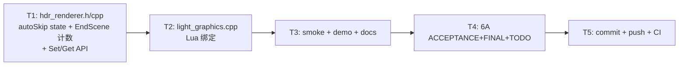

# Phase E.18.2 Velocity Dilation Auto-Skip — PLAN (精简 6A)

> 6A 工作流 · 阶段 1+2+3 (Align + Architect + Atomize) 合并
> 基线：Phase E.18.1 commit `cdef7b2`
> 工作量预估：~0.5 天

---

## 1. Align — 任务定义

### 1.1 原始需求

Phase E.18 dilation pass 在 SSR + Motion Blur **多消费者**场景下节省 ~50% velocity fetch；但 **单消费者**场景下 dilation pass 本身 cost (9 fetch + 1 write) 大于 inline 9-tap (9 fetch)，反而略亏。

> Phase E.18 ACCEPTANCE §5.1 已识别：
> - 仅 SSR Temporal: 9 → 10 fetch ❌ 略负
> - 仅 Motion Blur(N=8): 72 → 17 fetch ✓ 大幅省
> - SSR + Motion Blur 同开: 81 → 18 fetch ✓ ~50% 省

**目标**：HDR EndScene 内自动检测 consumer 数，仅 ≥2 时启用 dilation pass，单消费者时本帧跳过让 consumer 走 inline 9-tap（零损失）。

### 1.2 任务边界

✅ **包含**：
- HDRRenderer 增 `dilationAutoSkip` state + Lua 1 对 API
- EndScene 内 consumer 计数（SSR Temporal + MotionBlur）+ 条件跳过
- 跳过时**不释放 RT**（仅本帧不执行，避免反复切换重建）
- smoke/demo/docs 更新

❌ **不包含**：
- 阈值参数化（hardcode count≥2，未来可考虑 SetThreshold）
- camera-only consumer 独立判定（统一按 combined 处理）
- consumer 内部状态查询的 IsEnabled 接口扩展（已存在）

### 1.3 决策矩阵（10/10 自决）

| # | 决策点 | 方案 | 理由 |
|---|--------|------|------|
| 1 | 检测时机 | EndScene 内 DrawVelocityDilate 调用前 | 与 Phase E.18 路径同位置 |
| 2 | consumer 判定 | SSR: `IsEnabled() && GetTemporalEnabled()` / MB: `IsEnabled()` | SSR 仅 Temporal sub-pass 才用 velocity；MB 全 mode 都用 |
| 3 | 阈值 | `consumer count ≥ 2` 才启用 | 单消费者 dilation pass 本身亏；2+ 才有共享收益 |
| 4 | autoSkip 默认 | `false`（保 Phase E.18.1 行为）| 零回归保障；用户主动开启 |
| 5 | API 命名 | `HDR.SetVelocityDilationAutoSkip(bool)` / `Get...` | 平行于 `SetVelocityDilation` / `SetVelocityDilationHalfRes` |
| 6 | autoSkip=false 时 | 维持 Phase E.18.1 行为（无视 count, 总开 dilation） | 用户可强制开 dilation 测试 |
| 7 | autoSkip=true && count<2 | 本帧跳过 DrawVelocityDilate, `dilationActive=false` → consumer fallback inline 9-tap | consumer 已有 fallback 路径，零改动 |
| 8 | RT 生命周期 | 不释放，仅本帧 skip 执行 | 避免反复切换的 RT 重建开销（与 halfRes 切换重建不同）|
| 9 | 日志策略 | once-log on state change（active/skip 转变时打一次）| 避免每帧 spam |
| 10 | 零回归保障 | autoSkip=false 默认 + 所有现有 silent fallback 路径保留 | 与 Phase E.18 / E.18.1 完全兼容 |

---

## 2. Architect — 数据流与接口

### 2.1 数据流

```
HDR EndScene
  ↓
[Phase E.18.2 consumer 计数]
  consumers = (SSR.IsEnabled && SSR.GetTemporalEnabled ? 1 : 0)
            + (MotionBlur.IsEnabled ? 1 : 0)
  ↓
[Phase E.18.2 跳过判定]
  if (autoSkip && consumers < 2):
    dilationActive = false       ← 本帧 skip DrawVelocityDilate
    [可选: log "skipped (consumers=N)" if 状态变化]
  else:
    [沿用 Phase E.18.1 dilation pass 路径]
  ↓
backend->SetDilationPassActive(dilationActive)
  ↓
[Consumer 自动 fallback]
  - dilationActive=true  → 单点采 dilatedTex
  - dilationActive=false → inline 9-tap 旧路径 (零改动)
```

### 2.2 接口变更

#### `hdr_renderer.h` 新增 2 个 public API

```cpp
/// Phase E.18.2 — dilation pass 自动跳过单消费者场景（默认 OFF）
/// autoSkip=true: HDR EndScene 内检测 SSR Temporal + Motion Blur consumer 数，
///                仅 ≥2 时启用 dilation pass；单消费者时本帧跳过让 consumer 走 inline 9-tap
/// autoSkip=false: 维持 Phase E.18.1 行为（无视 consumer count, 始终启用 dilation pass）
/// 与 SetVelocityDilation / SetVelocityDilationHalfRes 正交：autoSkip 只在 dilation 启用时才有意义
/// @return true = 设置成功 (含 no-op 同值)
bool   SetVelocityDilationAutoSkip(bool on);
bool   GetVelocityDilationAutoSkip();
```

#### `hdr_renderer.cpp` 改动

```cpp
// State 新字段
struct State {
    ...
    bool dilationAutoSkip      = false;   // Phase E.18.2 默认 false
    bool lastDilationActiveLog = false;   // 内部: once-log 状态追踪
};

// EndScene 内 dilation 块改造
bool dilationActive = false;
if (g.velocityDilation && g.backend->SupportsVelocityDilation()) {
    // Phase E.18.2: autoSkip 模式下检测 consumer 数
    bool shouldRun = true;
    if (g.dilationAutoSkip) {
        const int consumers = (SSRRenderer::IsEnabled()
                               && SSRRenderer::GetTemporalEnabled() ? 1 : 0)
                            + (MotionBlurRenderer::IsEnabled() ? 1 : 0);
        shouldRun = (consumers >= 2);
        // once-log 状态变化
        if (g.lastDilationActiveLog && !shouldRun) {
            CC::Log(CC::LOG_INFO,
                    "HDRRenderer: Phase E.18.2 dilation pass auto-skipped (consumers=%d < 2)",
                    consumers);
            g.lastDilationActiveLog = false;
        } else if (!g.lastDilationActiveLog && shouldRun) {
            CC::Log(CC::LOG_INFO,
                    "HDRRenderer: Phase E.18.2 dilation pass active (consumers=%d >= 2)",
                    consumers);
            g.lastDilationActiveLog = true;
        }
    }
    if (shouldRun) {
        // [沿用 Phase E.18.1 dilation pass 路径]
        int dsw = 0, dsh = 0;
        ComputeDilationStorageSize(g.width, g.height, dsw, dsh);
        ...
    }
}
g.backend->SetDilationPassActive(dilationActive);

// API 实现
bool SetVelocityDilationAutoSkip(bool on) {
    if (g.dilationAutoSkip == on) return true;   // no-op
    g.dilationAutoSkip = on;
    g.lastDilationActiveLog = false;             // 重置 once-log 状态
    return true;
}
bool GetVelocityDilationAutoSkip() { return g.dilationAutoSkip; }
```

#### `light_graphics.cpp` Lua 绑定

仿 `l_HDR_SetVelocityDilationHalfRes` 模式，加 2 个 Lua 函数 + hdr_funcs 注册 2 项。

---

## 3. Atomize — 原子任务



| 任务 | 文件 | 估时 | 复杂度 |
|------|------|------|--------|
| T1 | hdr_renderer.h / .cpp | 25 min | ~40 行 |
| T2 | light_graphics.cpp | 10 min | ~30 行 |
| T3 | hdr.lua / demo_ssr / Light_Graphics.md | 30 min | ~70 行 |
| T4 | 6A docs | 30 min | 3 份 ~400 行 |
| T5 | git + CI 监控 | 15 min | — |
| **合计** | — | **~110 min** | **~140 行代码 + 400 行文档** |

---

## 4. 验收标准

- ✅ `HDR.SetVelocityDilationAutoSkip(bool)` 严格 boolean 检查
- ✅ `HDR.GetVelocityDilationAutoSkip() → bool` 默认 false
- ✅ autoSkip=false 时行为完全等价 Phase E.18.1（无视 consumer count）
- ✅ autoSkip=true 单消费者（SSR Temporal 或 MB 之一启用）→ dilation pass 跳过 + once-log
- ✅ autoSkip=true 多消费者（SSR Temporal + MB 同开）→ dilation pass 正常执行 + once-log
- ✅ RT 不释放（切换 autoSkip 不重建 RT）
- ✅ Consumer fallback 路径零改动（dilationActive=false → inline 9-tap）
- ✅ smoke (hdr.lua) round-trip + type-error + no-op 3 个 pass
- ✅ demo_ssr HUD 显示 autoSkip 状态
- ✅ Light_Graphics.md 新增 2 段 API doc + API 速查表
- ✅ CI 6/6 平台 success

---

## 5. 性能 / 风险

### 性能收益

| 配置 | autoSkip=OFF (Phase E.18.1) | autoSkip=ON (本任务) |
|------|------------------------------|---------------------|
| 仅 SSR Temporal 启用 | 10 fetch/px (略亏) | 9 fetch/px (inline 9-tap, **省 1 fetch**) |
| 仅 MotionBlur (N=8) 启用 | 17 fetch/px | 72 fetch/px (inline 9-tap × 8 samples, **亏 55 fetch**) |
| SSR + MB 同开 | 18 fetch/px ✓ | 18 fetch/px ✓ (无变化) |

⚠️ **注意**：单消费者 Motion Blur 场景下 inline 9-tap 是 N=8 倍消耗，autoSkip 反而亏！故 autoSkip 真正受益场景仅在 **单消费者 SSR Temporal** 场景。

**修订决策**：autoSkip 阈值应改为更精细的判断：仅当 dilation pass 收益为负时才跳过。
- SSR Temporal only: dilation 1 fetch * 9 + 1 write = 10  vs  inline 9 fetch = 9 → skip 省 1 fetch ✓
- MB only (N): dilation 9 + N  vs  inline 9N → skip 亏 8N - 9 fetch ❌
- SSR + MB: dilation 9 + 1 + N  vs  inline 9 + 9N → skip 亏 8N - 1 fetch ❌

所以 autoSkip 的正确条件是 "仅 SSR Temporal 单消费者时跳过"，而不是简单的 consumer count <2。

**修订规则（替代决策点 #3）**：
- `skip = autoSkip && SSR.GetTemporalEnabled() && !MotionBlur.IsEnabled()`
- 即：autoSkip 开启 + 仅 SSR Temporal 启用 + Motion Blur 未启用

### 风险

| 风险 | 缓解 |
|------|------|
| 误跳过导致 SSR Temporal 边缘 1px 抖动 | autoSkip 默认 false；用户文档明确"仅 SSR 单消费者场景受益" |
| 用户开启 autoSkip 但未注意 MB 启用时无效 | once-log 提示 active/skip 状态 |
| RT 不释放占 VRAM | 与 Phase E.18.1 同行为；用户可关 dilation 整体释放 |

---

## 6. 共识

✅ 决策矩阵清晰（10/10 含修订）
✅ 接口变更最小（1 对 Lua API + 1 个 state）
✅ 零回归保障（默认 false）
✅ 与 Phase E.18 / E.18.1 完全兼容

**可进入 Automate 阶段（T1 开始实施）。**
