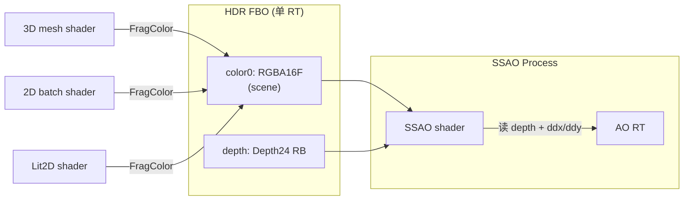
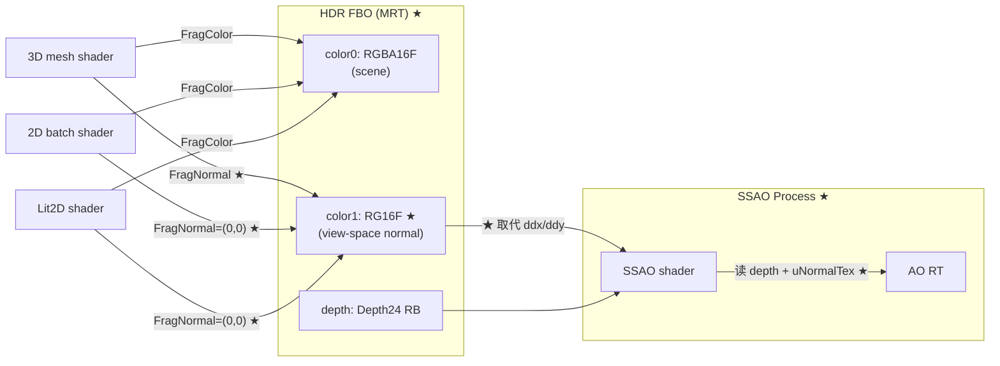
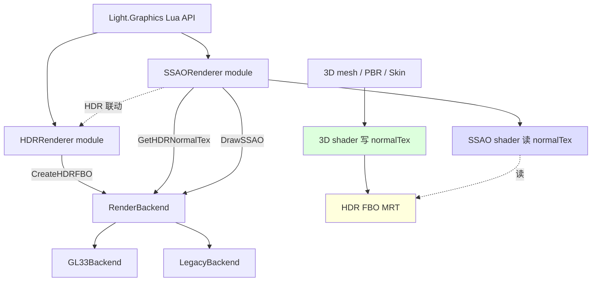
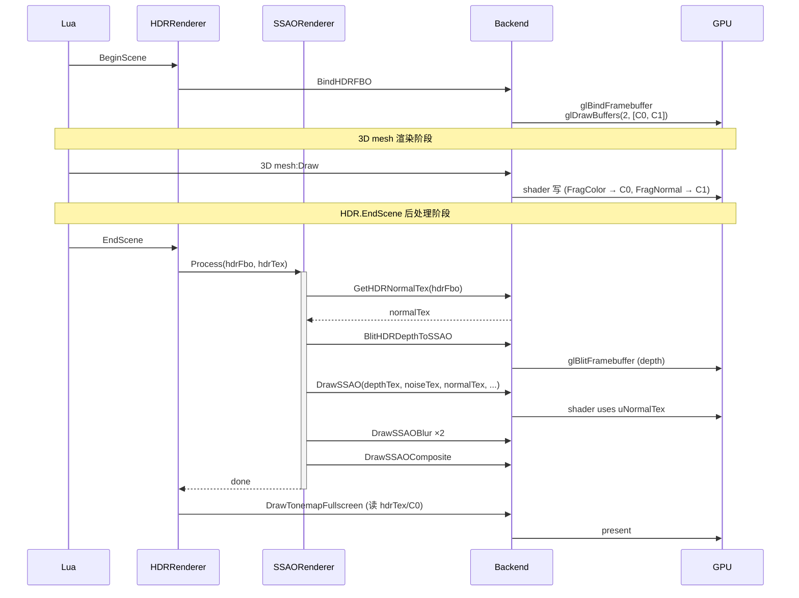

# DESIGN — Phase E.8.x · G-buffer normal RT 升级 SSAO

> 6A 工作流 · 阶段 2 · Architect（架构）
> 共识文档 → 系统架构 → 模块设计 → 接口规范

---

## 1. 整体架构图

### 1.1 升级前（Phase E.8 基线）



### 1.2 升级后（Phase E.8.x）



### 1.3 核心变化

| 变化点 | 升级前 | 升级后 |
|--------|--------|--------|
| HDR FBO color attachment | 1 (RGBA16F) | **2 (RGBA16F + RG16F)** ★ |
| Fragment shader 输出 | `out vec4 FragColor` | `out vec4 FragColor; out vec2 FragNormal` ★ |
| SSAO normal 来源 | `cross(dFdx(P), dFdy(P))` | `texture(uNormalTex, vUV)` ★ |
| Backend 接口 | 1 个 CreateHDRFBO | 1 个修改 + 1 个新增（GetHDRNormalTex）★ |
| HDR depth | Depth24 RB（不变）| Depth24 RB（不变）|
| SSAO 模块 API | 19 fn | **20 fn**（+ GetNormalTexId debug）|

---

## 2. 分层设计

### 2.1 Backend 层（render_gl33.cpp）

```
RenderBackend (虚基类)
├── CreateHDRFBO(w, h, &color, &normal=null)   ★ 修改 (新增 normal 参数)
├── DeleteHDRFBO(fbo, color)                    (不变)
├── GetHDRNormalTex(fbo) const                  ★ 新增
├── DrawSSAO(depth, noise, normal, ...)         ★ 修改 (加 normal 参数)
└── ...

GL33Backend (实现)
├── hdrFboDepthRB   map<uint32_t, uint32_t>     (不变)
├── hdrFboNormalTex map<uint32_t, uint32_t>     ★ 新增
├── CreateHDRFBO 内部:
│   ├── 1. 创建 RGBA16F colorTex
│   ├── 2. 创建 RG16F normalTex                  ★
│   ├── 3. 创建 Depth24 depthRB
│   ├── 4. attach color0 + color1 + depth        ★
│   ├── 5. glDrawBuffers(2, [COLOR_0, COLOR_1])   ★
│   ├── 6. CheckFramebufferStatus
│   └── 7. 失败 → 全释放; 成功 → map 关联存
├── DeleteHDRFBO 内部:
│   ├── 1. 查 hdrFboDepthRB → 释放 depthRB
│   ├── 2. 查 hdrFboNormalTex → 释放 normalTex   ★
│   └── 3. 删 fbo / colorTex
├── GetHDRNormalTex(fbo): map 查找返回           ★
└── DrawSSAO: shader 绑定多 1 个 sampler         ★
```

### 2.2 Shader 层（GLSL 双 profile）

```
3D 路径 (PBR + Unlit + Skin 变体)
├── VS3D_SOURCE / VS3D_SKIN_SOURCE / VS3D_SKIN_MORPH_SOURCE
│   ├── 计算 view-space normal:
│   │   vNormalView = normalize(mat3(view * model) * aNormal)
│   └── ★ 输出 vNormalView (新增 out vec3)
├── FS_UNLIT_SOURCE
│   ├── ★ 加 in vec3 vNormalView
│   ├── ★ 加 layout(location=1) out vec2 FragNormal
│   └── FragNormal = encodeViewN(vNormalView)
└── FS_PBR_SOURCE
    └── (同 unlit; 内部已计算 viewN, 仅输出)

2D 路径 (Batch + Lit2D)
├── FS_SOURCE / FS_LIT2D_SOURCE
│   └── ★ 加 layout(location=1) out vec2 FragNormal = vec2(0.5)  // 编码 N=(0,0,1)
└── (vs 不变)

SSAO 路径
├── FS_SSAO_SOURCE
│   ├── ★ 加 uniform sampler2D uNormalTex
│   ├── ★ 删 cross(dFdx(P), dFdy(P))
│   └── ★ N = decodeViewN(texture(uNormalTex, vUV).rg)
├── FS_SSAO_BLUR_SOURCE  (不变)
└── FS_SSAO_COMPOSITE_SOURCE  (不变)

Post-process 路径 (Bloom / AE / LensDirt / Streak / LensFlare / Tonemap)
└── 全部不变 (不写 attachment 1)
```

### 2.3 Module 层（ssao_renderer.cpp / hdr_renderer.cpp）

```
HDRRenderer
├── CreateRT(w, h)
│   ├── 调 backend->CreateHDRFBO(w, h, &colorTex, &normalTex)  ★ (传 &normalTex)
│   └── 失败时: HDR.Enable() 失败 → SSAO.OnHDREnabled 不触发 (链路保护)
└── (其他不变)

SSAORenderer
├── Process(hdrFbo, hdrTex)
│   ├── ★ uint32_t normalTex = backend->GetHDRNormalTex(hdrFbo)
│   ├── ★ if (!normalTex) return  // MRT 不可用 → 静默
│   ├── BlitHDRDepthToSSAO(...)   (不变)
│   ├── ★ DrawSSAO(depthTex, noiseTex, normalTex, fbos[0], ...)
│   └── ... (blur + composite 不变)
└── ★ 新增 Lua API: GetNormalTexId() — 返回当前 HDR FBO 关联的 normalTex
```

### 2.4 Lua API 层（light_graphics.cpp）

```
Light.Graphics.SSAO (20 fn = 19 旧 + 1 新)
├── ... (19 个 Phase E.8.3 已有保留)
└── ★ GetNormalTexId() → integer (debug; 0 = 未启用 / MRT 不可用)
```

---

## 3. 模块依赖关系图



**依赖方向（无循环）**：
```
Lua → Module → Backend → GL33
            ↓
         Shader (compile 时绑定)
```

---

## 4. 数据流向图

### 4.1 单帧完整流程



### 4.2 内存布局（@1080p）

| 资源 | 之前 | 之后 |
|------|------|------|
| HDR colorTex (RGBA16F) | 16 MB | 16 MB |
| HDR normalTex (RG16F) | — | **+4 MB** ★ |
| HDR depthRB (Depth24) | 6 MB | 6 MB |
| SSAO depthTex (Depth24) | 6 MB | 6 MB |
| SSAO 双 ping-pong (R16F, 1/2) | 2 MB | 2 MB |
| SSAO noiseTex (4×4 RGBA8) | 64 B | 64 B |
| SSAO composite temp (RGBA16F) | 16 MB | 16 MB |
| **总计 SSAO 启用时** | 46 MB | **50 MB** (+8.7%) |

---

## 5. 接口契约定义

### 5.1 RenderBackend 新接口

```cpp
/**
 * @brief 取 HDR FBO 关联的 G-buffer normal 纹理 id (Phase E.8.x)
 *
 * @param fbo 由 CreateHDRFBO 返回的 fbo id
 * @return    fbo 关联的 RG16F view-space normal tex id
 *            (0 = 该 fbo 不带 MRT, 或 fbo 已被释放)
 *
 * 用法:
 *   uint32_t fbo = backend->CreateHDRFBO(w, h, &colorTex, &normalTex);
 *   uint32_t nt  = backend->GetHDRNormalTex(fbo);   // == normalTex
 *
 * 设计意图:
 *   解耦 SSAOmodule 与 HDR 内部资源管理. SSAO 只持有 hdrFbo,
 *   不需要也不应该感知 normalTex 的 lifetime.
 *
 * 默认实现 (Legacy/未启用 MRT 的后端): return 0.
 */
virtual uint32_t GetHDRNormalTex(uint32_t /*fbo*/) const { return 0; }
```

### 5.2 CreateHDRFBO 接口扩展

```cpp
/**
 * @brief 创建 HDR FBO (Phase E.8.x: 升级为 MRT)
 *
 * 改动 (与 Phase E.3 相比):
 *   - 默认创建 MRT: COLOR0=RGBA16F (scene) + COLOR1=RG16F (view-normal)
 *   - 调用 glDrawBuffers(2, [GL_COLOR_ATTACHMENT0, GL_COLOR_ATTACHMENT1])
 *   - depth 仍是 Depth24 RBO (不变)
 *
 * @param[in]  w             RT 宽度 (像素)
 * @param[in]  h             RT 高度 (像素)
 * @param[out] outColorTex   RGBA16F scene tex id (必填, 不能为 null)
 * @param[out] outNormalTex  RG16F normal tex id (可选; nullptr = 不需要 normal RT)
 * @return     fbo id (0 = 失败)
 *
 * 失败原因:
 *   - 后端不支持 HDR (legacy)
 *   - GL_FRAMEBUFFER_COMPLETE 不通过 (RG16F 在某些极老驱动可能失败)
 *   - 内存不足
 *
 * 失败时: 全部已分配的 GL 对象释放, 返回 0.
 *
 * 关联管理:
 *   后端用内部 map (hdrFboDepthRB / hdrFboNormalTex) 关联存 depthRB + normalTex,
 *   DeleteHDRFBO 通过 fbo 反查并释放. 用户只需保留 colorTex (返回值) 即可.
 */
virtual uint32_t CreateHDRFBO(int /*w*/, int /*h*/,
                               uint32_t* /*outColorTex*/,
                               uint32_t* /*outNormalTex*/ = nullptr) { return 0; }
```

### 5.3 DrawSSAO 接口扩展

```cpp
/**
 * @brief 绘制 SSAO raw AO 到目标 RT (Phase E.8.x: 加 normalTex 参数)
 *
 * @param depthTex   全分辨率 depth tex (旁路 blit 来源)
 * @param noiseTex   4x4 RGBA8 noise tex (REPEAT)
 * @param normalTex  ★ 新增: G-buffer view-space normal RG16F tex
 * @param dstFbo     目标 SSAO FBO (R16F, 半分辨率)
 * @param dstW dstH  半分辨率尺寸
 * @param proj       当前 projection matrix (column-major float[16])
 * @param invProj    inverse(projection)
 * @param kernel     16 个半球采样方向 (float[48])
 * @param kernelSize 实际启用的 kernel 数 (8 或 16)
 * @param radius     采样半径 (view space)
 * @param bias       自遮蔽偏移
 * @param power      AO 输出幂
 *
 * 不变项: 无 normalTex 参数前的 ddx/ddy 重建路径已删除; 必传 normalTex.
 *
 * 默认实现 (Legacy): no-op.
 */
virtual void DrawSSAO(uint32_t depthTex, uint32_t noiseTex,
                       uint32_t normalTex,            // ★ 新增
                       uint32_t dstFbo,
                       int dstW, int dstH,
                       const float* proj, const float* invProj,
                       const float* kernel, int kernelSize,
                       float radius, float bias, float power) {}
```

### 5.4 SSAORenderer Lua API（新增 1 个）

```cpp
/**
 * @brief 取当前 HDR FBO 关联的 G-buffer normal RT id (Phase E.8.x debug)
 *
 * @return uint32_t
 *   0      → SSAO 未启用 / HDR 未启用 / MRT 不可用
 *   非 0   → RG16F view-space normal tex id (可在 Lua 中传给 Light.Graphics.DrawTexture)
 *
 * 用途: demo / 调试中可视化 normal RT, 验证 G-buffer 生成是否正确.
 *
 * Lua 示例:
 *   local nt = Light.Graphics.SSAO.GetNormalTexId()
 *   if nt > 0 then
 *       -- 全屏 quad 显示 normal (注意 RG16F 解码)
 *       Light.Graphics.DrawTexture(nt, 0, 0, w, h)
 *   end
 */
uint32_t GetNormalTexId();   // 在 SSAORenderer namespace
```

---

## 6. 异常处理策略

### 6.1 失败路径

| 失败点 | 处理 | 用户感知 |
|--------|------|---------|
| RG16F 纹理创建失败 | CreateHDRFBO 释放已创建的 colorTex / depthRB，返回 0 | HDR.Enable 返回 false; SSAO 不触发 |
| FRAMEBUFFER_COMPLETE 不通过 | 同上 | 同上 |
| 老 GLES 不支持 RG16F | 同上 | LDR 路径 |
| Linker error（shader 语法）| InitTonemap / InitBloom 等内部各自检查 | 模块 supported = false |
| GetHDRNormalTex 返回 0（map miss）| SSAO Process 检测后静默 return | SSAO 等于 disable |
| Lua GetNormalTexId 在 SSAO disable 时调用 | 返回 0 | 用户 nil-check 即可 |

### 6.2 与 Phase E.8 双 RT 旁路的关系

Phase E.8 的双 RT 旁路（SSAO 自管 depthFbo，blit HDR depth）保留不变。
**Phase E.8.x 仅替换 normal 来源**：从 ddx/ddy → uNormalTex。
其他 SSAO 内部逻辑（depth blit / kernel / blur / composite）一字不改。

---

## 7. 设计原则验证

| 原则 | 验证 |
|------|------|
| 严格按任务范围 | ✅ 仅 normal RT 升级，其他全部不变 |
| 与现有架构一致 | ✅ 复用 HDR FBO map 模式（depthRB → normalTex 平行）|
| 复用现有组件 | ✅ shader compile/link helper / vaoTonemap / glDrawBuffers 已用 |
| 接口最小化 | ✅ 仅 1 新接口 + 2 修改 |
| 无循环依赖 | ✅ Lua → Module → Backend → GL，单向 |
| 可行性 | ✅ MRT 在 GL3.3 / GLES3 是核心特性，Phase E.8.1 已经用过 glDrawBuffers |

---

## 8. 与现有系统冲突排查

✅ **HDR FBO MRT** vs **SSAO 双 RT 旁路**：兼容；SSAO 仍 blit depth，仅 normal 改读 attachment 1
✅ **glDrawBuffers(2, ...)** vs **Phase E.8.1 的 glDrawBuffers(1, {GL_NONE})**：互不冲突，作用对象不同 FBO
✅ **shader 加 layout(location=1) out vec2 FragNormal** vs **现有 layout(location=0)**：GL3.3 / GLES3 都明确支持多 attachment 输出
✅ **现有 Tonemap shader 不写 normal**：因为它写到 backbuffer（无 attachment 1），无需改
✅ **现有 Bloom / AE / LensDirt / Streak / LensFlare**：写到自己的 RT，不写 HDR FBO，无需改

---

**进入 6A 阶段 3: Atomize**
