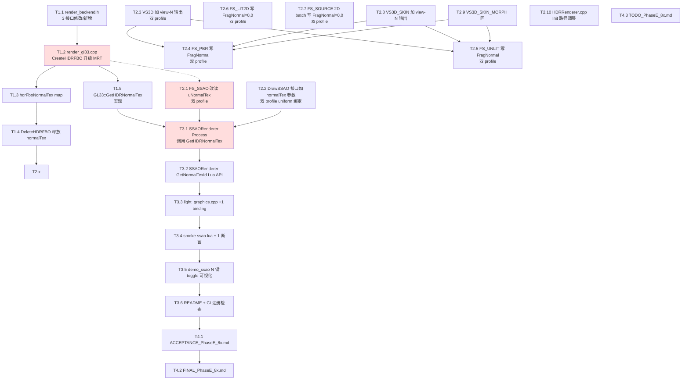

# TASK — Phase E.8.x · G-buffer normal RT 升级 SSAO

> 6A 工作流 · 阶段 3 · Atomize（原子化）
> 架构设计 → 拆分任务 → 明确接口 → 依赖关系

---

## 1. 子阶段汇总

| 子阶段 | 主题 | 任务数 | 行数 |
|--------|------|--------|------|
| **E.8.x.1** | Backend MRT 改造 | 5 | ~150 |
| **E.8.x.2** | Shader 升级（10 shader 路径）| 10 | ~200 |
| **E.8.x.3** | Module + Lua API + smoke + demo + CI | 6 | ~80 |
| **E.8.x.4** | Docs（ACCEPTANCE / FINAL / TODO）| 3 | ~600 |
| **总计** | — | **24 原子任务** | **~1030 行** |

---

## 2. 任务依赖图



**关键路径**：T1.1 → T1.2 → T2.x（10 shader） → T3.1 → smoke 验证。

---

## 3. 子阶段 E.8.x.1：Backend MRT 改造

### T1.1 — render_backend.h 接口修改

**输入契约**：
- 现有 `CreateHDRFBO(int, int, uint32_t*)` 接口
- 现有 `DeleteHDRFBO(uint32_t, uint32_t)` 接口

**输出契约**：
- 修改 `CreateHDRFBO` 加 `uint32_t* outNormalTex = nullptr` 默认参数
- 新增 `virtual uint32_t GetHDRNormalTex(uint32_t fbo) const { return 0; }` 默认实现
- 修改 `DrawSSAO(...)` 加 `uint32_t normalTex` 必填参数（位置：noiseTex 之后）

**实现约束**：
- 默认实现保持 0 / no-op，确保 LegacyBackend 自动兼容
- 完整 doxygen 注释 / 与 Phase E.3 风格一致

**预计行数**：+30 行（注释占大头）

**验收标准**：
- [ ] 头文件编译通过（CMake 配置阶段）
- [ ] LegacyBackend 不需改动（自动用默认 0/no-op）

**依赖**：无（先行）

---

### T1.2 — GL33::CreateHDRFBO 升级为 MRT

**输入契约**：
- 现有 CreateHDRFBO 实现（@e:\jinyiNew\Light\ChocoLight\src\render_gl33.cpp:2713-2764）
- 新增 `outNormalTex` 参数

**输出契约**：
- 新创建 RG16F normal texture（GL_LINEAR + CLAMP_TO_EDGE）
- glFramebufferTexture2D 绑定到 GL_COLOR_ATTACHMENT1
- glDrawBuffers(2, [COLOR_0, COLOR_1])
- 失败时全释放（colorTex / normalTex / depthRB / fbo）

**实现约束**：
- 仅在 `outNormalTex != nullptr` 时创建 normal RT（向后兼容）
- 失败错误 log："GL33: HDR MRT FBO incomplete (status=0x%X, %dx%d)"

**预计行数**：+45 行

**验收标准**：
- [ ] 单 RT 模式（outNormalTex=nullptr）完全等同原行为
- [ ] MRT 模式创建后 glGetIntegerv(GL_DRAW_BUFFER0) 等返回正确

**依赖**：T1.1

---

### T1.3 — hdrFboNormalTex map 关联

**输入契约**：
- 现有 `hdrFboDepthRB std::unordered_map<uint32_t, uint32_t>`

**输出契约**：
- 新增 `hdrFboNormalTex std::unordered_map<uint32_t, uint32_t>`
- CreateHDRFBO 成功时插入：`hdrFboNormalTex[fbo] = normalTex`

**实现约束**：
- 与 hdrFboDepthRB 邻近声明
- 命名一致

**预计行数**：+5 行

**验收标准**：
- [ ] map 在 fbo 释放后无残留

**依赖**：T1.2

---

### T1.4 — DeleteHDRFBO 释放 normalTex

**输入契约**：
- 现有 DeleteHDRFBO 实现

**输出契约**：
- 查 `hdrFboNormalTex[fbo]` → glDeleteTextures(1, &normalTex)
- erase map entry

**实现约束**：
- 与 hdrFboDepthRB 释放顺序一致

**预计行数**：+8 行

**验收标准**：
- [ ] glDeleteTextures 成功（valgrind / GL debug callback 无 leak）

**依赖**：T1.3

---

### T1.5 — GL33::GetHDRNormalTex 实现

**输入契约**：
- 已建立的 hdrFboNormalTex map

**输出契约**：
- `uint32_t GetHDRNormalTex(uint32_t fbo) const override`
- map 查找命中 → 返回 normalTex
- map 未命中 → 返回 0

**实现约束**：
- const 方法（不修改 map）
- find + 三元判断（5 行）

**预计行数**：+8 行

**验收标准**：
- [ ] CreateHDRFBO 成功后立即 GetHDRNormalTex 返回相同 id
- [ ] DeleteHDRFBO 后 GetHDRNormalTex 返回 0

**依赖**：T1.3

---

## 4. 子阶段 E.8.x.2：Shader 升级（10 路径）

### T2.1 — FS_SSAO_SOURCE 双 profile 升级

**输入契约**：
- 现有 FS_SSAO_SOURCE GLES3 + GL33 双 profile

**输出契约**：
- 删除 `vec3 N = normalize(cross(dFdy(P), dFdx(P)));`
- 加 `uniform sampler2D uNormalTex;`
- 加解码：
  ```glsl
  vec2 enc = texture(uNormalTex, vUV).rg;
  vec2 nxy = enc * 2.0 - 1.0;
  float zsq = max(0.0, 1.0 - dot(nxy, nxy));
  vec3 N = vec3(nxy, sqrt(zsq));
  ```

**实现约束**：
- GLES3 + GL33 两份都改
- 注释更新 algorithm 部分

**预计行数**：+10 / -2（净 +8 × 2 profile = +16）

**验收标准**：
- [ ] shader 编译通过两个 profile
- [ ] 视觉对比：边缘条纹噪声明显减少

**依赖**：T1.1

---

### T2.2 — DrawSSAO 实现绑定 normalTex

**输入契约**：
- 现有 GL33::DrawSSAO 实现
- T1.1 接口扩展（新增 normalTex 参数）

**输出契约**：
- `glActiveTexture(GL_TEXTURE2); glBindTexture(GL_TEXTURE_2D, normalTex);`
- `glUniform1i(locSSAO_NormalTex, 2);`（slot 2）
- 现有 depth=slot 0, noise=slot 1 不变

**实现约束**：
- 解绑顺序对应（slot 2 → 0 倒序解绑）
- 新增 `locSSAO_NormalTex` GLint 字段

**预计行数**：+15 行

**验收标准**：
- [ ] glGetUniformLocation("uNormalTex") 返回非 -1

**依赖**：T2.1

---

### T2.3 — VS3D_SOURCE 加 view-N 输出

**输入契约**：
- 现有 VS3D_SOURCE 双 profile（PBR + Unlit 共用）

**输出契约**：
- 加 `out vec3 vNormalView;`
- 内部计算：`vNormalView = normalize(mat3(uView * uModel) * aNormal);`
- 上传 view-projection 已有，这里仅新增 normal 变换

**实现约束**：
- mat3 构造方式（GLES3 + GL33 都支持）
- aNormal 是已有 in vec3 normal layout（已有）

**预计行数**：+5 × 2 profile = +10

**验收标准**：
- [ ] 链接通过；现有 demo 行为不变（vNormalView 未使用时无副作用）

**依赖**：无

---

### T2.4 — FS_PBR_SOURCE 写 FragNormal

**输入契约**：
- 现有 FS_PBR_SOURCE 双 profile
- T2.3 提供 vNormalView

**输出契约**：
- 加 `in vec3 vNormalView;`
- 加 `layout(location = 1) out vec2 FragNormal;`
- 在 main 末尾：
  ```glsl
  vec3 N = normalize(vNormalView);
  FragNormal = N.xy * 0.5 + 0.5;
  ```

**实现约束**：
- 注意：现有 main 已经用 `vec3 N` 做光照计算；这里需重命名变量避免冲突，或先用现有 N
- GL33 + GLES3 两份都改

**预计行数**：+5 × 2 = +10

**验收标准**：
- [ ] 链接通过
- [ ] 现有 PBR 视觉无变化（attachment 0 不动）

**依赖**：T2.3

---

### T2.5 — FS_UNLIT_SOURCE 写 FragNormal

同 T2.4，对 FS_UNLIT_SOURCE。

**预计行数**：+5 × 2 = +10

**依赖**：T2.3

---

### T2.6 — FS_LIT2D_SOURCE 写 FragNormal=(0,0)

**输入契约**：
- 现有 FS_LIT2D_SOURCE 双 profile

**输出契约**：
- 加 `layout(location = 1) out vec2 FragNormal;`
- main 末尾：`FragNormal = vec2(0.5);`（编码 N=(0,0,1)）

**实现约束**：
- Lit2D 本身有 normal map 数据，但 view-N 计算复杂；2D 场景 SSAO 无效，简单写 (0.5,0.5) 即可

**预计行数**：+3 × 2 = +6

**依赖**：无

---

### T2.7 — FS_SOURCE (2D batch) 写 FragNormal=(0,0)

同 T2.6。

**预计行数**：+3 × 2 = +6

**依赖**：无

---

### T2.8 — VS3D_SKIN_SOURCE 加 view-N 输出

同 T2.3，对 VS3D_SKIN_SOURCE。需注意 skin 后的 normal 也要乘 mat3(view * model)。

**预计行数**：+5 × 2 = +10

**依赖**：无

---

### T2.9 — VS3D_SKIN_MORPH_SOURCE 加 view-N 输出

同 T2.8，对 VS3D_SKIN_MORPH_SOURCE。

**预计行数**：+5 × 2 = +10

**依赖**：无

---

### T2.10 — HDRRenderer::CreateRT 调用 MRT

**输入契约**：
- 现有 hdr_renderer.cpp:CreateRT（@:59-73）
- T1.1 扩展 CreateHDRFBO 接口

**输出契约**：
- 修改 CreateRT 内部调用：
  ```cpp
  uint32_t normalTex = 0;
  uint32_t fbo = g.backend->CreateHDRFBO(w, h, &tex, &normalTex);
  // 不需要存 normalTex; backend 内部 map 关联
  ```

**实现约束**：
- HDR State 不需新增 normalTex 字段
- 失败路径不变（任何 fbo == 0 都失败）

**预计行数**：+3 行

**依赖**：T1.2

---

## 5. 子阶段 E.8.x.3：Module + Lua + smoke + demo

### T3.1 — SSAORenderer::Process 调用 GetHDRNormalTex

**输入契约**：
- T1.5 GetHDRNormalTex 实现
- T2.2 DrawSSAO 接口扩展

**输出契约**：
- Process 内部加：
  ```cpp
  uint32_t normalTex = g.backend->GetHDRNormalTex(hdrFbo);
  if (!normalTex) return;
  // 传给 DrawSSAO
  g.backend->DrawSSAO(g.depthTex, g.noiseTex, normalTex, g.fbos[0], ...);
  ```

**预计行数**：+5 / -1（净 +4）

**依赖**：T1.5 + T2.2

---

### T3.2 — SSAORenderer::GetNormalTexId Lua-friendly API

**输入契约**：
- T1.5 backend 接口

**输出契约**：
- ssao_renderer.h: `uint32_t GetNormalTexId();`
- ssao_renderer.cpp: 内部从 hdr_renderer 拿当前 hdrFbo，调 backend->GetHDRNormalTex

**实现约束**：
- 需要从 HDRRenderer 暴露当前 fbo —— 但 HDRRenderer 没有 GetCurrentFBO 公开 API
- **替代方案**：SSAORenderer 自己缓存 normalTex，在 OnHDREnabled 时记录
- **替代方案 B**：调 g.backend 借用静态全局（不优雅）

> **采纳**：在 SSAORenderer State 加 `lastNormalTex` 字段，在 Process 开头取 normalTex 时同步更新。GetNormalTexId 直接返回这个缓存。

**预计行数**：+10 行

**依赖**：T3.1

---

### T3.3 — light_graphics.cpp +1 Lua binding

**输入契约**：
- T3.2 GetNormalTexId

**输出契约**：
- 加 l_SSAO_GetNormalTexId binding（返回 lua_pushinteger）
- 加到 ssao_funcs[] 表（在 GetBlurEnabled 之后）

**预计行数**：+10 行

**依赖**：T3.2

---

### T3.4 — smoke ssao.lua 加 1 断言

**输入契约**：
- 现有 ssao.lua 50 断言

**输出契约**：
- Section J 新增：
  ```lua
  if type(S.GetNormalTexId) ~= "function" then fail("GetNormalTexId missing") end
  pass("GetNormalTexId function present")

  -- SSAO 未启用时返回 0
  S.Disable()
  if S.GetNormalTexId() ~= 0 then fail("GetNormalTexId() should be 0 when disabled") end
  pass("GetNormalTexId() == 0 when disabled")
  ```

**预计行数**：+15 行

**依赖**：T3.3

---

### T3.5 — demo_ssao N 键 toggle normal 可视化

**输入契约**：
- 现有 demo_ssao/main.lua 8 键
- T3.3 GetNormalTexId

**输出契约**：
- 加 `showNormal = false` flag
- N 键 toggle
- 渲染最后画 normal RT 全屏（如果 showNormal=true）：
  ```lua
  if keyTap('n') then showNormal = not showNormal end
  -- 渲染末尾:
  if showNormal then
      local nt = SSAO.GetNormalTexId()
      if nt > 0 then
          Gfx.DrawTexture(nt, 0, 0, WIN_W, WIN_H)   -- 假设有此 API
      end
  end
  ```

**实现约束**：
- 检查 Light.Graphics.DrawTexture 是否存在；不存在就用其他通用接口
- 8 键 → 9 键，README 也要改

**预计行数**：+15 行

**依赖**：T3.3

---

### T3.6 — README + CI 注册检查

**输入契约**：
- demo_ssao/README.md
- .github/workflows/build-templates.yml

**输出契约**：
- README 加 N 键说明 + Phase E.8.x 注脚
- CI workflow 不变（ssao.lua 已注册）

**预计行数**：+10 行

**依赖**：T3.5

---

## 6. 子阶段 E.8.x.4：Docs

### T4.1 — ACCEPTANCE_PhaseE_8x.md

CI 跑完后回填 6/6 状态 + 视觉验收 checklist。

**预计行数**：~200 行

---

### T4.2 — FINAL_PhaseE_8x.md

总结架构 / 改动文件 / API surface。

**预计行数**：~200 行

---

### T4.3 — TODO_PhaseE_8x.md

未来扩展（HBAO/GTAO/Temporal SSAO/SSR/G-buffer 完整版）。

**预计行数**：~150 行

---

## 7. 任务总览（24 atomic tasks）

| ID | 主题 | 行数 | 依赖 |
|----|------|------|------|
| T1.1 | render_backend.h 3 接口 | 30 | — |
| T1.2 | GL33 CreateHDRFBO MRT | 45 | T1.1 |
| T1.3 | hdrFboNormalTex map | 5 | T1.2 |
| T1.4 | DeleteHDRFBO 释放 normalTex | 8 | T1.3 |
| T1.5 | GetHDRNormalTex 实现 | 8 | T1.3 |
| T2.1 | FS_SSAO 双 profile | 16 | T1.1 |
| T2.2 | DrawSSAO 实现 + uniform | 15 | T2.1 |
| T2.3 | VS3D 加 view-N 输出 | 10 | — |
| T2.4 | FS_PBR 写 FragNormal | 10 | T2.3 |
| T2.5 | FS_UNLIT 写 FragNormal | 10 | T2.3 |
| T2.6 | FS_LIT2D 写 (0.5, 0.5) | 6 | — |
| T2.7 | FS_SOURCE (2D) 写 (0.5, 0.5) | 6 | — |
| T2.8 | VS3D_SKIN 加 view-N | 10 | — |
| T2.9 | VS3D_SKIN_MORPH 加 view-N | 10 | — |
| T2.10 | HDRRenderer::CreateRT 改 | 3 | T1.2 |
| T3.1 | Process 调 GetHDRNormalTex | 4 | T1.5+T2.2 |
| T3.2 | GetNormalTexId 公开 fn | 10 | T3.1 |
| T3.3 | Lua binding +1 | 10 | T3.2 |
| T3.4 | smoke +1 section | 15 | T3.3 |
| T3.5 | demo_ssao N 键 toggle | 15 | T3.3 |
| T3.6 | README + CI 注册 | 10 | T3.5 |
| T4.1 | ACCEPTANCE | 200 | T3.6 |
| T4.2 | FINAL | 200 | T3.6 |
| T4.3 | TODO | 150 | T3.6 |

**总计：~1006 行**

---

## 8. 风险与对策

| 风险 | 概率 | 影响 | 对策 |
|------|------|------|------|
| RG16F 在某老 GLES 驱动失败 | 低 | SSAO 不可用 | 失败链路：HDR.Enable 返回 false; SSAO 链路保护 |
| MRT 在 WebGL2 表现异常 | 极低 | CI 失败 | 已知 WebGL2 = GLES3，原生支持 |
| Skin / Morph 变体 normal 计算错误 | 中 | 边缘条纹 | 单元测试：手动 +X 法线物体，可视化 normal RT 验证 |
| layout(location=1) 在某 driver 链接失败 | 极低 | shader 失败 | shader 编译错误 log |
| 与现有 demo 视觉回归 | 极低 | 用户感知 | CI 跑完所有 Phase E smoke |
| view-N.z < 0（背面）解码错误 | 中 | 部分像素 AO 异常 | sqrt(max(0, 1-...))已 clamp |

---

## 9. 完成度门控（必须全 ✅ 才能进入 Approve）

- [x] 任务覆盖完整需求
- [x] 依赖关系无循环
- [x] 每个任务可独立验证
- [x] 复杂度评估合理（每个任务 < 50 行）
- [x] 关键路径清晰（T1.2 → T2.x → T3.1）

---

**进入 6A 阶段 4: Approve**（人工审查 → 批准 → 实施）
