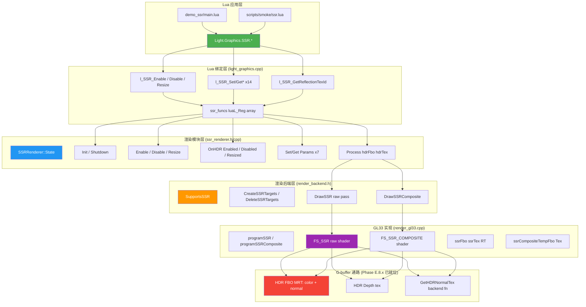
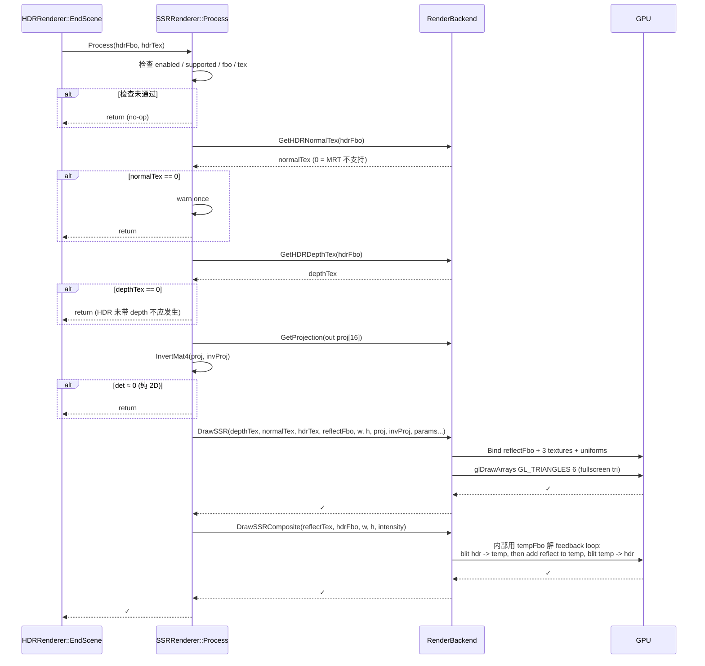
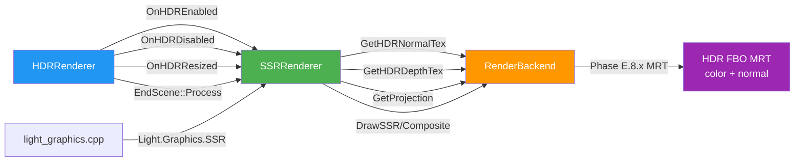
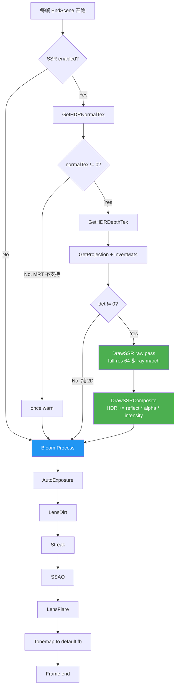

# DESIGN — Phase E.9 · Screen Space Reflection (SSR)

> 6A 工作流 · 阶段 2 · Architect (架构阶段)
> 共识文档 → 系统架构 → 模块设计 → 接口规范

---

## 1. 整体架构图

### 1.1 系统分层



### 1.2 文件清单与职责矩阵

| 层 | 文件 | 新建/修改 | 行数估算 | 主要职责 |
|----|------|-----------|----------|----------|
| 应用 | `samples/demo_ssr/main.lua` | 新建 | ~150 | 金属球 + 地面纹理反射 demo |
| 应用 | `samples/demo_ssr/README.md` | 新建 | ~30 | 操作 + 参数说明 |
| 测试 | `scripts/smoke/ssr.lua` | 新建 | ~250 | headless 兼容 smoke (~50 断言) |
| 绑定 | `src/light_graphics.cpp` | 修改 | +220 | 22 个 lua_CFunction + ssr_funcs |
| 模块 | `include/ssr_renderer.h` | 新建 | ~80 | namespace 接口声明 |
| 模块 | `src/ssr_renderer.cpp` | 新建 | ~280 | 沿用 SSAO 模板实现 |
| 主循环 | `src/light_ui.cpp` | 修改 | +5 | Init / Shutdown 注册 |
| 管线 | `src/hdr_renderer.cpp` | 修改 | +5 | EndScene 加 SSR Process |
| 后端接口 | `include/render_backend.h` | 修改 | +30 | 5 个 virtual fn + 默认空实现 |
| 后端 GL33 | `src/render_gl33.cpp` | 修改 | +280 | shader + RT + Draw 实现 |
| 文档 | `docs/Phase E.9 SSR/*.md` | 新建 | 7 份 | 6A 完整文档 |

**总计**：~1380 行代码 + ~3000 行文档。

---

## 2. 核心组件设计

### 2.1 SSRRenderer 模块（沿用 SSAO 模板）

#### 2.1.1 State 结构（匿名 namespace）

```cpp
namespace SSRRenderer {
namespace {

struct State {
    // === 模块状态 ===
    bool     enabled        = false;
    bool     supported      = false;
    bool     autoEnable     = false;     // 默认 false (与 SSAO 同, 需手动 SetAutoEnable(true))

    RenderBackend* backend  = nullptr;

    // === 资源 ===
    uint32_t reflectFbo     = 0;
    uint32_t reflectTex     = 0;         // RGBA16F full-res (高质量方案)
    int      width          = 0;
    int      height         = 0;

    // === 参数 (默认值见 CONSENSUS §5) ===
    int      maxSteps       = 64;
    float    stepSize       = 0.1f;
    float    thickness      = 0.5f;
    float    maxDistance    = 50.0f;
    float    intensity      = 0.7f;
    float    edgeFade       = 0.1f;
    bool     blurEnabled    = false;     // Phase E.9 不实现, 保留 API
};

static State g;

// 资源生命周期
static void DestroyResources();
static bool AllocateResources(int w, int h);

// clamp helpers
inline float clampf(float, float, float);
inline int   clampi(int, int, int);

} // anonymous namespace
} // namespace SSRRenderer
```

#### 2.1.2 接口契约

| 函数 | 输入契约 | 输出契约 | 异常 |
|------|----------|----------|------|
| `Init(backend)` | backend 不可为 null（warn 但允许） | `g.supported` ← `backend->SupportsSSR()` | 无 |
| `Shutdown()` | 无 | 释放所有 GL 资源；`g.enabled = false` | 无 |
| `Enable(w, h)` | w, h > 0；`g.supported` 为 true | `g.enabled = true`；reflectFbo/Tex 已创建 | 资源失败返回 false，silent fallback |
| `Disable()` | 无 | 释放 RT；`g.enabled = false` | 幂等，重复调用安全 |
| `IsEnabled()` | 无 | 返回 `g.enabled` | 无 |
| `IsSupported()` | 无 | 返回 `g.supported` | 无 |
| `Resize(w, h)` | w, h > 0 | 等价于 Disable + Enable | 同 Enable |
| `OnHDREnabled(w, h)` | HDR 已启用 | 若 `autoEnable` 则 Enable | 失败 silent，不打断 HDR 流程 |
| `OnHDRDisabled()` | 无 | 强制 Disable（HDR RT 销毁前自清） | 无 |
| `OnHDRResized(w, h)` | 无 | 若 enabled 则 Resize | 失败 silent |
| `SetMaxSteps(n)` | int | `g.maxSteps = clamp(n, 8, 128)` | 无 |
| `SetStepSize(v)` | float | `g.stepSize = clamp(v, 0.01, 1.0)` | 无 |
| `SetThickness(v)` | float | `g.thickness = clamp(v, 0.01, 5.0)` | 无 |
| `SetMaxDistance(v)` | float | `g.maxDistance = clamp(v, 1.0, 1000.0)` | 无 |
| `SetIntensity(v)` | float | `g.intensity = clamp(v, 0.0, 2.0)` | 无 |
| `SetEdgeFade(v)` | float | `g.edgeFade = clamp(v, 0.0, 0.5)` | 无 |
| `SetBlurEnabled(b)` | bool | `g.blurEnabled = b`（保留，不实际作用） | 无 |
| `GetReflectionTexId()` | 无 | `g.enabled ? g.reflectTex : 0` | 无 |
| `Process(hdrFbo, hdrTex)` | 入参非 0 | 反射写入 reflectFbo + composite 到 hdrFbo | 缺 normalTex 时 silent skip + once warn |

#### 2.1.3 Process 流程图



### 2.2 RenderBackend 接口扩展

#### 2.2.1 接口声明（`include/render_backend.h`）

```cpp
// ==================== Phase E.9 — SSR ====================
//
// Screen Space Reflection: linear ray march in view space.
// 复用 Phase E.8.x 的 G-buffer normal MRT (GetHDRNormalTex)
// + HDR depth tex (GetHDRDepthTex 已存在 Phase E.8 加入).
//
// 后端 silent fallback 策略:
//   - 不支持 SSR (Legacy / WebGL1) 时, SupportsSSR=false,
//     CreateSSRTargets 返回 false; SSRRenderer::Enable 返 false.
//   - 默认空实现; 仅 GL33 重写.

/// 后端是否支持 SSR (RGBA16F + view-space normal MRT 都可用)
virtual bool SupportsSSR() const { return false; }

/// 创建 SSR 反射 RT: full-res RGBA16F + GL_LINEAR + GL_CLAMP_TO_EDGE, 无 depth
/// @return 成功 true; 失败 false (outFbo/outTex 保持 0)
virtual bool CreateSSRTargets(int /*w*/, int /*h*/,
                               uint32_t* /*outFbo*/, uint32_t* /*outTex*/) {
    return false;
}

/// 释放 SSR RT (fbo + tex)
virtual void DeleteSSRTargets(uint32_t* /*fbo*/, uint32_t* /*tex*/) {}

/// SSR raw pass: 反射结果写入 dstFbo (RGBA16F)
/// @param depthTex   HDR depth tex (full-res)
/// @param normalTex  HDR G-buffer view-space normal (Phase E.8.x)
/// @param hdrTex     HDR color tex (反射采样源)
/// @param dstFbo     反射 RT (本 backend 创建的 ssrFbo)
/// @param w, h       full-res
/// @param projMat4 / invProjMat4  column-major, 16 floats each
/// @param maxSteps   ray march 步数 [8, 128]
/// @param stepSize   每步 view-space units
/// @param thickness  深度命中容差
/// @param maxDist    距离上限
/// @param edgeFade   屏幕边缘 UV 空间 fade 宽度 [0, 0.5]
virtual void DrawSSR(uint32_t /*depthTex*/, uint32_t /*normalTex*/, uint32_t /*hdrTex*/,
                     uint32_t /*dstFbo*/,
                     int /*w*/, int /*h*/,
                     const float* /*projMat4*/, const float* /*invProjMat4*/,
                     int /*maxSteps*/, float /*stepSize*/, float /*thickness*/,
                     float /*maxDist*/, float /*edgeFade*/) {}

/// SSR composite: hdrFbo += reflectTex.rgb * reflectTex.a * intensity
/// 后端内部用临时 RT 解 feedback loop (HDR 既读又写).
virtual void DrawSSRComposite(uint32_t /*reflectTex*/, uint32_t /*hdrFbo*/,
                               int /*w*/, int /*h*/, float /*intensity*/) {}
```

#### 2.2.2 GL33 实现关键点

```cpp
class RenderGL33 : public RenderBackend {
private:
    // ==================== Phase E.9 — SSR resources ====================
    bool     ssrSupported              = false;
    GLuint   programSSR                = 0;
    GLuint   programSSRComposite       = 0;
    // FS_SSR uniforms
    GLint    locSSR_Proj               = -1;
    GLint    locSSR_InvProj            = -1;
    GLint    locSSR_TexelSize          = -1;
    GLint    locSSR_DepthTex           = -1;
    GLint    locSSR_NormalTex          = -1;
    GLint    locSSR_HDRTex             = -1;
    GLint    locSSR_MaxSteps           = -1;
    GLint    locSSR_StepSize           = -1;
    GLint    locSSR_Thickness          = -1;
    GLint    locSSR_MaxDistance        = -1;
    GLint    locSSR_EdgeFade           = -1;
    // FS_SSR_COMPOSITE uniforms
    GLint    locSSRComp_ReflectTex     = -1;
    GLint    locSSRComp_HDRTex         = -1;       // 临时 RT 复制源
    GLint    locSSRComp_Intensity      = -1;
    // 临时 composite RT (避免 feedback loop)
    GLuint   ssrCompositeTempFbo       = 0;
    GLuint   ssrCompositeTempTex       = 0;
    int      ssrCompositeTempW         = 0;
    int      ssrCompositeTempH         = 0;

public:
    bool SupportsSSR() const override { return ssrSupported; }
    bool CreateSSRTargets(...) override;
    void DeleteSSRTargets(...) override;
    void DrawSSR(...) override;
    void DrawSSRComposite(...) override;

private:
    // 内部 helper
    bool InitSSRPrograms();
    void EnsureSSRCompositeTemp(int w, int h);
};
```

### 2.3 Shader 设计（双 profile）

#### 2.3.1 FS_SSR 主算法 shader

**关键复用**：`DecodeViewNormal()` helper 已在 Phase E.8.x FS_SSAO 中实现，本 phase 直接复用同一行代码（GLES3 + GL33 两个 profile）。

**额外 helper**：`ReconstructViewPos(uv, depth, invProj)`：

```glsl
// view-space pos 重建 (NDC -> view, perspective divide)
vec3 ReconstructViewPos(vec2 uv, float depth, mat4 invProj) {
    vec4 clip = vec4(uv * 2.0 - 1.0, depth * 2.0 - 1.0, 1.0);
    vec4 view = invProj * clip;
    return view.xyz / view.w;
}
```

#### 2.3.2 FS_SSR_COMPOSITE shader

```glsl
// 输入: reflectTex (RGBA16F), hdrTex (临时 RT 复制的 HDR)
// 输出: hdr.rgb + reflectTex.rgb * reflectTex.a * intensity
uniform sampler2D uReflectTex;
uniform sampler2D uHDRTex;
uniform float     uIntensity;

void main() {
    vec2 uv = gl_FragCoord.xy * uTexelSize;
    vec4 hdr = texture(uHDRTex, uv);
    vec4 ref = texture(uReflectTex, uv);
    FragColor = vec4(hdr.rgb + ref.rgb * ref.a * uIntensity, hdr.a);
}
```

### 2.4 Lua API 设计（22 个函数）

```cpp
static const luaL_Reg ssr_funcs[] = {
    // 生命周期 (5)
    {"Enable",              l_SSR_Enable},
    {"Disable",             l_SSR_Disable},
    {"IsEnabled",           l_SSR_IsEnabled},
    {"IsSupported",         l_SSR_IsSupported},
    {"Resize",              l_SSR_Resize},
    // HDR 联动 (2)
    {"SetAutoEnable",       l_SSR_SetAutoEnable},
    {"GetAutoEnable",       l_SSR_GetAutoEnable},
    // 参数 (14 = 7 对)
    {"SetMaxSteps",         l_SSR_SetMaxSteps},
    {"GetMaxSteps",         l_SSR_GetMaxSteps},
    {"SetStepSize",         l_SSR_SetStepSize},
    {"GetStepSize",         l_SSR_GetStepSize},
    {"SetThickness",        l_SSR_SetThickness},
    {"GetThickness",        l_SSR_GetThickness},
    {"SetMaxDistance",      l_SSR_SetMaxDistance},
    {"GetMaxDistance",      l_SSR_GetMaxDistance},
    {"SetIntensity",        l_SSR_SetIntensity},
    {"GetIntensity",        l_SSR_GetIntensity},
    {"SetEdgeFade",         l_SSR_SetEdgeFade},
    {"GetEdgeFade",         l_SSR_GetEdgeFade},
    {"SetBlurEnabled",      l_SSR_SetBlurEnabled},
    {"GetBlurEnabled",      l_SSR_GetBlurEnabled},
    // 调试 (1)
    {"GetReflectionTexId",  l_SSR_GetReflectionTexId},
    {NULL, NULL}
};
```

---

## 3. 模块依赖关系



**关键依赖**：
- SSR → RenderBackend（5 个新 fn + 复用 Phase E.8.x 的 GetHDRNormalTex / GetHDRDepthTex / GetProjection）
- HDRRenderer → SSR（4 个回调：OnHDREnabled/Disabled/Resized + EndScene Process）
- light_graphics → SSR（22 个 Lua binding）

---

## 4. 数据流向图



---

## 5. 异常处理策略

### 5.1 后端不支持

| 场景 | 检测点 | 行为 |
|------|--------|------|
| Legacy OpenGL | `SupportsSSR() = false` | `SSRRenderer::Init` 设 `supported=false`；`Enable()` 返回 false 不警告 |
| GL33 程序编译失败 | `InitSSRPrograms()` 返回 false | `ssrSupported = false`；同上 |
| MRT 不支持（Phase E.8.x silent fallback） | `GetHDRNormalTex(fbo) == 0` | `Process()` warn once + skip |

### 5.2 资源失败

| 场景 | 检测点 | 行为 |
|------|--------|------|
| `glGenFramebuffers` 失败 | `CreateSSRTargets` 返回 false | `Enable()` 返回 false；状态保持 disabled |
| `GL_FRAMEBUFFER_INCOMPLETE` | `CreateSSRTargets` 检查 status | 同上，记 ERROR log |
| 临时 composite RT 创建失败 | `EnsureSSRCompositeTemp` 检查 | `DrawSSRComposite` 跳过 composite step（反射 raw 已写入但不混合） |

### 5.3 参数边界

| 场景 | 防御 |
|------|------|
| 越界参数 | 全 clamp（见 2.1.2 表格） |
| `Process` 时 width/height = 0 | 检查后 return |
| `proj` 矩阵不可逆 | `InvertMat4` 返 false 时 return |

### 5.4 调用顺序错误

| 场景 | 防御 |
|------|------|
| `Enable()` 调用前 `Init()` 未调 | `g.backend == nullptr` 检查；返回 false + warn |
| `OnHDRDisabled` 时 SSR 资源仍持有 | `Disable()` 内部释放 + `g.enabled=false`；多次调用幂等 |
| `Process` 时 backend 已销毁 | `g.backend == nullptr` 检查；no-op |

---

## 6. 与现有 Phase E 的兼容性矩阵

| 场景 | Phase E.4 Bloom | Phase E.8 SSAO | Phase E.8.x normal | 验证 |
|------|-----------------|----------------|---------------------|------|
| SSR off | 顺序前移；自身不变 | 不变 | 不变 | bloom.lua / ssao.lua smoke |
| SSR on, MRT 支持 | Bloom 输入含反射高光 | 与 SSR 共享 normalTex | normal MRT 同时被 SSR + SSAO 读 | 视觉确认 + ssr.lua smoke |
| SSR on, MRT 不支持 | Bloom 输入不含反射 | SSAO silent skip | normalTex=0 | warn once，回退 |

---

## 7. 性能预算（高质量方案）

### 7.1 GPU 时间估算（GTX 1660，1080p）

| Pass | 分辨率 | 算法 | 估算 ms |
|------|--------|------|---------|
| HDR scene render | 1920×1080 | forward + MRT | ~5 ms |
| **SSR raw** | **1920×1080** | **64 步 ray march, 3 sampler taps/step** | **~6 ms** |
| **SSR composite** | **1920×1080** | **2 sampler tap + add** | **~0.3 ms** |
| Bloom | 半分辨率 pyramid | 5 级 down + up | ~1.5 ms |
| AE / LensDirt / Streak / SSAO / LensFlare / Tonemap | 各级 | 各 pass | ~3 ms |
| **总计** | - | - | **~15.8 ms** ≈ **63 FPS** |

### 7.2 内存预算

| RT | 尺寸 | 格式 | 字节/帧 |
|----|------|------|---------|
| ssrTex | 1920×1080 | RGBA16F | 16 MB |
| ssrCompositeTempTex | 1920×1080 | RGBA16F | 16 MB |
| **额外内存** | - | - | **32 MB** |

vs Phase E.8.x 后状态额外 +32 MB。中端 GPU (4GB+) 完全可承受。

### 7.3 退路预案（性能不达标时）

- 用户可调 `SetMaxSteps(32)` → ray march 减半，~3.5 ms
- Phase E.10+ 可加 half-res 选项（但当前 CONSENSUS 拍板 full-res）

---

## 8. 设计原则对齐检查（CONSENSUS §3.1 / §3.2）

| 原则 | 落实 |
|------|------|
| 严格按任务范围，避免过度设计 | ✅ 不实现 HiZ / TAA / Cone trace / Cubemap fallback |
| 与现有系统架构一致 | ✅ 沿用 SSAO 模板（State + 标准 lifecycle） |
| 复用现有组件和模式 | ✅ 复用 Phase E.8.x normal MRT / DecodeViewNormal helper / GetProjection / InvertMat4（实际可在 SSR module 写一份独立的或复用 SSAO 的，倾向独立避免跨模块依赖） |

---

## 9. 完成度门控（必须全 ✅ 才能进入 Atomize）

- [x] 架构图清晰准确（5 mermaid 图）
- [x] 接口定义完整（5 backend fn + 22 Lua fn 全部列出契约）
- [x] 与现有系统无冲突（兼容性矩阵 §6）
- [x] 设计可行性验证（性能 §7，~63 FPS 达标）

---

**进入 6A 阶段 3: Atomize**（架构 → 拆分原子任务 → 依赖关系图）

下一文档：`docs/Phase E.9 SSR/TASK_PhaseE_9.md`
