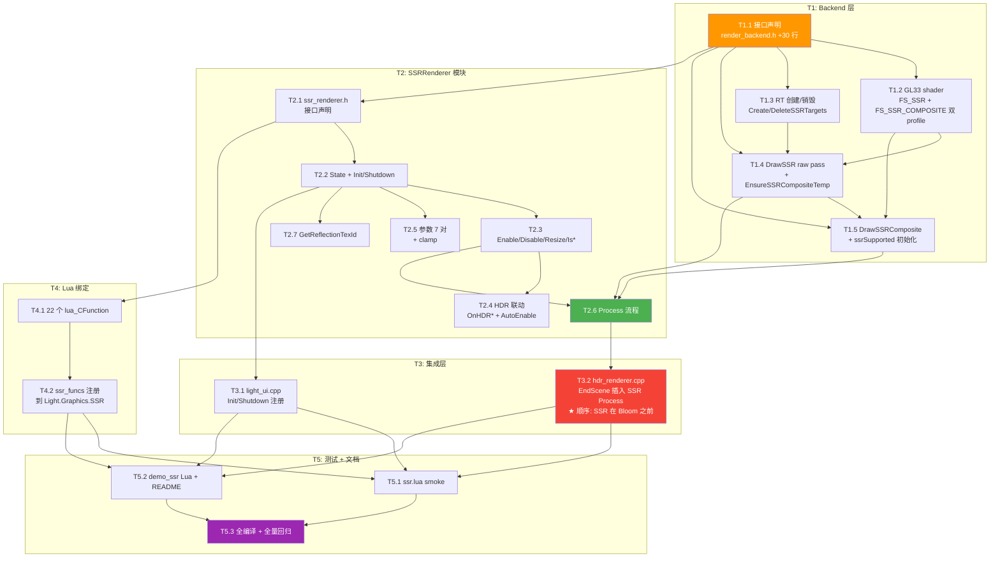

# TASK — Phase E.9 · Screen Space Reflection (SSR)

> 6A 工作流 · 阶段 3 · Atomize (原子化阶段)
> 架构设计 → 拆分任务 → 明确接口 → 依赖关系

---

## 1. 任务依赖图



**关键路径**：T1.1 → T1.2/3 → T1.4 → T1.5 → T2.6 → T3.2 → T5.3（红色高亮节点）

---

## 2. 任务原子化（按依赖顺序）

### T1.1 — RenderBackend 接口声明

**输入契约**：
- 前置依赖：无（独立任务）
- 输入数据：CONSENSUS §2.3 接口规范

**输出契约**：
- 修改 `include/render_backend.h`，在 SSAO section 之后插入 SSR section
- 5 个 virtual fn + 默认空实现 + 详细 docstring
- 不影响其他后端（默认实现使所有现有后端编译通过）

**实现约束**：
- 与 Phase E.8 SSAO 接口风格一致
- 默认实现：`SupportsSSR() = false`，其他 fn 空 body 或 `return false`

**验收标准**：
- 编译 0 error
- 现有 SSAO/Bloom/HDR smoke 全 PASS（接口加法不破坏既有调用）

**复杂度**：低 (~30 行)

---

### T1.2 — GL33 SSR shader 编译

**输入契约**：
- 前置依赖：T1.1
- 输入：FS_SSR + FS_SSR_COMPOSITE GLSL 双 profile 源码

**输出契约**：
- `src/render_gl33.cpp` 加：
  - `programSSR` / `programSSRComposite` GL program 句柄
  - 14 个 uniform location 缓存
  - `InitSSRPrograms()` private helper
  - 在 RenderGL33 ctor 末尾调用 InitSSRPrograms 并设 `ssrSupported`

**实现约束**：
- VS 复用现有 `vsTonemap`（fullscreen triangle）
- FS_SSR 双 profile：
  - GLES3: `#version 300 es / precision highp float;`
  - GL33:  `#version 330 core`
- 共享 `DecodeViewNormal()` helper（与 FS_SSAO 一致，定义 inline 不去 #include）
- 新增 `ReconstructViewPos(uv, depth, invProj)` helper

**验收标准**：
- shader 编译成功；link 成功
- 14 个 uniform location 全部 `>= 0`
- `ssrSupported = true`

**复杂度**：高 (~250 行 shader 源码 + ~80 行 C++ glue)

---

### T1.3 — GL33 SSR RT 创建/销毁

**输入契约**：
- 前置依赖：T1.1
- 输入：CreateSSRTargets / DeleteSSRTargets 接口签名

**输出契约**：
- `src/render_gl33.cpp` override：
  - `CreateSSRTargets(w, h, *outFbo, *outTex)` → 创建 RGBA16F + GL_LINEAR + GL_CLAMP_TO_EDGE，无 depth
  - `DeleteSSRTargets(*fbo, *tex)` → glDelete

**实现约束**：
- glTexImage2D internal=GL_RGBA16F, format=GL_RGBA, type=GL_FLOAT
- glCheckFramebufferStatus 检测，失败时回滚已创建资源
- 不附加 depth attachment（SSR 反射 RT 无几何渲染）

**验收标准**：
- 创建成功 outFbo > 0, outTex > 0
- glCheckFramebufferStatus 返回 GL_FRAMEBUFFER_COMPLETE
- 失败路径全测试（force ENOMEM 不可行，但代码路径覆盖通过 review）

**复杂度**：低 (~50 行)

---

### T1.4 — GL33 DrawSSR raw pass

**输入契约**：
- 前置依赖：T1.2 + T1.3
- 输入：DrawSSR 完整签名（depthTex + normalTex + hdrTex + dstFbo + proj/invProj + 5 个参数）

**输出契约**：
- `src/render_gl33.cpp::DrawSSR` 实现：
  1. `glBindFramebuffer(dstFbo)` + `glViewport(0, 0, w, h)`
  2. 关 depth/blend/scissor
  3. `glUseProgram(programSSR)`
  4. 绑 3 个 sampler（depthTex slot 0, normalTex slot 1, hdrTex slot 2）
  5. 上传 14 个 uniform（proj/invProj/texelSize/maxSteps/stepSize/thickness/maxDistance/edgeFade/...）
  6. `glDrawArrays(GL_TRIANGLES, 0, 6)` (vaoTonemap fullscreen tri)
  7. unbind

**实现约束**：
- maxSteps 通过 `glUniform1i` 上传
- proj/invProj 通过 `glUniformMatrix4fv(.., 1, GL_FALSE, mat4)`
- texelSize = (1/w, 1/h) 一次计算

**验收标准**：
- 调用后无 GL_INVALID_OPERATION（glGetError 检查）
- dstFbo 内容被写（hdr 全黑场景下，SSR raw 也应全 alpha=0 或全反射）

**复杂度**：中 (~80 行)

---

### T1.5 — GL33 DrawSSRComposite + temp FBO

**输入契约**：
- 前置依赖：T1.4
- 输入：DrawSSRComposite 签名

**输出契约**：
- `src/render_gl33.cpp` 加：
  - `EnsureSSRCompositeTemp(w, h)` private helper（懒创建）
  - `DrawSSRComposite(reflectTex, hdrFbo, w, h, intensity)`：
    1. EnsureSSRCompositeTemp(w, h)（首次或 resize 时重建）
    2. blit `hdrFbo color attachment` 到 `ssrCompositeTempFbo`（用 glBlitFramebuffer 或 fullscreen quad copy）
    3. bind hdrFbo + 用 `programSSRComposite` shader：FragColor = hdrCopy + reflect.rgb * reflect.a * intensity
    4. ssrCompositeTempTex 作为 hdr 输入采样
- ctor 末尾设 `ssrSupported = (programSSR != 0 && programSSRComposite != 0 && supportsRGBA16F)`

**实现约束**：
- temp FBO 用同 RGBA16F 格式
- 写回 hdrFbo 时 `glDisable(GL_BLEND)`（直接覆盖，FS 内部已加好）
- temp FBO 在 backend Shutdown 时释放

**验收标准**：
- composite 后 hdrFbo 颜色 = 旧 hdr + reflect * alpha * intensity（视觉验证）
- 资源正确释放，无内存泄漏

**复杂度**：中 (~100 行)

---

### T2.1 — ssr_renderer.h 接口声明

**输入契约**：
- 前置依赖：T1.1（验证 backend 接口可用）
- 输入：CONSENSUS §2.2 模块结构

**输出契约**：
- 新建 `include/ssr_renderer.h`：
  - 完整 namespace 接口（22 fn 声明对应 22 Lua API + Init/Shutdown/OnHDR* 内部 fn）
  - 头部 doc comment（与 ssao_renderer.h 同风格）
  - include guard `#ifndef SSR_RENDERER_H`

**实现约束**：
- 不引入 GL/std 重 include（仅 `<cstdint>` for uint32_t + 前向声明 RenderBackend）
- 函数命名与 SSAO 完全一致（Init/Shutdown/Enable/Disable/IsEnabled/IsSupported/Resize/OnHDR*/Set*/Get*）

**验收标准**：
- 单独编译通过（include 单元测试）
- 无任何 GL 符号泄漏

**复杂度**：低 (~80 行)

---

### T2.2 — SSRRenderer State + Init/Shutdown

**输入契约**：
- 前置依赖：T2.1
- 输入：DESIGN §2.1.1 State 结构

**输出契约**：
- 新建 `src/ssr_renderer.cpp`：
  - 匿名 namespace 的 `State` 结构 + `static State g`
  - `clampf` / `clampi` helpers
  - `DestroyResources()` / `AllocateResources(w, h)` private helpers
  - `Init(backend)` / `Shutdown()` 实现

**实现约束**：
- `Init` 不调用 Enable（与 SSAO 一致）
- `Shutdown` 调 DestroyResources + 清 backend 指针

**验收标准**：
- Init/Shutdown 反复调用不 crash
- supported 反映 `backend->SupportsSSR()`

**复杂度**：低 (~50 行)

---

### T2.3 — Enable/Disable/Resize/Is*

**输入契约**：
- 前置依赖：T2.2
- 输入：DESIGN §2.1.2 接口契约

**输出契约**：
- `Enable(w, h)`：检查 supported + 资源分配；幂等
- `Disable()`：释放资源 + enabled=false；幂等
- `Resize(w, h)`：fast path 同尺寸；否则 Disable + Enable
- `IsEnabled()` / `IsSupported()` 简单 getter

**实现约束**：
- 失败 silent fallback（不打 ERROR log，仅 WARN once）
- 资源管理通过 AllocateResources / DestroyResources

**验收标准**：
- smoke 验证 Enable -> IsEnabled true；Disable -> IsEnabled false
- Resize 同尺寸 fast path 不重建（debug log 验证）

**复杂度**：低 (~60 行)

---

### T2.4 — HDR 联动 + AutoEnable

**输入契约**：
- 前置依赖：T2.3
- 输入：DESIGN §2.1.2

**输出契约**：
- `OnHDREnabled(w, h)`：if autoEnable: Enable
- `OnHDRDisabled()`：Disable（强制，不看 autoEnable）
- `OnHDRResized(w, h)`：if enabled: Resize
- `SetAutoEnable(bool)` / `GetAutoEnable()`

**实现约束**：
- 默认 autoEnable=false（与 SSAO 同；用户需手动 Set 或显式 Enable）

**验收标准**：
- autoEnable=true + HDR.Enable → SSR 自动 enable
- HDR.Disable → SSR 强制 disable

**复杂度**：低 (~30 行)

---

### T2.5 — 参数 7 对 + clamp

**输入契约**：
- 前置依赖：T2.2
- 输入：CONSENSUS §5 参数表

**输出契约**：
- 7 对 setter/getter：MaxSteps / StepSize / Thickness / MaxDistance / Intensity / EdgeFade / BlurEnabled
- 每个 setter 用 clampi/clampf 保护
- BlurEnabled 仅存 flag（Phase E.9 不实际使用）

**实现约束**：
- clamp 范围严格按 CONSENSUS §5 表
- BlurEnabled 注释说明 "Phase E.9 reserved, unused"

**验收标准**：
- smoke round-trip 全 PASS
- clamp 边界测试全 PASS

**复杂度**：低 (~40 行)

---

### T2.6 — Process 流程

**输入契约**：
- 前置依赖：T2.3 + T2.5 + T1.4 + T1.5
- 输入：DESIGN §2.1.3 Process sequence

**输出契约**：
- `Process(hdrFbo, hdrTex)`：
  1. 早期 return（enabled / supported / fbo / tex 检查）
  2. `GetHDRNormalTex(fbo)`：== 0 → warn once + return
  3. `GetHDRDepthTex(fbo)`：== 0 → return
  4. `GetProjection` + `InvertMat4`：失败 → return
  5. `DrawSSR(...)`
  6. `DrawSSRComposite(...)`

**实现约束**：
- normalTex==0 时 warn-once（static bool warned=false 模式，与 SSAO 一致）
- 不每帧打日志

**验收标准**：
- 在 Phase E.8.x 后端正常工作
- 在不支持 MRT 的 backend silent fallback

**复杂度**：中 (~60 行)

---

### T2.7 — GetReflectionTexId

**输入契约**：
- 前置依赖：T2.2
- 输入：CONSENSUS §1.2 验收

**输出契约**：
- `GetReflectionTexId()`：返回 `g.enabled ? g.reflectTex : 0`

**实现约束**：
- 简单 inline getter

**验收标准**：
- HDR off → 返回 0
- HDR on + SSR.Enable → 返回 RT GL id (> 0)

**复杂度**：低 (~5 行)

---

### T3.1 — light_ui.cpp Init/Shutdown 注册

**输入契约**：
- 前置依赖：T2.2
- 输入：现有 SSAO 注册位置

**输出契约**：
- `light_ui.cpp::Window_Call` 中：
  - 在 `SSAORenderer::Init(g_render)` 之后加 `SSRRenderer::Init(g_render)`
  - 在窗口关闭路径，`SSAORenderer::Shutdown()` 之后加 `SSRRenderer::Shutdown()`（Shutdown 顺序反向：SSR 是更晚 init 的，应更早 shutdown）

**实现约束**：
- 顺序：Init 顺序 SSAO → SSR；Shutdown 顺序 SSR → SSAO
- 注释明确标注 Phase E.9.2

**验收标准**：
- 窗口启停反复 100 次不 crash
- 不破坏现有模块顺序

**复杂度**：低 (~5 行)

---

### T3.2 — hdr_renderer.cpp EndScene 插入 SSR Process ★

**输入契约**：
- 前置依赖：T2.6
- 输入：CONSENSUS §2.4 + DESIGN §4 数据流

**输出契约**：
- `hdr_renderer.cpp::EndScene` 中：
  - 在 `BloomRenderer::Process(g.fbo, g.sceneTex)` **之前** 插入：
    ```cpp
    // Phase E.9.2 — SSR (反射高光参与 bloom 提亮; 必须在 Bloom 之前)
    SSRRenderer::Process(g.fbo, g.sceneTex);
    ```
- `Enable(w, h)` 中追加：
  - `SSRRenderer::OnHDREnabled(w, h);`
- `Disable()` 中追加（**最先调**）：
  - `SSRRenderer::OnHDRDisabled();`
- `Resize` 中追加：
  - `SSRRenderer::OnHDRResized(w, h);`

**实现约束**：
- ★ 关键决策：SSR 必须在 Bloom Process 之前（CONSENSUS Q5）
- 顺序 affect bloom 输入，必须用 #include 顺序保证 SSRRenderer 头文件在 BloomRenderer 之前 visible

**验收标准**：
- Bloom 输入含反射高光（demo 视觉验证：金属球反射的高光被 bloom 扩散）
- HDR.Disable 时 SSR 先于 Bloom 关闭

**复杂度**：低 (~10 行)

---

### T4.1 — Lua C 函数实现 (22 个)

**输入契约**：
- 前置依赖：T2.1（头文件）+ T2.3-T2.7（实现）
- 输入：DESIGN §2.4 ssr_funcs 表

**输出契约**：
- `src/light_graphics.cpp` 加 22 个 `static int l_SSR_Xxx(lua_State* L)`：
  - 5 lifecycle: Enable / Disable / IsEnabled / IsSupported / Resize
  - 2 autoEnable: SetAutoEnable / GetAutoEnable
  - 14 params: 7 对 Set/Get
  - 1 debug: GetReflectionTexId

**实现约束**：
- 每个 fn 加 `/// @lua_api Light.Graphics.SSR.Xxx` 注释（自动文档生成可用）
- Set 全用 `luaL_checknumber` / `luaL_checkinteger` / `luaL_checkany`+`lua_toboolean`
- Get 全用 `lua_pushinteger` / `lua_pushnumber` / `lua_pushboolean`

**验收标准**：
- 22 fn 编译通过
- smoke 调用每个 fn 不 crash

**复杂度**：中 (~220 行)

---

### T4.2 — ssr_funcs 注册到 Light.Graphics.SSR

**输入契约**：
- 前置依赖：T4.1
- 输入：现有 ssao_funcs 注册位置

**输出契约**：
- `src/light_graphics.cpp` 加：
  - `static const luaL_Reg ssr_funcs[]` 数组
  - 在 `luaopen_Light_Graphics` 中（在 ssao 子表之后）加：
    ```cpp
    // Light.Graphics.SSR
    lua_newtable(L);
    luaL_setfuncs(L, ssr_funcs, 0);
    lua_setfield(L, -2, "SSR");
    ```

**实现约束**：
- 顺序：HDR → Bloom → AutoExposure → LensDirt → Streak → LensFlare → SSAO → **SSR**

**验收标准**：
- `Light.Graphics.SSR` 子表存在
- 22 个 API 全部可调用

**复杂度**：低 (~10 行)

---

### T5.1 — ssr.lua smoke

**输入契约**：
- 前置依赖：T4.2
- 输入：现有 `scripts/smoke/ssao.lua` 模板

**输出契约**：
- 新建 `scripts/smoke/ssr.lua`，结构：
  - **Section A**: subtable 存在 + 22 fn 可调用
  - **Section B**: lifecycle（Enable/Disable/IsEnabled/IsSupported）+ 幂等
  - **Section C**: params round-trip（7 对，epsilon 1e-4）
  - **Section D**: params clamp 边界（越界值正确截断）
  - **Section E**: AutoEnable 行为
  - **Section F**: GetReflectionTexId（HDR off vs on）
  - **Section G**: HDR 联动（Enable HDR → SSR autoEnable=true 自动拉起；Disable HDR → SSR Disable）
  - **Section H**: headless tolerant（HDR.Enable 失败 → 仍返回 PASS）
- 末尾 `[OK] Phase E.9 smoke (Light.Graphics.SSR): all checks passed`

**实现约束**：
- 完全 headless 兼容（Init() 不调，HDR.Enable 可能失败）
- 断言数 ≥ 50（覆盖每个 API + 边界）
- 与 ssao.lua 同 `assert_eq` / `assert_close` 风格

**验收标准**：
- 50+ 断言全 PASS
- 无 GL context 也能 PASS（CI 兼容）

**复杂度**：中 (~250 行)

---

### T5.2 — demo_ssr Lua + README

**输入契约**：
- 前置依赖：T4.2
- 输入：现有 demo_ssao 风格

**输出契约**：
- 新建 `samples/demo_ssr/main.lua`：
  - 加载金属球 mesh + 地面平面
  - HDR.Enable + SSR.Enable
  - 鼠标摄像机 + WASD
  - UI overlay 显示 6 个参数实时滑动条（用 ImGui 风格的 Lua wrapper，若没则用文字提示 + 按键）
  - F1: toggle HDR；F2: toggle Bloom；F3: toggle SSR；F4: cycle MaxSteps (16/32/64/128)
- 新建 `samples/demo_ssr/README.md`：操作 + 参数说明 + 性能建议

**实现约束**：
- 复用 examples 风格（如 demo_ssao）
- 如果项目无成熟 mesh loader，可用程序化生成（球 = sphere mesh，地面 = quad）

**验收标准**：
- 启动后金属球可见地面纹理反射
- F3 toggle SSR：开/关视觉差异明显

**复杂度**：中 (~150 行 Lua + 30 行 README)

---

### T5.3 — 全编译 + 全量回归

**输入契约**：
- 前置依赖：T1~T5 全部完成

**输出契约**：
- `cmake --build` Release 通过 0 error
- 跑以下 smoke：
  - `ssr.lua`：Phase E.9 主测
  - `ssao.lua` `hdr.lua` `bloom.lua` `mesh_3d.lua` `graphics.lua`：回归
- 启动 `demo_ssr` 视觉确认
- 更新 `docs/Phase E.9 SSR/ACCEPTANCE_PhaseE_9.md` 记录全部测试结果

**实现约束**：
- 失败时立即定位并修复，不允许 fail-then-skip

**验收标准**：
- 全量 smoke 0 FAIL
- demo_ssr 启动正常

**复杂度**：中 (主要时间是修 bug 而非写代码)

---

## 3. 任务覆盖矩阵（CONSENSUS §1.2 验收对照）

| CONSENSUS 验收项 | 覆盖任务 |
|------------------|----------|
| 编译 0 error | T5.3 |
| Lua API 13 fn 完整性 | T4.2 + T5.1 Section A |
| 7 对参数 round-trip | T2.5 + T5.1 Section C |
| 参数 clamp 边界 | T2.5 + T5.1 Section D |
| Lifecycle 幂等性 | T2.3 + T5.1 Section B |
| HDR 联动 | T2.4 + T3.2 + T5.1 Section G |
| Silent fallback | T1.1 默认实现 + T2.6 + T5.1 Section H |
| GetReflectionTexId | T2.7 + T4.1 + T5.1 Section F |
| 回归测试 | T5.3 |
| demo 场景 | T5.2 |
| 性能 GTX 1660 ≥ 30 FPS | T5.2 demo 实测（人工） |

**11 项验收全部有任务覆盖**。

---

## 4. 任务关键路径与并行机会

### 4.1 关键路径（不可并行）

```
T1.1 → T1.2 → T1.4 → T1.5 → T2.6 → T3.2 → T5.3
```

总计 7 个任务串行，预计 1.5 sessions（~3 小时）。

### 4.2 可并行任务对

| 并行组 | 任务 |
|--------|------|
| A | T2.5（参数）+ T2.7（debug）：纯独立 |
| B | T4.1（Lua C fn）+ T5.1（smoke）：可同时起步，T5.1 跑测试时 T4.1 已完成 |
| C | T1.3（RT）+ T1.2（shader）：互不依赖，可并行 |
| D | T5.2（demo）+ T5.1（smoke）：测试与 demo 无强依赖 |

### 4.3 复杂度统计

| 复杂度 | 任务数 | 总行数估算 |
|--------|--------|------------|
| 低 | 10 | ~290 |
| 中 | 6 | ~750 |
| 高 | 1 (T1.2 shader) | ~330 |
| **总计** | **17** | **~1370** |

---

## 5. 风险与中断点

每个任务遇到以下情况立即中断 + 询问：

1. **T1.2 shader 编译失败**：GLSL 语法错误或驱动差异 → 减 helper 函数体或换写法
2. **T1.4 / T1.5 GL_INVALID_OPERATION**：sampler bind 顺序或 uniform location -1 → debug 后继续
3. **T2.6 normal MRT 接口变化**：Phase E.8.x 后 GetHDRNormalTex 签名若被改 → 同步对齐
4. **T3.2 Bloom 顺序回归**：现有 demo 视觉变化 → 检查是否 SSR=off 时也变化（应不变）
5. **T5.3 性能 < 30 FPS**：用户拍板 full-res 64 步，若中端 GPU 不达标 → 报告 + TODO 标注

---

## 6. 完成度门控（必须全 ✅ 才能进入 Approve）

- [x] 任务覆盖完整需求（11/11 验收项有任务覆盖）
- [x] 依赖关系无循环（mermaid DAG 验证）
- [x] 每个任务都可独立验证（17/17 任务有验收标准）
- [x] 复杂度评估合理（最大单任务 T1.2 shader ~330 行，仍可控）

---

**进入 6A 阶段 4: Approve**（人工审查关卡）

下一步：与用户确认任务拆分粒度 + 依赖图无误，得到 Approve 后启动 Automate 阶段。
