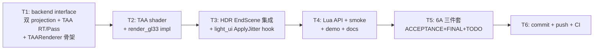

# Phase F.0 TAA 主管线 — PLAN (Align + Architect + Atomize)

> 6A 工作流 · 阶段 1+2+3 合并
> 基线：Phase E.18.2 commit `a50154c`
> 工作量预估：~2-3 天
> 性质：大特性 (Phase E velocity 链路集大成输出)

---

## 1. Align — 任务定义

### 1.1 原始需求

为 ChocoLight 引擎引入完整 TAA (Temporal Anti-Aliasing) 主管线：sub-pixel jitter 投影 + history 累积 + neighborhood clip + alpha blend，对整个 HDR scene 做 super-sampling 与抗锯齿，复用 Phase E 系列 velocity 链路 (E.13/E.14 velocity buffer + E.18 dilated velocity + 复用 SSR 的 Halton-2,3 jitter 表)。

### 1.2 已实现可复用基础设施

| 资产 | 位置 | 说明 |
|------|------|------|
| Halton-2,3 8-sample jitter 表 | `@e:/jinyiNew/Light/ChocoLight/src/ssr_renderer.cpp:84-94` | ±0.5 pixel 偏移 |
| Mat4 求逆 / 列主序乘法 | `@e:/jinyiNew/Light/ChocoLight/src/ssr_renderer.cpp:43-81` | TAA 计算 reprojection 同样需要 |
| Velocity buffer + dual format (RG16F/RG8) | Phase E.13/E.14 | TAA reproject 用 |
| Dilated velocity (E.18 9-tap max-length) | `HDRRenderer::GetDilatedVelocityTexture()` | TAA 复用，不重复 dilation |
| reverse-reprojection + 9-tap AABB clip 模式 | SSR Temporal shader (`@e:/jinyiNew/Light/ChocoLight/src/render_gl33.cpp:1970-2083`) | TAA shader 直接套用 |
| History ping-pong RT 模式 | SSR Temporal (`historyFbos[2]` / `historyIdx` swap) | 直接套用 |
| Pipeline hook 模式 | SSAO/SSR/MotionBlur (`OnHDREnabled`/`OnHDRDisabled`/`Process`) | TAA 仿同模式 |

### 1.3 任务边界

✅ **包含**：
- 新模块 `taa_renderer.h/.cpp` (仿 SSR/MotionBlur 模块)
- backend 双 projection (raster 用 jittered, sampling/reconstruction 用 unjittered)
- TAA shader (reproject + neighborhood AABB clip + alpha blend)
- HDR EndScene 集成 TAA pass (MotionBlur 后、Tonemap 前)
- Lua API: `Light.Graphics.TAA.Enable/Disable/IsEnabled/Resize/SetBlendAlpha/Get.../SetNeighborhoodClip/Get.../SetJitterEnabled/Get...`
- smoke / demo / docs

❌ **不包含** (Phase F.0.x 候选)：
- TAA Sharpening 后处理 (Filmic 锐化, 弥补 super-sampling 模糊)
- YCoCg color-space clip (RGB AABB 已够用)
- Variance clipping (邻域均值±方差)
- Anti-flicker filter (高对比度像素稳定化)
- Motion-vector based history reject (大 velocity 直接丢 history)

### 1.4 关键决策矩阵 (12 决策点)

| # | 决策点 | 选定方案 | 替代方案 / 理由 |
|---|--------|----------|----------------|
| 1 | TAA pipeline 位置 | **MotionBlur 之后、Tonemap 之前** | 业界主流；MotionBlur 输入更 sharp；TAA 是 HDR linear 空间最后一个 pass |
| 2 | Jitter 注入方式 | **backend 双 projection** (raster jittered + sample unjittered) | 替代：用户 Lua 层手动 jitter (复杂)；引擎不管 jitter (无 super-sampling) |
| 3 | Jitter sequence | **复用 SSR Halton-2,3 8-sample 表** | 替代：16-sample (质量更高但开销大)；统一更利于联动 |
| 4 | Jitter 启用条件 | **TAA Enable 时自动开启** projection jitter | 用户透明；SSR Temporal 内部 jitter 不冲突 (作用于 ray march 起点) |
| 5 | History RT | **2× RGBA16F full-res ping-pong** | 与 HDR scene 同格式同尺寸；1080p VRAM 16MB |
| 6 | Velocity 来源 | **combined dilated velocity** (E.18 输出) | 替代：camera-only (高速物体不参与 reproject 会重影) |
| 7 | Neighborhood clip 算法 | **9-tap AABB RGB clip** (与 SSR Temporal 一致) | 替代：YCoCg clip (更稳定但需色彩空间转换 shader 复杂度+30%) |
| 8 | Alpha 默认值 | **0.92** (history 占 92%) | SSR Temporal 用 0.9；TAA 主管线略高让累积更稳 |
| 9 | 默认启用 | **OFF** (用户 Enable 主动激活) | 与 Phase E 所有模块一致 (autoEnable=false) |
| 10 | Lua API 设计 | **`Light.Graphics.TAA.*` 子表** 仿 SSR/MotionBlur | 13-15 Lua 函数 (Enable/Disable/IsEnabled/IsSupported/Resize + 5 对 Set/Get) |
| 11 | 与 SSR Temporal 关系 | **共存** (互不干扰，但双 temporal 风险) | 文档明确警示；用户决定是否同开 |
| 12 | Sharpening | **Phase F.0 不做**，留 Phase F.0.1 | TAA 引入 sub-pixel 模糊；后续可选 Filmic-style 1-tap 锐化补偿 |

---

## 2. Architect — 数据流与接口

### 2.1 数据流图

```
[用户调用 SetPerspective(fovY, aspect, near, far)]
   ↓
g_render->LoadProjection(proj.m)
   ↓
[backend 内部双状态]
   projection_         ← 原始 unjittered (SSR/SSAO/MotionBlur 用)
   jitteredProjection_ ← TAA Enable 时实际栅格化用
   ↓
[BeginScene]
   if (TAA::IsEnabled()):
      backend->SetActiveProjection(jitteredProjection_)  ← 后续 3D Draw 用 jittered
   else:
      backend->SetActiveProjection(projection_)
   ↓
[用户 Draw 3D scene] → HDR RT (sub-pixel jittered if TAA ON)
   ↓
[HDR EndScene]
   1. Bloom → ... → SSAO → [E.18 dilation] → SSR → LensFlare → MotionBlur
   2. ★ Phase F.0 TAA::Process ★
      - 取当前 HDR scene tex (jittered) + 上帧 history tex + dilated velocity
      - reproject prev pixel via velocity buffer
      - 9-tap neighborhood AABB clip
      - alpha blend: history = mix(cur, clipped_history, alpha)
      - 输出: 写入新 history tex 同时覆盖 HDR scene tex
   3. Tonemap (用 TAA 后的 HDR)
   4. CommitVelocityHistory + TAA::CommitHistory (ping-pong swap)
   ↓
[下帧]
   TAA::frameCounter++ → 新 jitter 索引
```

### 2.2 关键接口

#### 2.2.1 `render_backend.h` 新增接口

```cpp
/// Phase F.0 — 设置 TAA jittered projection matrix
/// @param jitteredProj 16 floats (column-major)
/// 调用后, 直到下次 LoadProjection / ClearJitter 之前, 所有 3D 栅格化用此 matrix.
/// 其他模块 (SSR/SSAO/MotionBlur) GetProjection() 仍返原始 unjittered matrix.
virtual void LoadJitteredProjection(const float* jitteredProj) {}

/// Phase F.0 — 清除 jitter 模式, 恢复用原始 projection 栅格化
virtual void ClearJitteredProjection() {}

/// Phase F.0 — 查询当前是否启用了 jittered projection (供 debug HUD 用)
virtual bool IsJitteredProjectionActive() const { return false; }

/// Phase F.0 — TAA history RT 管理 (RGBA16F × 2 ping-pong)
virtual bool CreateTAAHistoryRT(int /*w*/, int /*h*/,
                                 uint32_t* /*fbos*/, uint32_t* /*texs*/) { return false; }
virtual void DeleteTAAHistoryRT(uint32_t* /*fbos*/, uint32_t* /*texs*/) {}

/// Phase F.0 — TAA pass: reproject + clip + blend
/// 输入: curHdrTex (本帧 HDR), historyTex (上帧 TAA 输出), velocityTex (dilated 或 raw),
///       dstFbo (本帧 TAA 输出 = 写入新 history slot)
/// 输出: dstFbo = TAA blended scene
virtual void DrawTAAPass(uint32_t /*curHdrTex*/, uint32_t /*historyTex*/,
                         uint32_t /*velocityTex*/, uint32_t /*dstFbo*/,
                         int /*w*/, int /*h*/,
                         float /*blendAlpha*/, int /*neighborhoodClip*/,
                         int /*hasHistory*/,
                         bool /*velocityDilation*/,
                         float /*velocityScale*/,
                         VelocityFormat /*velocityFormat*/) {}

/// Phase F.0 — 后端是否支持 TAA (要求 RGBA16F RT + MRT velocity)
virtual bool SupportsTAA() const { return false; }
```

#### 2.2.2 `taa_renderer.h` 新模块

```cpp
namespace TAARenderer {

// 生命周期 (仿 SSR/MotionBlur)
bool Init(RenderBackend* backend);
void Shutdown();
bool IsInited();

bool Enable(int w, int h);
void Disable();
bool IsEnabled();
bool IsSupported();
bool Resize(int w, int h);

// 联动 hook (HDR Enable/Disable 自动调)
void OnHDREnabled(int w, int h);   // autoEnable=false → no-op
void OnHDRDisabled();
void OnHDRResized(int w, int h);

// 主 pass (HDR EndScene 末端调)
void Process(uint32_t hdrFbo, uint32_t hdrTex);

// 参数
void  SetBlendAlpha(float alpha);    // clamp [0.5, 0.99], 默认 0.92
float GetBlendAlpha();

void  SetNeighborhoodClip(bool on);  // 默认 true
bool  GetNeighborhoodClip();

void  SetJitterEnabled(bool on);     // 默认 true (TAA enabled 时随之拉起)
bool  GetJitterEnabled();

// 内部状态查询 (debug HUD 用)
int   GetFrameCounter();             // jitter 序列索引 (% 8)
void  GetCurrentJitter(float* outX, float* outY);  // 当前帧 sub-pixel jitter (±0.5 pixel)

} // namespace TAARenderer
```

#### 2.2.3 Lua API (`Light.Graphics.TAA.*`)

| 函数 | 签名 | Phase |
|------|------|-------|
| `Enable(w, h)` | int, int → bool | F.0 |
| `Disable()` | → void | F.0 |
| `IsEnabled()` | → bool | F.0 |
| `IsSupported()` | → bool | F.0 |
| `Resize(w, h)` | int, int → bool | F.0 |
| `SetBlendAlpha(a)` | number → bool | F.0 |
| `GetBlendAlpha()` | → number | F.0 |
| `SetNeighborhoodClip(on)` | bool → bool | F.0 |
| `GetNeighborhoodClip()` | → bool | F.0 |
| `SetJitterEnabled(on)` | bool → bool | F.0 |
| `GetJitterEnabled()` | → bool | F.0 |
| `GetFrameCounter()` | → int | F.0 |
| `GetCurrentJitter()` | → number, number | F.0 |

**累计 13 Lua API**

### 2.3 内部状态机

```cpp
struct State {
    RenderBackend* backend = nullptr;
    bool     inited     = false;
    bool     supported  = false;
    bool     enabled    = false;
    bool     autoEnable = false;
    
    int      width      = 0;
    int      height     = 0;
    
    // History ping-pong (复用 SSR Temporal 模式)
    uint32_t historyFbos[2] = {0, 0};
    uint32_t historyTexs[2] = {0, 0};
    int      historyIdx     = 0;
    bool     hasHistory     = false;
    
    // 参数
    float    blendAlpha     = 0.92f;
    bool     neighborhoodClip = true;
    bool     jitterEnabled  = true;
    
    // Jitter 状态
    uint64_t frameCounter   = 0;
    float    curJitterX     = 0.0f;
    float    curJitterY     = 0.0f;
};
```

### 2.4 BeginScene jitter 注入流程

```cpp
// taa_renderer.cpp::ApplyJitterToProjection (BeginScene 内部辅助, 由 light_ui 主循环调)
void ApplyJitter() {
    if (!g.enabled || !g.jitterEnabled || !g.backend) return;
    
    // 取当前 unjittered projection
    float proj[16];
    g.backend->GetProjection(proj);
    
    // 计算 sub-pixel offset (NDC 空间, ±1.0/W 范围)
    const int j = (int)(g.frameCounter & 7u);
    g.curJitterX = kHaltonJitter[j][0];   // ±0.5 pixel
    g.curJitterY = kHaltonJitter[j][1];
    
    // NDC 偏移 = 像素偏移 × 2 / RT 尺寸
    const float ndcOffX = g.curJitterX * 2.0f / (float)g.width;
    const float ndcOffY = g.curJitterY * 2.0f / (float)g.height;
    
    // 修改 projection: m[8] += ndcOffX, m[9] += ndcOffY (column-major)
    // 这等价于把 NDC.x/y 整体加 ndcOff (sub-pixel 平移)
    float jitteredProj[16];
    memcpy(jitteredProj, proj, sizeof(proj));
    jitteredProj[8]  += ndcOffX;   // proj[2][0] 列影响 z->x clip
    jitteredProj[9]  += ndcOffY;   // proj[2][1] 列影响 z->y clip
    
    g.backend->LoadJitteredProjection(jitteredProj);
}
```

集成位置：`light_ui.cpp::l_Window_Call` 在 `HDRRenderer::BeginScene()` 之后、用户 `Draw` 之前调 `TAARenderer::ApplyJitter()`。

### 2.5 EndScene TAA Process 流程

```cpp
// taa_renderer.cpp::Process
void Process(uint32_t hdrFbo, uint32_t hdrTex) {
    if (!g.enabled || !g.supported || !g.backend) return;
    if (!hdrFbo || !hdrTex) return;
    if (!g.historyFbos[0] || !g.historyFbos[1]) return;
    
    const int writeIdx = g.historyIdx;
    const int readIdx  = 1 - writeIdx;
    
    // 取 dilated velocity (E.18 输出); fallback raw velocity
    const uint32_t dilatedV = HDRRenderer::GetDilatedVelocityTexture();
    const uint32_t rawV     = g.backend->GetHDRVelocityTex(hdrFbo);
    const uint32_t velocityTex = dilatedV ? dilatedV : rawV;
    
    // 跑 TAA shader: 输出到 historyFbos[writeIdx]
    g.backend->DrawTAAPass(hdrTex, g.historyTexs[readIdx], velocityTex,
                           g.historyFbos[writeIdx],
                           g.width, g.height,
                           g.blendAlpha,
                           g.neighborhoodClip ? 1 : 0,
                           g.hasHistory ? 1 : 0,
                           g.backend->GetVelocityDilation(),
                           g.backend->GetVelocityScale(),
                           g.backend->GetActiveVelocityFormat());
    
    // 把 TAA 输出 blit 回 HDR scene tex (让 Tonemap 用 TAA 后的内容)
    g.backend->BlitTAAToHDR(g.historyTexs[writeIdx], hdrFbo, g.width, g.height);
    
    // ping-pong swap
    g.historyIdx = readIdx;
    g.hasHistory = true;
    g.frameCounter++;
    
    // 清除 jittered projection (让下帧 BeginScene 重新设)
    g.backend->ClearJitteredProjection();
}
```

### 2.6 TAA shader (GLES 3.0, 仿 SSR Temporal)

```glsl
#version 300 es
precision highp float;
precision highp sampler2D;
in  vec2 vUV;
out vec4 FragColor;

uniform sampler2D uCurHdrTex;       // 本帧 HDR scene (jittered)
uniform sampler2D uHistoryTex;      // 上帧 TAA 输出
uniform sampler2D uVelocityTex;     // dilated 或 raw velocity
uniform vec2  uTexel;               // 1.0 / (W, H)
uniform float uBlendAlpha;          // [0.5, 0.99]
uniform int   uNeighborhoodClip;    // 0/1
uniform int   uHasHistory;          // 0=首帧, 1=累积
uniform int   uVelocityDilation;    // 0=单点采 (E.18 dilated path), 1=inline 9-tap (fallback)
uniform int   uVelocityFormat;      // 0=RG16F, 1=RG8
uniform float uVelocityScale;       // RG8 decode

vec2 DecodeVelocity(vec2 raw) {
    return (uVelocityFormat == 1) ? ((raw - 0.5) * (2.0 * uVelocityScale)) : raw;
}

vec2 SampleVelocity(vec2 uv) {
    if (uVelocityDilation == 0) return DecodeVelocity(texture(uVelocityTex, uv).rg);
    // inline 9-tap max-length (与 SSR Temporal 同算法)
    vec2 bestV = vec2(0.0);
    float bestLen = -1.0;
    for (int dy = -1; dy <= 1; ++dy) {
        for (int dx = -1; dx <= 1; ++dx) {
            vec2 v = DecodeVelocity(texture(uVelocityTex, uv + vec2(float(dx), float(dy)) * uTexel).rg);
            float l = dot(v, v);
            if (l > bestLen) { bestLen = l; bestV = v; }
        }
    }
    return bestV;
}

void main() {
    vec4 cur = texture(uCurHdrTex, vUV);
    
    if (uHasHistory == 0) { FragColor = cur; return; }
    
    // ① reproject
    vec2 velocity = SampleVelocity(vUV);
    vec2 prevUV = vUV - velocity;
    
    if (prevUV.x < 0.0 || prevUV.x > 1.0 ||
        prevUV.y < 0.0 || prevUV.y > 1.0) {
        FragColor = cur;
        return;
    }
    
    vec4 hist = texture(uHistoryTex, prevUV);
    
    // ② neighborhood AABB clip
    if (uNeighborhoodClip == 1) {
        vec3 mn = cur.rgb;
        vec3 mx = cur.rgb;
        vec3 s;
        s = texture(uCurHdrTex, vUV + uTexel * vec2(-1.0, -1.0)).rgb; mn = min(mn, s); mx = max(mx, s);
        s = texture(uCurHdrTex, vUV + uTexel * vec2( 0.0, -1.0)).rgb; mn = min(mn, s); mx = max(mx, s);
        s = texture(uCurHdrTex, vUV + uTexel * vec2( 1.0, -1.0)).rgb; mn = min(mn, s); mx = max(mx, s);
        s = texture(uCurHdrTex, vUV + uTexel * vec2(-1.0,  0.0)).rgb; mn = min(mn, s); mx = max(mx, s);
        s = texture(uCurHdrTex, vUV + uTexel * vec2( 1.0,  0.0)).rgb; mn = min(mn, s); mx = max(mx, s);
        s = texture(uCurHdrTex, vUV + uTexel * vec2(-1.0,  1.0)).rgb; mn = min(mn, s); mx = max(mx, s);
        s = texture(uCurHdrTex, vUV + uTexel * vec2( 0.0,  1.0)).rgb; mn = min(mn, s); mx = max(mx, s);
        s = texture(uCurHdrTex, vUV + uTexel * vec2( 1.0,  1.0)).rgb; mn = min(mn, s); mx = max(mx, s);
        hist.rgb = clamp(hist.rgb, mn, mx);
    }
    
    // ③ blend
    float alpha = clamp(uBlendAlpha, 0.0, 1.0);
    FragColor = vec4(mix(cur.rgb, hist.rgb, alpha), 1.0);
}
```

---

## 3. Atomize — 原子任务拆分



| 任务 | 文件 | 行数估算 | 复杂度 |
|------|------|----------|--------|
| T1 | `render_backend.h` (+30) / `render_gl33.cpp` (+250 双 projection 状态 + TAA RT 函数) / `taa_renderer.h` (+100) / `taa_renderer.cpp` (+400) | ~780 | 高 (新模块 + backend 改造) |
| T2 | `render_gl33.cpp` (+200 TAA shader + Draw 函数 + program 编译/uniform 缓存) | ~200 | 中 (仿 SSR Temporal shader) |
| T3 | `hdr_renderer.cpp` (+30 Process hook + Disable 顺序) / `light_ui.cpp` (+10 BeginScene 内 ApplyJitter) | ~40 | 中 (pipeline 顺序 + jitter 时序) |
| T4 | `light_graphics.cpp` (+260 Lua 绑定 13 函数 + 子表注册) / `scripts/smoke/taa.lua` (+150 新建) / `samples/demo_ssr/main.lua` (+30 TAA toggle + HUD) / `docs/api/Light_Graphics.md` (+300 TAA 子表完整文档) | ~740 | 中高 |
| T5 | `docs/Phase F.0/ACCEPTANCE_PhaseF_0.md` + `FINAL_PhaseF_0.md` + `TODO_PhaseF_0.md` | ~600 | 中 |
| T6 | git + CI 监控 | — | 低 |
| **合计** | — | **~2360 代码 + 600 文档** | **大特性** |

预估总工时：**~2-3 天**（含调试 + 视觉验证）。

---

## 4. 验收标准

### T1 backend 接口
- [ ] `LoadJitteredProjection` / `ClearJitteredProjection` / `IsJitteredProjectionActive` 三接口实现
- [ ] 内部双 projection state (`projection_` unjittered + `jitteredProjection_` for raster)
- [ ] 3D 渲染路径 (Draw / Lit / etc.) 自动取 jittered 当存在
- [ ] `GetProjection()` 始终返 unjittered (SSR/SSAO/MotionBlur 零改动)
- [ ] `CreateTAAHistoryRT` × 2 RGBA16F full-res
- [ ] `DeleteTAAHistoryRT` 安全清理
- [ ] `SupportsTAA()` 反映后端能力 (GLES3 + MRT support)

### T2 TAA shader
- [ ] Shader 编译通过 (GLES 3.0 / GL 3.3 desktop)
- [ ] `DrawTAAPass` 函数实现 (binding 4 sampler + 8 uniform)
- [ ] Program / uniform location 缓存正确

### T3 HDR 集成
- [ ] `TAARenderer::Process` 在 MotionBlur 后、Tonemap 前调
- [ ] `light_ui.cpp::l_Window_Call` 在 BeginScene 后 ApplyJitter
- [ ] HDR Disable 时 TAA::OnHDRDisabled 先调 (依赖顺序)
- [ ] HDR Resize 时 TAA history RT 重建

### T4 Lua API + docs
- [ ] 13 Lua 函数全部 round-trip + type-error 测试 (smoke 30+ assertion)
- [ ] demo_ssr 加 `T` 快捷键 toggle TAA (与 Temporal 区分开)
- [ ] HUD 显示 TAA 状态 + alpha + neighborhoodClip + frameCounter
- [ ] Light_Graphics.md TAA 子表完整文档 + API 速查表

### T5 6A 文档
- [ ] ACCEPTANCE/FINAL/TODO 三件套

### T6 CI
- [ ] GitHub Actions 6/6 平台 success
- [ ] CI 状态回填三份文档

### 视觉验证 (demo_ssr 手动)
- [ ] 静态场景 TAA Enable 后边缘锯齿明显减弱 (super-sampling 效果)
- [ ] 相机移动时无明显 ghosting (velocity reproject 正确)
- [ ] 高速物体边缘 1-2 px 抖动可接受 (neighborhood clip 起效)
- [ ] alpha 越高累积越稳但响应越慢 (~0.95 接近静态质量，~0.85 响应快但抖动)

---

## 5. 性能预算 (理论)

### TAA pass 自身开销 (1080p)

| 子操作 | fetch/px | 估算时间 |
|--------|----------|---------|
| 当前 HDR sample | 1 | — |
| Velocity sample (dilation pass 已做 → 单点采) | 1 | — |
| Neighborhood 9-tap (cur HDR) | 9 | ~0.05ms |
| History sample (after reproject) | 1 | — |
| Blend + write | — | ~0.02ms |
| **合计** | **12 fetch + 1 write** | **~0.10ms @ 1080p** |

### History RT VRAM

- 1080p: 2 × 1920 × 1080 × 8 bytes (RGBA16F) = **16 MB**
- 4K: 2 × 3840 × 2160 × 8 bytes = **64 MB** (注意 mobile GPU 受限)

### 与 SSR Temporal 双 temporal 开销

| 配置 | TAA only | SSR Temporal only | TAA + SSR Temporal |
|------|----------|-------------------|--------------------|
| GPU time @ 1080p | 0.10ms | 0.10ms | 0.20ms (linear add) |
| VRAM | 16 MB | 16 MB | 32 MB |
| 视觉 | 整体抗锯齿 | 反射稳定 | 反射被 temporal 两次 (略过 blur) |

**推荐**：用户启 TAA 时关 SSR Temporal (`Light.Graphics.SSR.SetTemporalEnabled(false)`)，让 TAA 主管线统一处理。

---

## 6. 风险 / 缓解

| 风险 | 影响 | 缓解 |
|------|------|------|
| Jitter 注入破坏 SSR/SSAO 等 view-space 计算 | 反射 / AO 错位 | backend 双 projection (GetProjection 返 unjittered) |
| 双 temporal (TAA + SSR Temporal) 过度模糊反射 | 反射 ghosting | 文档警示 + demo 默认互斥 |
| neighborhood clip 在高频高对比度区域产生 firefly | 闪烁 | Phase F.0.1 加 anti-flicker filter |
| jittered raster 在 forward shading 上产生 sub-pixel artifact | 极细物体边缘 | TAA history 累积自然抹平; 1-2 帧后稳定 |
| GLES2 / WebGL1 不支持 MRT velocity | 后端 SupportsTAA=false → silent fallback | 与现有 SSR/MotionBlur 路径一致 |
| History RT 占 VRAM | mobile 4K 64MB 可能 OOM | Phase F.0.x 加 halfRes history (仿 E.17) |

---

## 7. 共识 (待 Approve)

✅ 决策矩阵清晰 (12/12 已选)
✅ 接口变更可控 (backend +7 接口 + 新模块 ~500 行)
✅ 零回归保障 (默认 OFF + jitter 仅 TAA Enable 时启)
✅ 与 Phase E 链路无破坏 (复用 dilated velocity + Halton 表)
⏳ **关键决策点待用户拍板**:
  - **#1 pipeline 位置** (MotionBlur 之后 vs 之前 vs 替代 SSR Temporal)
  - **#2 jitter 注入方式** (backend 双 projection vs Lua 手动)
  - **#11 与 SSR Temporal 关系** (共存 vs 互斥强制)

**进入 Automate 阶段 (T1 开始) 需用户审阅本 PLAN + 拍板 3 个关键决策。**
