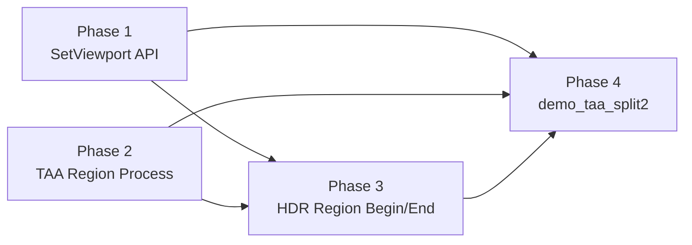

# Phase F.0.10.2 — 真物理 Split-Screen with TAA Multi-Instance · 架构设计

> 6A 工作流 · 阶段 2 (Architect) · DESIGN

---

## 1. 总体目标

让 ChocoLight 支持**真物理 split-screen with 独立 TAA per player**:
- 同一帧内左半屏渲染玩家 1 视角 + 走 TAA instance 1 history
- 同一帧内右半屏渲染玩家 2 视角 + 走 TAA instance 2 history
- 双 viewport 真并行 (不是 timeline cycle)

---

## 2. 关键简化决策

**不做完整 HDR 多实例化** (避免 9 个 sub-phase 联动)，改用更轻量方案:

```
原方案 (路径 C 完整): HDR 多 fbo + TAA 多 history + 各自 process     → 8-12h
本设计 (路径 C+):    HDR 单 fbo + 区域 begin/end + TAA region process → 6-8h
```

核心思想: **保留 HDR 单 fbo 单 sceneTex 不变, 通过 GL scissor + viewport 限制写入区域**。HDR.BeginScene/EndScene 接受可选 region 参数, scissor 控制 clear 范围, TAA Process 接收 (uvOffset, uvScale) 让 shader 仅处理区域。

---

## 3. 4 个 Incremental Sub-Phase

每个 sub-phase 独立 commit + CI 验证, 单 sub-phase failure 不阻塞前序交付。

### Phase 1 — Graphics.SetViewport Lua API (1h)

**目标**: 暴露 `Graphics.SetViewport(x, y, w, h)` + `Graphics.GetViewport()` Lua API。

**实现**:
- `light_graphics.cpp`:
  - 加 `l_SetViewport(x, y, w, h)` 调 `g_render->SetViewport(...)`
  - 加 `l_GetViewport()` 用 `glGetIntegerv(GL_VIEWPORT, ...)` 返 4 整数
  - 注册到 g_funcs[] 数组
- smoke `scripts/smoke/graphics.lua` 加 SetViewport/GetViewport 段:
  - round-trip (SetViewport → GetViewport 应返同值)
  - 非法参数 (负数 / 类型错) 防御性测试

**验收**: smoke PASS, CI 6/6 success

### Phase 2 — TAA Region Process (3-4h)

**目标**: TAA shader 接受 (uvOffset, uvScale) uniform, 让 TAA Process 能仅处理指定区域。

**实现**:
- `shaders/taa_blend.glsl` (推断现存):
  - 加 uniform `vec2 u_uvOffset` (区域左下角 UV, 默认 [0,0])
  - 加 uniform `vec2 u_uvScale` (区域 UV 缩放, 默认 [1,1])
  - 顶点 shader 把 quad UV 通过 `uv = uv * u_uvScale + u_uvOffset` 映射到区域
- `taa_renderer.cpp`:
  - 新接口 `void Process(uint32_t hdrFbo, uint32_t hdrTex, int x, int y, int w, int h)`
  - 老 `Process(hdrFbo, hdrTex)` 转 forward 到 `Process(fbo, tex, 0, 0, width, height)` (零回归)
  - 内部:
    1. 计算 uvOffset / uvScale (相对于全屏 history RT)
    2. backend->SetViewport(x, y, w, h) + glEnable(GL_SCISSOR_TEST) + glScissor(x, y, w, h)
    3. shader bind uniform → quad draw → only writes scissor region
    4. 复位 viewport / scissor
- HDR.EndScene 调用 TAA.Process 时, 默认仍全屏 (零回归)

**验收**: TAA region process 不破坏全屏 process; smoke region test PASS

### Phase 3 — HDR Region BeginScene/EndScene (2-3h)

**目标**: HDR.BeginScene/EndScene 接受可选 region 参数, 单帧支持 2 次区域 Begin/End。

**实现**:
- `hdr_renderer.cpp`:
  - `BeginScene(int x=0, int y=0, int w=0, int h=0)`:
    - w/h=0 时全屏 (默认, 零回归)
    - w/h>0 时仅 viewport(x,y,w,h) + scissor(x,y,w,h) + 仅清区域
  - `EndScene(int x=0, int y=0, int w=0, int h=0)`:
    - 调 TAA.Process 时传 region 参数 (用 Phase 2 接口)
    - tonemap 也支持 region (sceneTex 仅采样区域, default fb 写入区域)
- `light_graphics.cpp`:
  - 老 HDR.BeginScene/EndScene 不变 (内部 hook BeginFrame/EndFrame 全屏)
  - 加 Lua API `HDR.BeginRegion(x,y,w,h)` / `HDR.EndRegion(x,y,w,h)` 显式区域调用

**验收**: 单帧 2 次 Begin/End 不破坏 sceneTex; CI 6/6 success

### Phase 4 — demo_taa_split2 真分屏 (1-2h)

**目标**: 新 demo `samples/demo_taa_split2/main.lua` 真物理双视口分屏。

**实现**:
```lua
local HDR, TAA = Light.Graphics.HDR, Light.Graphics.TAA
local p1 = TAA.CreateInstance()    -- player 1 TAA
local p2 = TAA.CreateInstance()    -- player 2 TAA

-- 每帧
HDR.BeginRegion(0, 0, W/2, H)            -- 左半 viewport + scissor + 清左半
TAA.SetActiveInstance(p1); TAA.ApplyJitter()
Gfx.SetCamera(player1_eye, player1_at)
-- ... draw player 1 scene ...
HDR.EndRegion(0, 0, W/2, H)              -- TAA.Process region(0,0,W/2,H) + region tonemap

HDR.BeginRegion(W/2, 0, W/2, H)          -- 右半
TAA.SetActiveInstance(p2); TAA.ApplyJitter()
Gfx.SetCamera(player2_eye, player2_at)
-- ... draw player 2 scene ...
HDR.EndRegion(W/2, 0, W/2, H)
```

**验收**: 用户能看到真双视口分屏 + 各自独立 TAA history; CI smoke pass (headless API 验证)

---

## 4. 4 sub-phase 依赖图



每个 sub-phase 独立 commit, 单独 push 触发 CI 6/6 验证。

---

## 5. 风险与降级路径

| 风险 | 降级 |
|------|------|
| Phase 2 shader uniform 跨平台兼容 (web/ios/android) | 仅 windows/linux/macos 启用 region, 移动端 fallback 全屏 |
| Phase 3 单帧 2 次 BeginScene 破坏 history | 把 ClearCurrent 改为 scissor clear |
| Phase 4 demo 太复杂 | 简化为 2 静态相机 + 1 共享场景 |
| 总工作量超 8h | 仅交付 Phase 1+2, Phase 3+4 留 F.0.10.3 |

---

## 6. 决策矩阵

| 项 | 决策 |
|----|------|
| HDR 是否多实例化 | ❌ 不, 用区域 begin/end 替代 |
| TAA history 是否分区 | ❌ 不, 仍全屏 history, 仅 shader 用 uvOffset 限定写区域 |
| Region 控制方式 | GL viewport + scissor 双重保险 |
| 老 API 零回归 | ✅ 老 BeginScene/EndScene/TAA.Process 默认全屏 (region=0 → 全屏 fallback) |
| Lua API 新增 | SetViewport / GetViewport / HDR.BeginRegion / HDR.EndRegion (~4 fn) |

---

## 7. 累计 Phase F.0 系列预期 (Phase 4 完成后)

| Phase | 功能 | Lua API |
|-------|------|---------|
| F.0 ~ F.0.14 + F.0.10 | 35 + 5 | 40 |
| F.0.10.2 (Phase 1) | +2 (SetViewport / GetViewport) | 42 |
| F.0.10.2 (Phase 3) | +2 (HDR.BeginRegion / EndRegion) | 44 |
| **累计** | | **44** |
| **demos** | demo_ssr + demo_hdr + demo_taa_compare + demo_taa_split + **demo_taa_split2** | **5** |
