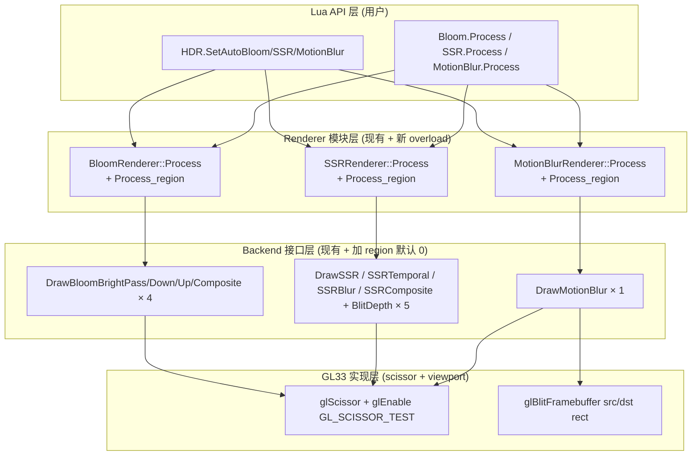

# Phase F.0.10.3 — Bloom/SSR/MB Region 化 DESIGN (架构)

> 6A 工作流 · 阶段 2 (Architect) · 系统分层 + 模块设计 + 接口规范
> 关联: ALIGNMENT_PhaseF_0_10_3.md
> 原则: scissor + 全 size resource (与 F.0.10.2 TAA 一致), shader 零改动

---

## 1. 整体架构图



---

## 2. 分层设计

### 2.1 Lua API 层 (用户接口, +9 fn)

| API | 签名 | 默认值 |
|-----|------|--------|
| `HDR.SetAutoBloom(bool)` | `(bool) -> bool / nil + err` | `true` |
| `HDR.GetAutoBloom()` | `() -> bool` | `true` |
| `HDR.SetAutoSSR(bool)` | `(bool) -> bool / nil + err` | `true` |
| `HDR.GetAutoSSR()` | `() -> bool` | `true` |
| `HDR.SetAutoMotionBlur(bool)` | `(bool) -> bool / nil + err` | `true` |
| `HDR.GetAutoMotionBlur()` | `() -> bool` | `true` |
| `Bloom.Process()` / `Bloom.Process(x, y, w, h)` | `(0/4 int) -> bool / nil + err` | full-screen |
| `SSR.Process()` / `SSR.Process(x, y, w, h)` | 同上 | 同上 |
| `MotionBlur.Process()` / `MotionBlur.Process(x, y, w, h)` | 同上 | 同上 |

### 2.2 Renderer 模块层 (C++ namespace)

每个 namespace 现有 `Process(hdrFbo, hdrTex)` 保留, 新加 region overload:

```cpp
namespace BloomRenderer {
    void Process(uint32_t hdrFbo, uint32_t hdrTex);  // 现有, 转发到 region 版
    void Process(uint32_t hdrFbo, uint32_t hdrTex,
                 int rgnX, int rgnY, int rgnW, int rgnH);  // 新增
}
// SSR / MotionBlur 同模式
```

老 Process 实现:
```cpp
void Process(uint32_t hdrFbo, uint32_t hdrTex) {
    Process(hdrFbo, hdrTex, 0, 0, 0, 0);  // 全屏路径
}
```

### 2.3 Backend 接口层 (10 个虚方法加 region 默认 0)

| 类别 | 接口 | 增量参数 |
|------|------|---------|
| Bloom (4) | DrawBloomBrightPass / Downsample / Upsample / Composite | `int rgnX = 0, rgnY = 0, rgnW = 0, rgnH = 0` |
| SSR (5+1) | BlitHDRDepthToSSAO / DrawSSR / DrawSSRTemporal / DrawSSRBlur / DrawSSRComposite | 同上 |
| MotionBlur (1) | DrawMotionBlur | 同上 |

总计 10 个虚接口扩展, 默认 0 = 全屏 = 老路径 (零回归).

### 2.4 GL33 实现层

#### 2.4.1 通用 region scissor 模板

每个 backend pass 的实现增加:

```cpp
void DrawXxxPass(... 现有参数 ..., int rgnX, int rgnY, int rgnW, int rgnH) {
    // 现有 bind FBO + viewport
    glBindFramebuffer(GL_FRAMEBUFFER, dstFbo);
    glViewport(0, 0, w, h);  // viewport 仍 full RT (保持 UV 映射)

    // 新增: scissor 限定写区域
    if (rgnW > 0 && rgnH > 0) {
        glEnable(GL_SCISSOR_TEST);
        glScissor(rgnX, rgnY, rgnW, rgnH);
    } else {
        glDisable(GL_SCISSOR_TEST);
    }

    // 现有 shader/uniform/draw
    // ...

    // 退出: 复位 scissor (与 F.0.10.2 TAA 一致)
    glDisable(GL_SCISSOR_TEST);
}
```

#### 2.4.2 Bloom mip 链 region 计算

```cpp
// BloomRenderer::Process 内部, region 按 mip 缩
int curRgnX = rgnX, curRgnY = rgnY, curRgnW = rgnW, curRgnH = rgnH;
for (int i = 1; i < g.actualLevels; ++i) {
    // mip i 的 region: 上一级缩半 (round down, 最小 1)
    curRgnX >>= 1;
    curRgnY >>= 1;
    curRgnW = std::max(1, curRgnW >> 1);
    curRgnH = std::max(1, curRgnH >> 1);
    backend->DrawBloomDownsample(prevTex, fbo[i], curW, curH,
                                  curRgnX, curRgnY, curRgnW, curRgnH);
}
// upsample 反向: 每级 region 翻倍
```

#### 2.4.3 MotionBlur Pass 2 blit 子矩形

```cpp
// 现有: glBlitFramebuffer(src, 0, 0, w, h, dst, 0, 0, w, h, ...)
// region 化:
if (rgnW > 0 && rgnH > 0) {
    glBlitFramebuffer(rgnX, rgnY, rgnX + rgnW, rgnY + rgnH,
                      rgnX, rgnY, rgnX + rgnW, rgnY + rgnH,
                      GL_COLOR_BUFFER_BIT, GL_NEAREST);
} else {
    glBlitFramebuffer(0, 0, w, h, 0, 0, w, h, GL_COLOR_BUFFER_BIT, GL_NEAREST);
}
```

---

## 3. 核心组件设计

### 3.1 BloomRenderer region overload

```cpp
void BloomRenderer::Process(uint32_t hdrFbo, uint32_t hdrTex,
                            int rgnX, int rgnY, int rgnW, int rgnH) {
    // 现有 防御性检查 (前 7 行不变)
    if (!g.enabled || !g.backend || !g.supported) return;
    if (!hdrFbo || !hdrTex) return;
    if (g.actualLevels < 2) return;

    // 1. Bright Pass (region 同输入坐标)
    g.backend->DrawBloomBrightPass(hdrTex, g.fbos[0], g.width, g.height,
                                   g.threshold, rgnX, rgnY, rgnW, rgnH);

    // 2. Downsample × N (region 每级缩半)
    int curW = g.width, curH = g.height;
    int rx = rgnX, ry = rgnY, rw = rgnW, rh = rgnH;
    for (int i = 1; i < g.actualLevels; ++i) {
        curW = std::max(1, curW / 2);
        curH = std::max(1, curH / 2);
        rx >>= 1; ry >>= 1;
        rw = (rw > 0) ? std::max(1, rw >> 1) : 0;
        rh = (rh > 0) ? std::max(1, rh >> 1) : 0;
        g.backend->DrawBloomDownsample(g.texs[i-1], g.fbos[i], curW, curH,
                                       rx, ry, rw, rh);
    }

    // 3. Upsample × (N-1) (region 反向翻倍)
    for (int i = g.actualLevels - 1; i > 0; --i) {
        int dstW = std::max(1, g.width >> (i - 1));
        int dstH = std::max(1, g.height >> (i - 1));
        int dRx = rgnX >> (i - 1), dRy = rgnY >> (i - 1);
        int dRw = (rgnW > 0) ? std::max(1, rgnW >> (i - 1)) : 0;
        int dRh = (rgnH > 0) ? std::max(1, rgnH >> (i - 1)) : 0;
        g.backend->DrawBloomUpsample(g.texs[i], g.fbos[i-1], dstW, dstH,
                                     g.radius, dRx, dRy, dRw, dRh);
    }

    // 4. Composite (region 同输入坐标)
    g.backend->DrawBloomComposite(g.texs[0], hdrFbo, g.width, g.height,
                                  g.intensity, rgnX, rgnY, rgnW, rgnH);
}
```

**关键考虑**:
- pyramid 全 size 创建 (与 F.0.10.2 TAA history 一致), 不变
- 每级 region 按 `>>i` 缩, 与 pyramid 大小同步
- `rw=0/rh=0` 表示老路径 (scissor disable)

### 3.2 SSRRenderer region overload

```cpp
void SSRRenderer::Process(uint32_t hdrFbo, uint32_t hdrTex,
                          int rgnX, int rgnY, int rgnW, int rgnH) {
    // 现有 防御性检查 (前 5 行不变)
    if (!g.enabled || !g.supported || !g.backend) return;
    // ... (见 ssr_renderer.cpp::Process 现有实现)

    // 0. depth blit (region 化)
    g.backend->BlitHDRDepthToSSAO(hdrFbo, g.depthFbo, g.srcW, g.srcH,
                                   rgnX, rgnY, rgnW, rgnH);

    // 1. SSR raw (region 限定 raster, ray march 仍全屏)
    g.backend->DrawSSR(g.depthTex, normalTex, hdrTex, g.reflectFbo,
                       g.srcW, g.srcH, proj, invProj,
                       g.maxSteps, g.stepSize, g.thickness,
                       g.maxDistance, g.edgeFade,
                       jitterX, jitterY,
                       rgnX, rgnY, rgnW, rgnH);

    // 2. Temporal (region 限定 history write)
    if (temporalActive) {
        // ... (现有 reproject 矩阵计算逻辑)
        g.backend->DrawSSRTemporal(..., rgnX, rgnY, rgnW, rgnH);
    }

    // 3. Blur (region 化, half-res 时 region 缩半)
    if (blurActive) {
        int hRgnX = rgnX / 2, hRgnY = rgnY / 2;
        int hRgnW = (rgnW > 0) ? std::max(1, rgnW / 2) : 0;
        int hRgnH = (rgnH > 0) ? std::max(1, rgnH / 2) : 0;
        g.backend->DrawSSRBlur(srcForBlur, depth, blurFbo[0], blurW, blurH,
                               0, radius, bilateral, depthSigma,
                               hRgnX, hRgnY, hRgnW, hRgnH);
        g.backend->DrawSSRBlur(blurTex[0], depth, blurFbo[1], blurW, blurH,
                               1, radius, bilateral, depthSigma,
                               hRgnX, hRgnY, hRgnW, hRgnH);
    }

    // 4. Composite (region 限定写入)
    g.backend->DrawSSRComposite(finalTex, hdrFbo, g.srcW, g.srcH, g.intensity,
                                rgnX, rgnY, rgnW, rgnH);
}
```

**关键考虑**:
- ray march 仍走全屏 (反射借邻区合理, shader 不动)
- Composite 内部 blit hdrFbo → temp 也要 region 化 (仅 blit 子矩形, 减重复 IO)
- half-res blur 的 region 缩半 (与 mip 计算同模式)

### 3.3 MotionBlurRenderer region overload

```cpp
void MotionBlurRenderer::Process(uint32_t hdrFbo, uint32_t hdrTex,
                                  int rgnX, int rgnY, int rgnW, int rgnH) {
    // 现有 防御性检查
    if (!g.enabled || !g.backend || !hdrFbo || !hdrTex) return;
    if (!g.fbo || !g.tex) return;

    // 现有: storage size 计算
    int rtW = 0, rtH = 0;
    ComputeStorageSize(g.width, g.height, rtW, rtH);

    // half-res storage 时 region 缩半
    int rRgnX = rgnX, rRgnY = rgnY, rRgnW = rgnW, rRgnH = rgnH;
    if (rtW < g.width || rtH < g.height) {
        rRgnX = rgnX / 2;
        rRgnY = rgnY / 2;
        rRgnW = (rgnW > 0) ? std::max(1, rgnW / 2) : 0;
        rRgnH = (rgnH > 0) ? std::max(1, rgnH / 2) : 0;
    }

    g.backend->DrawMotionBlur(hdrTex, velocityTex, cameraVelocityTex,
                              g.fbo, g.tex, hdrFbo,
                              g.width, g.height,
                              g.strength, g.sampleCount, g.mode,
                              rtW, rtH,
                              rgnX, rgnY, rgnW, rgnH);
    // ↑ backend 内 Pass 1 用 (rRgnX, rRgnY, rRgnW, rRgnH) 写 mb tex (storage 空间);
    //   Pass 2 blit 用 (rgnX, rgnY, rgnW, rgnH) 写 hdr fbo (full 空间)
    //   两者关系: half-res storage 时 storage rect 是 dst rect 的一半
}
```

**关键考虑**:
- Pass 1 写 motionBlurTex 在 storage 空间 (half-res 时是 half-res region)
- Pass 2 blit 是 storage → full, 用 GL_LINEAR 自动 upscale (现有逻辑保留)
- region 参数指 dst (full) 空间, backend 内部计算 storage 空间 region

---

## 4. 接口契约定义

### 4.1 Backend 虚接口 (10 个, 全部加 region 默认 0)

完整签名 (Bloom 4 个为例):

```cpp
virtual void DrawBloomBrightPass(uint32_t sceneTex, uint32_t outFbo,
                                  int w, int h, float threshold,
                                  int rgnX = 0, int rgnY = 0,
                                  int rgnW = 0, int rgnH = 0) {}

virtual void DrawBloomDownsample(uint32_t srcTex, uint32_t dstFbo,
                                  int dstW, int dstH,
                                  int rgnX = 0, int rgnY = 0,
                                  int rgnW = 0, int rgnH = 0) {}

virtual void DrawBloomUpsample(uint32_t srcTex, uint32_t dstFbo,
                                int dstW, int dstH, float radius,
                                int rgnX = 0, int rgnY = 0,
                                int rgnW = 0, int rgnH = 0) {}

virtual void DrawBloomComposite(uint32_t bloomTex, uint32_t hdrFbo,
                                 int w, int h, float intensity,
                                 int rgnX = 0, int rgnY = 0,
                                 int rgnW = 0, int rgnH = 0) {}
```

(SSR 5 + MotionBlur 1 同模式, 此处略)

### 4.2 Lua API 契约 (类比 HDR.SetAutoTAA / TAA.Process)

```lua
-- HDR 自动后处理开关 (3 对)
HDR.SetAutoBloom(on: bool) -> bool true | nil + err string
HDR.GetAutoBloom() -> bool                        -- 默认 true

HDR.SetAutoSSR(on: bool) -> bool true | nil + err string
HDR.GetAutoSSR() -> bool                          -- 默认 true

HDR.SetAutoMotionBlur(on: bool) -> bool true | nil + err string
HDR.GetAutoMotionBlur() -> bool                   -- 默认 true

-- 手动 region process (3 个, 各支持 0 args = 全屏 / 4 args = region)
Bloom.Process() | Bloom.Process(x, y, w, h) -> bool true | nil + err string
SSR.Process()   | SSR.Process(x, y, w, h)   -> bool true | nil + err string
MotionBlur.Process() | MotionBlur.Process(x, y, w, h) -> bool true | nil + err string
```

### 4.3 EndScene 内部条件调用 (零回归)

```cpp
// hdr_renderer.cpp::EndScene 修改 (3 处加 if (g.autoXxx))
if (g.autoBloom) BloomRenderer::Process(g.fbo, g.sceneTex);
// ... 其他后处理 ...
if (g.autoSSR) SSRRenderer::Process(g.fbo, g.sceneTex);
// ...
if (g.autoMotionBlur) MotionBlurRenderer::Process(g.fbo, g.sceneTex);
```

---

## 5. 数据流向图

### 5.1 Bloom region 化数据流

```
HDR scene (W × H)
  ├──[BrightPass region]──> pyramid[0] (W × H, region 写)
  ├──[Down region/2]──>     pyramid[1] (W/2 × H/2, region/2 写)
  ├──[Down region/4]──>     pyramid[2] (W/4 × H/4, region/4 写)
  └──[Down ...]──>          pyramid[3..N-1] (递归缩半)

pyramid[N-1] ──[Up region×2]──> pyramid[N-2] (additive blend region 写)
  ...
pyramid[0] ──[Composite region]──> HDR scene (additive blend region 写)
```

### 5.2 SSR region 化数据流

```
HDR scene (W × H, region 已写完)
  ├──[depth blit region]──> SSR depth (W × H, region 写)
  └──[SSR raw region/全屏 ray march]──> reflect tex (W × H, region 写)
       │
       ├──[Temporal region (可选)]──> history[write] (W × H, region 写)
       │     prev frame history[read] (full size, scissor 限读 region)
       │
       └──[Blur H+V region/2 (可选)]──> blur ping-pong (W/2 × H/2, region/2 写)
              │
              └──[Composite region]──> HDR scene (additive, region 写)
```

### 5.3 MotionBlur region 化数据流

```
HDR scene (W × H, post-TAA before tonemap)
  └──[Pass 1 shader region, storage 空间]──> mb tex (storage size, region 写)
       │
       └──[Pass 2 blit storage region → dst region]──> HDR scene (region 覆盖)
```

---

## 6. 异常处理策略

### 6.1 region 参数防御性检查 (Lua 层 + C++ 层)

| 异常场景 | Lua 层 | C++ 层 |
|---------|-------|--------|
| `rgnW < 0` 或 `rgnH < 0` | nil + err "w/h must be >= 0" | scissor 不启 (走全屏) |
| `rgnW = 0` 或 `rgnH = 0` | 视作全屏 | scissor 不启 (走全屏) |
| `rgnX < 0` 或 `rgnY < 0` | 接受 (允许子像素) | glScissor 自动 clamp |
| `rgnX + rgnW > W` | 接受 | glScissor 自动 clamp |
| 部分 region 参数 (1/2/3 个) | nil + err "expected 0 or 4 args" | N/A |
| 类型错 (string / table) | luaL_error | N/A |
| HDR / Bloom / SSR / MB 未启用 | Process 返 nil + err "not enabled" | Process 静默 no-op |

### 6.2 子模块 Enable 状态

- `Bloom.Process()` 调用时 `BloomRenderer::IsEnabled()` 必须 true
- `SSR.Process()` 调用时 `SSRRenderer::IsEnabled()` 必须 true
- `MotionBlur.Process()` 调用时 `MotionBlurRenderer::IsEnabled()` 必须 true
- 否则返 `nil + err string` (与 F.0.10.2 TAA.Process 一致)

### 6.3 mip / pyramid 边界

- mip-N region 缩到 < 1px: clamp 到 1×1 (与现有 mip 1×1 兜底逻辑一致)
- 若 region 缩到 0×0: 跳过该 mip 的 draw (scissor 0×0 等价于完全 reject)

---

## 7. 风险评估

| 风险 | 概率 | 影响 | 降级方案 |
|------|------|------|---------|
| Bloom shader 跨边界采样导致泄漏 | 高 | 视觉锯齿/亮带 | 接受 (与 F.0.10.2 TAA ~1px 锯齿同等级), 留 F.0.10.5 shader uvOffset 解决 |
| SSR ray march 跨边界采到邻区 | 中 | 反射"借"邻区颜色 (实际可能是预期效果) | 接受 (反射本质就是借周围) |
| MotionBlur blit sub-rect 性能 | 低 | 多 player 时 N 次 blit | acceptable (单 blit 远小于 1ms) |
| backend 接口扩展破坏老调用 | 低 | 编译错 | 用默认参数 0, 老调用零改动 |
| half-res RT region 缩到 0 | 低 | 跳过 mip | 已有 max(1, ...) 兜底 |
| Lua API smoke 顺序问题 | 中 | CI 失败 | 与 F.0.10.2 同模式, 已验证 |

---

## 8. 测试策略

### 8.1 smoke 增量

- `scripts/smoke/hdr.lua`: +6 PASS (3 对 SetAutoXxx / GetAutoXxx)
- `scripts/smoke/bloom.lua`: +6 PASS (Bloom.Process 默认/4-args/部分参/负数/类型错/HDR-off)
- `scripts/smoke/ssr.lua`: +6 PASS (SSR.Process 同模式)
- 新建 `scripts/smoke/motion_blur.lua`: 完整验证 (含 +6 PASS for Process)

### 8.2 视觉零回归 (本地 windows)

- demo_taa_compare: bloom + tonemap 路径不变, 像素零差异
- demo_ssr: SSR 路径不变, 反射效果一致
- demo_taa_split2: TAA region 路径不变, 双 player 视觉一致

### 8.3 CI 6/6 平台

- windows / macos / ios / android / web / linux
- 每个 sub-phase 单独 commit + CI 验证 (任一失败即回滚一步)

---

## 9. 与 F.0.10.2 设计的连续性

| 维度 | F.0.10.2 (已交付) | F.0.10.3 (本) |
|------|------------------|--------------|
| region 化路径 | scissor + 全 size history | scissor + 全 size pyramid/RT |
| backend 接口扩展 | 7 TAA pass + 1 BlitTAAToHDR | 4 Bloom + 5 SSR + 1 MB = 10 pass |
| 默认参数 | rgnX/Y/W/H = 0 | 同 |
| 全屏 fallback | rgnW=0 \|\| rgnH=0 | 同 |
| Lua API 模式 | TAA.Process(0/4 args) | Bloom/SSR/MB.Process(0/4 args) |
| HDR.SetAutoXxx | SetAutoTAA | + SetAutoBloom / SetAutoSSR / SetAutoMotionBlur |
| 防御性 | 类型错 / w/h<0 / 部分参 | 同模式 |
| smoke 模式 | TAA fn_names + 6 段测试 | Bloom/SSR/MB fn_names + 各 6 段 |

设计上是 F.0.10.2 的**直接延伸**, 复用经验和模式, 风险极低.

---

## 10. 决策矩阵 (12 个自动决策点 + 用户拍板)

| # | 决策 | 选择 | 理由 |
|---|------|------|------|
| 1 | Bloom region 化路径 | scissor + 全 size pyramid | 与 F.0.10.2 一致, 跨平台稳 |
| 2 | SSR ray march | 全屏运行 | 反射借邻区合理, shader 不动 |
| 3 | SSR history write | region 写 (scissor) | 防写脏邻区 history |
| 4 | SSR depth/reflect 写 | region 写 | scissor + viewport |
| 5 | MotionBlur Pass 1 | scissor 写 | 等同 TAA pass |
| 6 | MotionBlur Pass 2 | sub-rect blit | glBlitFramebuffer 内置支持 |
| 7 | region 参数语义 | 4 个 int (rgnX/Y/W/H) | 与 F.0.10.2 一致 |
| 8 | Bloom mip region 计算 | Process 内 `>>i` 缩 | 调用方一次传 region |
| 9 | region <1px | clamp 1×1 | 与现有 mip 兜底一致 |
| 10 | Lua API 设计 | Bloom/SSR/MB.Process(rgn) 直暴露 | split-screen 必备 |
| 11 | autoXxx 开关 | 3 对 SetAutoBloom/SSR/MotionBlur | 与 SetAutoTAA 对称 |
| 12 | 默认值 | 全 true | 零回归 |
| **U1** | **实施顺序** | **MB → Bloom → SSR** (用户拍板) | 风险递增, 最低先行 |
| **U2** | **demo 范围** | **不做 demo_taa_split3** (用户拍板) | 节省 1-2h, smoke + demo_taa_split2 已够 |

总计 **14 个决策, 全部已 lock-in**, 进入 Phase 3 Atomize.
