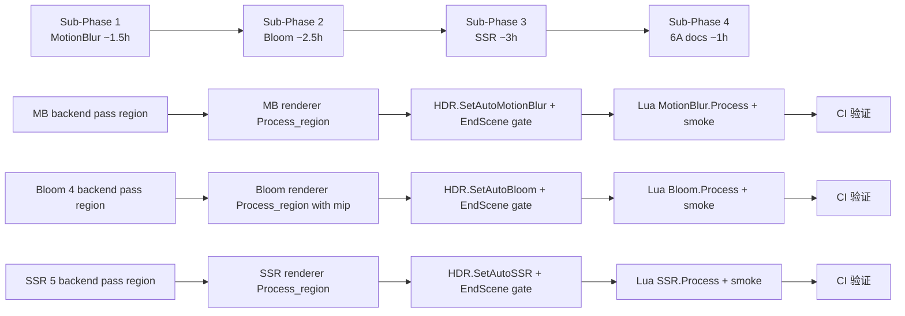

# Phase F.0.10.3 — Bloom/SSR/MB Region 化 TASK (原子任务)

> 6A 工作流 · 阶段 3 (Atomize) · 子任务拆分 + 依赖图 + 验收标准
> 关联: ALIGNMENT / DESIGN
> 4 个 sub-phase, 每个独立 commit + CI 验证

---

## 1. Sub-Phase 依赖图

**依赖关系**: 严格串行 (每个 sub-phase 独立 commit + CI 验证后才进下一个)

---

## 2. Sub-Phase 1 — MotionBlur Region 化 (~1.5h)

### 2.1 任务目标

为 `MotionBlurRenderer` 加 region 支持, 1 个 backend pass + 1 Lua API + autoMotionBlur 开关.

### 2.2 原子任务清单

#### Task 1.1 — Backend `DrawMotionBlur` 加 region 参数

- **输入契约**: 现有签名 `(scene, vel, camVel, mbFbo, mbTex, dst, w, h, strength, sample, mode, rtW, rtH)`
- **输出契约**: 加 4 个 region 参数 (默认 0), 老调用零改动
- **实现约束**:
  - `render_backend.h`: 虚接口加 `int rgnX = 0, rgnY = 0, rgnW = 0, rgnH = 0`
  - `render_gl33.cpp::DrawMotionBlur`:
    - Pass 1 (shader): `glScissor` + `glEnable(GL_SCISSOR_TEST)` 当 rgnW/H > 0
    - Pass 2 (blit): `glBlitFramebuffer` 用 sub-rect 当 rgnW/H > 0
    - half-res storage 时 storage region = (rgnX/2, rgnY/2, rgnW/2, rgnH/2)
- **验收**: 编译通过, 老 demo (demo_taa_compare 不启 MotionBlur) 视觉零差异

#### Task 1.2 — `MotionBlurRenderer` 加 Process region overload

- **输入契约**: 现有 `Process(hdrFbo, hdrTex)` 保留
- **输出契约**: 新增 `Process(hdrFbo, hdrTex, rgnX, rgnY, rgnW, rgnH)` overload
- **实现约束**:
  - `motion_blur_renderer.h`: 加 overload 声明
  - `motion_blur_renderer.cpp`:
    - 老 `Process(fbo, tex)` 转发到 `Process(fbo, tex, 0, 0, 0, 0)`
    - 新 region 版本: 计算 storage region (half-res 缩半), 转发 backend
- **验收**: 编译通过, 老 Process 行为完全等价 (转发零回归)

#### Task 1.3 — HDR `SetAutoMotionBlur` + EndScene gate

- **输入契约**: `HDRRenderer::EndScene` 中 `MotionBlurRenderer::Process(g.fbo, g.sceneTex)`
- **输出契约**:
  - `hdr_renderer.h`: 加 `void SetAutoMotionBlur(bool)` / `bool GetAutoMotionBlur()`
  - `hdr_renderer.cpp`:
    - State 加 `bool autoMotionBlur = true` 字段
    - EndScene 中改为 `if (g.autoMotionBlur) MotionBlurRenderer::Process(...)`
- **验收**: `HDR.GetAutoMotionBlur()` 默认 true, `SetAutoMotionBlur(false)` 后 EndScene 跳过 MB

#### Task 1.4 — Lua `MotionBlur.Process` + `HDR.SetAutoMotionBlur` binding

- **输入契约**: 现有 `Light.Graphics.MotionBlur` 子表 (~11 fn)
- **输出契约**: 新增 3 fn (Process / SetAutoMotionBlur / GetAutoMotionBlur)
- **实现约束**:
  - `light_graphics.cpp`:
    - `l_HDR_SetAutoMotionBlur` / `l_HDR_GetAutoMotionBlur` (类比 SetAutoTAA)
    - `l_MotionBlur_Process` (类比 l_TAA_Process, 0 / 4 args 防御)
    - 注册到 `hdr_funcs` 和 `motion_blur_funcs`
- **验收**: Lua 可调 `HDR.SetAutoMotionBlur(false)` 和 `MotionBlur.Process(0, 0, 100, 100)`

#### Task 1.5 — Smoke 增量

- **输入契约**: `scripts/smoke/motion_blur.lua` (现有 11 fn 验证)
- **输出契约**:
  - 加 fn_names 段: `Process` 加入
  - 加 §X SetAutoMotionBlur 区段 (4 PASS: 默认 true / round-trip / bad-arg / idempotent)
  - 加 §Y MotionBlur.Process 区段 (6 PASS: 0 args / 4 args / 部分参 / w<0 / 类型错 / 0/0/0/0)
- **验收**: smoke 全 PASS (本地 windows headless)

#### Task 1.6 — Commit + CI

- **commit msg**: `feat(F.0.10.3 sub-phase 1): MotionBlur region 化 + HDR.SetAutoMotionBlur + MB.Process Lua API`
- **CI 等待**: 6/6 平台 success
- **验收**: CI 全绿 + 本地 demo_taa_compare / demo_ssr 视觉零差异

### 2.3 验收标准 (Sub-Phase 1)

- [ ] 编译通过 (windows 本地)
- [ ] motion_blur.lua smoke +10 PASS (4 SetAutoMB + 6 Process)
- [ ] CI 6/6 平台 success
- [ ] 老 demo (demo_taa_compare 不启 MB / demo_ssr 启 MB) 视觉零差异

---

## 3. Sub-Phase 2 — Bloom Region 化 (~2.5h)

### 3.1 任务目标

为 `BloomRenderer` 加 region 支持, 4 个 backend pass + Lua API + autoBloom 开关 + mip region 计算.

### 3.2 原子任务清单

#### Task 2.1 — Backend Bloom 4 pass 加 region 参数

- **输入契约**: 4 个虚接口现有签名
  - `DrawBloomBrightPass(sceneTex, outFbo, w, h, threshold)`
  - `DrawBloomDownsample(srcTex, dstFbo, dstW, dstH)`
  - `DrawBloomUpsample(srcTex, dstFbo, dstW, dstH, radius)`
  - `DrawBloomComposite(bloomTex, hdrFbo, w, h, intensity)`
- **输出契约**: 4 个虚接口加 `int rgnX, rgnY, rgnW, rgnH = 0`
- **实现约束**:
  - `render_backend.h`: 4 个虚接口加默认 0 参数
  - `render_gl33.cpp`:
    - 4 个 Draw* 实现加 scissor 块 (与 F.0.10.2 TAA 模板一致)
    - composite 用 GL_BLEND ONE/ONE 时 scissor 仍生效 (硬件 blend 不影响 scissor)
    - upsample 加性 blend 同上
- **验收**: 编译通过, 4 pass 老调用零改动

#### Task 2.2 — `BloomRenderer` 加 Process region overload

- **输入契约**: 现有 `Process(hdrFbo, hdrTex)`
- **输出契约**: 新增 `Process(hdrFbo, hdrTex, rgnX, rgnY, rgnW, rgnH)`
- **实现约束**:
  - `bloom_renderer.h`: 加 overload
  - `bloom_renderer.cpp`:
    - 老 Process 转发到 region 版 (0/0/0/0)
    - 新 region 版本:
      - BrightPass: region 同输入坐标
      - Downsample × N: 每级 region 缩半 (`>>i`, max(1, ...))
      - Upsample × (N-1): 反向, 每级 region 翻倍 (`<<i`)
      - Composite: region 同输入坐标
- **验收**: 编译通过, 老 Process 行为零差异

#### Task 2.3 — HDR `SetAutoBloom` + EndScene gate

- **输入契约**: 现有 `BloomRenderer::Process(g.fbo, g.sceneTex)` 在 EndScene
- **输出契约**:
  - State 加 `bool autoBloom = true`
  - `HDRRenderer::SetAutoBloom(bool)` / `GetAutoBloom()` 实现
  - EndScene 中改为 `if (g.autoBloom) BloomRenderer::Process(...)`
- **验收**: `HDR.GetAutoBloom()` 默认 true, EndScene gate 工作

#### Task 2.4 — Lua `Bloom.Process` + `HDR.SetAutoBloom` binding

- **输入契约**: 现有 `Light.Graphics.Bloom` 子表 (~13 fn)
- **输出契约**: 新增 3 fn (Process / SetAutoBloom / GetAutoBloom)
- **实现约束**: 类比 sub-phase 1 (Lua binding + 注册到 hdr_funcs / bloom_funcs)
- **验收**: Lua 可调

#### Task 2.5 — Smoke 增量

- **输入契约**: `scripts/smoke/bloom.lua`
- **输出契约**: +10 PASS (4 SetAutoBloom + 6 Process), Process 加入 fn_names
- **验收**: smoke 本地 windows 全 PASS

#### Task 2.6 — Commit + CI

- **commit msg**: `feat(F.0.10.3 sub-phase 2): Bloom region 化 + HDR.SetAutoBloom + Bloom.Process Lua API`
- **CI 等待**: 6/6 平台 success
- **验收**: CI 全绿 + demo_taa_compare 视觉零差异

### 3.3 验收标准 (Sub-Phase 2)

- [ ] 编译通过 (windows 本地)
- [ ] bloom.lua smoke +10 PASS
- [ ] CI 6/6 平台 success
- [ ] demo_taa_compare 启 bloom 视觉零差异

---

## 4. Sub-Phase 3 — SSR Region 化 (~3h)

### 4.1 任务目标

为 `SSRRenderer` 加 region 支持, 5 个 backend pass + Lua API + autoSSR 开关.

### 4.2 原子任务清单

#### Task 3.1 — Backend SSR 5 pass 加 region 参数

- **输入契约**: 5 个虚接口现有签名
  - `BlitHDRDepthToSSAO(hdrFbo, depthFbo, w, h)` (复用 SSAO 接口)
  - `DrawSSR(depth, normal, hdr, dst, w, h, ..., jitter)`
  - `DrawSSRTemporal(...10 args...)`
  - `DrawSSRBlur(src, depth, dst, w, h, axis, radius, ...)`
  - `DrawSSRComposite(reflect, hdrFbo, w, h, intensity)`
- **输出契约**: 5 个虚接口加 region 默认 0 参数
- **实现约束**:
  - `render_backend.h`: 5 个虚接口加默认 0 参数
  - `render_gl33.cpp`:
    - BlitHDRDepthToSSAO: 加 scissor blit sub-rect (与 MotionBlur Pass 2 同模式)
    - DrawSSR: scissor + viewport 仍 full
    - DrawSSRTemporal: scissor (history write 限 region)
    - DrawSSRBlur: scissor, half-res 时 region 已是 half-res 空间 (caller 负责)
    - DrawSSRComposite: scissor + 内部 blit hdrFbo→temp 也 region (减重复 IO)
- **验收**: 编译通过, 5 pass 老调用零改动

#### Task 3.2 — `SSRRenderer` 加 Process region overload

- **输入契约**: 现有 `Process(hdrFbo, hdrTex)` (~120 行)
- **输出契约**: 新增 `Process(hdrFbo, hdrTex, rgnX, rgnY, rgnW, rgnH)`
- **实现约束**:
  - `ssr_renderer.h`: 加 overload
  - `ssr_renderer.cpp`:
    - 老 Process 转发到 region 版 (0/0/0/0)
    - 新 region 版本:
      - depth blit / DrawSSR / DrawSSRTemporal / DrawSSRComposite: 用 caller region
      - DrawSSRBlur (half-res): caller region 缩半再传
- **验收**: 编译通过, 老 Process 行为零差异

#### Task 3.3 — HDR `SetAutoSSR` + EndScene gate

- **输入契约**: 现有 `SSRRenderer::Process(g.fbo, g.sceneTex)` 在 EndScene
- **输出契约**:
  - State 加 `bool autoSSR = true`
  - `HDRRenderer::SetAutoSSR(bool)` / `GetAutoSSR()`
  - EndScene 中 `if (g.autoSSR) SSRRenderer::Process(...)`
- **验收**: 默认 true, gate 工作

#### Task 3.4 — Lua `SSR.Process` + `HDR.SetAutoSSR` binding

- **输入契约**: 现有 `Light.Graphics.SSR` 子表 (~13 fn)
- **输出契约**: 新增 3 fn
- **实现约束**: 类比 sub-phase 1/2
- **验收**: Lua 可调

#### Task 3.5 — Smoke 增量

- **输入契约**: `scripts/smoke/ssr.lua`
- **输出契约**: +10 PASS (4 SetAutoSSR + 6 Process)
- **验收**: smoke 本地 windows 全 PASS

#### Task 3.6 — Commit + CI

- **commit msg**: `feat(F.0.10.3 sub-phase 3): SSR region 化 + HDR.SetAutoSSR + SSR.Process Lua API`
- **CI 等待**: 6/6 平台 success
- **验收**: CI 全绿 + demo_ssr 视觉零差异 (反射效果一致)

### 4.3 验收标准 (Sub-Phase 3)

- [ ] 编译通过 (windows 本地)
- [ ] ssr.lua smoke +10 PASS
- [ ] CI 6/6 平台 success
- [ ] demo_ssr 启 SSR + Temporal + Blur 视觉零差异

---

## 5. Sub-Phase 4 — 6A docs 收尾 (~1h)

### 5.1 任务目标

ACCEPTANCE / FINAL / TODO 文档 + CI 状态回填.

### 5.2 原子任务清单

#### Task 4.1 — ACCEPTANCE_PhaseF_0_10_3.md

- 4 sub-phase 验收矩阵
- 14 决策点回顾
- 接口契约 (10 个 backend pass + 9 fn Lua)
- 防御性测试覆盖
- smoke + CI 状态

#### Task 4.2 — FINAL_PhaseF_0_10_3.md

- 交付物清单 (代码行数 / smoke / 文档)
- 3 行总结
- 工程反思 (做对的事 / 走过的弯路)
- 留 F.0.10.4+ 未来计划

#### Task 4.3 — TODO_PhaseF_0_10_3.md

- 用户操作指引 (启 split-screen + bloom/ssr/mb 区域化的最小代码)
- 4-player 扩展示例
- 常见错误避免
- 留 F.0.10.4 / F.0.10.5 项

#### Task 4.4 — Commit + CI 回填

- **commit msg**: `docs(F.0.10.3 sub-phase 4): 6A 收尾 ACCEPTANCE / FINAL / TODO`
- **CI 验证**: docs-only commit, 预期 success
- 各文档回填 CI 状态 (类似 F.0.10.2)

### 5.3 验收标准 (Sub-Phase 4)

- [ ] 3 文档完整
- [ ] CI docs commit success
- [ ] 全 phase 累计 CI 4 sub-phase × 6 平台全绿
- [ ] 用户读 TODO 即可独立写 4-player demo

---

## 6. 累计交付物预估

| 维度 | 预估增量 |
|------|---------|
| C++ 代码 | ~280 行新增 (10 backend + 3 renderer overload + 6 HDR autoXxx + 9 Lua bindings) |
| smoke | +30 PASS (3 sub-phase × 10 PASS) |
| 文档 | ALIGNMENT / DESIGN / TASK / ACCEPTANCE / FINAL / TODO (6 文档) |
| Commit | 4 (每 sub-phase 一个) + 1-2 docs 回填 |
| 累计 Lua API | 45 → 54 fn (+9) |
| 累计 backend 接口扩展 | 10 个虚方法加 region 默认 0 参数 |
| 工作量 | ~8h (1.5 + 2.5 + 3 + 1) |

---

## 7. 风险与降级

| 风险 | 概率 | 降级方案 |
|------|------|---------|
| Bloom mip region 缩到 0 | 中 | clamp 1×1 (与现有 mip 兜底一致) |
| SSR ray march 跨边界采样 | 高 | 接受 (反射借邻区合理), 留 F.0.10.5 |
| MotionBlur Pass 2 blit dst rect 错 | 低 | scissor 不影响 blit, 必须用 sub-rect blit |
| 任一 sub-phase CI 失败 | 中 | 单独 commit 回滚一步, 不影响其他 |
| Lua API smoke 顺序问题 | 低 | 与 F.0.10.2 同模式, 已验证 |
| backend 默认参数破坏老调用 | 低 | C++ 默认参数, 老 .cpp 零改动 |

---

## 8. 进入 Phase 4 Approve 前的最终检查

- [x] 4 sub-phase 任务清单完整 (16 个原子 task)
- [x] 依赖关系清晰 (严格串行)
- [x] 验收标准明确可测 (smoke + CI + demo)
- [x] 风险有降级方案
- [x] 与 F.0.10.2 设计连续, 复用经验
- [x] 用户已拍板 (顺序 + 不做 demo_taa_split3)

**TASK 文档完成, 进入 Phase 4 Approve 最终检查清单**.
