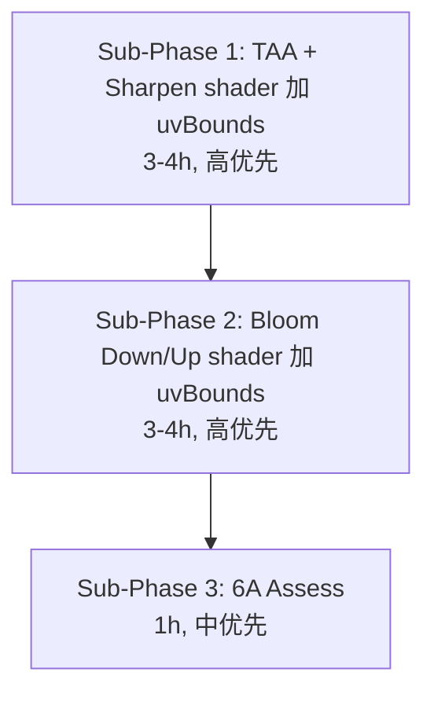

# Phase F.0.10.5 — Shader uvBounds 完美边界 TASK 任务拆分

> 6A 工作流 · 阶段 3 (Atomize) · 任务拆分
> 关联: `ALIGNMENT_PhaseF_0_10_5.md` / `DESIGN_PhaseF_0_10_5.md`

---

## 1. Sub-Phase 矩阵

---

## 2. Sub-Phase 1 — TAA + Sharpen shader uvBounds

### 2.1 任务原子拆解

| Task | 内容 | 输入契约 | 输出契约 | 验收 |
|------|------|---------|---------|------|
| **T1.1** | 改 4 处 shader (TAA × 2 + Sharpen × 2, GLES3 + GL3.3) | DESIGN §3.1 + §3.2 | 4 处 shader 加 `uniform vec4 uUvBounds` + `ClampUV()` 函数 + 9+4 个采样替换 | 字面对照 GLES3 ↔ GL3.3 一致 |
| **T1.2** | backend `DrawTAAPass` / `DrawTAASharpenPass` 加 `const float* uvBounds = nullptr` 默认参数 | render_backend.h | 2 个虚接口签名扩展 | 老调用零改动 |
| **T1.3** | GL3.3 backend 实现 (`render_gl33.cpp`): 加 `locTAA_UvBounds` / `locTAASharpen_UvBounds` + `glUniform4fv` (nullptr 时上传 0,0,1,1) | 4 处 shader (T1.1) | 编译通过 + uniform 上传 | 编译 + headless smoke |
| **T1.4** | TAA Renderer `Process(rgn)` 算 uvBounds (0.5 texel inset) | DESIGN §4.3 | Process 入口算 uvBoundsBuf | 传入 backend |
| **T1.5** | 本地 smoke 验证 (8 smoke 全过 + demo headless) | T1.1-1.4 | smoke 8/8 PASS, demo 9 PASS | 零回归 |
| **T1.6** | commit + push + CI 验证 | T1.5 通过 | git commit, push | CI 6/6 success |

### 2.2 依赖关系
- T1.1 与 T1.2 / T1.3 / T1.4 都依赖 shader 设计
- T1.1 完成后, T1.2 + T1.3 + T1.4 可并行
- T1.5 / T1.6 顺序执行

### 2.3 风险
- shader 编译错 (语法 / GLES 兼容): 现场修
- ClampUV 函数与 GLES3 行内 / GL3.3 GLSL 语法兼容: GLSL 标准支持

---

## 3. Sub-Phase 2 — Bloom Down/Up shader uvBounds

### 3.1 任务原子拆解

| Task | 内容 | 输入契约 | 输出契约 | 验收 |
|------|------|---------|---------|------|
| **T2.1** | 改 4 处 shader (BLOOM_DOWN × 2 + BLOOM_UP × 2, GLES3 + GL3.3) | DESIGN §3.3 + §3.4 | 4 处 shader 加 uvBounds + ClampUV + 13+9 个采样替换 | GLES3 ↔ GL3.3 字面一致 |
| **T2.2** | backend `DrawBloomDownsample` / `DrawBloomUpsample` 加 uvBounds 默认参数 | render_backend.h | 2 个虚接口签名扩展 | 老调用零改动 |
| **T2.3** | GL3.3 backend 实现: 加 `locBloomDown_UvBounds` / `locBloomUp_UvBounds` + glUniform4fv | T2.1 + T2.2 | 编译通过 + uniform 上传 | 编译 + headless |
| **T2.4** | Bloom Renderer `Process(rgn)` 每 mip 级算 uvBounds | DESIGN §2.2 | 每级算 srcW_i/srcH_i + uvBounds_i | mip 链正确 |
| **T2.5** | smoke 8/8 PASS + demo 验证 | T2.1-2.4 | smoke 全过 | 零回归 |
| **T2.6** | commit + push + CI | T2.5 | git, CI 6/6 | OK |

### 3.2 依赖
- 与 Sub-Phase 1 完全独立 (不同 shader / 不同 backend pass)
- 可在 SP1 完成 + CI 通过后串行启动

---

## 4. Sub-Phase 3 — 6A Assess 收尾

### 4.1 任务原子拆解

| Task | 内容 | 输出 |
|------|------|------|
| **T3.1** | ACCEPTANCE_PhaseF_0_10_5.md | 5 个 sub-phase 矩阵 + 设计回顾 + 验收 + 风险实际 |
| **T3.2** | FINAL_PhaseF_0_10_5.md | 项目背景 + 交付 + 关键决策 + 工作量 + 后续候选 |
| **T3.3** | TODO_PhaseF_0_10_5.md | 强制 (CI 回填) + 可选 (demo 视觉验证) + 用户支持 |
| **T3.4** | commit + push | F.0.10.5 完成 |

---

## 5. 总体工作量预估 (vs DESIGN)

| Sub-Phase | DESIGN 估 | 任务数 | 实际工作量预期 |
|-----------|-----------|--------|---------------|
| SP1 (TAA+Sharpen) | 3-4h | 6 task | 3h (TAA shader 复杂, Sharpen 简单) |
| SP2 (Bloom) | 3-4h | 6 task | 3h (mip 链复杂, 但模式与 F.0.10.3 一致) |
| SP3 (Assess) | 1h | 4 task | 1h |
| **合计** | **7-9h** | **16 task** | **7h** |

复用 F.0.10.3 / F.0.10.4 模板成熟度高, 预期略低于 DESIGN 上限.

---

## 6. 验收 (本 Phase 全局)

- ✅ 8 个 shader 改造 (TAA / Sharpen / BloomDown / BloomUp 各 GLES3 + GL3.3)
- ✅ 4 个 backend 接口加 uvBounds 默认参数
- ✅ 3 个 Renderer Process 算 uvBounds 上传
- ✅ 8 smoke 全过 (零回归, 含 ssao/lens_flare/lens_fx 复用)
- ✅ demo_taa_split2 headless 9 PASS (零回归)
- ✅ CI 6/6 success (含 Web/iOS GLES 验证)
- ✅ Lua API 不增 (54 fn 保持)

---

## 7. 中止条件

- shader 编译失败 (GLES 兼容性问题) → 暂停 + 改方案 (例: 拆 ClampUV 为 inline `clamp(uv, ...)`)
- CI 任意平台 fail → 立即停 + 排查
- 性能回归 > 5% (基于 demo perf bench) → 评估 inset 是否过严
