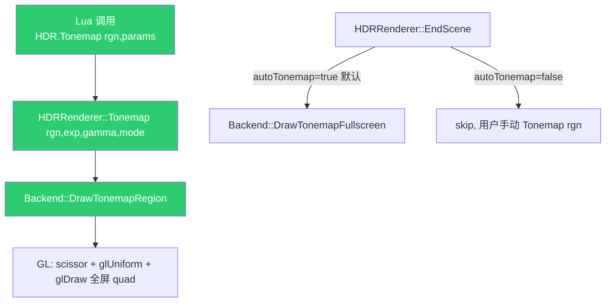

# Phase F.0.10.6 — HDR multi-instance DESIGN 设计

> 6A 工作流 · 阶段 2 (Architect) · 系统设计
> 关联: `ALIGNMENT_PhaseF_0_10_6.md`

---

## 1. 整体架构



新增的 3 个组件 (绿色) + 不变的 EndScene/Fullscreen 路径.

---

## 2. 分层设计

### 2.1 Backend 层 (`render_backend.h` + `render_gl33.cpp`)

#### 2.1.1 接口扩展

```cpp
// 老接口保留, 不变 (零回归)
virtual void DrawTonemapFullscreen(uint32_t hdrTex, float exposure,
                                    float gamma, int tonemapMode = 0) {}

// 新增接口 (默认 no-op, GL33 实现)
virtual void DrawTonemapRegion(uint32_t /*hdrTex*/, float /*exposure*/,
                                float /*gamma*/, int /*tonemapMode*/,
                                int /*rgnX*/, int /*rgnY*/,
                                int /*rgnW*/, int /*rgnH*/) {}
```

#### 2.1.2 GL33 实现

```cpp
void DrawTonemapRegion(uint32_t hdrTex, float exposure, float gamma,
                        int tonemapMode, int rgnX, int rgnY,
                        int rgnW, int rgnH) override {
    if (!tonemapSupported || !hdrTex) return;
    if (rgnW <= 0 || rgnH <= 0) {
        // 退化: 全屏调用 (用户传 0,0,0,0 时)
        DrawTonemapFullscreen(hdrTex, exposure, gamma, tonemapMode);
        return;
    }

    // 1. 关 depth/blend, 启 scissor (与 F.0.10.3 模式一致)
    glDisable(GL_DEPTH_TEST);
    glDisable(GL_BLEND);
    glEnable(GL_SCISSOR_TEST);
    glScissor(rgnX, rgnY, rgnW, rgnH);

    // 2. 绑 program + 上传 uniform (与 fullscreen 一致)
    glUseProgram(programTonemap);
    if (locTonemap_Exposure >= 0) glUniform1f(locTonemap_Exposure, exposure);
    if (locTonemap_Gamma    >= 0) glUniform1f(locTonemap_Gamma,    gamma);
    if (locTonemap_Mode     >= 0) glUniform1i(locTonemap_Mode,     tonemapMode);

    // 3. 绑 HDR tex
    glActiveTexture(GL_TEXTURE0);
    glBindTexture(GL_TEXTURE_2D, (GLuint)hdrTex);

    // 4. 绑 VAO + draw (全屏 quad, scissor 限制写区)
    glBindVertexArray(vaoTonemap);
    glDrawArrays(GL_TRIANGLES, 0, 6);

    // 5. 解绑 + 复位 scissor (重要: 防影响后续 pass)
    glBindVertexArray(0);
    glBindTexture(GL_TEXTURE_2D, 0);
    glUseProgram(0);
    glDisable(GL_SCISSOR_TEST);
}
```

**关键决策**:
- 复用 fullscreen 的 program / VAO / uniform location
- 退化路径 (`rgnW=0`) 不调 scissor, 直接 fwd 给 fullscreen
- 不复位 depth/blend (与 fullscreen 一致, 下次 BeginFrame 重置)

---

### 2.2 HDRRenderer 层 (`hdr_renderer.cpp`)

#### 2.2.1 状态扩展

```cpp
struct State {
    // ...现有字段...
    bool autoTAA          = true;    // F.0.10.2
    bool autoBloom        = true;    // F.0.10.3
    bool autoSSR          = true;    // F.0.10.3
    bool autoMotionBlur   = true;    // F.0.10.3
    bool autoTonemap      = true;    // F.0.10.6 — 新增, 默认 true 零回归
};
```

#### 2.2.2 EndScene 改造

```cpp
// EndScene 末尾的 tonemap 调用 (现有)
g.backend->DrawTonemapFullscreen(g.sceneTex, exposure, g.gamma, g.tonemap);

// 改为
if (g.autoTonemap) {
    g.backend->DrawTonemapFullscreen(g.sceneTex, exposure, g.gamma, g.tonemap);
}
```

#### 2.2.3 新增 API

```cpp
// 公开 API (头文件)
void Tonemap(int rgnX, int rgnY, int rgnW, int rgnH,
              float exposure, float gamma, int tonemapMode);

// 重载 (用全局 g.exposure / g.gamma / g.tonemap)
void Tonemap(int rgnX, int rgnY, int rgnW, int rgnH);

// auto-tonemap 开关 (与 SetAutoTAA 同模式)
bool SetAutoTonemap(bool on);
bool GetAutoTonemap();
```

实现细节:

```cpp
void Tonemap(int rgnX, int rgnY, int rgnW, int rgnH,
              float exposure, float gamma, int tonemapMode) {
    // 防御性: HDR 未启用 / backend 无效 / sceneTex 无效 → silent skip
    if (!g.enabled || !g.backend || !g.sceneTex) return;

    // 复用 backend region API
    g.backend->DrawTonemapRegion(g.sceneTex, exposure, gamma, tonemapMode,
                                  rgnX, rgnY, rgnW, rgnH);
}

void Tonemap(int rgnX, int rgnY, int rgnW, int rgnH) {
    // AE 叠加: 与 EndScene 同逻辑, AE 开时 AE 覆盖 manual exposure
    float exposure = AutoExposureRenderer::IsEnabled()
                        ? AutoExposureRenderer::GetCurrentExposure()
                        : g.exposure;
    Tonemap(rgnX, rgnY, rgnW, rgnH, exposure, g.gamma, g.tonemap);
}
```

---

### 2.3 Lua API 层 (`light_graphics.cpp`)

#### 2.3.1 新增 3 个 fn

```cpp
// HDR.Tonemap(rgnX, rgnY, rgnW, rgnH [, params_table])
//   params_table 可选, 字段: { exposure=number, gamma=number, tonemap=string|int }
//   不传 params_table 时用全局 (g.exposure 含 AE / g.gamma / g.tonemap)
static int l_HDR_Tonemap(lua_State* L);

// HDR.SetAutoTonemap(bool)
static int l_HDR_SetAutoTonemap(lua_State* L);

// HDR.GetAutoTonemap() -> bool
static int l_HDR_GetAutoTonemap(lua_State* L);
```

#### 2.3.2 l_HDR_Tonemap 实现要点

```cpp
static int l_HDR_Tonemap(lua_State* L) {
    int rgnX = (int)luaL_checkinteger(L, 1);
    int rgnY = (int)luaL_checkinteger(L, 2);
    int rgnW = (int)luaL_checkinteger(L, 3);
    int rgnH = (int)luaL_checkinteger(L, 4);

    // 可选 params_table
    if (lua_istable(L, 5)) {
        // 各字段都可选, 缺省用全局
        float exposure = ...;  // 读 t.exposure 或 g.exposure (含 AE)
        float gamma    = ...;  // 读 t.gamma 或 g.gamma
        int   mode     = ...;  // 读 t.tonemap (string/int) 或 g.tonemap

        HDRRenderer::Tonemap(rgnX, rgnY, rgnW, rgnH, exposure, gamma, mode);
    } else {
        // 不传 params, 用全局
        HDRRenderer::Tonemap(rgnX, rgnY, rgnW, rgnH);
    }

    // 返回 (ok, err) 模式 (与 Bloom.Process 等一致)
    if (!HDRRenderer::IsEnabled() || !HDRRenderer::GetSceneTexture()) {
        lua_pushnil(L);
        lua_pushstring(L, "HDR.Tonemap: HDR not enabled (sceneTex = 0)");
        return 2;
    }
    lua_pushboolean(L, 1);
    return 1;
}
```

---

## 3. 数据流向

```
[用户 Lua 代码]
       |
       | -- HDR.Tonemap(rgnX, rgnY, rgnW, rgnH, {exposure=1.5, tonemap="aces"})
       v
[l_HDR_Tonemap] (light_graphics.cpp)
       |
       | -- 解析 params_table (可选), 计算 exposure/gamma/mode
       v
[HDRRenderer::Tonemap rgn,exp,gamma,mode] (hdr_renderer.cpp)
       |
       | -- 防御 (HDR 未启用 silent skip)
       v
[Backend::DrawTonemapRegion] (render_gl33.cpp)
       |
       | -- glScissor + glUniform + glDrawArrays
       v
[GPU: HDR sceneTex → default fb 的 region 区域]
```

---

## 4. 异常处理策略

| 异常情况 | 行为 |
|---------|------|
| HDR 未启用 | `Tonemap` silent skip, Lua 返回 `(nil, "HDR not enabled")` |
| `rgnW=0` 或 `rgnH=0` | Backend 退化为 `DrawTonemapFullscreen` (老路径) |
| `params_table` 非 table | `lua_istable` 检测 → 走全局 path |
| `params.tonemap` 字符串无效 | 复用 `hdr_tonemap_name_to_mode` 回退 ACES (已有逻辑) |
| `params.gamma <= 0` | clamp 到 0.0001 (与 `SetGamma` 一致) |

---

## 5. 与现有架构的一致性

| 模式 | 现有 phase | F.0.10.6 |
|------|-----------|---------|
| Region scissor | F.0.10.3 (Bloom/SSR/MB) | ✅ 同模式 |
| auto-* 开关 (默认 true 零回归) | F.0.10.2/F.0.10.3 (auto-TAA/Bloom/SSR/MB) | ✅ 同模式 |
| `Process(rgn)` Lua API | F.0.10.3 (Bloom.Process 等) | ✅ 同模式 |
| Backend `Draw*Region` | F.0.10.3 | ✅ 同模式 |

**结论**: F.0.10.6 是 F.0.10.3 的精确延伸, 模板成熟度高, 实施风险低.

---

## 6. 后续 (本 phase 不做)

- demo_taa_split2 加 per-region tonemap 演示 (黄昏 vs 蓝夜) → demo_tonemap_split2 (后续 phase)
- per-region color grading LUT
- per-region film grain / vignette

---

## 7. 共识声明

设计已与 ALIGNMENT 一致, 范围清晰, 接口契约定义完整, 进入 ATOMIZE 阶段.
