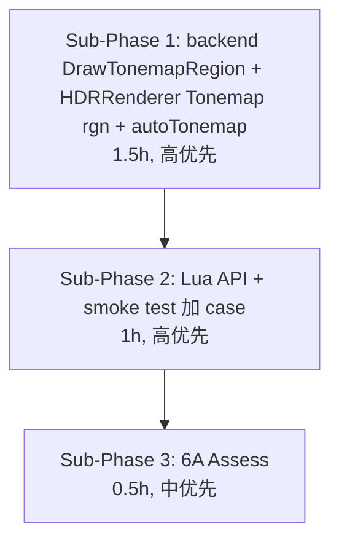

# Phase F.0.10.6 — HDR multi-instance TASK 任务拆分

> 6A 工作流 · 阶段 3 (Atomize) · 任务原子化
> 关联: `ALIGNMENT_PhaseF_0_10_6.md` / `DESIGN_PhaseF_0_10_6.md`

---

## 1. Sub-Phase 矩阵

---

## 2. Sub-Phase 1 — Backend + HDRRenderer

### 2.1 任务原子拆解

| Task | 内容 | 输入契约 | 输出契约 | 验收 |
|------|------|---------|---------|------|
| **T1.1** | `render_backend.h` 加 `DrawTonemapRegion` 虚接口 (默认 no-op) | DESIGN §2.1.1 | 1 个新虚函数, 8 参数 | 头文件编译过 |
| **T1.2** | `render_gl33.cpp` 实现 `DrawTonemapRegion` (复用 fullscreen 逻辑 + scissor) | DESIGN §2.1.2 | GL 实现, `rgnW=0` 退化 | 编译过 |
| **T1.3** | `hdr_renderer.h` 加 `Tonemap(rgn, exp, gamma, mode)` + `Tonemap(rgn)` 重载 + `SetAutoTonemap` + `GetAutoTonemap` | DESIGN §2.2.3 | 4 个新 API 声明 | 头文件编译过 |
| **T1.4** | `hdr_renderer.cpp` 实现 4 个 API + `g.autoTonemap = true` 字段 + EndScene 加 `if (g.autoTonemap)` 包裹 | DESIGN §2.2 | 实现完整 | 编译过 |
| **T1.5** | 本地编译 + smoke 8/8 (零回归) | T1.1-1.4 | smoke 全过 | 老路径行为不变 |

### 2.2 依赖

- T1.1 ↔ T1.2 (header → impl)
- T1.3 ↔ T1.4 (header → impl)
- T1.1+T1.2 与 T1.3+T1.4 可并行 (但 T1.4 调 T1.2 backend, 实测时 T1.4 后跑)
- T1.5 最后跑

### 2.3 风险

- backend `DrawTonemapRegion` 与 `DrawTonemapFullscreen` 代码重复 → 复用逻辑通过退化 (T1.2 内部 `rgnW=0` 调 fullscreen)
- AE (AutoExposure) 与 region exposure 互动 → 在 `Tonemap(rgn)` 重载中明确 AE 覆盖逻辑

---

## 3. Sub-Phase 2 — Lua API + smoke

### 3.1 任务原子拆解

| Task | 内容 | 输入契约 | 输出契约 | 验收 |
|------|------|---------|---------|------|
| **T2.1** | `light_graphics.cpp` 加 `l_HDR_Tonemap` (含 params_table 解析: exposure/gamma/tonemap) | DESIGN §2.3 | 1 个 Lua fn | 编译过 |
| **T2.2** | 加 `l_HDR_SetAutoTonemap` + `l_HDR_GetAutoTonemap` | DESIGN §2.3 | 2 个 Lua fn | 编译过 |
| **T2.3** | 注册 3 个 fn 到 `hdr_funcs[]` table | T2.1 + T2.2 | 注册完整 | Lua 可见 |
| **T2.4** | `scripts/smoke/hdr.lua` 加 case 验证: SetAutoTonemap round-trip + Tonemap headless 退化 | T2.1-2.3 | smoke 加 2-3 行 case | smoke PASS |
| **T2.5** | 跑 8 smoke 全过 (零回归) | T2.4 | 8 PASS | OK |
| **T2.6** | demo_taa_split2 headless probe (确保不退化) | T2.5 | 8 PASS 维持 | OK |

### 3.2 依赖

- T2.1/T2.2/T2.3 顺序 (impl → 注册)
- T2.4 在 T2.3 后
- T2.5/T2.6 最后

---

## 4. Sub-Phase 3 — 6A Assess

### 4.1 任务原子拆解

| Task | 内容 | 输出 |
|------|------|------|
| **T3.1** | `ACCEPTANCE_PhaseF_0_10_6.md` | sub-phase 矩阵 + 验收 + 工作量 |
| **T3.2** | `FINAL_PhaseF_0_10_6.md` | 项目总结 + 关键决策 + 后续候选 |
| **T3.3** | `TODO_PhaseF_0_10_6.md` | 强制 (CI 验证) + 可选 (demo / per-region grading) + 用户支持 |
| **T3.4** | commit + push | F.0.10.6 完成 |

---

## 5. 总体工作量预估

| Sub-Phase | DESIGN 估 | 任务数 | 工作量预期 |
|-----------|-----------|--------|----------|
| SP1 (backend + renderer) | 1.5h | 5 task | 1.5h |
| SP2 (Lua + smoke) | 1h | 6 task | 1h |
| SP3 (Assess) | 0.5h | 4 task | 0.5h |
| **合计** | **3h** | **15 task** | **~3h** |

ALIGN/DESIGN/TASK 文档已 0.5h 完成 (本 commit), 总累 ~3.5h.

---

## 6. 验收 (本 Phase 全局)

- ✅ 1 个 backend 接口 (`DrawTonemapRegion`)
- ✅ 4 个 HDRRenderer API (`Tonemap` x2 + `SetAutoTonemap` + `GetAutoTonemap`)
- ✅ 3 个 Lua API (`HDR.Tonemap` + `HDR.SetAutoTonemap` + `HDR.GetAutoTonemap`)
- ✅ 8 smoke 全过 (零回归)
- ✅ demo_taa_split2 headless 8 PASS (零回归)
- ✅ CI 6/6 success (待 push)
- ✅ Lua API 总数: 54 → **57** (+3)

---

## 7. 中止条件

- 编译失败且 30min 内未解决 → 暂停 + 重新评估设计
- smoke 出现回归且根因不明 → 暂停 + 排查
- AE 与 region exposure 互动出现死锁 → 评估是否拆 phase
