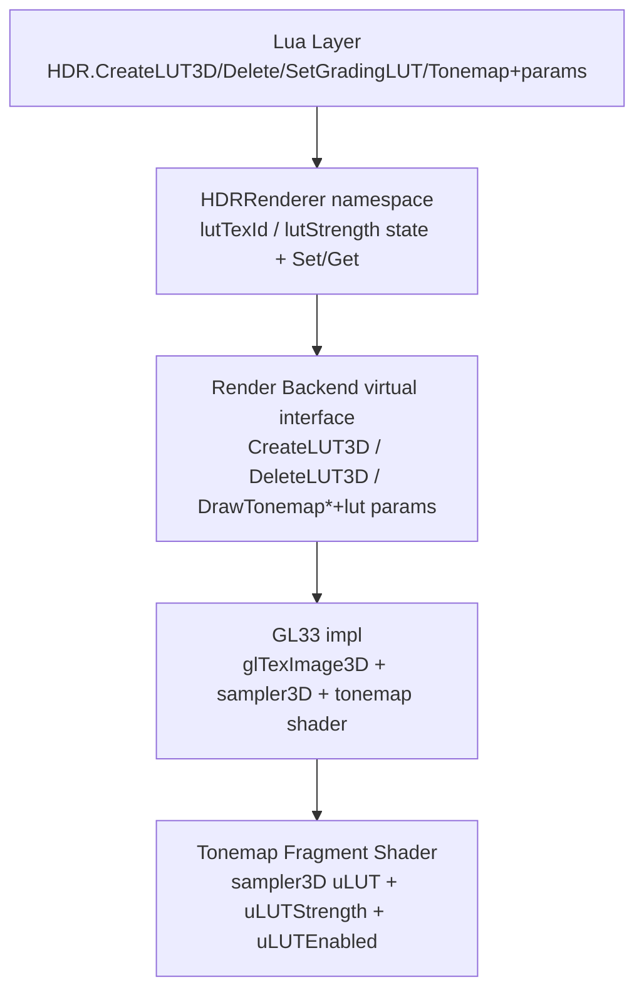
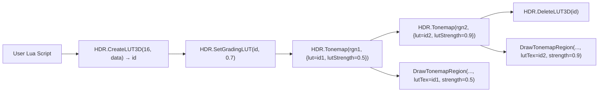

# Phase F.0.10.8 — per-region color grading LUT DESIGN

> 6A 工作流 · 阶段 2 (Architect) · 共识文档 → 系统架构 → 模块设计 → 接口规范
> 关联: `ALIGNMENT_PhaseF_0_10_8.md`

---

## 1. 整体架构图



---

## 2. 分层设计

### 2.1 Backend 层 (`render_backend.h` + `render_gl33.cpp`)

**新增虚函数 2 个**:
```cpp
virtual uint32_t CreateLUT3D(int size, const uint8_t* data) { return 0; }
virtual bool     DeleteLUT3D(uint32_t lutTex) { return false; }
```

**改造 2 个虚函数 (默认参数零回归)**:
```cpp
virtual void DrawTonemapFullscreen(uint32_t hdrTex, float exposure, float gamma,
                                    int tonemapMode = 0,
                                    uint32_t lutTex = 0, float lutStrength = 0.0f) {}
virtual void DrawTonemapRegion(uint32_t hdrTex, float exposure, float gamma, int tonemapMode,
                                int rgnX, int rgnY, int rgnW, int rgnH,
                                uint32_t lutTex = 0, float lutStrength = 0.0f) {}
```

**`render_gl33.cpp` 改造点**:
1. `FS_TONEMAP_SOURCE` (GLES3 + GL33 双源) 加 `sampler3D uLUT` + `uLUTStrength` + `uLUTEnabled` + main 函数末尾 LUT 混合
2. `InitTonemap` 加缓存 `locTonemap_LUT` / `locTonemap_LUTStrength` / `locTonemap_LUTEnabled` + 绑 sampler 到 unit 1
3. `DrawTonemap{Fullscreen,Region}`: 加 `glActiveTexture(GL_TEXTURE1) + glBindTexture(GL_TEXTURE_3D, lutTex)` + 上传 uniform; 退出时解绑 unit 1
4. 新增 `CreateLUT3D` 实现: `glTexImage3D(GL_RGB8)` + GL_LINEAR + GL_CLAMP_TO_EDGE
5. 新增 `DeleteLUT3D` 实现: `glDeleteTextures(1, &id)`
6. shader 不可用时 LUT3D create 仍可成功 (LUT 是用户资源, 与 tonemap shader 解耦)

### 2.2 HDRRenderer 层 (`hdr_renderer.h` + `hdr_renderer.cpp`)

**State 字段新增**:
```cpp
uint32_t lutTexId   = 0;     // 全局 grading LUT (0 = no LUT)
float    lutStrength = 0.0f; // [0, 1] 混合强度
```

**新 API 5 个**:
```cpp
uint32_t CreateLUT3D(int size, const uint8_t* data, size_t dataLen);  // wrap backend, 校验后传
bool     DeleteLUT3D(uint32_t lutTex);
bool     SetGradingLUT(uint32_t lutTex, float strength);
uint32_t GetGradingLUTId();
float    GetGradingLUTStrength();
```

**改 EndScene**:
- `autoTonemap` 路径透传 `g.lutTexId, g.lutStrength` 给 `DrawTonemapFullscreen`

**改 Tonemap 重载 (4 个新签名)**:
```cpp
// 已有 (F.0.10.6/7):
void Tonemap(int rgnX, int rgnY, int rgnW, int rgnH);  // 用 g.exposure + g.lut
void Tonemap(int rgnX, int rgnY, int rgnW, int rgnH,
              float exposure, float gamma, int tonemapMode);  // 不含 LUT (默认 0/0)

// 新增 (F.0.10.8):
void Tonemap(int rgnX, int rgnY, int rgnW, int rgnH,
              float exposure, float gamma, int tonemapMode,
              uint32_t lutTex, float lutStrength);  // 完全覆盖
```

### 2.3 Lua 层 (`light_graphics.cpp`)

**5 个新 Lua fn**:

| fn | 签名 | 错误处理 |
|----|------|---------|
| `HDR.CreateLUT3D` | `(size, data_string_or_array) → texId_or_nil, err` | size [4,64], data 长度 = size³×3 |
| `HDR.DeleteLUT3D` | `(texId) → bool` | texId > 0 |
| `HDR.SetGradingLUT` | `(texId, strength) → bool` | strength clamp [0,1] |
| `HDR.GetGradingLUTId` | `() → uint32_t` | always returns |
| `HDR.GetGradingLUTStrength` | `() → float` | always returns |

**改 `HDR.Tonemap` 解析 params_table**:
- 加 `params.lut` (number, 0 = no LUT)
- 加 `params.lutStrength` (number, clamp [0,1])

---

## 3. 接口契约定义

### 3.1 `CreateLUT3D(size, data)` 输入契约

| 输入 | 校验 | 错误 |
|------|------|-----|
| `size` | int [4, 64] | "size out of range [4,64]" |
| `data` | string len = size³×3 / int array len = size³×3 | "data length mismatch (expected N, got M)" |
| backend | `SupportsHDR()` true | "HDR backend not supported" |

**返回**:
- 成功: `(texId, nil)` where texId > 0
- 失败: `(nil, err_string)`

### 3.2 LUT 数据布局

```
// data[i] for voxel (r, g, b), i ∈ [0, size³)
// R 变化最快 (与 glTexImage3D 默认 row-major 一致)
// data[(b*size + g)*size + r] * 3 + 0 = R 通道
// data[(b*size + g)*size + r] * 3 + 1 = G 通道
// data[(b*size + g)*size + r] * 3 + 2 = B 通道
```

### 3.3 Tonemap shader LUT 流程

```glsl
// 已有
vec3 hdr = texture(uHDRTex, vUV).rgb * uExposure;
vec3 ldr = tonemap_op(hdr);

// F.0.10.8 新增: LUT 混合 (uLUTEnabled = strength > 0 && lutTex != 0)
if (uLUTEnabled != 0) {
    vec3 graded = texture(uLUT, ldr).rgb;
    ldr = mix(ldr, graded, uLUTStrength);
}

// 已有
vec3 srgb = pow(ldr, vec3(1.0/uGamma));
FragColor = vec4(srgb, 1.0);
```

**性能**: 1 次 `texture(sampler3D, vec3)` ≈ 1.5 × 2D fetch (硬件 trilinear).

---

## 4. 数据流向图



**两层覆盖**:
1. 全局 `HDR.SetGradingLUT(id, str)` 设置默认
2. Per-region `params.lut/lutStrength` 覆盖全局

---

## 5. 异常处理策略

| 异常 | 处理 |
|------|-----|
| backend 不支持 HDR | `CreateLUT3D` 返 (nil, "HDR backend not supported") |
| `glTexImage3D` 失败 (OOM 等) | 返 (nil, "glTexImage3D failed"); 已 glGen 的 tex 立即释放 |
| `SetGradingLUT(lutTex=0)` | 合法 (= disable), strength 任意 |
| `SetGradingLUT(strength=0)` | shader 内 uLUTEnabled=0 短路 (省 fetch) |
| `Tonemap` params 含非法 lut (字符串等) | luaL_error |
| `DeleteLUT3D(0)` | 返 false (silent, 与 LensFlare 同模式) |
| 用户 Delete 后仍使用 | shader 采到 invalid handle → glGetError, 视觉黑/绿; 用户责任 |

---

## 6. 与 F.0.10.6 / F.0.10.7 集成

- `HDR.SetAutoTonemap(false)` 路径 (split-screen): 用户调 `HDR.Tonemap(rgn, params)` 时, 若 params 含 `lut`/`lutStrength` → 走新 backend 接口
- `HDR.SetAutoTonemap(true)` 路径 (单视角默认): `EndScene` 内部 `DrawTonemapFullscreen` 透传 `g.lutTexId / g.lutStrength`
- demo `demo_taa_split2`: 加 procedural LUT 生成 (Lua 端构 byte string) + per-region 应用

---

## 7. shader 改动详细 (双源对照)

### 7.1 GLES 3.0 版本 (`#version 300 es`)

```glsl
precision highp float;
precision highp sampler3D;   // 新加: 3D sampler 默认精度
in  vec2 vUV;
out vec4 FragColor;

uniform sampler2D uHDRTex;
uniform sampler3D uLUT;         // NEW: 3D LUT
uniform float uExposure;
uniform float uGamma;
uniform int   uTonemapMode;
uniform float uLUTStrength;     // NEW [0,1]
uniform int   uLUTEnabled;      // NEW: 0=skip LUT

// ... 4 个 tonemap 函数不变 ...

void main() {
    vec3 hdr = max(texture(uHDRTex, vUV).rgb, vec3(0.0)) * uExposure;
    vec3 ldr;
    if      (uTonemapMode == 1) ldr = TonemapReinhard(hdr);
    else if (uTonemapMode == 2) ldr = TonemapUncharted2(hdr);
    else if (uTonemapMode == 3) ldr = TonemapLinear(hdr);
    else                        ldr = TonemapACES(hdr);

    if (uLUTEnabled != 0) {              // NEW: LUT 混合
        vec3 graded = texture(uLUT, clamp(ldr, 0.0, 1.0)).rgb;
        ldr = mix(ldr, graded, uLUTStrength);
    }

    vec3 srgb = pow(ldr, vec3(1.0 / max(uGamma, 0.0001)));
    FragColor = vec4(srgb, 1.0);
}
```

### 7.2 GL 3.3 Core 版本

完全一致, 仅 `#version 330 core`, 删除 `precision` 行.

---

## 8. 测试 / 验证策略

### 8.1 unit 测 (smoke `hdr.lua` 加 4 PASS)

1. `HDR.CreateLUT3D(16, identity_data)` 返 texId > 0
2. `HDR.DeleteLUT3D(texId)` 返 true
3. `HDR.SetGradingLUT(id, 0.7)` 后 `Get*` round-trip
4. `HDR.CreateLUT3D(2, ...)` 拒绝 (size < 4) → nil + err

### 8.2 integration 测 (demo headless probe 加 3 PASS)

5. `HDR.SetGradingLUT(0, 0.0)` round-trip + `Get*` 返 (0, 0.0)
6. `HDR.Tonemap(rgn, {lut=id, lutStrength=0.5})` headless 退化返 nil + err
7. `HDR.CreateLUT3D` headless 返 nil + err

### 8.3 视觉验证 (留用户跟进)

- demo_taa_split2 跑实际 GL context: P1 用红偏移 LUT, P2 用蓝偏移 LUT, 视觉 显著差异

---

## 9. 性能预算

| 操作 | 估计 | 备注 |
|------|------|-----|
| `glTexImage3D` size=16 | < 1ms | 12KB, 一次性 |
| `glTexImage3D` size=32 | < 5ms | 96KB |
| `glActiveTexture + Bind` per pass | ~1μs | 状态切换 |
| sampler3D trilinear fetch | ~1.5x sampler2D | 硬件标准 |
| if-branch (uLUTEnabled) | 0 | 现代 GPU uniform branch |

**结论**: LUT 启用 vs 不启用 perf 差 < 5%, 远低于 SSR/Bloom.

---

## 10. 文件改动清单

| 文件 | 改动 | 行数估 |
|------|------|-------|
| `ChocoLight/include/render_backend.h` | 2 new fn + 2 改 fn 默认参数 | +30 |
| `ChocoLight/src/render_gl33.cpp` | shader 双源 + Init + DrawTonemap*改 + Create/Delete 实现 | +120 |
| `ChocoLight/include/hdr_renderer.h` | 5 new API decl | +20 |
| `ChocoLight/src/hdr_renderer.cpp` | State 字段 + 5 impl + EndScene/Tonemap 透传 | +80 |
| `ChocoLight/src/light_graphics.cpp` | 5 Lua fn + params 解析改 | +180 |
| `scripts/smoke/hdr.lua` | 4 PASS | +60 |
| `samples/demo_taa_split2/main.lua` | 3 PASS + 实际 LUT 演示 | +80 |
| `samples/demo_taa_split2/README.md` | 更新 | +20 |
| `docs/Phase F.0.10.8/` | 6 docs | ~600 |
| **合计** | | **~1200 行** |

---

## 11. 决策摘要 (DESIGN 关键)

1. **3D texture, trilinear filter, RGB8 RGB8 数据** — 业界标准
2. **shader uniform branch (uLUTEnabled)** — 单 program 简化, 性能 0 损
3. **backend 接口扩参 (默认 0/0)** — 零回归
4. **HDRRenderer State 字段 + Lua HDR 子表 API** — 与 SetTonemapper 同级
5. **Per-region params 字段** — 与 F.0.10.6 一致
6. **用户自管理 LUT 生命周期** — 不引入 LUT pool / ref count
