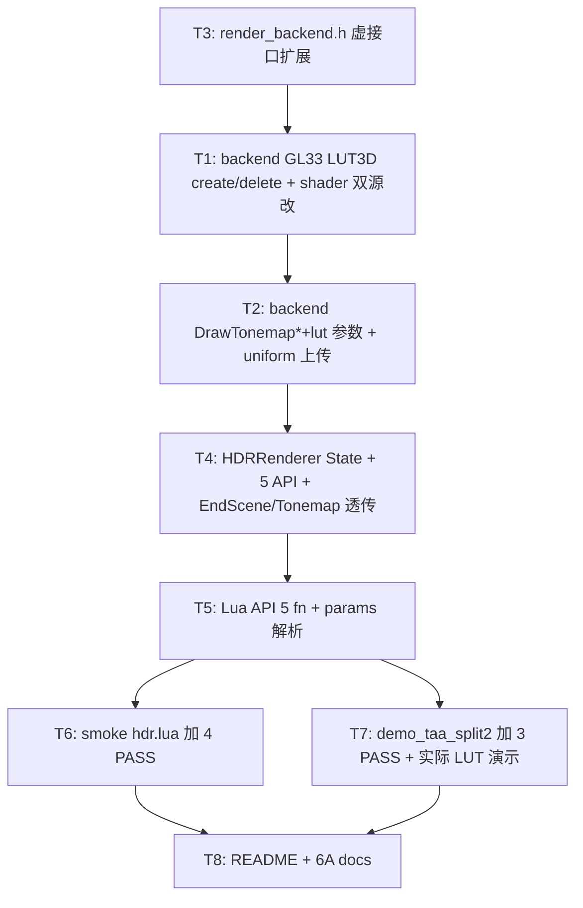

# Phase F.0.10.8 — per-region color grading LUT TASK

> 6A 工作流 · 阶段 3 (Atomize) · 拆分任务 → 明确接口 → 依赖关系

---

## 任务依赖图

---

## 子任务原子化

### T1 — Backend GL33 LUT3D create/delete + shader 双源改 (~1.5h)

**输入契约**:
- render_backend.h 已扩展 2 new fn (T3)
- 现有 tonemap shader 在 `render_gl33.cpp` 1097-1149 (GLES) + 1379-1430 (GL33)

**输出契约**:
- `CreateLUT3D(size, data)` override 实现: glGenTextures + glTexImage3D(GL_RGB8) + GL_LINEAR + GL_CLAMP_TO_EDGE_3D
- `DeleteLUT3D(lutTex)` override 实现: glDeleteTextures
- shader 双源加 `sampler3D uLUT` + `uLUTStrength` + `uLUTEnabled` uniform
- shader main 函数 LDR 后加 LUT 混合 (mix(ldr, sample(LUT, ldr), strength))
- `InitTonemap` 加 3 个 uniform location 缓存 + 绑 sampler3D 到 unit 1

**实现约束**:
- 与 sampler2D unit 0 隔离 (LUT 用 unit 1)
- 输入校验在 caller 层 (HDRRenderer); backend 假设输入合法
- shader 编译失败时 silent fallback (与现 InitTonemap 同模式)

**验收**:
- 编译通过
- shader 内 sampler3D / sampler2D 双 uniform 不冲突
- 单元测: 给定 16³ identity data → CreateLUT3D 返非零 id

### T2 — Backend `DrawTonemap{Fullscreen,Region}` 加 lut 参数 (~0.5h)

**输入契约**: T1 完成

**输出契约**:
- 2 函数加 `uint32_t lutTex = 0, float lutStrength = 0.0f` 默认参数
- 函数内: `bool useLUT = (lutTex != 0 && lutStrength > 0.0f)`
- `glActiveTexture(GL_TEXTURE1) + glBindTexture(GL_TEXTURE_3D, useLUT ? lutTex : 0)`
- 上传 uniform: uLUTStrength + uLUTEnabled (= useLUT ? 1 : 0)
- 退出时 `glBindTexture(GL_TEXTURE_3D, 0)` (unit 1 解绑)

**实现约束**:
- LUT 不可用 (lutTex=0 or strength=0) 不影响现有路径
- 与 scissor / depth/blend 状态切换不冲突

**验收**:
- 老 caller (无 lut 参数) 行为不变
- 新 caller 传 lutTex/strength 实际生效 (验证: 抓 frame 看 uLUTEnabled uniform 上传值)

### T3 — `render_backend.h` 虚接口扩展 (~0.3h)

**输入契约**: 无依赖 (与 T1 并行可启动)

**输出契约**:
- 新增 2 个 virtual fn (CreateLUT3D / DeleteLUT3D 默认实现 no-op)
- 改 2 个虚 fn 加默认参数 (DrawTonemap{Fullscreen,Region}: lutTex=0, lutStrength=0)
- doxygen 注释完整

**实现约束**: 默认参数零回归

**验收**: 编译通过

### T4 — HDRRenderer State + 5 API + EndScene/Tonemap 透传 (~1h)

**输入契约**: T2, T3 完成

**输出契约**:
- State 加 lutTexId / lutStrength 字段 (默认 0, 0.0)
- 5 新 API 实现 (CreateLUT3D wrap, DeleteLUT3D wrap, SetGradingLUT, GetGradingLUTId, GetGradingLUTStrength)
- CreateLUT3D 内部校验 size [4,64] + data 长度 + backend.SupportsHDR
- EndScene 透传 g.lutTexId / g.lutStrength
- Tonemap(rgn) 透传 g.lutTexId / g.lutStrength
- Tonemap(rgn, exp, gamma, mode) 默认不含 LUT (lut=0)
- 新 Tonemap(rgn, exp, gamma, mode, lutTex, lutStrength) 重载

**实现约束**:
- strength clamp [0,1]
- lutTexId=0 视为 disable
- 与 AE 叠加路径不冲突 (LUT 与 exposure 解耦)

**验收**:
- 5 API 单测 round-trip ok
- EndScene autoTonemap 路径 LUT 字段透传 (代码审 + headless 验证)

### T5 — Lua API 5 fn + Tonemap params 解析 (~1.2h)

**输入契约**: T4 完成

**输出契约**:
- l_HDR_CreateLUT3D: 接 (size, data_string | data_table) → tex_id | nil + err
- l_HDR_DeleteLUT3D: 接 (tex_id) → bool
- l_HDR_SetGradingLUT: 接 (tex_id, strength) → bool
- l_HDR_GetGradingLUTId: → integer
- l_HDR_GetGradingLUTStrength: → number
- 改 l_HDR_Tonemap params_table 解析: 加 `lut` (number, default 0) + `lutStrength` (number, default 0.0)
- 注册到 hdr_funcs[]

**实现约束**:
- data 支持 string (binary) 和 table (int array) 两种
- 不调 LUT API → 全部行为兼容老脚本

**验收**:
- smoke + headless probe 全过

### T6 — smoke hdr.lua 加 4 PASS (~0.5h)

**输入契约**: T5 完成

**输出契约**:
- 加 §14 LUT section: 4 PASS
  - PASS: CreateLUT3D(16, identity_data) 返 id > 0
  - PASS: DeleteLUT3D(id) 返 true
  - PASS: SetGradingLUT(id, 0.7) + Get round-trip
  - PASS: CreateLUT3D(2, ...) 拒绝 size < 4

**实现约束**:
- 与 §13 (autoTonemap) 同模式

**验收**: 8 smoke 全 PASS

### T7 — demo_taa_split2 加 3 PASS + 实际 LUT 演示 (~1h)

**输入契约**: T5 完成

**输出契约**:
- demo headless probe 加 3 PASS (CreateLUT3D headless, SetGradingLUT round-trip, Tonemap with LUT params headless)
- 实际渲染路径 (有 GL context 时): 生成 2 个 procedural LUT (red-tint vs blue-tint), 应用到 P1/P2

**实现约束**:
- procedural LUT 用 Lua 端 string.char + 循环构建 (16³×3 = 12KB, 微秒级)
- 与 F.0.10.6 P1/P2 tonemap params 共存

**验收**:
- demo headless 14 PASS (旧 11 + 新 3)

### T8 — README + 6A docs (~0.5h)

**输入契约**: T6, T7 完成

**输出契约**:
- `Light_Graphics.md` 加 LUT API 段
- `samples/demo_taa_split2/README.md` 加 LUT 字段
- ACCEPTANCE / FINAL / TODO 文档

**验收**: 6 docs 全, commit ready

---

## 拆分原则总结

- **复杂度可控**: 每任务 < 2h, 单子任务可独立编译/测试
- **依赖清晰**: T3 → T1 → T2 → T4 → T5 → {T6, T7} → T8 单线
- **零回归保障**: 默认参数 + uniform branch + 不调 API 即不变
- **测试驱动**: smoke 增量加 4 PASS + demo 加 3 PASS

---

## 执行批次

| Sub-Phase | 任务 | 工作量 |
|-----------|------|-------|
| **SP1** (Backend) | T3 → T1 → T2 | ~2.3h |
| **SP2** (Renderer + Lua) | T4 → T5 | ~2.2h |
| **SP3** (Verification + Docs) | T6 + T7 + T8 | ~2h |
| **合计** | | **~6.5h** |

vs ALIGN 估 5.5h, vs DESIGN 估 5-7h. 实际可能 4-5h (复用 F.0.10.6 模板高).
