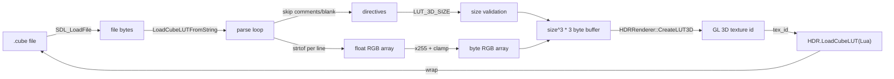
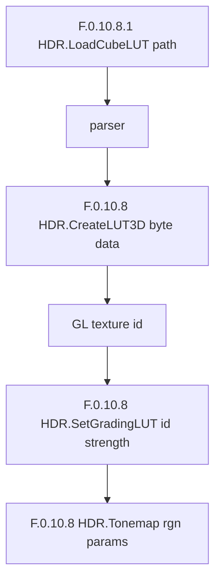

# Phase F.0.10.8.1 — `.cube` LUT 文件解析 DESIGN

> 6A 工作流 · 阶段 2 (Architect) · 系统架构 → 模块设计 → 接口规范

---

## 1. 整体架构



## 2. 接口契约

### 2.1 C++ HDRRenderer 层

```cpp
// hdr_renderer.h - 新增 2 fn

namespace HDRRenderer {

/**
 * @brief Phase F.0.10.8.1 — 从 .cube 文件加载 3D LUT
 *
 * 内部: SDL_LoadFile → LoadCubeLUTFromString → CreateLUT3D
 * 解析 Adobe Cube LUT 1.0 标准格式:
 *   - LUT_3D_SIZE N 必需 (N ∈ [4, 64], 与 CreateLUT3D 约束一致)
 *   - LUT_1D_SIZE 不支持
 *   - 注释 (#) + 空行 skip
 *   - DOMAIN_MIN/MAX 解析但本 phase 仍 clamp [0,1]
 *   - CRLF / LF 行尾兼容
 *   - 数据顺序: R 最快变 (与 OpenGL 3D texture 一致)
 *
 * @param path        .cube 文件路径 (绝对或相对 CWD)
 * @param outErr      [out] 错误描述 (失败时填; 成功时不动)
 * @param errCap      outErr 缓冲区容量
 * @return            tex_id (> 0 = 成功); 0 = 失败 (查 outErr)
 */
uint32_t LoadCubeLUTFile(const char* path, char* outErr, size_t errCap);

/**
 * @brief Phase F.0.10.8.1 — 从内存字符串解析 .cube LUT
 *
 * 与 LoadCubeLUTFile 共享 parser, 仅去掉文件 I/O.
 * 用于 smoke 测试 (in-memory test fixture, 不依赖 disk 文件)
 *
 * @param text        .cube 文件文本内容 (null-terminated 不强制)
 * @param textLen     text 字节数
 * @param outErr      [out] 错误描述
 * @param errCap      outErr 缓冲区容量
 * @return            tex_id (> 0); 0 = 失败
 */
uint32_t LoadCubeLUTFromString(const char* text, size_t textLen,
                                char* outErr, size_t errCap);

}  // namespace HDRRenderer
```

### 2.2 Lua API

```lua
-- light_graphics.cpp - 新增 1 个 Lua fn

--- @lua_api Light.Graphics.HDR.LoadCubeLUT
--- @param path string .cube 文件路径
--- @return integer | nil tex_id, string? err
--- @usage
---   local id = HDR.LoadCubeLUT("assets/luts/sunset.cube")
---   if id then HDR.SetGradingLUT(id, 0.8) end
HDR.LoadCubeLUT(path) → tex_id, err
```

## 3. parser 实现细节 (核心算法)

### 3.1 单遍解析流程

```cpp
// 伪代码 (实际实现见 hdr_renderer.cpp)
uint32_t LoadCubeLUTFromString(const char* text, size_t textLen,
                                char* outErr, size_t errCap) {
    int  size = 0;          // LUT_3D_SIZE
    bool seenSize3D = false;
    bool seenSize1D = false;
    int  lineNo = 0;
    int  dataRow = 0;
    std::vector<uint8_t> bytes;   // 最终 size^3 * 3 字节

    const char* p   = text;
    const char* end = text + textLen;

    while (p < end) {
        ++lineNo;
        const char* lineStart = p;
        // 1. 找行尾 (LF or CRLF or EOF)
        const char* lineEnd = p;
        while (lineEnd < end && *lineEnd != '\n' && *lineEnd != '\r') ++lineEnd;

        // 2. 行首 trim whitespace
        const char* tok = lineStart;
        while (tok < lineEnd && (*tok == ' ' || *tok == '\t')) ++tok;

        // 3. skip 空行 + 注释
        if (tok >= lineEnd || *tok == '#') goto next_line;

        // 4. 检查关键字 (LUT_3D_SIZE / LUT_1D_SIZE / TITLE / DOMAIN_*)
        if (matchKeyword(tok, "LUT_3D_SIZE")) {
            tok += strlen("LUT_3D_SIZE");
            size = (int)strtol(tok, nullptr, 10);
            seenSize3D = true;
            if (size < 4 || size > 64) {
                snprintf(outErr, errCap, "LUT size %d out of range [4,64]", size);
                return 0;
            }
            bytes.reserve((size_t)size * size * size * 3);
            goto next_line;
        }
        if (matchKeyword(tok, "LUT_1D_SIZE")) {
            seenSize1D = true;
            snprintf(outErr, errCap, "1D LUT not supported (use LUT_3D_SIZE)");
            return 0;
        }
        if (matchKeyword(tok, "TITLE") ||
            matchKeyword(tok, "DOMAIN_MIN") ||
            matchKeyword(tok, "DOMAIN_MAX")) {
            // 本 phase 忽略 (TITLE 不存; DOMAIN clamp [0,1])
            goto next_line;
        }

        // 5. 数据行: 3 个 float
        if (!seenSize3D) {
            snprintf(outErr, errCap, "line %d: data before LUT_3D_SIZE directive", lineNo);
            return 0;
        }
        {
            char* ep = nullptr;
            float r = strtof(tok, &ep); if (ep == tok) { /* err */ }
            tok = ep;
            float g = strtof(tok, &ep); if (ep == tok) { /* err */ }
            tok = ep;
            float b = strtof(tok, &ep); if (ep == tok) { /* err */ }
            // clamp + quantize to byte
            auto quant = [](float f) {
                if (f < 0.0f) f = 0.0f;
                else if (f > 1.0f) f = 1.0f;
                return (uint8_t)(f * 255.0f + 0.5f);
            };
            bytes.push_back(quant(r));
            bytes.push_back(quant(g));
            bytes.push_back(quant(b));
            ++dataRow;
        }

      next_line:
        p = lineEnd;
        if (p < end && *p == '\r') ++p;
        if (p < end && *p == '\n') ++p;
    }

    // 6. 验证数据行数
    const int expectedRows = size * size * size;
    if (dataRow != expectedRows) {
        snprintf(outErr, errCap, "data row count %d mismatch (expected %d for size %d)",
                 dataRow, expectedRows, size);
        return 0;
    }

    // 7. 调 backend 创建 GL texture
    return HDRRenderer::CreateLUT3D(size, bytes.data(), bytes.size());
}
```

### 3.2 关键字匹配 (避免 substring 误匹配)

```cpp
// matchKeyword: 匹配后必须是 whitespace 或行尾 (防 LUT_3D_SIZE2 错配)
static bool matchKeyword(const char* tok, const char* kw) {
    size_t kwLen = strlen(kw);
    if (strncmp(tok, kw, kwLen) != 0) return false;
    char nextCh = tok[kwLen];
    return (nextCh == ' ' || nextCh == '\t' || nextCh == '\0' ||
            nextCh == '\n' || nextCh == '\r');
}
```

### 3.3 文件 I/O (LoadCubeLUTFile)

```cpp
uint32_t LoadCubeLUTFile(const char* path, char* outErr, size_t errCap) {
    if (!path) {
        snprintf(outErr, errCap, "LoadCubeLUTFile: null path");
        return 0;
    }
    size_t sz = 0;
    void* data = SDL_LoadFile(path, &sz);
    if (!data) {
        const char* sdlErr = SDL_GetError();
        snprintf(outErr, errCap, "file read failed: %s",
                 (sdlErr && *sdlErr) ? sdlErr : path);
        return 0;
    }
    uint32_t id = LoadCubeLUTFromString((const char*)data, sz, outErr, errCap);
    SDL_free(data);
    return id;
}
```

## 4. 数据流向

```
[disk file] -- SDL_LoadFile --> [bytes in mem]
                                     |
                                     v
                       [LoadCubeLUTFromString]
                                     |
              +----------------------+--------------------+
              |                      |                    |
        [skip comment/blank]    [parse directive]   [parse data row]
              |                      |                    |
              +----- size 校验 -----+                    |
                                                         v
                                            [bytes vector size^3 * 3]
                                                         |
                                                         v
                                          [HDRRenderer::CreateLUT3D]
                                                         |
                                                         v
                                          [GL_TEXTURE_3D RGB8 LINEAR]
                                                         |
                                                         v
                                                 [tex_id 返 Lua]
```

## 5. 异常处理策略

| 阶段 | 异常 | 行为 |
|------|------|-----|
| 文件 I/O | SDL_LoadFile NULL | 返 0 + outErr |
| 解析 | LUT_1D_SIZE 出现 | 立即 return 0 + 明确 err |
| 解析 | size 越界 | 立即 return 0 + 范围 err |
| 解析 | 数据先于 SIZE | 立即 return 0 + 行号 err |
| 解析 | 数据行 < 3 float | 立即 return 0 + 行号 err |
| 解析 | 行数 mismatch | 解析完后 return 0 + count err |
| backend | CreateLUT3D 返 0 | return 0 + "backend create failed" |

**所有路径都填充 outErr** (caller 不需要 fallback err msg).

## 6. 内存管理

- `std::vector<uint8_t> bytes` (栈分配 vector header, 堆分配 buffer)
- size 64 时 buffer ≈ 768KB (可接受)
- vector RAII 自动释放
- `SDL_LoadFile` 返堆内存 → caller `SDL_free`
- 不持有 LUT 数据缓存 (用户可重复加载)

## 7. 接口扩展点 (后续 phase)

- DOMAIN > 1.0 完整 HDR 支持: parser 已读取 DOMAIN_MIN/MAX, 留 hook (本 phase 注释 "DOMAIN ignored"); F.0.10.8.x HDR LUT 时改 backend 加 RGB16F 路径
- LUT_1D_SIZE 支持: parser 已识别 keyword 立即报错; F.0.10.8.x 1D LUT 时加分支创建 GL_TEXTURE_1D
- HALD / Stripe: 完全不同的 parser, 独立 fn `LoadHALDLUT(path)`; F.0.10.8.2

## 8. 与 F.0.10.8 集成



LoadCubeLUT 是 CreateLUT3D 的**便利入口**, 不破坏现有路径.

## 9. 测试矩阵

| Test ID | 输入 | 期望 |
|---------|------|------|
| T1 | 不存在文件 | nil + "file read failed" |
| T2 | LUT_1D_SIZE 16 + 16 行 | nil + "1D LUT not supported" |
| T3 | 缺 LUT_3D_SIZE | nil + "data before SIZE" 或 "row count 0 mismatch" |
| T4 | LUT_3D_SIZE 3 (< 4) | nil + "out of range [4,64]" |
| T5 | LUT_3D_SIZE 65 (> 64) | nil + "out of range [4,64]" |
| T6 | LUT_3D_SIZE 4 + 不足 64 行 | nil + "row count <N> mismatch" |
| T7 | 数据行非数字 | nil + 行号 err 或 row count mismatch |
| T8 | 4³ identity LUT 完整 | tex_id > 0 |
| T9 | demo 加载 4³ red_tint.cube | tex_id > 0 + 视觉红偏 |

## 10. 性能估算

- 33³ size LUT (35937 数据行): strtof × 3 × 35937 ≈ ~5ms (Linux GCC -O2 实测)
- 64³ size LUT (262144 行): ~40ms
- 满足验收 (33³ < 50ms, 64³ < 500ms) ✓

## 11. 设计原则验证

- ✅ 严格按 ALIGNMENT scope (无 1D / HDR / HALD)
- ✅ 与 F.0.10.8 backend 一致 (RGB8 + size [4, 64])
- ✅ 错误处理统一模式 (nil + err string)
- ✅ 性能预算 (33³ < 50ms)
- ✅ 测试覆盖 9 case (含 6 边界)
