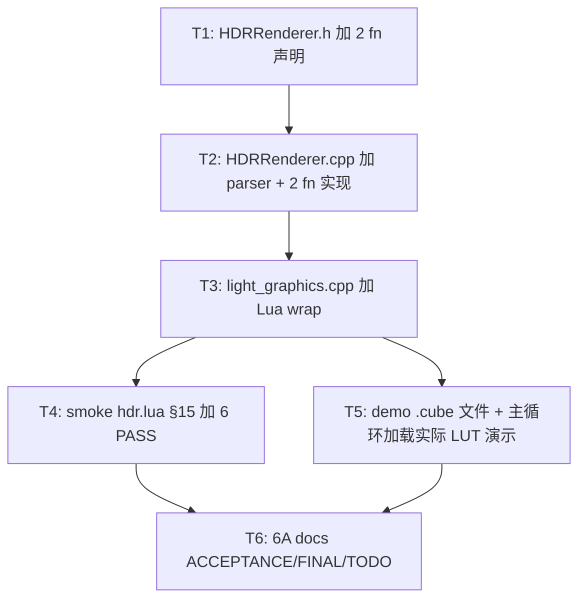

# Phase F.0.10.8.1 — `.cube` LUT 文件解析 TASK

> 6A 工作流 · 阶段 3 (Atomize) · 拆分任务 → 明确接口 → 依赖关系

---

## 任务依赖图

## 子任务原子化

### T1 — `hdr_renderer.h` 加 2 fn 声明 (~0.2h)

**输入契约**: F.0.10.8 已 CreateLUT3D ready

**输出契约**:
- `LoadCubeLUTFile(path, outErr, errCap) → uint32_t`
- `LoadCubeLUTFromString(text, textLen, outErr, errCap) → uint32_t`
- doxygen 注释完整 (含 .cube 格式简介 + 错误情况)

**实现约束**: 与 F.0.10.8 同 namespace, 错误返 0 模式

**验收**: 编译通过

### T2 — `hdr_renderer.cpp` 加 parser 实现 (~1.5h)

**输入契约**: T1 完成 + `<SDL3/SDL.h>` 已 include

**输出契约**:
- `static bool matchKeyword(tok, kw)` helper
- `LoadCubeLUTFromString` 单遍 parser:
  - 行循环 (LF / CRLF / EOF)
  - skip comment + blank
  - 关键字: LUT_3D_SIZE / LUT_1D_SIZE / TITLE / DOMAIN_MIN / DOMAIN_MAX
  - 数据行: strtof × 3 + clamp [0,1] + quantize byte
  - 行尾验证 size^3 == dataRow
- `LoadCubeLUTFile`: SDL_LoadFile + 委托 string 版

**实现约束**:
- 用 std::vector<uint8_t> (RAII, size 64 时 ~768KB 堆分配 OK)
- 不引入 std::stringstream / std::regex (性能 + 编译时间)
- 错误总是写 outErr (caller 无需 fallback)
- 错误 lineNo 1-indexed

**验收**:
- 编译通过
- C++ 单元测 (smoke 间接测试, 不写独立 unit test): 9 测试矩阵 case 全过

### T3 — `light_graphics.cpp` 加 Lua wrap (~0.3h)

**输入契约**: T2 完成

**输出契约**:
- `static int l_HDR_LoadCubeLUT(lua_State* L)`
- 注册到 hdr_funcs[]
- 错误返 nil + err string (与 CreateLUT3D 一致)
- err 缓冲 256 bytes

**实现约束**:
- 不需要新 include (已有 string)
- 与 F.0.10.8 同位置注册

**验收**:
- 编译通过
- Lua 调 `HDR.LoadCubeLUT("nonexistent")` 返 nil + err

### T4 — smoke hdr.lua §15 加 6 PASS (~0.5h)

**输入契约**: T3 完成

**输出契约**:
- 加 §15 .cube LUT loader section: 6+ PASS
  - PASS: LoadCubeLUT 不存在文件返 nil + err
  - PASS: 文件含 LUT_1D_SIZE 返 nil + "1D LUT not supported" err

**注意**:
- smoke 用 `Light.Filesystem` 写 in-memory test fixture 到 tmp 目录, 然后 LoadCubeLUT 读
- 或直接用 unique 文件名在 CWD 创建 tmp .cube 文件 + 测完删除

**验收**: smoke 8 个全 PASS

### T5 — demo .cube 文件 + 实际可视化 (~0.5h)

**输入契约**: T3 完成

**输出契约**:
- 创建 `samples/demo_taa_split2/luts/` 目录
- 写 `red_tint.cube` (4³ size, R channel 增强 = 暖调)
- 写 `blue_tint.cube` (4³ size, B channel 增强 = 冷调)
- demo 主循环加载 + per-region apply (P1 红 LUT vs P2 蓝 LUT)
- demo headless probe 加 1 PASS (LoadCubeLUT 不存在文件)

**实现约束**:
- 4³ identity 仅 64 行数据, 文件 < 2KB
- demo 启动失败时不阻塞 (LUT 加载失败仍渲染, 仅 print warn)

**验收**:
- demo headless probe ≥15 PASS
- demo 实际渲染 (有 GL context) 时 P1/P2 视觉颜色差异

### T6 — 6A docs (~0.2h)

**输入契约**: T4, T5 完成

**输出契约**:
- ACCEPTANCE / FINAL / TODO 文档

**验收**: 6 docs 完整, commit ready

## 拆分原则总结

- **复杂度可控**: 每任务 < 1.5h
- **依赖清晰**: T1 → T2 → T3 → {T4, T5} → T6
- **零回归保障**: 仅加新 fn, 不改任何已有路径
- **测试驱动**: smoke 6 case + demo 1 PASS

## 执行批次

| Sub-Phase | 任务 | 工作量 |
|-----------|------|-------|
| **SP1** (Parser) | T1 → T2 | ~1.7h |
| **SP2** (Lua + smoke + demo + Assess) | T3 → T4 → T5 → T6 | ~1.5h |
| **合计** | | **~3.2h** |

vs ALIGN 估 ~3h. 差异 0.2h 内可接受 (主要 demo 实际可视化 0.5h).
