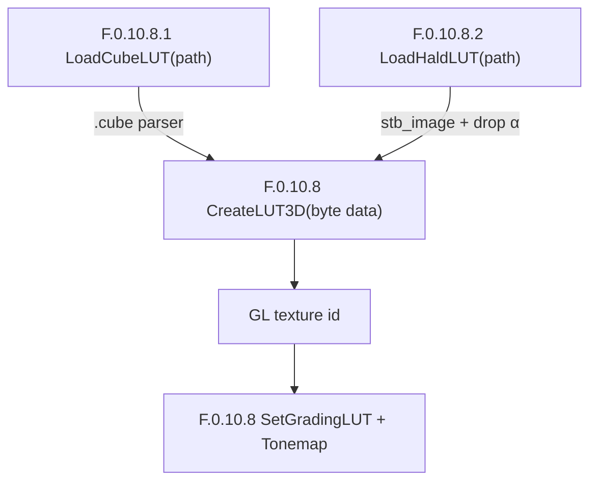

# Phase F.0.10.8.2 — HALD CLUT 图像 LUT 加载 DESIGN

> 6A · 阶段 2 (Architect)

---

## 1. 整体架构

```mermaid
graph LR
    A["HALD .png / .jpg"] -->|stbi_load| B["pixel data RGBA bytes"]
    B -->|drop alpha| C["RGB byte stream"]
    C -->|width^(1/3)=N integer check| D["LUT size = N²"]
    D -->|backend->CreateLUT3D| E["GL 3D texture id"]

    F["HDR.LoadHaldLUT(Lua)"] -->|wrap| A
    E -->|tex_id| F
```

## 2. 接口契约

### 2.1 C++ HDRRenderer

```cpp
namespace HDRRenderer {

/**
 * @brief Phase F.0.10.8.2 — 从 HALD CLUT 图像 (PNG/JPG/BMP/TGA) 加载 3D LUT
 *
 * 内部: stbi_load → 验证方阵 + N³ → drop alpha → CreateLUT3D
 * HALD 标准 (ImageMagick / GIMP / Photoshop "Color Lookup"):
 *   - 图像分辨率 N³ × N³ (level N)
 *   - LUT size = N²
 *   - 像素 raster scan = LUT byte 顺序 (R 最快变, 与 GL 一致)
 *
 * 支持 level N ∈ [2, 8] → LUT size ∈ [4, 64] (与 F.0.10.8 CreateLUT3D 一致)
 *
 * @param path    PNG/JPG/BMP/TGA 文件路径
 * @param outErr  [out] 错误描述
 * @param errCap  outErr 容量
 * @return        tex_id (>0); 0 = 失败
 */
uint32_t LoadHaldLUTFile(const char* path, char* outErr, size_t errCap);

}
```

### 2.2 Lua API

```lua
-- light_graphics.cpp 加 1 fn

HDR.LoadHaldLUT(path) → tex_id, err
```

## 3. parser 算法

### 3.1 流程

```cpp
uint32_t LoadHaldLUTFile(const char* path, char* outErr, size_t errCap) {
    // 1. stb_image decode (强制 4 通道 RGBA)
    int w = 0, h = 0, ch = 0;
    stbi_set_flip_vertically_on_load(0);
    unsigned char* px = stbi_load(path, &w, &h, &ch, 4);
    if (!px) {
        writeErr_(outErr, errCap, "stbi_load failed: %s",
                  stbi_failure_reason() ? stbi_failure_reason() : path);
        return 0u;
    }

    // 2. 验证方阵
    if (w != h) {
        stbi_image_free(px);
        writeErr_(outErr, errCap, "HALD image not square: %dx%d", w, h);
        return 0u;
    }

    // 3. 求 level N: w = N³ ?
    //    HALD level ∈ [2, 8] → w ∈ {8, 27, 64, 125, 216, 343, 512}
    //    用整数立方根
    int N = 0;
    for (int n = 2; n <= 8; ++n) {
        if (n * n * n == w) { N = n; break; }
    }
    if (N == 0) {
        stbi_image_free(px);
        writeErr_(outErr, errCap,
                  "HALD width %d is not N³ for any N ∈ [2,8] (expected: 8, 27, 64, 125, 216, 343, 512)",
                  w);
        return 0u;
    }

    // 4. LUT size
    const int size = N * N;  // N=2→4, N=4→16, N=8→64
    if (size < 4 || size > 64) {
        stbi_image_free(px);
        writeErr_(outErr, errCap,
                  "HALD level %d → LUT size %d out of range [4, 64]", N, size);
        return 0u;
    }

    // 5. RGBA → RGB byte stream (drop alpha)
    //    像素 raster scan = LUT byte 顺序 (R 最快变, 与 GL 一致, 零 reshape)
    const int totalPx = w * h;  // = size^3 ✓
    std::vector<uint8_t> bytes;
    bytes.resize((size_t)totalPx * 3u);
    for (int i = 0; i < totalPx; ++i) {
        bytes[i * 3 + 0] = px[i * 4 + 0];  // R
        bytes[i * 3 + 1] = px[i * 4 + 1];  // G
        bytes[i * 3 + 2] = px[i * 4 + 2];  // B
        // alpha drop
    }
    stbi_image_free(px);

    // 6. backend 创建 GL texture (与 F.0.10.8.1 同模式: backend null 检查 + CreateLUT3D 调用)
    if (!g.backend) {
        writeErr_(outErr, errCap,
                  "HDR backend not initialized (parse ok for size=%d)", size);
        return 0u;
    }
    const uint32_t id = g.backend->CreateLUT3D(size, bytes.data());
    if (id == 0u) {
        writeErr_(outErr, errCap,
                  "backend CreateLUT3D failed (size=%d, GL not ready or OOM)", size);
        return 0u;
    }
    return id;
}
```

### 3.2 关键计算

- **width 验证**: 用循环 N ∈ [2, 8] 直接比较 `N³ == width` (避免浮点 cbrt 精度问题)
- **size = N²**: 4 / 9 / 16 / 25 / 36 / 49 / 64 (7 个值)
  - **过滤**: 仅 4 / 16 / 64 是 power-of-2 友好, 但 9 / 25 / 36 / 49 也合法 (用户自定义 level)
- **像素布局**: HALD pixel(x, y) raster scan **直接 = ** LUT byte order (R 最快)
  - **零 reshape, 仅 alpha drop** ← F.0.10.8.2 性能关键

---

## 4. 数据流

```
[disk PNG/JPG] -- stbi_load(force RGBA) --> [W*H*4 bytes RGBA]
                                                |
                                           [验证方阵 + N³]
                                                |
                                           [size = N²]
                                                |
                                           [drop alpha → W*H*3 bytes RGB]
                                                |
                                           [HDRRenderer::CreateLUT3D]
                                                |
                                           [GL texture id]
```

---

## 5. 测试矩阵

| Test ID | 输入 | 期望 |
|---------|------|------|
| T1 | 不存在文件 | nil + "stbi_load failed" |
| T2 | 非图像文件 (.txt 内容) | nil + "stbi_load failed" |
| T3 | 1×1 BMP (非 HALD) | nil + "width 1 is not N³" |
| T4 | 100×100 PNG (非 HALD) | nil + "width 100 is not N³" |
| T5 | 8×8 BMP HALD level=2 identity | tex_id (or backend null err) |
| T6 | 64×64 BMP HALD level=4 identity | tex_id (or backend null err) |
| T7 | 9×8 矩形 BMP | nil + "image not square" |

## 6. 性能估算

| Level | 像素 | stbi_load | reshape (vector) | total |
|-------|------|-----------|------------------|-------|
| 2 | 64 | < 1ms | < 1ms | < 2ms |
| 4 | 4096 | ~3ms | < 1ms | ~4ms |
| 8 | 262144 | ~50ms | ~5ms | ~55ms |

满足验收 (level 8 < 100ms) ✓

---

## 7. 异常路径

| 阶段 | 异常 | 行为 |
|------|------|-----|
| stbi_load | NULL ret | 立即 return 0 + outErr (含 stbi_failure_reason) |
| 方阵验证 | w ≠ h | free + return 0 |
| level 求解 | 无 N ∈ [2,8] s.t. N³==w | free + return 0 (含 expected list) |
| backend null | g.backend == nullptr | free + return 0 (parse 已成功) |
| backend CreateLUT3D | 返 0 | return 0 (free 已在前面) |

**所有路径 stbi_image_free 必调** (用 RAII guard 或显式 free, 选显式 + 早返 return 模式).

---

## 8. smoke fixture 生成 (Lua 端)

smoke 不依赖 disk 静态资源, 启动时生成 in-memory BMP:

```lua
-- 8×8 HALD level=2 identity BMP (BGR + 14+40 byte header)
local function make_hald2_identity_bmp()
    local size = 4    -- LUT size (N²)
    local W = 8       -- 图像 wide (N³)
    local H = 8
    -- BMP header (54 byte) + pixel data (W*H*3 BGR + row padding to 4)
    -- ...
end
```

**简化方案**: smoke 仅测错误情况 (不存在 / 非 HALD), 不测合法 HALD (避免写复杂 BMP 编码). 合法测试通过 demo 实际加载真 PNG (用户提供).

---

## 9. 与 F.0.10.8 / F.0.10.8.1 集成



3 个入口点 (byte / .cube / HALD image) 共享同一 backend->CreateLUT3D 路径.

---

## 10. 设计原则验证

- ✅ 严格按 ALIGNMENT scope (无 16-bit / sRGB linear / Stripe)
- ✅ 复用 F.0.10.8 backend (零 backend 改动)
- ✅ 复用 F.0.10.8.1 模式 (writeErr_ + backend null 延后检查)
- ✅ 性能预算 (level 8 < 100ms)
- ✅ 测试覆盖 (5+ PASS)
- ✅ 与 stb_image 集成模式 (light_graphics_image.cpp 同款)
