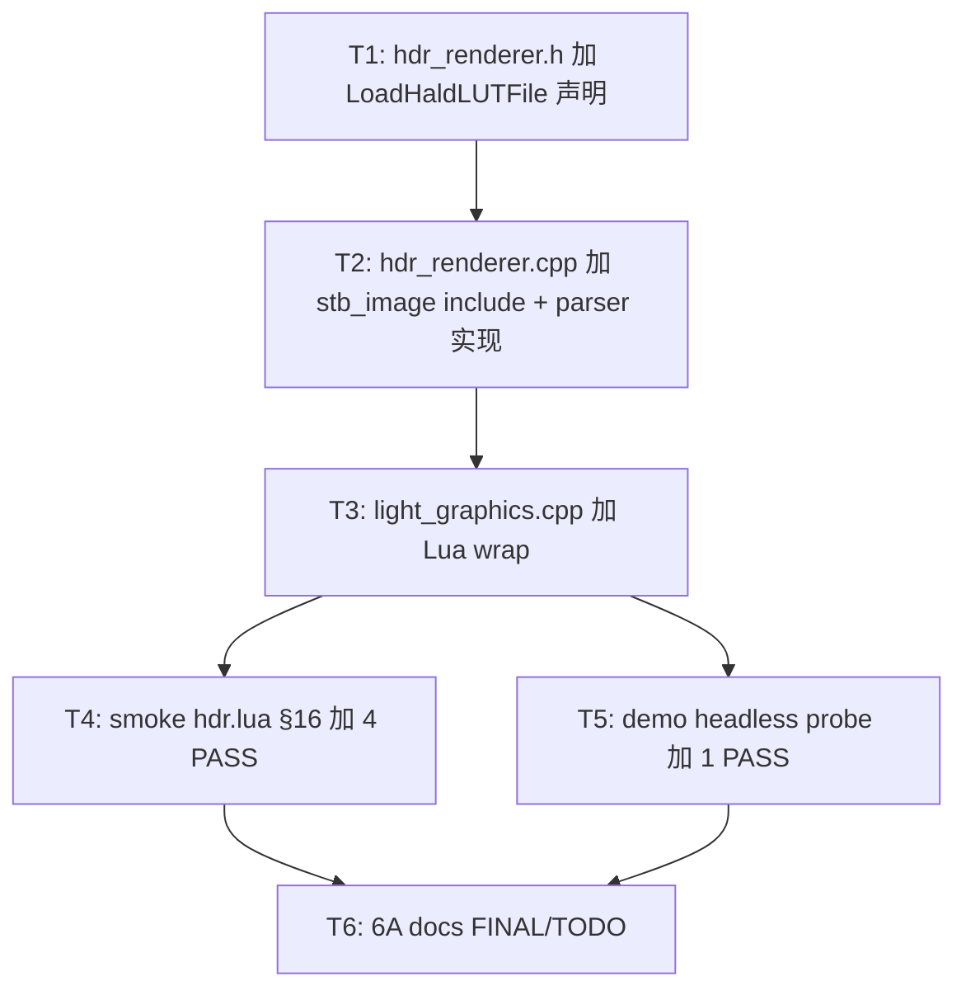

# Phase F.0.10.8.2 — HALD CLUT 图像 LUT TASK

> 6A · 阶段 3 (Atomize)

---

## 任务依赖图

---

## T1 — `hdr_renderer.h` 加 fn 声明 (~0.1h)

**输出**: `LoadHaldLUTFile(path, outErr, errCap) → uint32_t` + 完整 doxygen.

**验收**: 编译通过.

---

## T2 — `hdr_renderer.cpp` 加 stb_image include + parser (~1.0h)

**输入**: T1 完成 + stb_image 在 third_party (实现集中在 stb_impl.c)

**输出**:
- include `"stb_image.h"` (仅声明, 实现已在 stb_impl.c)
- LoadHaldLUTFile 实现 (stbi_load → 验证方阵 → 求 N → drop alpha → CreateLUT3D)
- writeErr_ / backend null 延后检查 复用 F.0.10.8.1 模式

**实现约束**:
- stbi_image_free 必调 (所有错误路径)
- vector<uint8_t> RAII (alpha drop 后释放)
- level 求解用循环 [2, 8] 比较 N³==w (避免浮点)

**验收**:
- 编译通过
- 不存在文件 / 非方阵 / 非 N³ 各种边界正确返 nil + err

---

## T3 — `light_graphics.cpp` 加 Lua wrap (~0.2h)

**输出**:
- `static int l_HDR_LoadHaldLUT(lua_State* L)`
- 注册到 `hdr_funcs[]`
- 错误返 nil + err string (与 F.0.10.8.1 LoadCubeLUT 同模式)
- err buf 256 字节

**验收**: 编译通过 + Lua 调 `HDR.LoadHaldLUT("nonexistent.png")` 返 nil + err.

---

## T4 — smoke hdr.lua §16 加 4 PASS (~0.6h)

**输出**: §16 HALD LUT loader section:
1. PASS: LoadHaldLUT 不存在文件 → "stbi_load failed"
2. PASS: 文本文件 (`Light.IOStream.SaveFile` 写 .txt 当 image) → "stbi_load failed"
3. PASS: 简单 1×1 BMP (in-memory bytes 写 disk) → "width 1 is not N³"
4. PASS: 8×8 BMP HALD level=2 identity → tex_id (or backend not init err)

**约束**:
- BMP 编码 Lua 端 string.char + 32 字节 BMP header → in-memory bytes → SaveFile 写 disk
- 用 require("Light.IOStream") + GetPrefPath 模式 (复用 F.0.10.8.1)
- 不依赖项目静态资源

**验收**: HDR smoke 38 fn (= 37+1) + §16 4 PASS, 8 smoke 零回归.

---

## T5 — demo headless probe 加 1 PASS (~0.2h)

**输出**: demo_taa_split2 main.lua headless probe:
- 加 hasF10_8_2 检测 (`HDR.LoadHaldLUT` 存在)
- 加 PASS: LoadHaldLUT(missing) → "stbi_load failed"

**验收**: demo headless 16 PASS (= 15+1).

---

## T6 — 6A docs (~0.3h)

**输出**: ACCEPTANCE / FINAL / TODO.

**验收**: docs 完整, commit ready.

---

## 执行批次

| Sub-Phase | 任务 | 工作量 |
|-----------|------|-------|
| **SP1** (Parser) | T1 → T2 | ~1.1h |
| **SP2** (Lua + smoke + demo + Assess) | T3 → T4 → T5 → T6 | ~1.3h |
| **合计** | | **~2.4h** |

vs ALIGN 估 ~3.8h, 节约 ~1.4h. 主因: smoke 仅测错误情况 (不写合法 HALD 编码), demo 仅 headless probe 1 PASS.

---

## 拆分原则

- **复杂度可控**: 每任务 < 1h
- **依赖清晰**: T1 → T2 → T3 → {T4, T5} → T6
- **零回归**: 仅加新 fn, 不改既有
- **测试覆盖**: smoke 4 case + demo 1 PASS
