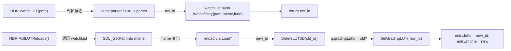
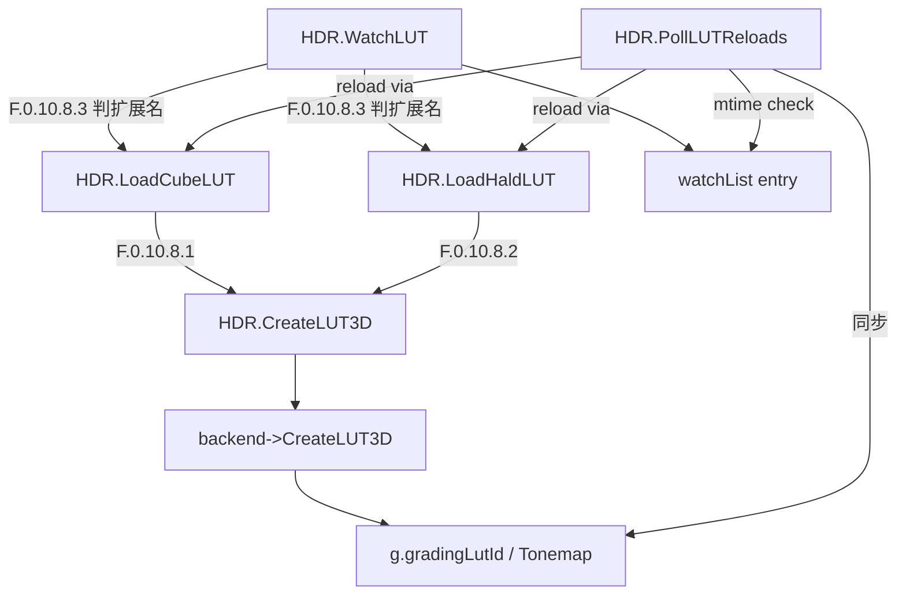

# Phase F.0.10.8.3 — LUT 热重载 DESIGN

> 6A · 阶段 2 (Architect)

---

## 1. 整体架构



## 2. 接口契约

### 2.1 C++ HDRRenderer

```cpp
namespace HDRRenderer {

/// 注册 LUT 文件到 watch list, 内部加载 + 返 GL tex id
/// 自动判扩展名 (.cube → LoadCubeLUTFile; .png/.jpg/.bmp/.tga → LoadHaldLUTFile)
uint32_t WatchLUT(const char* path, char* outErr, size_t errCap);

/// 从 watch list 移除 + DeleteLUT3D
bool UnwatchLUT(uint32_t lutTex);

/// 查询 path 当前 lutId (reload 后 path 不变, id 已变)
uint32_t GetWatchedLUTId(const char* path);

/// 遍历 watch list, 检 mtime 变化 → 重 load + 替换 id + 自动同步 g.gradingLutId
/// 返 reload 成功数 (失败的 entry 保留, 下次再试)
int PollLUTReloads();

/// 全局开关 (关闭后 PollLUTReloads 直接返 0, 不做 mtime 调用)
void SetLUTHotReload(bool enabled);
bool GetLUTHotReload();

}
```

### 2.2 Lua API (6 fn)

```lua
HDR.WatchLUT(path)         → tex_id, err
HDR.UnwatchLUT(tex_id)     → bool
HDR.GetWatchedLUTId(path)  → tex_id or nil
HDR.PollLUTReloads()       → reloaded_count
HDR.SetLUTHotReload(bool)  → (none)
HDR.GetLUTHotReload()      → bool
```

---

## 3. 内部状态扩展

```cpp
// hdr_renderer.cpp namespace { ... } 内加:

struct WatchEntry {
    std::string path;
    SDL_Time    lastMtime = 0;   // SDL_GetPathInfo 返回的 modify_time
    uint32_t    lutId     = 0;   // 当前 GL tex id (reload 时更新)
    bool        isHald    = false;
};

// 加到 State {} 内:
struct State {
    // ... existing fields ...

    bool                    lutHotReload = true;   // F.0.10.8.3 默认开启
    std::vector<WatchEntry> lutWatchList;          // F.0.10.8.3 watch 注册表
};
```

---

## 4. 算法

### 4.1 扩展名判定

```cpp
static bool isImageExt_(const char* path) {
    // 取 path 最后一个 '.' 后缀, 比较 (case-insensitive)
    const char* dot = strrchr(path, '.');
    if (!dot) return false;
    // 简化: tolower 比较常见图像扩展名
    return strcasecmp(dot, ".png") == 0 ||
           strcasecmp(dot, ".jpg") == 0 ||
           strcasecmp(dot, ".jpeg") == 0 ||
           strcasecmp(dot, ".bmp") == 0 ||
           strcasecmp(dot, ".tga") == 0;
}
```

### 4.2 WatchLUT

```cpp
uint32_t WatchLUT(const char* path, char* outErr, size_t errCap) {
    if (!path || !*path) {
        writeErr_(outErr, errCap, "WatchLUT: empty path");
        return 0u;
    }
    // 1. 判格式
    const bool hald = isImageExt_(path);

    // 2. 加载 (复用 F.0.10.8.1 / F.0.10.8.2)
    const uint32_t id = hald
        ? LoadHaldLUTFile(path, outErr, errCap)
        : LoadCubeLUTFile(path, outErr, errCap);
    if (!id) return 0u;

    // 3. 取初始 mtime
    SDL_PathInfo info{};
    SDL_GetPathInfo(path, &info);   // 失败容忍, mtime = 0

    // 4. 注册 (如果已在 list, 先移除避免重复)
    for (auto it = g.lutWatchList.begin(); it != g.lutWatchList.end(); ++it) {
        if (it->path == path) {
            // 已 watch, 删旧 entry + 删旧 GL tex
            if (it->lutId && it->lutId != id) {
                if (g.backend) g.backend->DeleteLUT3D(it->lutId);
            }
            g.lutWatchList.erase(it);
            break;
        }
    }
    g.lutWatchList.push_back({path, info.modify_time, id, hald});
    return id;
}
```

### 4.3 UnwatchLUT

```cpp
bool UnwatchLUT(uint32_t lutTex) {
    if (lutTex == 0u) return false;
    for (auto it = g.lutWatchList.begin(); it != g.lutWatchList.end(); ++it) {
        if (it->lutId == lutTex) {
            if (g.backend) g.backend->DeleteLUT3D(lutTex);
            // 同步: 如果是当前 grading 用的 LUT, 清空
            if (g.gradingLutId == lutTex) g.gradingLutId = 0u;
            g.lutWatchList.erase(it);
            return true;
        }
    }
    return false;
}
```

### 4.4 GetWatchedLUTId

```cpp
uint32_t GetWatchedLUTId(const char* path) {
    if (!path || !*path) return 0u;
    for (auto& e : g.lutWatchList) {
        if (e.path == path) return e.lutId;
    }
    return 0u;
}
```

### 4.5 PollLUTReloads (核心)

```cpp
int PollLUTReloads() {
    if (!g.lutHotReload || g.lutWatchList.empty()) return 0;

    int reloaded = 0;
    char errBuf[256];
    for (auto& e : g.lutWatchList) {
        // 1. 查当前 mtime
        SDL_PathInfo info{};
        if (!SDL_GetPathInfo(e.path.c_str(), &info)) {
            continue;   // 文件暂时不可访问, 下次再试
        }
        if (info.modify_time == e.lastMtime) continue;  // 无变化

        // 2. mtime 变化, 重 load
        errBuf[0] = '\0';
        uint32_t newId = e.isHald
            ? LoadHaldLUTFile(e.path.c_str(), errBuf, sizeof(errBuf))
            : LoadCubeLUTFile(e.path.c_str(), errBuf, sizeof(errBuf));
        if (newId == 0u) {
            // reload 失败 (文件正被写, 内容不完整 etc.), 保留 entry, 下次再试
            CC::Log("[HDR.PollLUTReloads] reload failed: %s — %s",
                    e.path.c_str(), errBuf);
            continue;
        }

        // 3. 替换 id
        const uint32_t oldId = e.lutId;
        e.lutId     = newId;
        e.lastMtime = info.modify_time;

        // 4. 自动同步 g.gradingLutId (如果当前 grading 用的是 oldId)
        if (g.gradingLutId == oldId) g.gradingLutId = newId;

        // 5. 删旧 GL tex
        if (oldId && g.backend) g.backend->DeleteLUT3D(oldId);

        ++reloaded;
    }
    return reloaded;
}
```

### 4.6 SetLUTHotReload / GetLUTHotReload

```cpp
void SetLUTHotReload(bool enabled) { g.lutHotReload = enabled; }
bool GetLUTHotReload() { return g.lutHotReload; }
```

---

## 5. 数据流

```
[启动]
  ↓
HDR.WatchLUT("warm.cube")
  ↓ 内部 LoadCubeLUTFile + SDL_GetPathInfo
  ↓
[watchList += {path, mtime, lutId}]
  ↓
HDR.SetGradingLUT(lutId, 1.0)
  ↓
[主循环每帧]
  ↓
HDR.PollLUTReloads()
  ↓ 遍历 watchList, 比 mtime
  ↓ 变化时: Load* + DeleteOld + Update g.gradingLutId
  ↓
[reloaded_count > 0 → 美术看到新调色]
```

---

## 6. 测试矩阵

| Test ID | 输入 | 期望 |
|---------|------|------|
| T1 | WatchLUT("nonexistent.cube") | nil + "file read failed" |
| T2 | WatchLUT("nonexistent.png") | nil + "stbi_load failed" |
| T3 | WatchLUT(missing) twice | 第二次也 nil (不污染 watchList) |
| T4 | UnwatchLUT(0) | false (silent) |
| T5 | UnwatchLUT(not_in_list) | false (silent) |
| T6 | PollLUTReloads() with empty watchList | 0 |
| T7 | SetLUTHotReload(true/false) round-trip | GetLUTHotReload 一致 |
| T8 | GetWatchedLUTId("not_watched") | nil |

注: T1-T8 都不需要真 reload 测试 (会让 smoke 复杂且不稳定). 真 reload 由 demo / 用户手动测.

---

## 7. 与 F.0.10.8.x 集成



WatchLUT = LoadCubeLUT / LoadHaldLUT 的 "wrapper + 跟踪". 内部完全复用现有 parser. 零 backend 改动.

---

## 8. 异常路径

| 阶段 | 异常 | 行为 |
|------|------|-----|
| WatchLUT 加载失败 | LoadCubeLUT/LoadHaldLUT 返 0 | return 0 (不加入 watchList) |
| WatchLUT 同 path 重复注册 | erase 旧 entry + 新加入 | 旧 GL tex 释放 (避免泄漏) |
| Poll SDL_GetPathInfo 失败 | continue 该 entry | 文件被锁/移动, 下次再试 |
| Poll reload 失败 | continue + log | 文件正在被写, 下次再试 |
| Unwatch 找不到 id | return false | silent (与 DeleteLUT3D 一致) |

---

## 9. 性能估算

- mtime polling: SDL_GetPathInfo 每文件 ~10-50μs (syscall stat). 10 个 watched LUT poll 总 < 1ms.
- reload: 与 LoadCubeLUT/LoadHaldLUT 等价 (各 ~5-55ms 视 level/size).
- 用户调 Poll 频率自己控 (典型每秒 1 次 = 1ms / 60 帧 ~= 0.017ms/帧).
