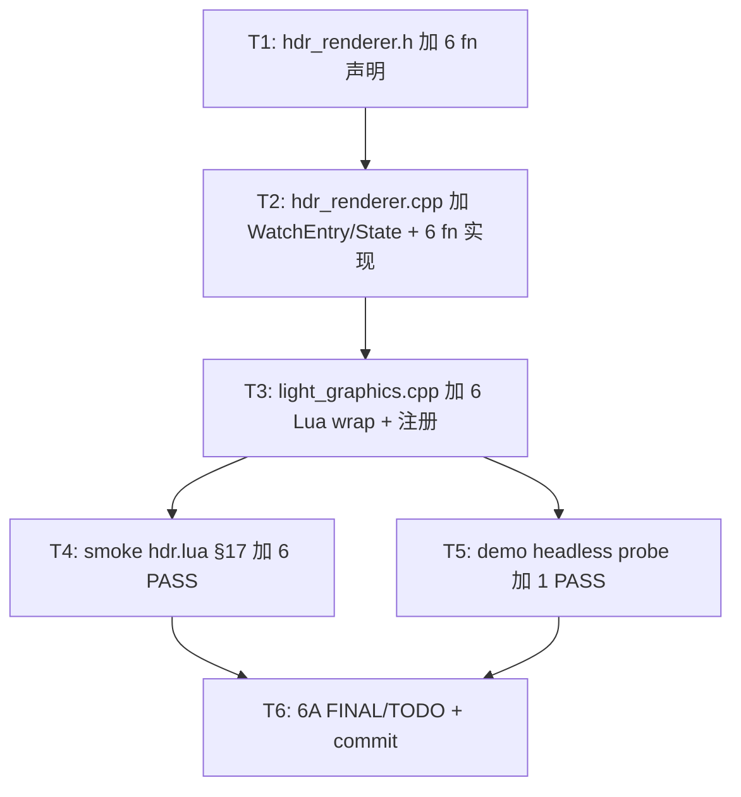

# Phase F.0.10.8.3 — LUT 热重载 TASK

> 6A · 阶段 3 (Atomize)

---

## 任务依赖图

---

## T1 — `hdr_renderer.h` 加 6 fn 声明 (~0.1h)

**输出**: WatchLUT / UnwatchLUT / GetWatchedLUTId / PollLUTReloads / SetLUTHotReload / GetLUTHotReload + 完整 doxygen.

**验收**: 编译通过.

---

## T2 — `hdr_renderer.cpp` 加 WatchEntry + State 字段 + 6 fn 实现 (~1.0h)

**输入**: T1 完成 + SDL_GetPathInfo 可用 (已在 light_filesystem.cpp 使用).

**输出**:
- 加 `WatchEntry { path, lastMtime, lutId, isHald }` (anonymous namespace)
- State 加 `lutHotReload` (默认 true) + `lutWatchList`
- 加 `isImageExt_` helper (扩展名判定)
- 6 fn 实现 (按 DESIGN §4)

**实现约束**:
- `<string>` + `<algorithm>` include
- 复用 LoadCubeLUTFile / LoadHaldLUTFile (零 backend 改动)
- 注意 PollLUTReloads 内的 g.gradingLutId 自动同步
- WatchLUT 重复 path 时去旧 entry (避免泄漏)
- UnwatchLUT 同步清 g.gradingLutId (如果匹配)

**验收**:
- 编译通过
- WatchLUT(missing) 返 0 + outErr 不空
- Watch 同 path 两次不泄漏

---

## T3 — `light_graphics.cpp` 加 6 Lua wrap + 注册 (~0.3h)

**输出**:
- 6 `static int l_HDR_*` 函数
- 注册到 `hdr_funcs[]` (6 行)
- err buf 256 字节

**验收**: 编译通过 + Lua 6 fn 可见.

---

## T4 — smoke hdr.lua §17 加 PASS (~0.6h)

**输出**:
- fn_names 加 6 个新 fn (HDR 38 → 44)
- §17 LUT 热重载 section 6+ PASS:
  1. WatchLUT(missing .cube) → nil + "file read failed"
  2. WatchLUT(missing .png) → nil + "stbi_load failed"
  3. UnwatchLUT(0) → false (silent)
  4. UnwatchLUT(123) → false (id not in list, silent)
  5. PollLUTReloads() with empty list → 0
  6. SetLUTHotReload(true/false) round-trip + GetLUTHotReload 一致
  7. GetWatchedLUTId("not_watched") → nil

**约束**: 不测真 reload (需要 sleep + 改文件, 复杂且不稳定); 那个由 demo / 用户手动测.

**验收**: HDR smoke 44 fn + §17 7 PASS; 8 smoke 零回归.

---

## T5 — demo headless probe 加 1 PASS (~0.1h)

**输出**: demo_taa_split2 main.lua headless probe:
- 加 hasF10_8_3 检测 (`HDR.WatchLUT` 存在)
- 加 PASS: WatchLUT(missing) → nil + err

**验收**: demo headless 17 PASS.

---

## T6 — 6A docs + commit (~0.4h)

**输出**: FINAL / TODO + commit + push.

---

## 执行批次

| Sub-Phase | 任务 | 工作量 |
|-----------|------|-------|
| **SP1** | T1 → T2 | ~1.1h |
| **SP2** | T3 → T4 → T5 → T6 | ~1.4h |
| **合计** | | **~2.5h** |
