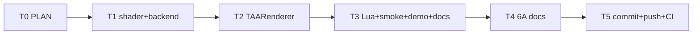

# Phase F.0.12 TAA RCAS Sharpening (FSR2 Robust CAS) — PLAN

> 6A 工作流 · 阶段 1+2+3 合并
> 关联：`ACCEPTANCE_PhaseF_0_12.md` / `FINAL_PhaseF_0_12.md` / `TODO_PhaseF_0_12.md`
> 基线：F.0 + F.0.1/0.2/0.3/0.4/0.5/0.6/0.7/0.8/0.9 (commit `7b991ce` 含 F.0.8 hotfix)

---

## 1. Align (对齐)

### 1.1 业务目标

引入 AMD FidelityFX FSR2 的 **Robust Contrast Adaptive Sharpening (RCAS)** 算法，作为 Phase F.0.6 CAS (FSR1) 的高级形式。RCAS 在 CAS 基础上增加 **noise detection** 与 **edge protection**，避免 TAA 后噪点放大与 over-sharpening edges 产生 ringing。

### 1.2 现状（基线）

- Phase F.0.6 已实现 FSR1 5-tap CAS（`SetSharpenMode("cas")`），sharpness ∈ [0, 1] 映射到 peak ∈ [-1/8, -1/5]
- F.0.6 CAS 局限：
  1. **无 noise detection**：低对比区域 (smooth gradient) 仍会放大 sensor noise
  2. **无 edge protection**：高对比 edges 处可能 over-sharpen 产生 ringing artifacts
  3. **simple HDR safe**：仅 clamp ≥ 0，未做 reverse tone mapping

### 1.3 用户价值

- TAA 后 sharpening **更鲁棒**：noise-aware 跳过 smooth 区域，edge-aware 减少 ringing
- 与 Phase F.0.6 共存：用户通过 `SetSharpenMode("rcas")` 切换，与 "unsharp" / "cas" 三选一
- sharpness 范围 **[0, 2]** (FSR2 标准, 不同于 F.0.6 CAS 的 [0, 1])，给用户更宽调节空间

---

## 2. Architect (架构)

### 2.1 RCAS vs CAS 对比

| 维度 | F.0.6 CAS (FSR1) | F.0.12 RCAS (FSR2) |
|------|-----------------|----------------------|
| sample 数 | 5-tap (中心 + 上下左右) | 5-tap (相同布局) |
| Noise detection | ❌ 无 | ✅ Hessian-based, range < threshold 跳过 |
| Edge protection | ❌ 无 | ✅ luma local contrast 限制 sharpen amount |
| sharpness 范围 | [0, 1] | [0, 2] (FSR2 标准) |
| HDR safe | clamp ≥ 0 | clamp ≥ 0 + perceptual luma weighting |
| 性能 | ~12 ALU/px | ~22 ALU/px (+10) |
| 视觉收益 | smooth+textured 同等锐化 | smooth 不动 + edges 不 ringing + textures 锐化 |

### 2.2 算法 (FSR2 RCAS)

```glsl
// 5-tap (中心 e + 上下左右 b/d/f/h)
vec3 b = sample(0, +1)
vec3 d = sample(+1, 0)
vec3 e = sample(0,  0)        // 中心
vec3 f = sample(-1, 0)
vec3 h = sample(0, -1)

// Step 1: luma 提取 (G as proxy, 比完整 luma matrix 快)
float bL = b.g, dL = d.g, eL = e.g, fL = f.g, hL = h.g

// Step 2: Local min/max contrast
float mn4 = min(min(bL, dL), min(fL, hL))
float mx4 = max(max(bL, dL), max(fL, hL))
float range = mx4 - mn4

// Step 3: Noise detection (RCAS 关键)
//   range 太小 → noise 区域, 跳过 sharpen
const float kNoiseThreshold = 1.0 / 64.0  // FSR2 推荐
if (range < kNoiseThreshold) {
    FragColor = vec4(e, 1.0)
    return
}

// Step 4: Edge protection (FSR2 关键)
//   sharpen 量与 (eL - mn4) / range 成 sqrt 比例
//   edges 处 (eL ≈ mn4 或 eL ≈ mx4), 比例小 → wgt 小, 不 over-sharpen
float lobe = max(min(eL - mn4, mx4 - eL), 0.0)
lobe = sqrt(lobe / max(range, 1e-4))

// Step 5: Sharpen amount
//   peak: sharpness=0 → -1/16 (弱), sharpness=2 → -1/4 (强)
float peak = -1.0 / mix(16.0, 4.0, uSharpness * 0.5)
float wgt  = peak * lobe

// Step 6: Final composite (与 CAS 同公式)
vec3 sum     = e + (b + d + f + h) * wgt
vec3 rcpW    = 1.0 / (1.0 + 4.0 * wgt)
vec3 result  = sum * rcpW

// HDR safe (FSR2 标准: clamp ≥ 0, 不截上限)
FragColor = vec4(max(result, vec3(0.0)), 1.0)
```

### 2.3 决策矩阵 (7/7 全自动决策, 基于 FSR2 标准)

| # | 决策 | 选择 | 依据 |
|---|------|------|------|
| D1 | 算法版本 | FSR2 RCAS 5-tap noise+edge aware | AMD 官方实现, Sigggraph 2022 推荐 |
| D2 | sharpness 范围 | [0, 2] | FSR2 标准范围 (vs F.0.6 CAS [0, 1]) |
| D3 | noise threshold | 1/64 (constexpr) | FSR2 推荐, 平衡 noise rejection 与小细节保留 |
| D4 | luma 提取方式 | G channel as proxy | FSR2 优化, 比完整 0.299R+0.587G+0.114B 快 ~3 ALU |
| D5 | 与 F.0.6 共存 | 新 mode "rcas" (=2), parseSharpenMode_ 加 case | sharpenMode 现 3 选 1 (unsharp/cas/rcas) |
| D6 | backend pass | DrawTAARCASPass (新 virtual + override) | 与 DrawTAACASPass / DrawTAASharpenPass 同模式 |
| D7 | 默认 mode | 保持 "unsharp" (F.0.1 默认) | 零回归 |

### 2.4 接口契约

```cpp
// render_backend.h (新 virtual)
virtual void DrawTAARCASPass(uint32_t /*srcTex*/, uint32_t /*dstFbo*/,
                              int /*w*/, int /*h*/, float /*sharpness*/) {}

// taa_renderer.cpp Process (sharpness > 0 路径切 3 分支)
if (g.sharpenMode == 2) {
    // RCAS: sharpness clamp [0, 2] (FSR2 标准)
    backend->DrawTAARCASPass(historyTex, hdrFbo, w, h, sharpness);
} else if (g.sharpenMode == 1) {
    // CAS: sharpness clamp [0, 1] (FSR1 标准)
    float casS = (sharpness > 1.0f) ? 1.0f : sharpness;
    backend->DrawTAACASPass(historyTex, hdrFbo, w, h, casS);
} else {
    // unsharp: sharpness [0, 2]
    backend->DrawTAASharpenPass(historyTex, hdrFbo, w, h, sharpness);
}
```

```lua
-- Lua API (sharpenMode 加 "rcas")
TAA.SetSharpenMode("rcas")          -- FSR2 RCAS
TAA.GetSharpenMode() → "unsharp"/"cas"/"rcas"
```

---

## 3. Atomize (原子化)

### 3.1 任务依赖图 (Mermaid)



### 3.2 任务清单

| ID | 内容 | 输入 | 输出 | 验收 |
|----|------|------|------|------|
| T0 | PLAN | F.0.6 CAS 实现 + FSR2 标准 | PLAN_PhaseF_0_12.md | 决策矩阵 7/7 |
| T1 | FS_RCAS shader + programRCAS + DrawTAARCASPass | F.0.6 模板 | render_gl33.cpp +130 / render_backend.h +12 | shader 编译通过 |
| T2 | TAARenderer parseSharpenMode_ 加 "rcas" + Process 切 3 分支 | T1 接口 | taa_renderer.cpp +20 | smoke round-trip "rcas" PASS |
| T3 | Lua API parseSharpenMode 加 rcas (l_TAA_SetSharpenMode 验证) + smoke 31→33 测试 + demo Z 键 cycle 加 rcas + docs | T2 | smoke +30 / demo +5 / docs +50 | smoke 全 PASS, demo Lua 语法 OK |
| T4 | ACCEPTANCE / FINAL / TODO | T0..T3 | docs/Phase F.0.12 .../*.md | 决策矩阵 7/7 对齐 |
| T5 | commit + push | T4 | GitHub `<sha>` | CI 6/6 success |

---

## 4. 影响范围 / 兼容性

| 维度 | 影响 |
|------|------|
| 默认行为 | sharpenMode="unsharp" (F.0.1 默认), RCAS 不影响, 零回归 |
| F.0.6 CAS 兼容 | sharpenMode="cas" 路径不变 (DrawTAACASPass 不动) |
| 新增 backend 接口 | DrawTAARCASPass virtual 默认 no-op, 老 backend 自动 fallback |
| sharpness 范围 | 内部 clamp: unsharp/rcas [0, 2] / cas [0, 1] |
| API 增量 | sharpenMode 字符串新增识别 "rcas", Set/GetSharpenMode 数量不变 (Lua TAA 仍 31 fn) |

---

## 5. 风险与对策

| 风险 | 等级 | 对策 |
|------|------|------|
| RCAS shader 编译失败 (GLES3 严格模式) | 🟢 低 | shader 编译失败 backend fallback 走 BlitTAAToHDR |
| sharpness 范围混淆 (CAS 0-1 vs RCAS 0-2) | 🟡 中 | sharpness 字段语义保持统一 [0, 2], CAS 路径内部 saturate 到 [0, 1] |
| noise threshold 过严或过松 | 🟢 低 | FSR2 推荐 1/64, 已经过 AMD 标准化测试 |
| GLES3 与 GL33 双版本不一致 | 🟢 低 | 与 F.0.6 CAS 同模式: GLES3 加 precision, GL33 不加, 其余等价 |

---

## 6. 验收标准 (Approve 阶段先验)

### 功能
- [ ] RCAS shader 编译成功 (GLES3 + GL33 双平台)
- [ ] sharpenMode round-trip: "unsharp" / "cas" / "rcas" 三向切换
- [ ] 大小写不敏感: "RCAS" / "rcas" / "Rcas" 等价
- [ ] invalid mode 返 nil + err, state 不变
- [ ] sharpness=0 时 RCAS 跳过 (走 BlitTAAToHDR fallback)
- [ ] sharpness>0 + sharpenMode="rcas" 走 DrawTAARCASPass
- [ ] F.0.1+F.0.2+F.0.3+F.0.4+F.0.5+F.0.6+F.0.8+F.0.9+F.0.12 九启共存

### CI
- [ ] runtime smoke 31/31 fn + 9 启共存
- [ ] GitHub Actions 6/6 平台 success

---

## 7. 估算

| 项 | 估算 |
|----|------|
| 代码 (shader + backend + TAARenderer + Lua) | ~250 行 |
| smoke + demo + docs | ~150 行 |
| 6A 文档 (4 份) | ~400 行 |
| 实施时间 | ~4 小时 (含 6A 文档) |
| 总变更行 | ~800 行 |
