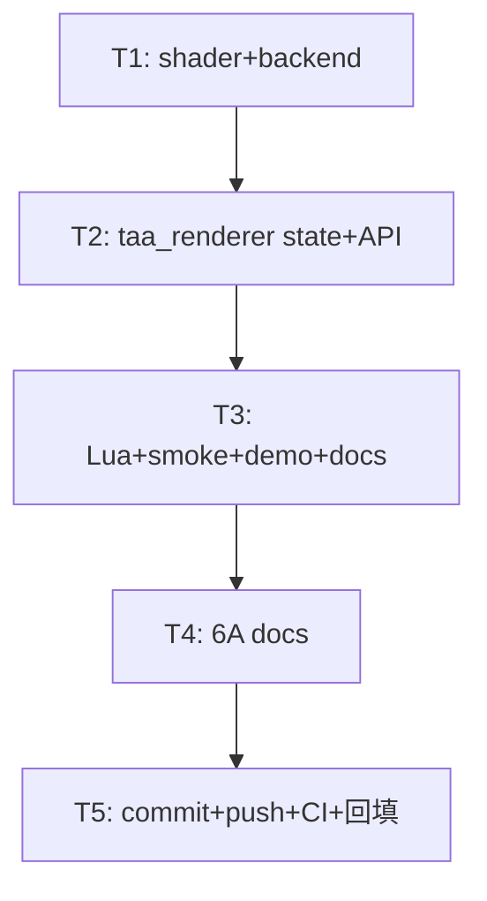

# Phase F.0.4 — TAA Anti-flicker Filter PLAN

> 6A 工作流 · 阶段 1+2+3 (Align+Architect+Atomize) · 单文档精简版
> 关联：`ACCEPTANCE_PhaseF_0_4.md` / `FINAL_PhaseF_0_4.md` / `TODO_PhaseF_0_4.md`
> 基线：Phase F.0 master TAA pipeline (`bc82376`) + Phase F.0.1 Sharpening (`011a549`)

---

## 1. 阶段 1 Align（对齐）

### 1.1 任务定义

为 TAA 主管线加 **anti-flicker filter（防闪烁滤波）**，消除以下两类伪影：

1. **High-frequency luma firefly**：单亮像素在时序累积中被 history 反复 blend，逐帧加剧 → 形成"闪烁噪点"
2. **F.0.1 sharpening 副作用放大**：sharpness>1.0 时 unsharp mask 对高 luma 像素的提亮 → 与 history 累积叠加产生 ringing 闪烁

### 1.2 背景（为什么需要 anti-flicker）

Phase F.0 默认 `alpha=0.92`（history 占 92%），意味着 1 个 firefly 在 history 中"半衰期" ≈ -ln(0.5)/ln(0.92) ≈ **8.3 帧**，相当于 60fps 下闪烁感知约 **140ms**，人眼对其极敏感。

业界经典解决方案是 **Brian Karis（UE4）2014 SIGGRAPH** 提出的 **Luma Weighting**：高 luma 像素在 blend 时降权重，使得"亮 spike"被时序累积"稀释"而非"放大"。

### 1.3 决策矩阵（6/6 自动决策）

| # | 决策点 | 选项 | **决定** | 依据 |
|---|--------|------|---------|------|
| D1 | 算法 | Karis luma weighting / Reinhard tonemap-blend / 3×3 luma clamp | **Karis luma weighting** | UE4/UE5/Inside 业界主流；0 额外 fetch；仅修改 blend 公式 |
| D2 | 集成位置 | 修改 FS_TAA blend / 新增独立 pass | **修改 FS_TAA blend** | 同 shader 内一行公式改造，无新 pass 无新 RT |
| D3 | 默认值 | enabled / disabled | **enabled (true)** | 默认与 F.0.1 sharpening 配合自然；对纯 F.0 行为零回归（用户可关） |
| D4 | API 类型 | bool toggle / float intensity | **bool toggle** | Karis weighting 是 binary 算法，无强度概念；如需 fine-tune 走 F.0.3 variance |
| D5 | 命名 | SetAntiFlicker / SetLumaWeighting / SetTemporalStability | **SetAntiFlicker** | 描述用户感知效果，非算法名 |
| D6 | shader 分支策略 | 永远计算 / `if (uAntiFlicker)` 分支 | **shader 内 if 分支** | uAntiFlicker=0 时跳过 luma 计算，零 ALU 开销 fallback |

### 1.4 与已有 API 的兼容

- **零 API break**：仅新增 2 个 Lua API，不改 13+2=15 原有 API
- **后端虚函数签名修改**：`DrawTAAPass` 加 `int antiFlicker = 1` 参数（带默认值 → 不破坏 legacy fallback）
- **行为兼容**：`SetAntiFlicker(false)` 后 TAA 行为完全等价 Phase F.0 + F.0.1 原始 blend

---

## 2. 阶段 2 Architect（架构）

### 2.1 整体数据流（与 F.0.1 同位置插入）

```
Velocity Sample → Reproject prevUV → Sample hist
                                         ↓
                       9-tap AABB clip (if neighborhoodClip=true)
                                         ↓
            ╔═══════════ Phase F.0.4 ═══════════════╗
            ║ if (uAntiFlicker == 1):               ║
            ║   lumaCur  = dot(cur,  Rec709)        ║
            ║   lumaHist = dot(hist, Rec709)        ║
            ║   wCur  = 1.0 / (1.0 + lumaCur)       ║
            ║   wHist = 1.0 / (1.0 + lumaHist)      ║
            ║   wc = wCur  * (1-α)                  ║
            ║   wh = wHist * α                      ║
            ║   FragColor = (cur*wc + hist*wh) / (wc+wh) ║
            ║ else:                                  ║
            ║   FragColor = mix(cur, hist, α)       ║  ← Phase F.0 原始
            ╚═══════════════════════════════════════╝
                                         ↓
                              写入 history[writeIdx]
                                         ↓
                          (Phase F.0.1 Sharpen Pass 或 Blit)
```

### 2.2 Karis luma weighting 算法详解

```glsl
// Rec.709 luma 系数（与 ACES tonemap 同基准）
float lumaCur  = dot(cur.rgb,  vec3(0.2126, 0.7152, 0.0722));
float lumaHist = dot(hist.rgb, vec3(0.2126, 0.7152, 0.0722));

// 反比例权重: luma 越大权重越小
float wCur  = 1.0 / (1.0 + lumaCur);
float wHist = 1.0 / (1.0 + lumaHist);

// 加权混合，注意权重要包含原 alpha 调控
float alpha = clamp(uBlendAlpha, 0.0, 1.0);
float wc = wCur  * (1.0 - alpha);
float wh = wHist * alpha;
FragColor = vec4((cur.rgb * wc + hist.rgb * wh) / (wc + wh), 1.0);
```

**关键性质**：
- **luma=0 时**：wCur=wHist=1.0 → 等价 `mix(cur, hist, α)` 退化为 F.0 行为（暗部完全保留）
- **luma=10（中等 HDR 高光）时**：wCur=wHist≈0.091，权重相互抵消 → 仍接近 mix 行为
- **luma_hist=100（极端 firefly）时**：wHist≈0.0099 << wCur≈0.091 → history 被有效压制
- **结论**：对低/中等 luma 几乎不改变行为，仅对极端高 luma firefly 起抑制作用 → **零视觉副作用**

### 2.3 Shader 改造范围

**FS_TAA_SOURCE 修改点（GLES3 + GL33 两份对称）**：
- + uniform `int uAntiFlicker`
- + 在 `// blend` 段（line 2161-2162）替换为 if 分支
- 行数增量：每份 +8 行（共 +16 行）

### 2.4 后端接口签名

**`include/render_backend.h` DrawTAAPass**：
```cpp
// Phase F.0.4: + int antiFlicker (0=纯 alpha blend, 1=Karis luma-weighted blend)
virtual void DrawTAAPass(uint32_t curHdrTex, uint32_t historyTex, uint32_t velocityTex,
                          uint32_t dstFbo, int w, int h,
                          float blendAlpha, int neighborhoodClip, int hasHistory,
                          int velocityDilation, float velocityScale, int velocityFormat,
                          int antiFlicker = 1) {}  // ← 默认值 = 不破坏 legacy
```

**`render_gl33.cpp::DrawTAAPass`**：
- + 上传 `uAntiFlicker` uniform
- + `locTAA_AntiFlicker` 在 Init 内 `glGetUniformLocation`
- 行数增量：+3 行

### 2.5 TAARenderer 改造

**`taa_renderer.h`**：
- + `SetAntiFlicker(bool)` / `GetAntiFlicker()` 公共 API
- 行数增量：+8 行（含注释）

**`taa_renderer.cpp`**：
- + `bool antiFlicker = true` state
- + Process 内 `DrawTAAPass(...)` 调用末尾追加 `g.antiFlicker ? 1 : 0`
- + Set/GetAntiFlicker 实现
- 行数增量：+10 行

### 2.6 Lua API

**`light_graphics.cpp`**：
- + `l_TAA_SetAntiFlicker(L)` / `l_TAA_GetAntiFlicker(L)` wrapper
- + `taa_funcs[]` 增 2 项，15 → 17 fn
- 行数增量：+18 行

---

## 3. 阶段 3 Atomize（原子任务）

### T1: backend shader + 接口（~30 min）

**输入契约**：FS_TAA_SOURCE GLES3 + GL33 双源；`include/render_backend.h::DrawTAAPass`；`render_gl33.cpp` programTAA 状态块、Init 编译块、Draw 实现。

**输出契约**：
1. FS_TAA_SOURCE × 2 加 `uAntiFlicker` uniform + if 分支
2. `render_backend.h::DrawTAAPass` 增 `int antiFlicker = 1` 参数（默认 1）
3. `render_gl33.cpp`: + `locTAA_AntiFlicker` 字段 + Init `glGetUniformLocation` + Draw `glUniform1i`

**验收**：shader 编译成功（CI Windows runtime 内 Light.Graphics.TAA.IsSupported() = true）；调用 `DrawTAAPass(..., antiFlicker=0)` 行为与 Phase F.0 完全等价（验证由 T3 smoke 完成）。

### T2: taa_renderer state + 公共 API（~15 min）

**输入契约**：`taa_renderer.h` API 区；`taa_renderer.cpp` state 区 + Process + 参数 setter。

**输出契约**：
1. `taa_renderer.h`: + `void SetAntiFlicker(bool)` + `bool GetAntiFlicker()` 声明 + Phase F.0.4 注释段
2. `taa_renderer.cpp`: + `antiFlicker = true` state 字段；Process 传 `g.antiFlicker ? 1 : 0` 给 `DrawTAAPass`；+ Set/Get 实现

**验收**：smoke `Light.Graphics.TAA.GetAntiFlicker()` 默认返回 `true`；Set/Get round-trip ok。

### T3: Lua API + smoke + demo + docs（~25 min）

**输入契约**：`light_graphics.cpp` taa_funcs[]；`scripts/smoke/taa.lua`；`samples/demo_ssr/main.lua`；`docs/api/Light_Graphics.md`。

**输出契约**：
1. `light_graphics.cpp`: + `l_TAA_SetAntiFlicker` / `l_TAA_GetAntiFlicker` wrapper + `taa_funcs[]` 15→17
2. `taa.lua`: 加 §antiFlicker（surface check / 默认 true / round-trip / coexist with sharpening 4 个 pass）
3. `demo_ssr/main.lua`: 加 `J` 键 toggle anti-flicker + HUD `antiFlicker=ON/OFF` + Keys help 行
4. `Light_Graphics.md`: + Set/GetAntiFlicker 文档段（算法 + 性能 + 推荐配合 sharpening 使用）+ API 速查表 15→17 fn

**验收**：CI Windows runtime smoke 显示新 §antiFlicker 4 PASS + 末尾"Phase F.0 + F.0.1 + F.0.4 TAA smoke: ALL TESTS PASSED"。

### T4: 6A 文档（~15 min）

**输出契约**：
1. `ACCEPTANCE_PhaseF_0_4.md` (~200 行) — 任务完整性 + 决策对齐 + 验收清单 + 性能预期
2. `FINAL_PhaseF_0_4.md` (~180 行) — 交付总结 + 性能基线 + 工程反思 + Phase F.0.x 路线
3. `TODO_PhaseF_0_4.md` (~100 行) — 必做 + 推荐候选 + CI 回填表

### T5: commit + push + CI（~15 min 含等待）

**输出契约**：
1. `feat(F.0.4): TAA anti-flicker — Karis luma weighting blend` commit
2. `gh run view` CI 6/6 平台 success
3. 3 份 6A 文档 §CI 状态回填 (run id + commit + 时长 + 日期)

**总估时**: ~100 分钟（含 CI 等待）

---

## 4. 依赖关系图



线性流水，无并行优化空间（每步依赖前一步的接口/状态稳定）。

---

## 5. 性能预估（1080p）

| 模式 | TAA 主 pass 开销 | 增量 |
|------|------------------|------|
| F.0 baseline (无 F.0.4) | ~0.10 ms | — |
| F.0.4 antiFlicker=false | ~0.10 ms | 0 (shader if 分支跳过) |
| F.0.4 antiFlicker=true  | ~0.11 ms | +0.01 ms (+10%, 2 dot + 4 div + 1 add + 1 div / px) |

**与 sharpening 联动**：F.0.1 sharpness=0.5 + F.0.4 antiFlicker=true 总 TAA 开销 ~0.14 ms @ 1080p（远低于 1 帧预算 16.67 ms 的 1%）。

---

## 6. 风险与回滚

| 风险 | 概率 | 影响 | 缓解 |
|------|------|------|------|
| Karis weighting 在极端低 luma (<0.01) 暗部不可见的影响 | 低 | 暗部接近 mix 行为，差异 < 1/256 LDR 灰阶 | 数学验证：暗部 wCur≈wHist≈1.0 退化为 mix |
| 与 SSR Temporal 同帧累加 anti-flicker | 中 | SSR 反射 + TAA 双重 luma 抑制可能过暗 | 推荐启用 TAA 时关 SSR Temporal（与 F.0 同建议）|
| shader uniform location 未找到（驱动 bug） | 低 | -1 uniform 默认值 = 0 → antiFlicker 关闭 | 不会崩溃，仅退化为 F.0 行为 |
| 后端虚函数签名变更引起 legacy 后端不兼容 | 极低 | 默认参数 = 1，legacy 后端默认实现是 no-op | 已确认 RenderBackend 默认实现 fallback |

**回滚策略**：发现严重伪影时用户调 `SetAntiFlicker(false)` 即可恢复 F.0 行为，0 commit revert 需要。

---

## 7. Phase F.0.x 路线衔接

- **F.0.4（本期）**：Karis luma weighting anti-flicker
- **F.0.5**：half-res history RT (VRAM 优化)
- **F.0.6**：5-tap CAS sharpening (替换 F.0.1 的 4-tap)
- **F.0.2**：YCoCg color-space clip (替换 F.0 的 RGB AABB clip)
- **F.0.3**：Variance clipping (clip 替代算法)
