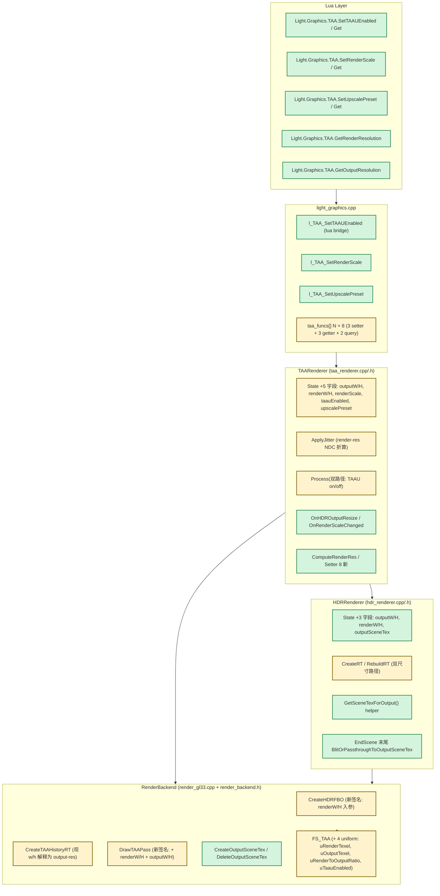
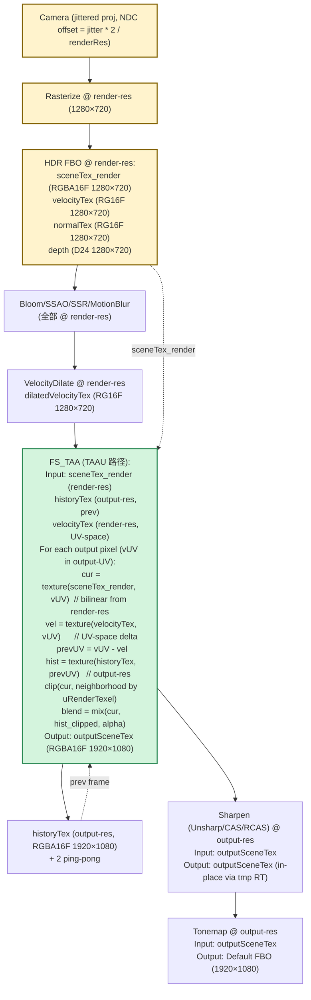
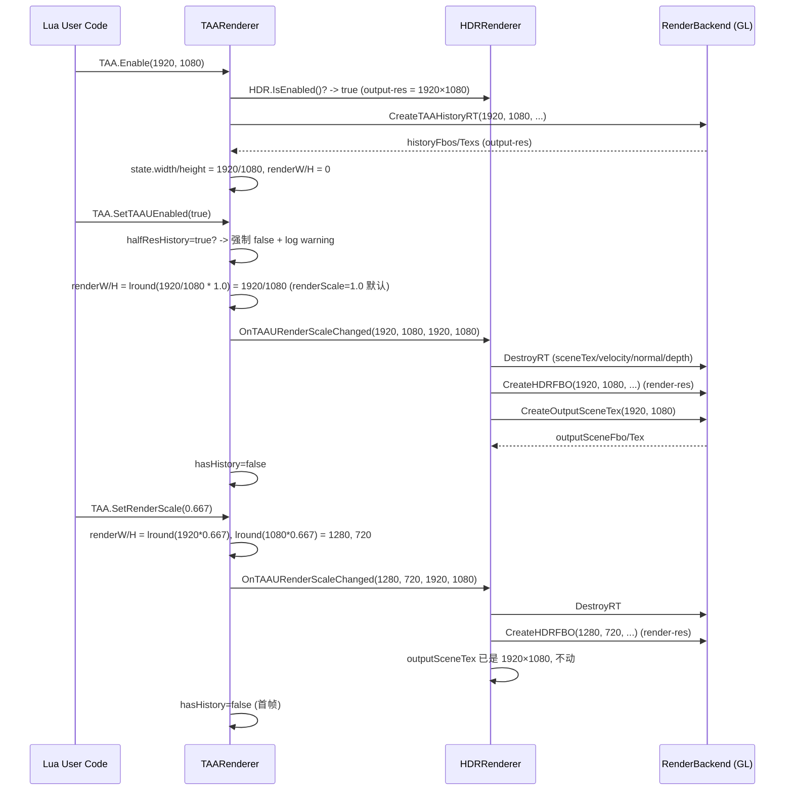
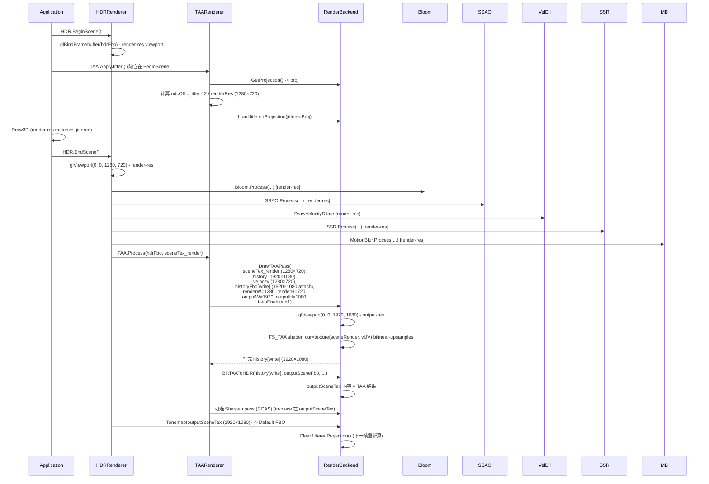

# Phase F.1 TAAU (Temporal Anti-Aliasing Upsampling) — DESIGN 文档

> **阶段**：6A Workflow — 阶段 2 Architect（设计）
> **目标**：CONSENSUS → 系统架构 → 模块设计 → 接口规范 → Shader 规范
> **基线**：ALIGNMENT_PhaseF_1.md（待用户拍板 Q1-Q8，本文预设全推荐组合 A）
> **下一步**：阶段 3 Atomize（TASK_PhaseF_1.md 原子化拆分）
> **创建日期**：2026-05-17

---

## 1. 整体架构图



**图例**：
- 🟢 绿色 = **新增**
- 🟡 黄色 = **修改**

---

## 2. 数据流向图

### 2.1 每帧完整管线（Phase F.1 TAAU 启用，renderScale=0.667）



### 2.2 兼容路径（taauEnabled=false，行为 == Phase F.0）

```
sceneTex_render == sceneTex_output (同一个 RT, output-res)
historyTex 在 output-res
FS_TAA shader 走 uTaauEnabled=0 分支:
  uRenderTexel == uOutputTexel
  cur 采样、邻域、velocity 都在 output-UV / output-pixel 空间
  完全等同 Phase F.0 路径
```

---

## 3. 模块设计

### 3.1 TAARenderer 模块 (`ChocoLight/src/taa_renderer.cpp` + `include/taa_renderer.h`)

#### 3.1.1 State 字段扩展

```cpp
struct State {
    // ─── F.0 既有字段 ───
    RenderBackend* backend;
    bool inited, supported, enabled, autoEnable;
    int width, height;              // F.1 后语义变为 outputW/H (向后兼容)
    int historyW, historyH;         // F.1 后等同 outputW/H (forceful, halfResHistory 关闭)
    uint32_t historyFbos[2], historyTexs[2];
    int historyIdx;
    bool hasHistory;
    // ... 14 F.0 参数

    // ─── F.1 新增字段 ───
    bool  taauEnabled       = false;    // ★ TAAU 总开关
    float renderScale       = 1.0f;     // [0.5, 1.0], 默认 1.0 (等同 F.0)
    int   upscalePreset     = 3;        // 0=Perf / 1=Bal / 2=Qual / 3=Native (默认 Native)
    int   renderW           = 0;        // = lround(outputW * renderScale)
    int   renderH           = 0;        // = lround(outputH * renderScale)
};
```

**注意**：F.0 既有的 `width / height` 字段在 F.1 后语义改为 **outputW/H**（用户从 TAA.Enable(w, h) 传入的 w/h），其值与 F.0 完全一致（不破坏外部读取）。增加 `renderW / renderH` 字段独立追踪渲染分辨率。

#### 3.1.2 新增公开 API

```cpp
// ───────── F.1 TAAU API ─────────

/// TAAU 总开关。默认 false (Phase F.0 行为)。
/// 设为 true 时:
///   - 强制关闭 halfResHistory (Q5 仲裁)
///   - 触发 HDRRenderer 重建 (sceneTex 改为 render-res)
///   - 重置 history (hasHistory=false)
void SetTAAUEnabled(bool flag);
bool GetTAAUEnabled();

/// 渲染分辨率比例, clamp [0.5, 1.0]。默认 1.0。
/// 仅在 taauEnabled=true 时生效; taauEnabled=false 时仍可 set 但不触发重建。
/// renderW = std::max(1, lround(outputW * scale))
/// renderH 同理
void  SetRenderScale(float scale);
float GetRenderScale();

/// 预设档位:
///   "performance" = 0.5    "balanced" = 0.667
///   "quality"     = 0.75   "native"   = 1.0
/// 调用时同步更新 renderScale。
void        SetUpscalePreset(const char* preset);
const char* GetUpscalePreset();   // 返回当前最匹配的预设名 (容差 0.01)

/// 查询当前渲染分辨率 (output * renderScale)
void GetRenderResolution(int* outW, int* outH);
void GetOutputResolution(int* outW, int* outH);
```

#### 3.1.3 ApplyJitter 修改

```cpp
void ApplyJitter() {
    if (!g.enabled || !g.jitterEnabled) return;

    float proj[16];
    g.backend->GetProjection(proj);

    const int j = (int)(g.frameCounter & 7u);
    const float jitterX = kHaltonJitter[j][0];
    const float jitterY = kHaltonJitter[j][1];

    // ★ F.1: jitter 按 render-res 折算 (taauEnabled=false 时 renderW == outputW, 等价 F.0)
    const int jitterW = (g.taauEnabled && g.renderW > 0) ? g.renderW : g.width;
    const int jitterH = (g.taauEnabled && g.renderH > 0) ? g.renderH : g.height;
    const float ndcOffX = jitterX * 2.0f / (float)jitterW;
    const float ndcOffY = jitterY * 2.0f / (float)jitterH;

    float jitteredProj[16];
    memcpy(jitteredProj, proj, sizeof(jitteredProj));
    jitteredProj[8] += ndcOffX;  // column 2, row 0
    jitteredProj[9] += ndcOffY;  // column 2, row 1

    g.backend->LoadJitteredProjection(jitteredProj);
    g.curJitterX = jitterX;
    g.curJitterY = jitterY;
}
```

#### 3.1.4 Process 双路径

```cpp
void Process(uint32_t hdrFbo, uint32_t hdrTex) {
    Process(hdrFbo, hdrTex, 0, 0, 0, 0);
}

void Process(uint32_t hdrFbo, uint32_t hdrTex,
             int rgnX, int rgnY, int rgnW, int rgnH) {
    if (!g.enabled || !g.supported) return;
    // ... 标准自检

    const int writeIdx = g.historyIdx;
    const int readIdx  = 1 - writeIdx;

    // ★ F.1: TAAU 路径 vs F.0 路径
    if (g.taauEnabled) {
        // hdrTex 是 sceneTex_render (render-res), 输出到 outputSceneTex (output-res, 经 historyFbo[write])
        g.backend->DrawTAAPass(hdrTex,
                               g.historyTexs[readIdx],
                               velocityTex,
                               g.historyFbos[writeIdx],
                               g.renderW, g.renderH,          // ★ render-res
                               g.outputW, g.outputH,          // ★ output-res
                               g.blendAlpha,
                               g.neighborhoodClip ? 1 : 0,
                               g.hasHistory ? 1 : 0,
                               velocityDilation,
                               velocityScale, velocityFormat,
                               g.antiFlicker ? 1 : 0,
                               g.clipMode, g.varianceGamma,
                               g.motionGamma,
                               g.motionAdaptiveGamma ? 1 : 0,
                               1 /* uTaauEnabled */,
                               rgnX, rgnY, rgnW, rgnH);

        // history 写入完成. sharpen 路径在 outputSceneTex 上
        // (sharpen 内部已经按 outputSceneTex 尺寸工作, 无需改)
        g.backend->BlitTAAToHDR(g.historyTexs[writeIdx],
                                hdrFbo /* HDR fbo, 但 attach point 改为 outputSceneTex */,
                                g.outputW, g.outputH,
                                g.outputW, g.outputH,
                                rgnX, rgnY, rgnW, rgnH);
    } else {
        // F.0 路径: hdrTex 与 history 同尺寸 (output-res, F.0 既有逻辑)
        g.backend->DrawTAAPass(hdrTex,
                               g.historyTexs[readIdx],
                               velocityTex,
                               g.historyFbos[writeIdx],
                               g.width, g.height,             // ★ 单尺寸 (output-res)
                               g.width, g.height,             // ★ 同上
                               // ... 其他参数同上
                               0 /* uTaauEnabled = 0 */,
                               rgnX, rgnY, rgnW, rgnH);

        g.backend->BlitTAAToHDR(g.historyTexs[writeIdx], hdrFbo,
                                g.width, g.height,
                                g.width, g.height,
                                rgnX, rgnY, rgnW, rgnH);
    }

    // 通用 sharpen 路径 (在 sceneTex / outputSceneTex 上, sharpen 自动按 dstW/H 工作)
    if (g.sharpness > 0.0f) {
        // 走 unsharp / cas / rcas 分支
    }

    g.historyIdx = readIdx;
    g.hasHistory = true;
    ++g.frameCounter;
}
```

#### 3.1.5 SetTAAUEnabled 实现细节（含 Q5 仲裁）

```cpp
void SetTAAUEnabled(bool flag) {
    if (g.taauEnabled == flag) return;

    g.taauEnabled = flag;

    if (flag) {
        // Q5 仲裁: TAAU + HalfResHistory 互斥
        if (g.halfResHistory) {
            g.halfResHistory = false;
            CC::Log(CC::LOG_WARN,
                    "TAARenderer: TAAU 启用, 自动关闭 HalfResHistory (Q5 仲裁)");
        }

        // 重算 renderW/H (基于当前 outputW/H + renderScale)
        g.renderW = std::max(1, (int)std::lround(g.width  * g.renderScale));
        g.renderH = std::max(1, (int)std::lround(g.height * g.renderScale));

        // 通知 HDRRenderer 重建 (sceneTex/velocity 改 render-res, 新增 outputSceneTex)
        HDRRenderer::OnTAAURenderScaleChanged(g.renderW, g.renderH,
                                              g.width, g.height);
    } else {
        // 关 TAAU: 通知 HDR 回退单尺寸 (sceneTex 回 output-res)
        g.renderW = 0;
        g.renderH = 0;
        HDRRenderer::OnTAAUDisabled();
    }

    // 重置 history (避免新旧路径 history 混用)
    g.hasHistory = false;
    g.historyIdx = 0;
    g.frameCounter = 0;
}
```

### 3.2 HDRRenderer 模块 (`ChocoLight/src/hdr_renderer.cpp` + `include/hdr_renderer.h`)

#### 3.2.1 State 字段扩展

```cpp
struct State {
    // ─── F.0 既有 ───
    int width, height;          // F.1 后语义为 outputW/H (用户 Enable 入参)
    uint32_t fbo;               // HDR FBO (size = renderW × renderH 当 TAAU enabled)
    uint32_t sceneTex;          // F.1 后是 render-res sceneTex (当 TAAU enabled)
    uint32_t velocityTex, cameraVelocityTex;  // render-res
    uint32_t normalTex;         // render-res
    // ... dilation RT, AE state etc.

    // ─── F.1 新增 ───
    int      renderW           = 0;        // 当 TAAU disabled 时 = width
    int      renderH           = 0;        // 当 TAAU disabled 时 = height
    bool     taauActive        = false;    // 由 TAARenderer 通知
    uint32_t outputSceneFbo    = 0;        // ★ output-res sceneTex (仅 TAAU enabled 时分配)
    uint32_t outputSceneTex    = 0;
};
```

#### 3.2.2 新增内部接口

```cpp
// 由 TAARenderer 调用, 通知尺寸变化
void OnTAAURenderScaleChanged(int renderW, int renderH, int outputW, int outputH);
void OnTAAUDisabled();

// 查询当前应该送给 Sharpen/Tonemap 的 sceneTex (output-res 还是 render-res)
uint32_t GetSceneTexForOutput();

// 内部 helper
static void DestroyOutputSceneTex();
static bool AllocateOutputSceneTex(int outputW, int outputH);
```

#### 3.2.3 RT 重建路径

```cpp
void OnTAAURenderScaleChanged(int newRenderW, int newRenderH, int outputW, int outputH) {
    if (!g.enabled) return;

    g.taauActive = true;
    g.renderW = newRenderW;
    g.renderH = newRenderH;
    // g.width/height 已经是 outputW/H

    // 重建 sceneTex / velocity / normal / depth 为 render-res
    DestroyRT();
    if (!CreateRT(newRenderW, newRenderH)) {
        CC::Log(CC::LOG_ERROR, "HDRRenderer: TAAU render-res RT 重建失败");
        g.taauActive = false;
        return;
    }

    // 创建 output-res sceneTex (sharpen/tonemap 用)
    if (!AllocateOutputSceneTex(outputW, outputH)) {
        CC::Log(CC::LOG_ERROR, "HDRRenderer: outputSceneTex 分配失败");
    }
}

void OnTAAUDisabled() {
    g.taauActive = false;
    DestroyOutputSceneTex();
    // 重建 sceneTex 为 output-res
    DestroyRT();
    CreateRT(g.width, g.height);
    g.renderW = g.renderH = 0;
}

uint32_t GetSceneTexForOutput() {
    return g.taauActive ? g.outputSceneTex : g.sceneTex;
}
```

#### 3.2.4 EndScene 修改

EndScene 内部所有 sharpen / tonemap 路径，将 sceneTex 引用替换为 `GetSceneTexForOutput()`：

```cpp
void EndScene() {
    // ... bloom / SSAO / SSR / MotionBlur 路径 (作用于 g.sceneTex, 即 render-res)

    if (g.taauActive) {
        // TAA pass 已经写到 outputSceneTex (via DrawTAAPass + BlitTAAToHDR)
    }

    // Sharpen / Tonemap 用 GetSceneTexForOutput()
    const uint32_t sceneTexForOutput = GetSceneTexForOutput();
    const int     dstW = g.taauActive ? g.width  : g.renderW;  // ?? 写错!
    // 正确:
    const int outputW = g.width;
    const int outputH = g.height;

    if (g.tonemapEnabled) {
        backend->Tonemap(sceneTexForOutput, g.exposure, g.gamma, g.tonemapMode,
                          outputW, outputH);
    }
}
```

### 3.3 RenderBackend 接口 (`ChocoLight/include/render_backend.h` + `src/render_gl33.cpp`)

#### 3.3.1 新增 / 修改虚函数

```cpp
// ───────── F.1 修改 ─────────

// 沿用现签名 (向后兼容); w/h 由调用方解释:
//   - F.0 模式: w/h = output-res (sceneTex 与 history 同尺寸)
//   - F.1 模式: 调用方传 renderW/H 创建 HDR FBO (sceneTex render-res)
virtual uint32_t CreateHDRFBO(int w, int h, uint32_t* outTex,
                              uint32_t* outNormalTex,
                              uint32_t* outVelocityTex,
                              VelocityFormat velocityFormat,
                              uint32_t* outCameraVelocityTex) override;

// 沿用现签名; w/h = output-res (history 一律 output-res)
virtual bool CreateTAAHistoryRT(int w, int h,
                                 uint32_t* fbos, uint32_t* texs) override;

// ★ 新签名: 增 renderW/H + outputW/H + uTaauEnabled
virtual void DrawTAAPass(uint32_t curHdrTex,        // F.1: render-res sceneTex (TAAU mode)
                         uint32_t historyTex,       // F.1: output-res
                         uint32_t velocityTex,      // render-res
                         uint32_t dstFbo,           // output-res (history fbo)
                         int renderW, int renderH,  // ★ F.1: render-res
                         int outputW, int outputH,  // ★ F.1: output-res (== renderW/H 当 TAAU disabled)
                         float blendAlpha,
                         int neighborhoodClip, int hasHistory,
                         bool velocityDilation,
                         float velocityScale, VelocityFormat velocityFormat,
                         int antiFlicker, int clipMode, float varianceGamma,
                         float motionGamma, int motionAdaptiveGamma,
                         int taauEnabled,           // ★ F.1: 0 = F.0 行为, 1 = TAAU
                         int rgnX = 0, int rgnY = 0, int rgnW = 0, int rgnH = 0,
                         const float* uvBounds = nullptr) override;

// ───────── F.1 新增 ─────────

// 创建 output-res sceneTex (TAAU 模式下用作 sharpen/tonemap 输入)
virtual bool CreateOutputSceneTex(int w, int h, uint32_t* outFbo, uint32_t* outTex) {
    return false;  // default no-op (legacy backend)
}
virtual void DeleteOutputSceneTex(uint32_t fbo, uint32_t tex) {}
```

#### 3.3.2 DrawTAAPass 实现 (render_gl33.cpp)

```cpp
void DrawTAAPass(uint32_t curHdrTex, uint32_t historyTex,
                 uint32_t velocityTex, uint32_t dstFbo,
                 int renderW, int renderH,
                 int outputW, int outputH,
                 float blendAlpha, int neighborhoodClip, int hasHistory,
                 bool velocityDilation, float velocityScale,
                 VelocityFormat velocityFormat,
                 int antiFlicker, int clipMode, float varianceGamma,
                 float motionGamma, int motionAdaptiveGamma,
                 int taauEnabled,
                 int rgnX, int rgnY, int rgnW, int rgnH,
                 const float* uvBounds) override {

    glBindFramebuffer(GL_FRAMEBUFFER, dstFbo);
    glViewport(0, 0, outputW, outputH);
    if (rgnW > 0 && rgnH > 0) {
        glEnable(GL_SCISSOR_TEST);
        glScissor(rgnX, rgnY, rgnW, rgnH);
    }

    glUseProgram(programTAA);

    // Bind textures
    glActiveTexture(GL_TEXTURE0); glBindTexture(GL_TEXTURE_2D, curHdrTex);
    glActiveTexture(GL_TEXTURE1); glBindTexture(GL_TEXTURE_2D, historyTex);
    glActiveTexture(GL_TEXTURE2); glBindTexture(GL_TEXTURE_2D, velocityTex);

    // ── F.1 新增 uniforms ──
    glUniform2f(locTAA_RenderTexel, 1.0f / renderW, 1.0f / renderH);
    glUniform2f(locTAA_OutputTexel, 1.0f / outputW, 1.0f / outputH);
    glUniform2f(locTAA_RenderToOutputRatio,
                (float)renderW / outputW, (float)renderH / outputH);
    glUniform1i(locTAA_TaauEnabled, taauEnabled);

    // F.0 既有 uniforms (uTexel 兼容: TAAU 关闭时与 F.0 一致)
    glUniform2f(locTAA_Texel, 1.0f / renderW, 1.0f / renderH);  // 即 uRenderTexel
    // ... 其他 14 项 uniforms

    DrawFullscreenTriangle();

    if (rgnW > 0 && rgnH > 0) glDisable(GL_SCISSOR_TEST);
}
```

### 3.4 FS_TAA Shader 改造规范

#### 3.4.1 新增 Uniforms

```glsl
// ───── F.1 新增 ─────
uniform vec2  uRenderTexel;        // 1.0 / (renderW, renderH)
uniform vec2  uOutputTexel;        // 1.0 / (outputW, outputH)
uniform vec2  uRenderToOutputRatio; // renderRes / outputRes (e.g. 0.667 when scale=2/3)
uniform int   uTaauEnabled;        // 0 = F.0 行为, 1 = TAAU 路径

// uTexel 保留作为 cur 邻域采样步长 (TAAU 模式下 == uRenderTexel)
```

#### 3.4.2 Main 函数核心改动

```glsl
void main() {
    // vUV in [0, 1]; 在 F.0 路径下是 sceneTex UV (output-res 等同),
    // 在 F.1 路径下是 outputSceneTex UV (output-res)

    // ① cur 采样: TAAU 路径自动从 render-res sceneTex bilinear 上采样
    vec4 cur = texture(uCurHdrTex, vUV);  // 不变, bilinear 在 render-res 上采样

    if (uHasHistory == 0) {
        FragColor = cur;
        return;
    }

    // ② velocity 采样 (UV-space, render-res 与 output-res 通用)
    vec2 velocity = SampleVelocity(vUV);
    vec2 prevUV   = vUV - velocity;

    // ③ history reproject (history 在 output-res, prevUV 直接可用)
    vec4 hist = texture(uHistoryTex, ClampUV(prevUV));

    // ④ neighborhood clip
    //    F.0: 邻域 step = uTexel (output-res = render-res)
    //    F.1: 邻域 step = uRenderTexel (因为邻域是 cur 邻域, cur 是 render-res)
    vec2 neighborStep = (uTaauEnabled == 1) ? uRenderTexel : uTexel;

    if (uNeighborhoodClip == 1) {
        if (uClipMode == 2) {
            // Variance clip (Salvi 2016) - 9-tap mean / variance
            vec3 m1 = vec3(0.0), m2 = vec3(0.0);
            for (int dy = -1; dy <= 1; ++dy) {
                for (int dx = -1; dx <= 1; ++dx) {
                    vec3 s = texture(uCurHdrTex, vUV + neighborStep * vec2(dx, dy)).rgb;
                    vec3 yc = RGBToYCoCg(s);
                    m1 += yc; m2 += yc * yc;
                }
            }
            m1 /= 9.0; m2 /= 9.0;
            vec3 sigma = sqrt(max(vec3(0.0), m2 - m1 * m1));
            float gamma = uVarianceGamma;
            // Motion-adaptive (F.0.8)
            if (uMotionAdaptiveGamma == 1) {
                float speed = length(velocity) * 100.0;  // amplification
                gamma = mix(uVarianceGamma, uMotionGamma, clamp(speed, 0.0, 1.0));
            }
            vec3 mn = m1 - sigma * gamma;
            vec3 mx = m1 + sigma * gamma;
            vec3 hyc = RGBToYCoCg(hist.rgb);
            hyc = clamp(hyc, mn, mx);
            hist.rgb = YCoCgToRGB(hyc);
        } else if (uClipMode == 1) {
            // YCoCg AABB
            // ... 同 F.0 但 step 改 neighborStep
        } else {
            // RGB AABB
            // ... 同 F.0 但 step 改 neighborStep
        }
    }

    // ⑤ blend (alpha + 可选 Karis luma weighting)
    float alpha = clamp(uBlendAlpha, 0.0, 1.0);
    if (uAntiFlicker == 1) {
        // Karis weight
        float luma_cur  = dot(cur.rgb,  vec3(0.299, 0.587, 0.114));
        float luma_hist = dot(hist.rgb, vec3(0.299, 0.587, 0.114));
        float w_cur     = 1.0 / (1.0 + luma_cur);
        float w_hist    = alpha / (1.0 + luma_hist);
        FragColor = (cur * w_cur + hist * w_hist) / (w_cur + w_hist);
    } else {
        FragColor = mix(cur, hist, alpha);
    }
}
```

**关键改动总结**：
1. cur 邻域采样步长由 `uTexel` 改为 `neighborStep`（TAAU 下用 render-res texel）
2. 其他逻辑（reproject / clip / blend）**完全不变** —— 因为 velocity 是 UV-space delta，history 与 vUV 同尺寸（output-res）
3. uTaauEnabled=0 时 `neighborStep == uTexel`（F.0 行为完全一致）

### 3.5 Lua Bridge (`ChocoLight/src/light_graphics.cpp`)

新增 6 条 Lua 函数 + 2 条查询：

```cpp
// l_TAA_SetTAAUEnabled / l_TAA_GetTAAUEnabled
static int l_TAA_SetTAAUEnabled(lua_State* L) {
    bool flag = lua_toboolean(L, 1) != 0;
    TAARenderer::SetTAAUEnabled(flag);
    return 0;
}
static int l_TAA_GetTAAUEnabled(lua_State* L) {
    lua_pushboolean(L, TAARenderer::GetTAAUEnabled() ? 1 : 0);
    return 1;
}

// l_TAA_SetRenderScale / l_TAA_GetRenderScale
static int l_TAA_SetRenderScale(lua_State* L) {
    float s = (float)luaL_checknumber(L, 1);
    TAARenderer::SetRenderScale(s);  // clamp 在内部
    return 0;
}
static int l_TAA_GetRenderScale(lua_State* L) {
    lua_pushnumber(L, TAARenderer::GetRenderScale());
    return 1;
}

// l_TAA_SetUpscalePreset / l_TAA_GetUpscalePreset
static int l_TAA_SetUpscalePreset(lua_State* L) {
    const char* p = luaL_checkstring(L, 1);
    TAARenderer::SetUpscalePreset(p);
    return 0;
}
static int l_TAA_GetUpscalePreset(lua_State* L) {
    lua_pushstring(L, TAARenderer::GetUpscalePreset());
    return 1;
}

// l_TAA_GetRenderResolution / l_TAA_GetOutputResolution
static int l_TAA_GetRenderResolution(lua_State* L) {
    int w, h;
    TAARenderer::GetRenderResolution(&w, &h);
    lua_pushinteger(L, w);
    lua_pushinteger(L, h);
    return 2;
}
static int l_TAA_GetOutputResolution(lua_State* L) {
    int w, h;
    TAARenderer::GetOutputResolution(&w, &h);
    lua_pushinteger(L, w);
    lua_pushinteger(L, h);
    return 2;
}

// 注册到 taa_funcs[]:
//   {"SetTAAUEnabled",        l_TAA_SetTAAUEnabled},
//   {"GetTAAUEnabled",        l_TAA_GetTAAUEnabled},
//   {"SetRenderScale",        l_TAA_SetRenderScale},
//   {"GetRenderScale",        l_TAA_GetRenderScale},
//   {"SetUpscalePreset",      l_TAA_SetUpscalePreset},
//   {"GetUpscalePreset",      l_TAA_GetUpscalePreset},
//   {"GetRenderResolution",   l_TAA_GetRenderResolution},
//   {"GetOutputResolution",   l_TAA_GetOutputResolution},
```

---

## 4. 时序图

### 4.1 启用 TAAU 的初始化序列



### 4.2 每帧 Process 时序 (TAAU 启用)



---

## 5. 接口契约规范

### 5.1 输入校验与 Clamp

| Setter | 输入约束 | Clamp / 拒绝行为 |
|---|---|---|
| `SetTAAUEnabled(bool)` | bool | 直接赋值; 若 supported==false 则 log warning + 不生效 |
| `SetRenderScale(float)` | [0.5, 1.0] | `std::clamp(s, 0.5f, 1.0f)`，越界 log info（非 error） |
| `SetUpscalePreset(const char*)` | "performance" / "balanced" / "quality" / "native" | 未知字符串 → log warning + 不生效 |

### 5.2 失败/降级路径

| 触发条件 | 行为 |
|---|---|
| Backend `SupportsTAA() == false` | TAAU 永不激活，所有 setter 静默 no-op |
| `outputSceneTex` 分配失败 (OOM) | TAAU 自动回退到 F.0 路径 + log error + `taauActive = false` |
| HDR 未启用 | TAA.Enable 失败（与 F.0 一致） |
| renderScale × outputW < 1 | renderW = 1 (clamp)，log info |

### 5.3 多 Instance 行为

每个 instance 独立的字段：
- `taauEnabled` / `renderScale` / `upscalePreset` / `renderW` / `renderH`
- 共享：backend / supported / 全局 jitter table (kHaltonJitter)

**Multi-Instance × TAAU 限制**：HDRRenderer 当前是多 instance（每 instance 独立 HDR FBO）。TAA instance 与 HDR instance 1:1 映射（同 `g_active` 索引）。每个 HDR instance 独立维护 renderW/H 与 outputSceneTex。

---

## 6. 文件改动清单

| 文件 | 改动类型 | 主要内容 |
|---|---|---|
| `ChocoLight/include/render_backend.h` | 修改 | DrawTAAPass 签名扩展 (+ renderW/H + outputW/H + taauEnabled); 新增 CreateOutputSceneTex / DeleteOutputSceneTex |
| `ChocoLight/src/render_gl33.cpp` | 修改 | FS_TAA shader 增 4 uniform; DrawTAAPass 实现; OutputSceneTex backend 实现 |
| `ChocoLight/include/hdr_renderer.h` | 修改 | OnTAAURenderScaleChanged / OnTAAUDisabled / GetSceneTexForOutput 声明 |
| `ChocoLight/src/hdr_renderer.cpp` | 修改 | State +3 字段; CreateRT/RebuildRT 双尺寸路径; EndScene 内 sharpen/tonemap 改用 GetSceneTexForOutput; 多 instance 同步 |
| `ChocoLight/include/taa_renderer.h` | 修改 | 6 新公开 API 声明 (SetTAAUEnabled / SetRenderScale / SetUpscalePreset/ GetRenderResolution / GetOutputResolution + getter) |
| `ChocoLight/src/taa_renderer.cpp` | 修改 | State +5 字段; ApplyJitter 用 render-res NDC; Process 双路径; SetTAAUEnabled 含 Q5 仲裁; CloneInstance 复制新字段 |
| `ChocoLight/src/light_graphics.cpp` | 修改 | 8 新 Lua bridge 函数 + taa_funcs[] 注册 |
| `scripts/smoke/taa.lua` | 修改 | +6-8 检查点 (Surface / Default / Clamp / Round-trip / Preset-Scale-sync) |
| `samples/demo_taau/main.lua` | 新增 | TAAU 演示 demo (renderScale 切换 + HUD 显示 render/output res) |
| `samples/demo_taau/README.md` | 新增 | 键位 + renderScale 描述 |
| `docs/Phase F.1 TAAU/*.md` | 新增 | 7 件套 (ALIGNMENT 已存, DESIGN 当前文件, +CONSENSUS/TASK/ACCEPTANCE/FINAL/TODO) |
| `docs/api/Light_Graphics.md` | 修改 | TAA 子表 +8 函数文档 |
| `CHANGELOG.md` | 修改 | Phase F.1 入口 |
| `README.md` | 修改 | 主特性表新增 TAAU |

---

## 7. 测试设计

### 7.1 Smoke 增量 (scripts/smoke/taa.lua)

```lua
-- Phase F.1 TAAU surface
local taau_fns = {
    "SetTAAUEnabled", "GetTAAUEnabled",
    "SetRenderScale", "GetRenderScale",
    "SetUpscalePreset", "GetUpscalePreset",
    "GetRenderResolution", "GetOutputResolution",
}
for _, fn in ipairs(taau_fns) do
    if type(TAA[fn]) ~= "function" then fail("TAA." .. fn .. " missing") end
end
pass("TAA F.1 8 functions surface")

-- Default values
assert(TAA.GetTAAUEnabled() == false)
assert(math.abs(TAA.GetRenderScale() - 1.0) < 0.001)
assert(TAA.GetUpscalePreset() == "native")
pass("TAA F.1 defaults (TAAU=false, scale=1.0, preset=native)")

-- Clamp
TAA.SetRenderScale(0.3); assert(TAA.GetRenderScale() >= 0.5)
TAA.SetRenderScale(2.0); assert(TAA.GetRenderScale() <= 1.0)
pass("TAA F.1 SetRenderScale clamp [0.5, 1.0]")

-- Preset ↔ scale 双向同步
TAA.SetUpscalePreset("balanced")
assert(math.abs(TAA.GetRenderScale() - 0.667) < 0.001)
TAA.SetRenderScale(0.5)
assert(TAA.GetUpscalePreset() == "performance")
pass("TAA F.1 Preset/Scale 双向同步")

-- Q5 仲裁: TAAU + HalfResHistory 互斥
TAA.SetHalfResHistory(true)
TAA.SetTAAUEnabled(true)
assert(TAA.GetHalfResHistory() == false, "TAAU 启用应自动关闭 HalfResHistory")
pass("TAA F.1 Q5 arbitration")

-- Resolution query
local rw, rh = TAA.GetRenderResolution()
local ow, oh = TAA.GetOutputResolution()
if TAA.IsEnabled() then
    assert(rw > 0 and rh > 0 and ow > 0 and oh > 0)
end
pass("TAA F.1 GetRenderResolution / GetOutputResolution")
```

### 7.2 Demo (`samples/demo_taau/main.lua`)

```lua
-- ============================================================================
-- Phase F.1 TAAU Demo - 渲染分辨率与显示分辨率解耦
-- ============================================================================
-- Y : 切 TAAU
-- 1 : Performance (0.5)
-- 2 : Balanced (0.667)
-- 3 : Quality (0.75)
-- 4 : Native (1.0)
-- N/M : RenderScale -/+ (步长 0.05)
-- H : Sharpness 循环
-- ============================================================================
```

HUD 显示 `Render: 1280×720 | Output: 1920×1080 | Scale: 0.667 (balanced) | TAAU: ON`

---

## 8. 风险与缓解（详细）

### 8.1 sceneTex 双角色混乱

**风险**：HDRRenderer 内部 sceneTex 引用 ~20 处，TAAU 模式下需要区分 render-res sceneTex 和 output-res outputSceneTex。漏改一处即导致 sharpen 在错误分辨率工作。

**缓解**：
1. 统一 helper `GetSceneTexForOutput()` 单一入口，所有 sharpen / tonemap 强制走 helper
2. 用 grep 审计 `sceneTex` 引用，逐个判断属于 render-res （继续用 sceneTex）还是 output-res（改用 GetSceneTexForOutput）
3. Single PR 拆分：Phase F.1.0 仅做单 instance 改造；F.1.0.1 推广到 multi-instance

### 8.2 velocity 在 render-res / dilation 在 render-res，但 TAA 在 output-res 采样

**风险**：bilinear 上采样 velocity 有 ~1 pixel 误差（render-res velocity 边缘 → output-res shader 采样位置不齐）。

**缓解**：
1. 业界做法（FSR2/UE4）也接受 1-pixel velocity 误差，靠 history clip 吸收
2. shader 内可选 nearest-filter 采样 velocity（避免 bilinear），但易引入 staircase；保留 bilinear 作为默认
3. 预留 `SetVelocityNearestSample(bool)` API 留 F.1.1 增量（不在 F.1.0 范围）

### 8.3 多 Instance × TAAU 复杂度

**风险**：4 instance × 各自 renderScale → 4 套 sceneTex (render-res 各异) + 4 套 outputSceneTex（output-res 也可能各异）。

**缓解**：
1. F.1.0 仅支持 default instance (id=0) TAAU；user instance (1..3) 拒绝 `SetTAAUEnabled(true)` 并 log warning
2. F.1.0.2 增量扩展到 multi-instance（独立 PR）

### 8.4 测试覆盖空白

**风险**：CI headless 无 GPU，TAAU 视觉效果无法自动测试。

**缓解**：
1. Smoke 覆盖 API / 状态机 / 默认值 / clamp / 仲裁
2. 视觉/性能验收明确由用户在真机执行（与 F.0 同模式）
3. demo_taau 提供肉眼对比工具（按 Y 切 TAAU on/off, 数字键切 preset）

---

## 9. 实施分阶段计划

### F.1.0 - 单 Instance TAAU 主路径
- Backend 接口扩展
- HDRRenderer 双尺寸路径（仅 default instance）
- TAARenderer State + 3 setter/getter
- FS_TAA shader uniform 扩展
- Lua bridge + smoke
- demo_taau (Performance/Balanced/Quality/Native 4 档)
- 7 文档套件
- **预计**: 3-5 天

### F.1.0.1 - Multi-Instance 扩展
- User instance 也可 SetTAAUEnabled
- 4 player split-screen × 不同 renderScale 测试
- demo_taa_split2 增加 per-player renderScale
- **预计**: 1-2 天

### F.1.1 - LOD Bias 调整 (可选增量, 独立 phase)
- 3D mesh shader 增 `uMipBias` uniform
- TAARenderer auto-compute `bias = log2(renderScale) - 0.7` (FSR2 参数)
- **预计**: 2-3 天（涉及所有 textured mesh shader）

### F.1.2 - Velocity Nearest Sample (可选, 独立 phase)
- shader 增 `uVelocityNearest` 切换
- API: `SetVelocityNearestSample(bool)`

---

## 10. 文档版本

| 版本 | 日期 | 修订 |
|---|---|---|
| v0.1 | 2026-05-17 | 初稿 — 架构图 + 模块设计 + 接口契约 + shader 规范 + 改动清单 + 风险缓解 |

---

**下一步**：用户拍板 ALIGNMENT Q1-Q8 → 写 CONSENSUS_PhaseF_1.md 锁定方案 → 微调本 DESIGN 对应章节 → 进入阶段 3 Atomize（TASK_PhaseF_1.md）。
