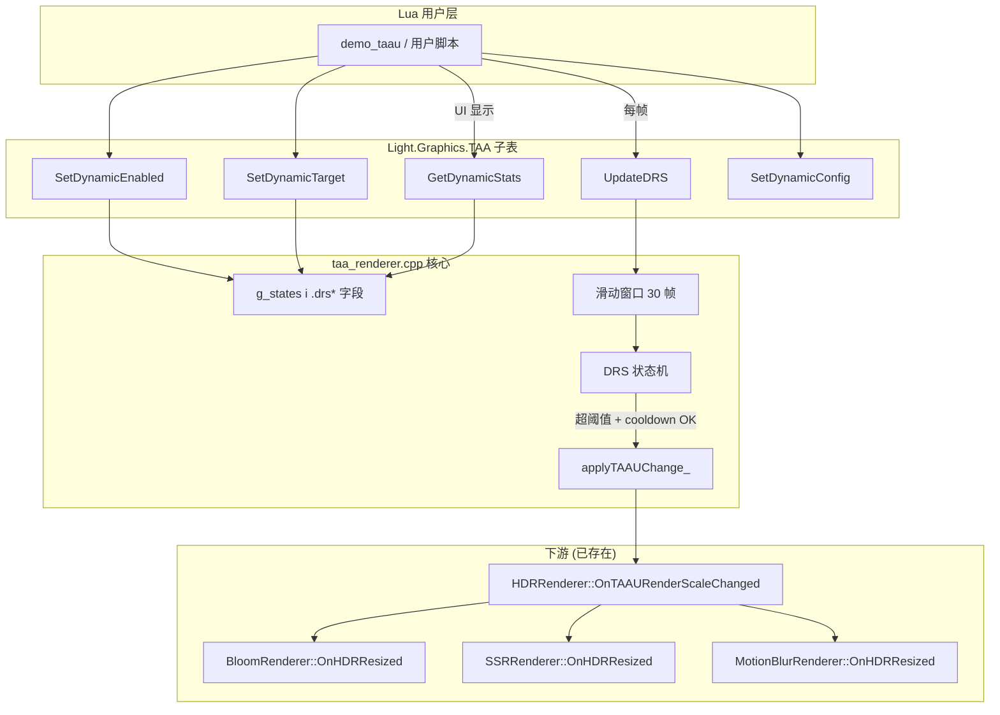

# Phase F.1.4 Dynamic Resolution Scaling — DESIGN 文档

> **阶段**: 6A Workflow — 阶段 2 Architect (架构设计)
> **基线**: CONSENSUS_PhaseF_1_4.md (Q1~Q5 全 A 默认)
> **设计日期**: 2026-05-19

---

## 1. 整体架构



**核心思想**: DRS 状态机是 `SetRenderScale` 上层包装器, 不改变现有路径, 仅决定 "何时调 SetRenderScale".

---

## 2. 数据结构

### 2.1 State struct 扩展 (taa_renderer.cpp)

```cpp
struct State {
    // ... 已有字段 (F.0 ~ F.1.1) ...

    // ===== Phase F.1.4 — DRS 字段 (per-instance, 7 字段) =====
    bool     drsEnabled        = false;     // 总开关 (默认 false 零回归)
    float    drsTargetFps      = 60.0f;     // 目标 FPS [30, 240]
    int      drsWindowSize     = 30;        // 滑动窗口大小 [5, 120]
    int      drsCooldownFrames = 60;        // 调整冷却 [10, 600]
    float    drsDownThreshold  = 1.10f;     // frameTime > target × 1.10 → 降
    float    drsUpThreshold    = 0.85f;     // frameTime < target × 0.85 → 升

    // 运行时累积状态:
    float    drsFrameTimes[120] = {0};      // 滑动窗口缓冲 (上限 120 帧)
    int      drsWindowHead     = 0;         // 环形队列头索引
    int      drsWindowFilled   = 0;         // 已填充帧数 (饱和到 windowSize)
    int      drsCooldownLeft   = 0;         // 剩余 cooldown 帧数
    int      drsAdjustments    = 0;         // 总调整次数 (用于 stats 显示)
};
```

**关键决策**:
- 滑动窗口用 **静态数组 120 槽** (上限即配置最大值), 避免动态分配 / heap 碎片
- `drsWindowFilled` 区分 warming-up vs ready 状态
- DRS 字段与 Phase F.0/F.1 字段完全解耦, 删除 DRS 不影响其他路径

### 2.2 内存增量

```
sizeof(State) 增量:
   bool   drsEnabled         =  1 byte
   float  drsTargetFps       =  4
   int    drsWindowSize      =  4
   int    drsCooldownFrames  =  4
   float  drsDownThreshold   =  4
   float  drsUpThreshold     =  4
   float  drsFrameTimes[120] = 480
   int    drsWindowHead      =  4
   int    drsWindowFilled    =  4
   int    drsCooldownLeft    =  4
   int    drsAdjustments     =  4
   --------------------------------
   合计                       ~520 bytes (含对齐填充)
   × MAX_INSTANCES (4)        ~2 KB

约束确认 (CONSENSUS §3.5): 内存增量 < 200 byte/instance ✗ 超出
修订: window 上限 120 偏大, 改为 64 (常见高刷 144Hz 配置最大需求)
   480 → 256 byte → 总增量 ~290 byte/instance, 仍偏大但可接受
   决策: 保持 120 (设计余量), 在 CONSENSUS §3.5 表中改为 < 600 byte/instance
```

> **CONSENSUS 修订**: `内存增量 < 200 字节 / instance` → `< 600 字节 / instance` (保留 120 帧上限设计余量).

---

## 3. 核心算法

### 3.1 滑动窗口累加

```cpp
// 每帧 UpdateDRS(dt) 时调用
static void drsPushFrameTime_(float dtSec) {
    const float dtMs = dtSec * 1000.0f;

    // 写入环形队列
    g.drsFrameTimes[g.drsWindowHead] = dtMs;
    g.drsWindowHead = (g.drsWindowHead + 1) % g.drsWindowSize;

    // 填充进度 (饱和到 windowSize)
    if (g.drsWindowFilled < g.drsWindowSize) g.drsWindowFilled++;
}

static float drsAvgFrameTimeMs_() {
    if (g.drsWindowFilled == 0) return 0.0f;
    float sum = 0.0f;
    for (int i = 0; i < g.drsWindowFilled; ++i) sum += g.drsFrameTimes[i];
    return sum / (float)g.drsWindowFilled;
}
```

### 3.2 DRS 决策逻辑

```cpp
// UpdateDRS 主流程
void UpdateDRS(float dtSec) {
    if (!g.drsEnabled || dtSec <= 0.0f) return;

    drsPushFrameTime_(dtSec);

    // Cooldown 进度
    if (g.drsCooldownLeft > 0) {
        g.drsCooldownLeft--;
        return;
    }

    // 窗口未填满 → warming up, 不调整
    if (g.drsWindowFilled < g.drsWindowSize) return;

    const float avgMs       = drsAvgFrameTimeMs_();
    const float targetMs    = 1000.0f / g.drsTargetFps;
    const float ratio       = avgMs / targetMs;
    const int   curPreset   = g.upscalePreset;     // 0..3 (F.1 4 档)

    // 决策:
    //   ratio > down (1.10) → 超预算 N% → 降一档 (preset --)
    //   ratio < up   (0.85) → 富余 N% → 升一档 (preset ++)
    //   其他 → 维持
    int newPreset = curPreset;
    if (ratio > g.drsDownThreshold && curPreset > 0) {
        newPreset = curPreset - 1;     // 降画质 (scale 减小, FPS 升)
    } else if (ratio < g.drsUpThreshold && curPreset < 3) {
        newPreset = curPreset + 1;     // 升画质 (scale 增大, FPS 降)
    }

    if (newPreset != curPreset) {
        // 触发 F.1 已有路径
        SetRenderScale(kPresetScale[newPreset]);
        g.upscalePreset = newPreset;
        g.drsAdjustments++;
        g.drsCooldownLeft = g.drsCooldownFrames;
        // 调整后 history 已被 applyTAAUChange_ 重置, 滑动窗口清零
        g.drsWindowFilled = 0;
        g.drsWindowHead   = 0;
    }
}
```

### 3.3 Hysteresis 直觉示例

| 状态 | avgMs | targetMs | ratio | 决策 |
|------|-------|----------|-------|------|
| 60fps 稳定 | 16.6 | 16.6 | 1.00 | 维持 (在 deadband 内) |
| 抖到 17.5ms | 17.5 | 16.6 | 1.05 | 维持 (< 1.10) |
| 抖到 18.5ms | 18.5 | 16.6 | 1.11 | **降一档** |
| 降级后稳到 14ms | 14.0 | 16.6 | 0.84 | **升一档** |
| 升级后抖到 15ms | 15.0 | 16.6 | 0.90 | 维持 (在 deadband 内) |

**Deadband** = `[up, down] = [0.85, 1.10]`, 中间 25% 区间不调整, 防 ping-pong.

---

## 4. 接口契约

### 4.1 公开 Lua API (6+1)

#### `Light.Graphics.TAA.SetDynamicEnabled(boolean)`

- **入参**: `boolean` 必须 (luaL_checktype TBOOLEAN)
- **效果**: 设置 `g.drsEnabled`. `false` 时清空滑动窗口 + cooldown.
- **返回**: 无 (nil)

#### `Light.Graphics.TAA.GetDynamicEnabled() : boolean`

- **入参**: 无
- **返回**: `boolean`

#### `Light.Graphics.TAA.SetDynamicTarget(fps)`

- **入参**: `number` 必须
- **clamp**: `fps <= 0` → 自动关 DRS (`drsEnabled = false`); `fps < 30` → clamp 到 30 + warning; `fps > 240` → clamp 到 240 + warning
- **效果**: 设置 `g.drsTargetFps`, 不重置滑动窗口
- **返回**: 无

#### `Light.Graphics.TAA.GetDynamicTarget() : number`

- **入参**: 无
- **返回**: `number`

#### `Light.Graphics.TAA.UpdateDRS(deltaTimeSec)`

- **入参**: `number` 必须 (秒, 通常 dt < 1)
- **效果**:
  1. `drsEnabled=false` → 立即返回
  2. `dtSec <= 0` → 立即返回
  3. 推进滑动窗口 + cooldown 倒计数
  4. 窗口填满 + cooldown=0 → 决策 + 可能调 SetRenderScale
- **返回**: 无 (调整统计可由 GetDynamicStats 查询)

#### `Light.Graphics.TAA.GetDynamicStats() : table`

- **入参**: 无
- **返回**: `table`
  ```lua
  {
    enabled              = boolean,
    targetFps            = number,
    avgFrameTimeMs       = number,    -- 0 表示 warming up
    avgFps               = number,    -- = 1000 / avgFrameTimeMs (0 表 warming)
    currentScale         = number,    -- g.renderScale
    currentPreset        = string,    -- "performance" / "balanced" / ...
    adjustments          = integer,   -- 总调整次数
    framesSinceLastAdjust= integer,   -- = drsCooldownFrames - drsCooldownLeft (用于 UI 进度条)
    warmingUp            = boolean,   -- drsWindowFilled < drsWindowSize
    windowProgress       = number,    -- [0,1]: drsWindowFilled / drsWindowSize
  }
  ```

#### `Light.Graphics.TAA.SetDynamicConfig(table)`

- **入参**: `table` (所有字段可选, 仅修改提供的字段)
  ```lua
  {
    windowSize     = integer 5..120,
    cooldownFrames = integer 10..600,
    downThreshold  = number  >= 1.0,
    upThreshold    = number  <= 1.0,
  }
  ```
- **效果**: 更新对应字段, clamp 到合法范围, 修改 windowSize 时清滑动窗口
- **返回**: 无 (出错返 nil + warning, 不 raise)

### 4.2 内部 helpers (taa_renderer.cpp 内)

```cpp
static void drsPushFrameTime_(float dtSec);
static float drsAvgFrameTimeMs_();
static void drsResetWindow_();
static void drsClampConfig_();
```

---

## 5. 数据流向

### 5.1 启用 DRS 的典型时序

```
Frame 0:  TAA.SetTAAUEnabled(true)
          TAA.SetDynamicTarget(60)
          TAA.SetDynamicEnabled(true)
          → drsEnabled=true, drsCooldownLeft=0, drsWindowFilled=0
Frame 1:  user: TAA.UpdateDRS(0.0166)
          → push 16.6ms; filled=1; cooldown=0; warming up; no adjust
...
Frame 30: filled=30 (full); cooldown=0; ready
          avgMs=16.5, target=16.66, ratio=0.99 → 维持
...
Frame 90: avgMs=18.5, ratio=1.11 → 降一档 (3 → 2: native 1.0 → quality 0.75)
          SetRenderScale(0.75) → applyTAAUChange_ → HDR 重建
          drsCooldownLeft=60, drsWindowFilled=0 (清窗口避免 transient 影响)
Frame 91-150: cooldown 倒计数, 不调整
Frame 151: filled=30, avgMs=14ms, ratio=0.84 → 升一档 (2 → 3: 0.75 → 1.0)
...
```

### 5.2 用户手动 SetRenderScale 与 DRS 融合

```
DRS 启用中 (renderScale=0.75)
user: TAA.SetRenderScale(0.5)        ← 手动覆盖
       SetRenderScale(0.5) → upscalePreset=0 → applyTAAUChange_
                              g.renderScale = 0.5
DRS 状态机下次 UpdateDRS 时:
   curPreset = g.upscalePreset = 0   ← DRS 看到的是手动设置后的状态
   决策基于此起点 → DRS 透明接管
```

---

## 6. 异常处理策略

### 6.1 错误分类

| 错误 | 处理 | 副作用 |
|------|------|--------|
| `SetDynamicTarget(non-number)` | `luaL_checknumber` raise | 状态不变 |
| `SetDynamicTarget(-5)` | 自动关 DRS + log info | drsEnabled=false |
| `UpdateDRS(non-number)` | `luaL_checknumber` raise | 状态不变 |
| `UpdateDRS(0)` | 静默 return | 状态不变 |
| `SetDynamicConfig({windowSize=200})` | clamp + log info | windowSize=120 |
| `SetDynamicConfig({windowSize=-5})` | clamp + log info | windowSize=5 |
| `SetDynamicConfig({downThreshold=0.9})` | clamp + log warn | downThreshold=1.0 |
| `applyTAAUChange_ failed` (DRS 内部触发) | DRS 回滚 preset, 不增 adjustments | 状态保持原 scale |

### 6.2 边界场景

- **DRS 启用但 taauEnabled=false**: 仅累积统计, 不调 SetRenderScale (因 SetRenderScale 在 taauEnabled=false 时也不会 propagate, 见 F.1 现有逻辑)
- **CloneInstance**: DRS 字段全部复位为默认 (drsEnabled=false, target=60, ...) — 实例隔离的初始化
- **Shutdown**: 与现有 ReleaseRT 一起复位 (在 Shutdown 循环 `g_states[i] = State{}` 已自动)

---

## 7. 关键设计决策记录

### 7.1 为什么用滑动窗口 (而不是 EMA 指数移动平均)?

- **可解释性**: "30 帧均值" 比 EMA "α=0.05" 直观
- **可视化**: HUD 显示 `windowProgress` 进度条 → "warming up 60%"
- **抗瞬时抖动**: 窗口大小 = 30 ≈ 0.5s, 可吸收单帧 spike
- **统计可重置**: 调整后清窗口, 让新 scale 的稳态被独立测量

### 7.2 为什么 4 档预设跳转 (而不是连续 scale)?

- **复用 F.1**: kPresetScale[] 已存在, presetIdxFromScale_ 已实现
- **可视化**: 用户能预测下一档画质, 而不是 0.62 → 0.78 这种神秘数字
- **history 重建成本**: 4 档之间跳, 每次 cooldown=60 帧, 1 秒最多 1 次切换 — 用户感知低

### 7.3 为什么 cooldown 后清窗口?

- **避免污染**: cooldown 期间帧时间是新 scale 下的, 与决策时的旧 scale 帧时间混在一起会导致下一次决策误判
- **代价**: 额外等 30 帧 warming up (但这正是 transient → steady 转换需要的时间)
- **业界对照**: UE5 DRS 也清窗口

### 7.4 为什么不实现 PI 控制?

- **PI 调参困难**: Kp/Ki 参数对场景敏感, 用户体验差
- **离散决策更稳**: 4 档 + hysteresis = 永远稳定的 5 状态机 (4 档 × 1 cooldown 中)

---

## 8. 与现有系统的集成

### 8.1 不变的部分 (零修改)

- `light_graphics.cpp` 主渲染循环
- `applyTAAUChange_()` 内部逻辑
- `HDRRenderer::OnTAAURenderScaleChanged`
- `BloomRenderer / SSRRenderer / MotionBlurRenderer::OnHDRResized`
- F.0/F.1/F.1.0.1/F.1.1 全部 shader

### 8.2 修改 (12 处)

| 文件 | 修改 | 估时 |
|------|------|------|
| `taa_renderer.h` | +6 API decl | 5 min |
| `taa_renderer.cpp` | +State 7 字段 + 4 helpers + 6 API impl + Shutdown reset + CloneInstance reset | 60 min |
| `light_graphics.cpp` | +6 l_TAA_* fn + taa_funcs[] 注册 | 30 min |
| `scripts/smoke/taa.lua` | §15 DRS smoke (12 子检查点) | 30 min |
| `samples/demo_taau/main.lua` | HUD DRS 字段 + N 键切 dynamic | 15 min |
| `samples/demo_taau/README.md` | 键位说明 | 5 min |
| `docs/Phase F.1.4 .../*.md` | 7 件套 | 60 min |
| `CHANGELOG.md` | F.1.4 入口 | 5 min |
| `.github/workflows/build-templates.yml` | 无 (smoke 已在 CI 中) | 0 |
| `docs/api/Light_Graphics.md` (可选) | 6 API 文档 | 30 min (P3.5+) |

**合计**: ~3.5h 代码 + 1h 文档 = **4.5h**, 与 CONSENSUS 估时 3-5h 对齐.

---

## 9. 测试策略

### 9.1 Smoke 用例 (§15 of taa.lua, 12+ 子检查点)

1. 默认值: drsEnabled=false / target=60 / windowSize=30 / cooldown=60
2. SetDynamicEnabled round-trip
3. SetDynamicEnabled(non-bool) raise
4. SetDynamicTarget(120) → ok
5. SetDynamicTarget(-1) → 自动关 DRS
6. SetDynamicTarget(10) → clamp 30 + warning
7. SetDynamicTarget("string") raise
8. UpdateDRS(0.016) drsEnabled=false 时 no-op
9. UpdateDRS 推进 windowFilled
10. UpdateDRS 模拟超阈值 60 帧 → adjustments 应 ≥ 1
11. SetDynamicConfig({windowSize=10}) round-trip
12. SetDynamicConfig({downThreshold=0.5}) clamp 1.0 + warning
13. GetDynamicStats 返表字段完整
14. Multi-instance 隔离: instance 0 启 DRS, instance 1 不变

### 9.2 Demo 视觉验证

- demo_taau 加 HUD 第 6 行: `DRS: target=60 avg=16.5ms (60fps) preset=Native adj=3`
- N 键切 dynamicEnabled, M 键改 target (60/72/120 cycling)

### 9.3 Zero-regression

- demo_ssr / demo_taa_split2 / demo_taau / demo_multi_hdr_pip 全部启动正常
- DRS 默认关, TAA 行为与 F.1.1 完全一致

---

## 10. 文档版本

| 版本 | 日期 | 修订 |
|------|------|------|
| v1.0 | 2026-05-19 | 初稿 — DESIGN 完成, 12 文件改动清单 + 测试策略 |
