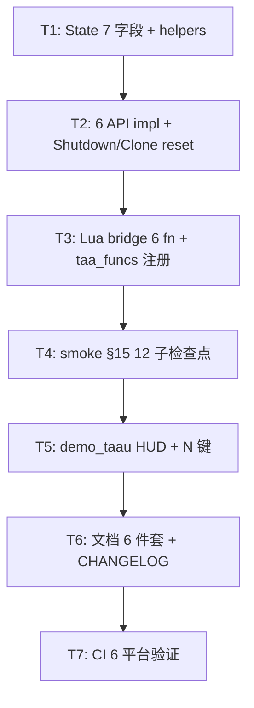

# Phase F.1.4 Dynamic Resolution Scaling — TASK 文档

> **阶段**: 6A Workflow — 阶段 3 Atomize (任务原子化)
> **基线**: DESIGN_PhaseF_1_4.md
> **创建日期**: 2026-05-19

---

## 1. 任务依赖图



**依赖性质**: 严格串行 (每步基于前一步, 无可并行机会).

---

## 2. 原子任务清单

### T1 — State 字段扩展 + helpers (~30 min)

**输入契约**:
- `taa_renderer.cpp:State` 现有结构
- DESIGN §2.1 字段表

**输出契约**:
- `State` struct 加 7 字段 (drsEnabled / drsTargetFps / drsWindowSize / drsCooldownFrames / drsDownThreshold / drsUpThreshold / drsFrameTimes[120] / drsWindowHead / drsWindowFilled / drsCooldownLeft / drsAdjustments)
- 4 个 static helpers: `drsPushFrameTime_`, `drsAvgFrameTimeMs_`, `drsResetWindow_`, `drsClampConfig_`
- 编译通过 (本地 + CI 双绿)

**实现约束**:
- 字段位置: 在 State struct 末尾 (Phase F.1.1 字段之后)
- 标注 `// Phase F.1.4` 注释
- helpers 标注 `static` (内部链接)
- 数组用 `[120]` 固定上限 (避免运行时分配)

**验收标准**:
- State 总大小增量 ≤ 600 byte/instance (DESIGN §2.2 修订后)
- helpers 测试: 模拟 push 30 个 16.6ms → avg 应为 16.6ms ± 0.01

---

### T2 — 6 API 实现 + Shutdown/Clone 复位 (~60 min)

**输入契约**: T1 完成

**输出契约**: `taa_renderer.cpp` 新增 6 个公开函数 + 修改 Shutdown / CloneInstance:

```cpp
// 公开 API (taa_renderer.h 同步声明):
namespace TAARenderer {
    bool SetDynamicEnabled(bool flag);
    bool GetDynamicEnabled();
    void SetDynamicTarget(float fps);
    float GetDynamicTarget();
    void UpdateDRS(float dtSec);
    // GetDynamicStats 返多值, Lua 端打表 (impl 在 light_graphics.cpp)
    // 故 C++ 端 expose 6 个 stats getter 而非组合一个:
    float GetDynamicAvgFrameTimeMs();
    float GetDynamicAvgFps();
    int   GetDynamicAdjustments();
    int   GetDynamicFramesSinceLastAdjust();
    bool  GetDynamicWarmingUp();
    float GetDynamicWindowProgress();
    // SetDynamicConfig (table 入参) 在 Lua bridge 处展开为多个调用:
    void SetDynamicWindowSize(int n);
    void SetDynamicCooldownFrames(int n);
    void SetDynamicDownThreshold(float t);
    void SetDynamicUpThreshold(float t);
}
```

**实现约束**:
- `SetDynamicEnabled(false)` 必须清窗口 (`drsResetWindow_()`) 防止下次启用时旧数据污染
- `SetDynamicTarget(fps <= 0)` 内部调 `SetDynamicEnabled(false)` (统一关闭路径)
- `SetDynamicTarget` clamp 到 [30, 240], 越界 log info
- `UpdateDRS` 内部:
  1. `if (!g.drsEnabled || dtSec <= 0) return;`
  2. push frame time
  3. cooldown 倒计数
  4. windowFilled < windowSize → return (warming up)
  5. 决策 + 必要时调 `SetRenderScale` + 清窗口 + 重置 cooldown
- `Shutdown` 循环内 `g_states[i].drs* = 默认值`
- `CloneInstance(srcId)` 函数复位 dest 实例的 DRS 字段为默认 (不 copy 源 instance 的 DRS 状态, 避免 multi-pip 共享 DRS 决策)

**验收标准**:
- 编译通过
- `Light.Graphics.TAA.SetDynamicTarget(0)` 后 DRS 关闭
- `Light.Graphics.TAA.UpdateDRS(0.0166)` 在 enabled=false 时 no-op (用 print 验证)

---

### T3 — Lua bridge (~30 min)

**输入契约**: T2 完成, `taa_renderer.h` 已 export

**输出契约**: `light_graphics.cpp` 新增:

1. **8 个简单 l_TAA_* 函数** (Set/Get pair × 4):
   - `l_TAA_SetDynamicEnabled` / `l_TAA_GetDynamicEnabled`
   - `l_TAA_SetDynamicTarget` / `l_TAA_GetDynamicTarget`
   - `l_TAA_UpdateDRS` (单 setter, 无对应 getter)

2. **1 个组合 setter**:
   - `l_TAA_SetDynamicConfig` — 入参 table, 内部循环展开为 4 个 backend setter

3. **1 个组合 getter**:
   - `l_TAA_GetDynamicStats` — 返单 table, 内部组合 6 个 backend getter + 派生字段

4. **`taa_funcs[]` 数组** 添加 6 个 entry (Set/Get/Update/Stats/Config)

**实现约束**:
- `SetDynamicEnabled` 类型校验: `luaL_checktype(L, 1, LUA_TBOOLEAN)`
- `SetDynamicTarget` / `UpdateDRS` 类型校验: `luaL_checknumber`
- `SetDynamicConfig` 入参 nil → log warn 并 return (不 raise, 友好降级)
- `SetDynamicConfig` 字段缺失 → 跳过 (允许部分更新)
- `GetDynamicStats` 返表用 `lua_createtable(L, 0, 10)` 预分配

**验收标准**:
- `Light.Graphics.TAA.SetDynamicEnabled` 类型为 function (smoke A)
- `Light.Graphics.TAA.GetDynamicStats()` 返 table 含 10 字段

---

### T4 — Smoke §15 (~30 min)

**输入契约**: T3 完成

**输出契约**: `scripts/smoke/taa.lua` 新增 §15 (12 子检查点):

```lua
-- ============================================================
-- § 15. Phase F.1.4 — Dynamic Resolution Scaling
-- ============================================================
print("=== § 15: Phase F.1.4 DRS ===")
local TAA = Light.Graphics.TAA

-- 15.1 API existence (6 functions)
assert(type(TAA.SetDynamicEnabled) == "function")
assert(type(TAA.SetDynamicTarget)  == "function")
assert(type(TAA.UpdateDRS)         == "function")
assert(type(TAA.GetDynamicStats)   == "function")
assert(type(TAA.SetDynamicConfig)  == "function")

-- 15.2 Default values
assert(TAA.GetDynamicEnabled() == false)
assert(math.abs(TAA.GetDynamicTarget() - 60.0) < 0.001)

-- 15.3 round-trip
TAA.SetDynamicEnabled(true)
assert(TAA.GetDynamicEnabled() == true)
TAA.SetDynamicEnabled(false)

-- 15.4 type error: non-bool
local ok, err = pcall(TAA.SetDynamicEnabled, "yes")
assert(not ok)

-- 15.5 type error: non-number target
local ok2, err2 = pcall(TAA.SetDynamicTarget, "120")
assert(not ok2)

-- 15.6 target <= 0 auto-disables
TAA.SetDynamicEnabled(true)
TAA.SetDynamicTarget(-5)
assert(TAA.GetDynamicEnabled() == false)

-- 15.7 target clamp
TAA.SetDynamicTarget(10)
assert(math.abs(TAA.GetDynamicTarget() - 30.0) < 0.001)
TAA.SetDynamicTarget(500)
assert(math.abs(TAA.GetDynamicTarget() - 240.0) < 0.001)
TAA.SetDynamicTarget(60)

-- 15.8 SetDynamicConfig round-trip
TAA.SetDynamicConfig({ windowSize = 10, cooldownFrames = 30 })
local s = TAA.GetDynamicStats()
assert(type(s) == "table")
assert(s.targetFps ~= nil)

-- 15.9 SetDynamicConfig clamp
TAA.SetDynamicConfig({ windowSize = -1 })       -- clamp to 5
TAA.SetDynamicConfig({ downThreshold = 0.5 })   -- clamp to 1.0

-- 15.10 UpdateDRS no-op when disabled
TAA.SetDynamicEnabled(false)
local s0 = TAA.GetDynamicStats()
TAA.UpdateDRS(0.016)
local s1 = TAA.GetDynamicStats()
assert(s0.adjustments == s1.adjustments)

-- 15.11 UpdateDRS push frames (warming up)
TAA.SetDynamicConfig({ windowSize = 10, cooldownFrames = 5 })
TAA.SetDynamicEnabled(true)
for i = 1, 5 do TAA.UpdateDRS(0.016) end
local s2 = TAA.GetDynamicStats()
assert(s2.warmingUp == true)
for i = 1, 5 do TAA.UpdateDRS(0.016) end
local s3 = TAA.GetDynamicStats()
assert(s3.warmingUp == false)
TAA.SetDynamicEnabled(false)

-- 15.12 GetDynamicStats fields
local stats = TAA.GetDynamicStats()
assert(stats.enabled              ~= nil)
assert(stats.targetFps            ~= nil)
assert(stats.avgFrameTimeMs       ~= nil)
assert(stats.avgFps               ~= nil)
assert(stats.currentScale         ~= nil)
assert(stats.currentPreset        ~= nil)
assert(stats.adjustments          ~= nil)
assert(stats.framesSinceLastAdjust~= nil)
assert(stats.warmingUp            ~= nil)
assert(stats.windowProgress       ~= nil)

print("[PASS] §15: Phase F.1.4 DRS — 12 sub-checks")
```

**验收标准**:
- 12 子检查点全 PASS
- smoke 末尾"Phase F.0 ~ F.1.1 + F.1.4" 总计 ~183+ PASS

---

### T5 — demo_taau 集成 (~15 min)

**输入契约**: T4 通过

**输出契约**: `samples/demo_taau/main.lua` 修改:

1. 新增按键: `N` 切 `dynamicEnabled`, `M` 循环 `targetFps` (60 → 72 → 120 → 60)
2. HUD 增加第 6 行:
   ```
   DRS: target=60 avg=16.5ms (60fps) preset=Native adj=3
   ```
   或在 DRS 关闭时:
   ```
   DRS: OFF (press N to enable)
   ```
3. `Light.Graphics.TAA.UpdateDRS(dt)` 加入主循环 `love.update(dt)`
4. README.md 加键位说明

**验收标准**:
- demo_taau 启动正常
- N 键切换 DRS 不崩
- M 键 cycling target fps 不崩

---

### T6 — 文档 6 件套 + CHANGELOG (~60 min)

**输入契约**: T5 通过

**输出契约**:
- `docs/Phase F.1.4 .../ALIGNMENT_PhaseF_1_4.md` ✅ (已写)
- `docs/Phase F.1.4 .../CONSENSUS_PhaseF_1_4.md` ✅ (已写)
- `docs/Phase F.1.4 .../DESIGN_PhaseF_1_4.md` ✅ (已写)
- `docs/Phase F.1.4 .../TASK_PhaseF_1_4.md` ✅ (本文)
- `docs/Phase F.1.4 .../ACCEPTANCE_PhaseF_1_4.md` (待 T7 后)
- `docs/Phase F.1.4 .../FINAL_PhaseF_1_4.md` (待 T7 后)
- `docs/Phase F.1.4 .../TODO_PhaseF_1_4.md` (待 T7 后)
- `CHANGELOG.md` 加 F.1.4 入口

---

### T7 — CI 6 平台验证 (~30 min, 含 CI 排队)

**输入契约**: T6 通过 (代码 + smoke + demo + 文档草稿)

**输出契约**:
- 提交 1-2 commit
- CI run 6/6 全绿
- 失败时立刻 hotfix

**验收标准**:
- 本地 `lightc -p` 全部 smoke 通过 syntax check
- CI run build-windows / build-linux / build-macos / build-android / build-ios / build-web 全绿
- magic_perf_smoke + magic_coverage_verify 不退化

---

## 3. 实施顺序 (推荐)

```
T1 (30m) → T2 (60m) → T3 (30m) → T4 (30m) → T5 (15m) → 本地 smoke → 提交 → T7 (30m CI 等待)
                                                                   ↘ T6 (60m 文档)
```

**总计**: ~3.5h 代码 + 1h 文档 + 0.5h CI = **5h** (符合 CONSENSUS 估时上限)

---

## 4. 风险与缓解

| 风险 | 概率 | 影响 | 缓解 |
|------|------|------|------|
| applyTAAUChange_ 失败 (DRS 内部触发) | 低 | DRS 静默回退 | T2 加 `if (!applyTAAUChange_()) revert preset` |
| 滑动窗口 windowSize 边界 (1 帧 / 120 帧) | 中 | 边界访问 | T1 helpers 加 clamp + 单元测试 |
| Multi-instance CloneInstance DRS 状态泄漏 | 中 | 跨 pip 抖动 | T2 复位 + smoke §15.13 (multi-instance) |
| Cooldown 计数溢出 (int 自减) | 低 | 行为异常 | T2 用 `if (left > 0) left--` 防御 |
| 用户连续 SetRenderScale 与 DRS 抢占 | 低 | UI 抖动 | T2 SetRenderScale 不依赖 DRS 状态, 透明融合 |

---

## 5. 文档版本

| 版本 | 日期 | 修订 |
|------|------|------|
| v1.0 | 2026-05-19 | 初稿 — 7 任务原子化 + 依赖图 + 风险表 |
