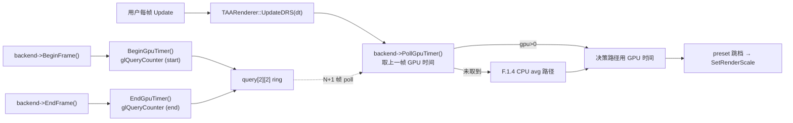

# Phase F.1.5 GPU Timer for DRS — DESIGN 文档

> **阶段**: 6A Workflow — 阶段 2 Architect
> **基线**: CONSENSUS_PhaseF_1_5.md

---

## 1. 整体架构



---

## 2. 接口契约

### 2.1 RenderBackend 基类 (新增 4 虚函数)

```cpp
// @e:\jinyiNew\Light\ChocoLight\include\render_backend.h

/// 是否支持 GPU 整帧 timer query
/// 桌面 GL3.3+ Core 必 true; GLES3 + EXT_disjoint_timer_query 时 true; 其他 false
virtual bool SupportsGpuTimer() const { return false; }

/// 整帧 timer 起点 (BeginFrame 内自动调; 可重入安全)
virtual void BeginGpuTimer() {}

/// 整帧 timer 终点 (EndFrame 内自动调)
virtual void EndGpuTimer() {}

/// Poll 上一帧 GPU 时间 (异步; 数据未到 return false)
/// @param outMs 输出毫秒; nullptr 安全 return false
/// @return true=数据有效; false=未支持/数据未到/disjoint
virtual bool PollGpuTimer(double* outMs) {
    if (outMs) *outMs = 0.0;
    return false;
}
```

### 2.2 GL33Backend 实现

```cpp
// @e:\jinyiNew\Light\ChocoLight\src\render_gl33.cpp

class GL33Backend : public RenderBackend {
    // ... existing fields ...

    // ==================== Phase F.1.5 — GPU Timer Query ====================
    bool   m_gpuTimerSupported = false;     // capability bit (init 时探测设)
    GLuint m_gpuTimerQuery[2][2] = {{0,0},{0,0}};  // [frame N % 2][start/end]
    int    m_gpuTimerWriteIdx = 0;           // 当前写入的 ringbuffer 索引
    bool   m_gpuTimerInFrame  = false;       // BeginGpuTimer 已调但 EndGpuTimer 未调
    int    m_gpuTimerWarmup   = 0;           // 已 issue 帧数 (前 2 帧无可 poll 数据)
};
```

### 2.3 GL33Backend::Init 中 GPU timer 探测

```cpp
void GL33Backend::InitGpuTimer() {
    // 桌面 GL3.3+ ARB_timer_query 是 core, 直接可用
    // 移动端 / Web 需检测 EXT_disjoint_timer_query
    bool ext_supported = false;
#if defined(__EMSCRIPTEN__) || defined(__ANDROID__) || defined(CHOCO_PLATFORM_IOS)
    const char* exts = (const char*)glGetString(GL_EXTENSIONS);
    if (exts && strstr(exts, "GL_EXT_disjoint_timer_query")) {
        ext_supported = true;
    }
#else
    // 桌面: GL3.3 core 自带 ARB_timer_query
    ext_supported = true;
#endif

    if (!ext_supported) {
        CC::Log(CC::LOG_INFO, "GL33Backend: GPU timer query 不支持 (DRS 走 CPU fallback)");
        return;
    }

    glGenQueries(4, &m_gpuTimerQuery[0][0]);  // 4 个 query 一次创建
    if (m_gpuTimerQuery[0][0] == 0) {
        CC::Log(CC::LOG_WARN, "GL33Backend: glGenQueries 失败, GPU timer 禁用");
        return;
    }
    m_gpuTimerSupported = true;
    CC::Log(CC::LOG_INFO, "GL33Backend: GPU timer query 启用 (GL_TIMESTAMP, double-buffered)");
}
```

### 2.4 GL33Backend::BeginFrame / EndFrame 自动包裹

```cpp
void BeginFrame(float cr, float cg, float cb, float ca) override {
    glClearColor(cr, cg, cb, ca);
    glClear(GL_COLOR_BUFFER_BIT | GL_DEPTH_BUFFER_BIT);
    glUseProgram(program);
    glBindVertexArray(vao);

    // Phase F.1.5: 自动起 GPU timer (用户无感)
    BeginGpuTimer();
}

void EndFrame() override {
    glBindVertexArray(0);
    glUseProgram(0);

    // Phase F.1.5: 自动结束 GPU timer
    EndGpuTimer();
}
```

### 2.5 BeginGpuTimer / EndGpuTimer 实现

```cpp
void BeginGpuTimer() override {
    if (!m_gpuTimerSupported) return;
    if (m_gpuTimerInFrame) return;   // 防御重入

    const int idx = m_gpuTimerWriteIdx;
    glQueryCounter(m_gpuTimerQuery[idx][0], GL_TIMESTAMP);
    m_gpuTimerInFrame = true;
}

void EndGpuTimer() override {
    if (!m_gpuTimerSupported) return;
    if (!m_gpuTimerInFrame) return;

    const int idx = m_gpuTimerWriteIdx;
    glQueryCounter(m_gpuTimerQuery[idx][1], GL_TIMESTAMP);
    m_gpuTimerWriteIdx = 1 - idx;    // 翻转到另一个 slot
    m_gpuTimerInFrame = false;
    if (m_gpuTimerWarmup < 2) m_gpuTimerWarmup++;
}
```

### 2.6 PollGpuTimer 实现

```cpp
bool PollGpuTimer(double* outMs) override {
    if (outMs) *outMs = 0.0;
    if (!m_gpuTimerSupported) return false;
    if (m_gpuTimerWarmup < 2) return false;   // 暖机阶段无可 poll 数据

    // 上一帧 (上一次 EndGpuTimer 翻转后的 slot)
    const int prevIdx = m_gpuTimerWriteIdx;   // 已翻转, 上一帧的 slot

    // 检查 GLES3 disjoint event (GPU clock 跳变, 数据无效)
#if defined(__EMSCRIPTEN__) || defined(__ANDROID__) || defined(CHOCO_PLATFORM_IOS)
    GLint disjoint = 0;
    glGetIntegerv(GL_GPU_DISJOINT_EXT, &disjoint);
    if (disjoint) return false;   // 此次结果无效, 丢弃
#endif

    // 检查 query 数据是否就绪
    GLint available = 0;
    glGetQueryObjectiv(m_gpuTimerQuery[prevIdx][1], GL_QUERY_RESULT_AVAILABLE, &available);
    if (!available) return false;

    GLuint64 t0 = 0, t1 = 0;
    glGetQueryObjectui64v(m_gpuTimerQuery[prevIdx][0], GL_QUERY_RESULT, &t0);
    glGetQueryObjectui64v(m_gpuTimerQuery[prevIdx][1], GL_QUERY_RESULT, &t1);
    if (t1 <= t0) return false;   // 异常情况

    if (outMs) *outMs = (double)(t1 - t0) / 1e6;   // ns → ms
    return true;
}
```

### 2.7 TAARenderer State 字段

```cpp
// @e:\jinyiNew\Light\ChocoLight\src\taa_renderer.cpp State{}

// ==================== Phase F.1.5 — GPU timer for DRS ====================
double  drsGpuFrameTimeMs   = 0.0;     // 上一帧 GPU 时间 (ms); 0 = 未取到
int     drsLastSource       = 0;       // 0=none / 1=cpu / 2=gpu
bool    drsPreferGpuSource  = true;    // 用户开关 (默认 true)
```

### 2.8 UpdateDRS 决策路径升级

```cpp
void UpdateDRS(float dtSec) {
    if (!g.drsEnabled) return;
    if (dtSec <= 0.0f) return;

    drsPushFrameTime_(dtSec);

    // cooldown 倒计数 (复用 F.1.4)
    if (g.drsCooldownLeft > 0) {
        g.drsCooldownLeft--;
        return;
    }

    // 窗口未填满 → warming up
    if (g.drsWindowFilled < g.drsWindowSize) return;

    // ==================== F.1.5: 决策时间源选择 ====================
    double srcMs = 0.0;
    g.drsLastSource = 0;
    if (g.drsPreferGpuSource && g.backend && g.backend->SupportsGpuTimer()) {
        double gpuMs = 0.0;
        if (g.backend->PollGpuTimer(&gpuMs) && gpuMs > 0.0) {
            g.drsGpuFrameTimeMs = gpuMs;
            srcMs = gpuMs;
            g.drsLastSource = 2;     // gpu
        }
    }
    if (g.drsLastSource != 2) {
        const float cpuMs = drsAvgFrameTimeMs_();
        if (cpuMs > 0.0f) {
            srcMs = (double)cpuMs;
            g.drsLastSource = 1;     // cpu
        }
    }
    if (srcMs <= 0.0 || g.drsTargetFps <= 0.0f) return;

    // 后续决策不变 (ratio = srcMs / targetMs)
    const double targetMs = 1000.0 / g.drsTargetFps;
    const double ratio    = srcMs / targetMs;

    // ... 与 F.1.4 相同的 preset 跳档逻辑 ...
}
```

### 2.9 Lua bridge

```lua
-- 新增 2 API
Light.Graphics.TAA.SetPreferGpuSource(flag: boolean)
Light.Graphics.TAA.GetPreferGpuSource() -> boolean

-- GetDynamicStats 表新增 2 字段:
{
    -- F.1.4 现有 10 字段 ...
    gpuFrameTimeMs: number,    -- F.1.5: 上一帧 GPU 时间 (ms); 0 = 未取到
    source: string,            -- F.1.5: "none" / "cpu" / "gpu"
}
```

---

## 3. 数据流图

```
┌────────────┐
│  user.update(dt)
└──────┬─────┘
       │
       ▼
┌──────────────────────┐
│ TAA.UpdateDRS(dt)     │
│ ┌──────────────────┐  │
│ │ drsPushFrameTime │  │   <-- F.1.4 CPU 累积仍保留 (fallback 用)
│ └──────────────────┘  │
│ ┌──────────────────┐  │
│ │ cooldown / warm  │  │
│ └──────────────────┘  │
│ ┌──────────────────┐  │
│ │ 选源 (F.1.5):    │  │
│ │  GPU? PollGpuTimer  │   <-- backend->PollGpuTimer()
│ │  CPU? avg         │   <-- F.1.4 现有 drsAvgFrameTimeMs_
│ └──────────────────┘  │
│ ┌──────────────────┐  │
│ │ 计算 ratio + 跳档 │   <-- F.1.4 决策逻辑 (无修改)
│ └──────────────────┘  │
└──────────────────────┘

┌────────────────────────────────┐
│  backend->BeginFrame()         │
│  └─ glQueryCounter(START)       │   <-- F.1.5 自动包
│                                  │
│  ... 用户 Draw ...                 │
│                                  │
│  backend->EndFrame()            │
│  └─ glQueryCounter(END)          │
│  └─ writeIdx ^= 1                 │
└────────────────────────────────┘
```

---

## 4. 异常处理策略

| 异常情况 | 处理 | 日志 |
|----------|------|------|
| `glGenQueries` 失败 | `m_gpuTimerSupported = false` | LOG_WARN |
| BeginGpuTimer 重入 | 第二次 silent skip | 无 |
| EndGpuTimer 没 Begin | silent return | 无 |
| Poll 在 warmup<2 | return false (不视为错误) | 无 |
| Disjoint = true (移动端) | 此次结果丢弃 + return false | 无 (常见, 非错误) |
| `t1 <= t0` 异常 | return false | 无 |
| Backend 不支持 | DRS fallback 到 CPU 路径 | LOG_INFO 一次 |
| outMs = nullptr | safe return false | 无 |

---

## 5. 测试策略

### 5.1 Smoke (scripts/smoke/taa.lua §15)

| # | 检查点 |
|---|--------|
| 15.1 | 默认 drsPreferGpuSource = true |
| 15.2 | SetPreferGpuSource round-trip (true/false) |
| 15.3 | SetPreferGpuSource(non-boolean) raise |
| 15.4 | GetDynamicStats 多 2 字段 (gpuFrameTimeMs / source) |
| 15.5 | Disable preferGpu 后 source 必为 "cpu" 或 "none" |
| 15.6 | Multi-instance 隔离 (各 instance 独立 source) |
| 15.7 | 状态复位 (Reset 后默认值) |

### 5.2 Demo (samples/demo_taau)

- HUD 增 1 行: `Source: gpu (gpuMs=4.20)` 或 `Source: cpu`
- 增 1 键: `G` 切 SetPreferGpuSource

### 5.3 CI 平台行为

| 平台 | 期待行为 |
|------|----------|
| Windows / Linux / macOS | source="gpu" (GL3.3 core 必有) |
| Android (现代设备) | 多数 source="gpu" (EXT_disjoint_timer_query 普遍支持) |
| iOS (GLES3) | 大概率 source="cpu" (Apple 早推 Metal) |
| Web (WebGL2) | 视用户激活, 通常 source="cpu" |

CI smoke 不能验证 GPU 真实时间, 但能验证:
- backend->SupportsGpuTimer() 返回符合预期
- API 不 raise / 返回类型正确
- fallback 路径无 crash

---

## 6. 性能估算

| 项 | 估算 |
|----|------|
| `glQueryCounter` 调用开销 | ~50ns (driver-implementation dependent) |
| `glGetQueryObjectui64v` (when available) | ~200ns |
| 单帧总开销 (Begin + End + Poll) | < 0.5 µs (可忽略) |
| 内存增量 (per backend) | 4 GLuint = 16 byte |
| 内存增量 (per TAA instance) | 16 byte (1 double + 1 int + 1 bool + padding) |

---

## 7. 与现有模块协同

### 7.1 与 F.1.4 DRS

- 数据流: F.1.5 仅替换 UpdateDRS 内的 "决策时间源选择" 一段
- F.1.4 滑动窗口仍保留 (作为 fallback CPU 源)
- 决策逻辑 (preset 跳档 / cooldown / hysteresis) 无任何修改
- F.1.4 既有 7 Lua API + 12 smoke 子检查点 → 全保留

### 7.2 与 F.1.1 autoMipBias

- 无交互. F.1.5 不触发 SetRenderScale (UpdateDRS 调 SetRenderScale 时 F.1.1 hook 自动跑)

### 7.3 与 multi-instance (F.0.10)

- 每 instance 独立 drsGpuFrameTimeMs / drsLastSource / drsPreferGpuSource (在 State 内部)
- backend GPU timer 是全局 (与 g_active 无关), 但各 instance 各自 poll → 各自缓存

---

## 8. 后向兼容

- 添加 4 backend virtual: 默认 no-op return false; legacy backend 透明无影响
- 添加 3 TAARenderer State 字段: 默认安全值 (drsPreferGpuSource=true 但若 backend 不支持等同 false)
- 添加 2 Lua API: 老 caller 不感知
- GetDynamicStats 多 2 字段: 老 caller 不读不影响

**结论**: 完全后向兼容, 零回归.

---

## 版本历史

| v1.0 | 2026-05-19 | 初稿 |
