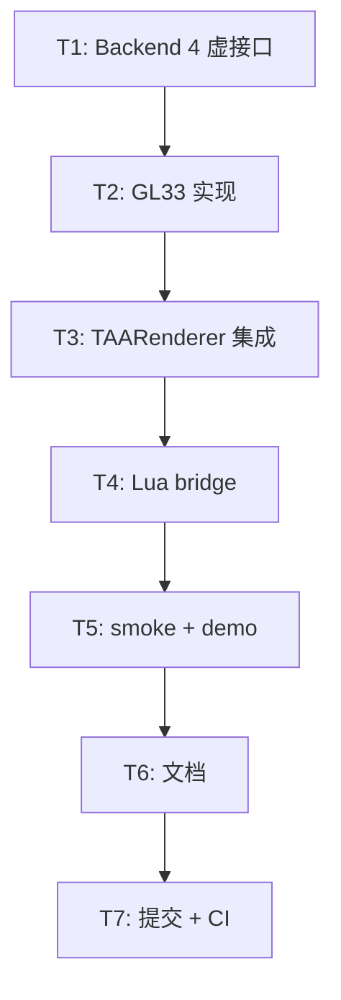

# Phase F.1.5 GPU Timer for DRS — TASK 文档

> **阶段**: 6A Workflow — 阶段 3 Atomize
> **基线**: DESIGN_PhaseF_1_5.md
> **日期**: 2026-05-19

---

## 1. 任务依赖图

---

## 2. 任务清单

### T1: Backend 4 虚接口 (高优先级, ~15min)

**目标**: 在 `RenderBackend` 基类加 4 个虚函数 (默认 no-op).

**输入契约**:
- 文件: `@e:\jinyiNew\Light\ChocoLight\include\render_backend.h`
- 现有 BeginFrame/EndFrame 已有 (line 160-161), 不动
- 现有 `Phase F.0 — TAA Master Pipeline 虚接口` 段 (line ~1526) 是范例

**输出契约**:
- 4 新虚函数: `SupportsGpuTimer()` / `BeginGpuTimer()` / `EndGpuTimer()` / `PollGpuTimer(double*)`
- 默认实现: SupportsGpuTimer→false, Begin/End→no-op, Poll→{*outMs=0; return false}
- 完整 Doxygen 注释

**验收标准**:
- [ ] 4 虚函数声明添加, 默认值合理
- [ ] 注释清晰说明 capability 模式 + 异步 poll 机制
- [ ] legacy backend 默认无任何感知 (零编译警告)

---

### T2: GL33Backend 实现 (高优先级, ~60min)

**目标**: GL33Backend 用 `GL_TIMESTAMP` query 实现 4 接口.

**输入契约**:
- 文件: `@e:\jinyiNew\Light\ChocoLight\src\render_gl33.cpp`
- GL33Backend 类位置 line 3525+
- BeginFrame/EndFrame 位置 line 7483-7492
- 已有 `gpuSkinningSupported` capability 模式 (line 3595)

**输出契约**:
- 类字段: `m_gpuTimerSupported` / `m_gpuTimerQuery[2][2]` / `m_gpuTimerWriteIdx` / `m_gpuTimerInFrame` / `m_gpuTimerWarmup`
- 函数: `InitGpuTimer()` 私有方法 + 4 override
- BeginFrame 内追加 `BeginGpuTimer()` 调用 (透明)
- EndFrame 内追加 `EndGpuTimer()` 调用
- 析构 / Shutdown 路径释放 query
- Init 失败时静默 fallback (capability=false)
- 跨平台 ext 探测: 桌面 (GL3.3 core 必有) / GLES3 (检测 `GL_EXT_disjoint_timer_query` 字符串) / 失败时 disabled

**验收标准**:
- [ ] 桌面编译通过 + 运行时 supported=true
- [ ] GLES3 / WebGL2 编译通过 (即使无 ext 也不 crash)
- [ ] 双 query ping-pong 不 stall (warmup 2 帧后才 poll)
- [ ] Disjoint event 检测 (GLES3 路径)
- [ ] 资源泄漏 0 (Shutdown 释放 4 query)

---

### T3: TAARenderer 集成 (高优先级, ~30min)

**目标**: State 加 3 字段, UpdateDRS 集成优先级链.

**输入契约**:
- 文件: `@e:\jinyiNew\Light\ChocoLight\src\taa_renderer.cpp`
- State 现有 F.1.4 字段 (line 95-110)
- UpdateDRS 现实现 (line ~1118-1162)
- Shutdown / CloneInstance 复位逻辑

**输出契约**:
- State 加: `drsGpuFrameTimeMs` (double=0.0) / `drsLastSource` (int=0) / `drsPreferGpuSource` (bool=true)
- UpdateDRS 决策段升级: GPU 优先, CPU fallback (具体见 DESIGN §2.8)
- Shutdown 复位: 3 字段重置
- CloneInstance 复位: 3 字段独立 (drsPreferGpuSource 复制配置)
- 公开 API: `SetPreferGpuSource(bool)` / `GetPreferGpuSource()`

**验收标准**:
- [ ] F.1.4 行为完全保留 (drsPreferGpuSource=false 时与 F.1.4 等价)
- [ ] backend->SupportsGpuTimer()=false 时透明走 CPU 路径
- [ ] backend->PollGpuTimer 失败 (warmup / disjoint) 时透明走 CPU
- [ ] 各 instance 独立 source 状态

---

### T4: Lua bridge (中优先级, ~20min)

**目标**: 暴露 2 新 API + 扩展 GetDynamicStats.

**输入契约**:
- 文件: `@e:\jinyiNew\Light\ChocoLight\src\light_graphics.cpp`
- 现有 F.1.4 7 Lua API + GetDynamicStats 10 字段表 (line ~4953-5060)
- taa_funcs[] 注册数组 (line ~5320+)

**输出契约**:
- `l_TAA_SetPreferGpuSource(L)` — bool 参数, raise on non-bool
- `l_TAA_GetPreferGpuSource(L)` — return bool
- 扩展 `l_TAA_GetDynamicStats`:
  - `gpuFrameTimeMs` (number)
  - `source` (string: "none" / "cpu" / "gpu")
  表大小 10 → 12

**验收标准**:
- [ ] 新 2 API 注册到 taa_funcs[]
- [ ] GetDynamicStats 12 字段完整
- [ ] 类型校验: SetPreferGpuSource(non-bool) raise

---

### T5: Smoke + Demo (高优先级, ~30min)

**目标**: smoke §15 7 子检查点 + demo HUD/键集成.

**输入契约**:
- smoke: `@e:\jinyiNew\Light\scripts\smoke\taa.lua` 末尾 (current §14 后)
- demo: `@e:\jinyiNew\Light\samples\demo_taau\main.lua` HUD + key bindings
- demo: `@e:\jinyiNew\Light\samples\demo_taau\README.md` 键位文档

**输出契约**:
- smoke §15: 7 子检查点 (default / round-trip / type-check / stats / disable / multi-instance / reset)
- fn_names 加 2: SetPreferGpuSource / GetPreferGpuSource
- 总函数数 60 → 62
- demo HUD 加 1 行 `Source: gpu/cpu (gpuMs=...)`
- demo 加 G 键切 SetPreferGpuSource
- README 键位文档加 G 键说明

**验收标准**:
- [ ] smoke 本地 syntax check PASS
- [ ] demo 本地 syntax check PASS
- [ ] smoke §15 7/7 子检查点 PASS

---

### T6: 文档 ACCEPTANCE / FINAL / TODO (中优先级, ~30min)

**目标**: 6A 阶段 5/6 文档 (ACCEPTANCE/FINAL/TODO).

**输入契约**:
- F.1.4 同名文档作为模板 (`@e:\jinyiNew\Light\docs\Phase F.1.4 Dynamic Resolution Scaling\`)
- 实施完成结果 (T1~T5)

**输出契约**:
- ACCEPTANCE: T1~T7 完成情况 + 验收标准核对 + 文件改动汇总
- FINAL: 提交记录 + CI 验证 + API 总结 + 业界对照 + 设计权衡
- TODO: 已知限制 + Phase F.1.6+ 候选方向

**验收标准**:
- [ ] ACCEPTANCE 7 件套 + 表格化的核对清单
- [ ] FINAL 含 CI 6/6 平台数据 (在 T7 完成后填)
- [ ] TODO 含 ≥3 个 F.1.6+ 候选方向

---

### T7: 提交 + CI 6 平台验证 (高优先级, ~30min 等待)

**目标**: git commit + push 触发 CI, 监控 6 平台全绿.

**输入契约**:
- T1~T6 全部完成 + 本地 syntax check PASS
- git status 确认所有改动入暂存

**输出契约**:
- 1 commit 涵盖所有改动 (代码 + smoke + demo + 文档)
- CI run id + 6 平台状态记录到 FINAL 文档

**验收标准**:
- [ ] CI 6/6 平台全绿
- [ ] 失败时立即修复 + 重新 push
- [ ] FINAL 文档补充 CI run id 完成最终签字

---

## 3. 时间预算

| 任务 | 估时 | 累计 |
|------|------|------|
| T1: Backend 虚接口 | 15 min | 0:15 |
| T2: GL33 实现 | 60 min | 1:15 |
| T3: TAARenderer 集成 | 30 min | 1:45 |
| T4: Lua bridge | 20 min | 2:05 |
| T5: smoke + demo | 30 min | 2:35 |
| T6: 文档 3 件 | 30 min | 3:05 |
| T7: CI 验证 | 30 min | 3:35 |

**总估时**: ~3.5h (与 F.1.4 持平)

---

## 4. 风险评估

| 风险 | 影响 | 缓解 |
|------|------|------|
| iOS GLES3 没有 EXT_disjoint_timer_query | 中 (移动端无 GPU 时间) | 静默 fallback CPU, smoke §15 不依赖真实 GPU 数据 |
| WebGL2 用户没启 ext | 中 | 同上, 静默 fallback |
| GL_TIMESTAMP 在某些驱动返回 0 | 低 | t1<=t0 检测后丢弃 |
| Async readback 仍 stall (driver bug) | 低 | 双 query ping-pong + warmup=2 标准做法 |
| TAARenderer Shutdown 时 backend 已释放 | 低 | 现有 backend 检查 if (g.backend) 已防御 |

---

## 版本历史

| v1.0 | 2026-05-19 | 初稿 |
