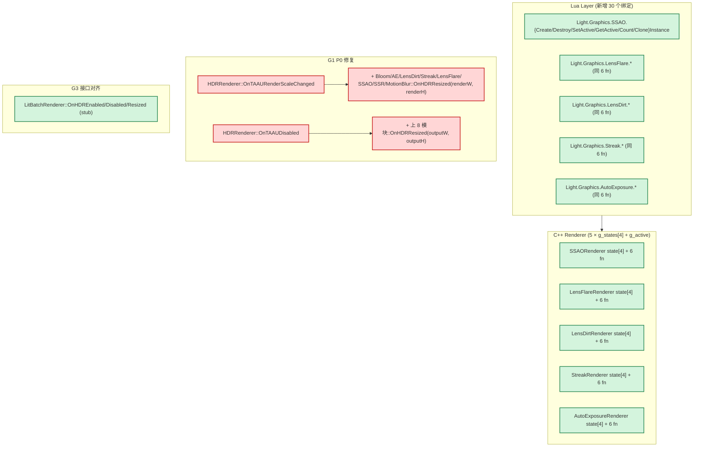
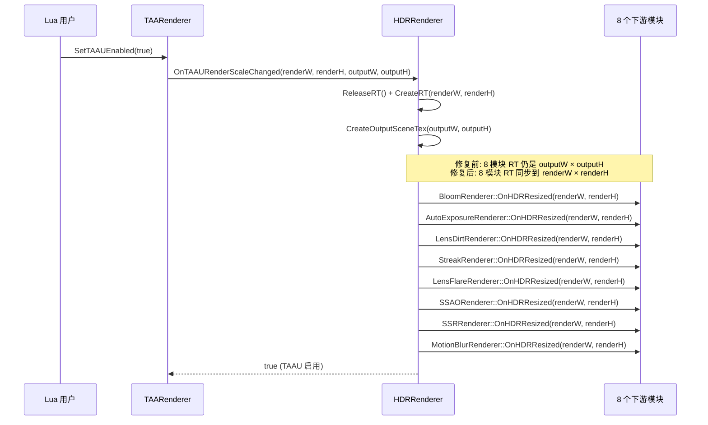

# Phase F.2 渲染架构补齐 — DESIGN (设计) 文档

> **阶段**：6A Workflow — 阶段 2 Architect
> **创建日期**：2026-05-17

---

## 1. 整体架构图



## 2. G1 (P0) — 数据流修复



切回 F.0 路径 (OnTAAUDisabled) 镜像调用，参数 `outputW, outputH`。

## 3. G2 (P1) — 多实例模板

完全复用 BloomRenderer F.0.10.9.x.2 模板:

```cpp
// 1. 在 .cpp 内, struct State 之后:
static constexpr int MAX_INSTANCES = 4;
static State g_states[MAX_INSTANCES];
static int   g_active = 0;
static int   g_count  = 1;
static bool  g_slot_in_use[MAX_INSTANCES] = { true, false, false, false };

#define g g_states[g_active]   // 老 fn 透明访问 active instance

// 2. Init() 顶上加 g_active = 0 (显式回到 default)

// 3. 新增 6 fn:
int CreateInstance();    // 找空闲槽 [1, 3], 槽满返 0
bool DestroyInstance(int id);
bool SetActiveInstance(int id);
int GetActiveInstance();
int GetInstanceCount();
int CloneInstance(int srcId);   // 复制参数, 不复制 RT
```

## 4. G3 (P1) — LitBatch stub

```cpp
// lit_batch_renderer.h 加 3 个声明
void OnHDREnabled(int w, int h);
void OnHDRDisabled();
void OnHDRResized(int w, int h);

// lit_batch_renderer.cpp 加 3 个 stub 实现
void OnHDREnabled(int /*w*/, int /*h*/) {}
void OnHDRDisabled() {}
void OnHDRResized(int /*w*/, int /*h*/) {}
```

## 5. 各模块改动总量估算

| 模块 | .h 行 | .cpp 行 | Lua binding 行 |
|------|-------|---------|----------------|
| HDRRenderer (G1) | 0 | +20 | 0 |
| LitBatch (G3) | +12 | +5 | 0 |
| SSAO (G2) | +10 | +85 | +30 |
| LensFlare (G2) | +10 | +75 | +30 |
| LensDirt (G2) | +12 | +75 | +30 |
| Streak (G2) | +9 | +75 | +30 |
| AutoExposure (G2) | +10 | +85 | +35 |
| **合计** | **+63** | **+420** | **+155** |

