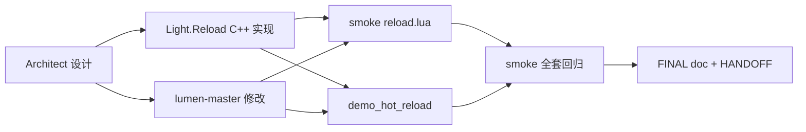

# Phase G.0 — Lua 脚本热重载 DESIGN

> **Align 文档**: `ALIGNMENT_PhaseG_0.md`
> **范围**: 用户选定 "深入 + main 热重载 (6h)" — 包含 Light.Reload + Preserve + lumen-master RestartScript

---

## 1. 架构总览

```
┌────────────────────────────────────────────────────┐
│                  Lua API (用户侧)                   │
│  Light.Reload.Module(name)    ← 模块级 reload      │
│  Light.Reload.File(path)      ← 文件级 reload      │
│  Light.Reload.WatchModule(n)  ← 自动 reload        │
│  Light.Reload.Preserve(k, f)  ← 状态保留           │
│  Light.Reload.RestartScript() ← 整个 main.lua 重启 │
└─────────────────────┬──────────────────────────────┘
                      │
        ┌─────────────┴──────────────┐
        ▼                            ▼
┌──────────────────┐         ┌──────────────────────┐
│ Light.Reload      │         │ lumen-master           │
│ light_reload.cpp │         │ light.cpp::pMain       │
│ ~280 行           │         │ (改 ~30 行)            │
│                  │         │                      │
│ ┌──────────────┐ │         │ 加 reload_pending     │
│ │ Module()     │ │         │ 全局; pMain 主循环    │
│ │ File()       │ │         │ 退出后检查, 有则       │
│ │ Preserve()   │ │         │ DoFile(reload_target) │
│ │ WatchModule()├─┼────┐    │ 再次执行              │
│ └──────────────┘ │    │    └──────┬──────────────┘
│                  │    │           │
│ ┌──────────────┐ │    │           ▼
│ │ RestartScript├─┼────┼──→ lumen_RequestRestart(path)
│ └──────────────┘ │    │
└──────────────────┘    │
                        │  集成
                        ▼
              ┌─────────────────┐
              │ Light.HotReload  │  (已有)
              │ Watch / Check   │
              └─────────────────┘
```

---

## 2. 数据结构

### 2.1 Light.Reload 模块全局状态 (`light_reload.cpp`)

```cpp
namespace {

constexpr int MAX_PRESERVED_STATES = 256;

struct PreservedState {
    bool used;
    char key[128];       // 用户指定 key (e.g. "game/player")
    int  stateRef;       // Lua state table in registry (LUA_NOREF if cleared)
};

struct WatchedModule {
    bool used;
    int  watchId;        // HotReload watch id (来自 HotReload.Watch)
    char name[128];      // module name (e.g. "game.player")
    char path[512];      // 解析后的文件路径
};

// 全局状态
PreservedState s_preserved[MAX_PRESERVED_STATES];
WatchedModule  s_watched[MAX_PRESERVED_STATES];

int  s_errorHandlerRef = LUA_NOREF;     // Lua function, fn(path, err)
char s_lastErrorPath[512];
char s_lastErrorMsg[1024];
int64_t s_lastErrorTime = 0;

int64_t s_modulesReloaded = 0;
int64_t s_filesReloaded   = 0;
int64_t s_errorsTotal     = 0;

}
```

### 2.2 lumen-master 全局状态

```cpp
// light.cpp 新增
static char s_restartTargetPath[1024] = {0};
static bool s_restartPending = false;

extern "C" void lumen_RequestRestart(const char* path) {
    if (path && *path) {
        strncpy(s_restartTargetPath, path, sizeof(s_restartTargetPath)-1);
        s_restartTargetPath[sizeof(s_restartTargetPath)-1] = '\0';
        s_restartPending = true;
    }
}

extern "C" bool lumen_IsRestartPending() { return s_restartPending; }
extern "C" void lumen_ClearRestartPending() { s_restartPending = false; }
```

主循环 (`pMain`) 修改:
```cpp
if (script)
    s->status = handleScript(L, argv, script);
+ while (s->status == 0 && lumen_IsRestartPending()) {
+     const char* target = s_restartTargetPath;
+     lumen_ClearRestartPending();
+     CC::Log(...,  "Lumen: RestartScript → %s", target);
+     s->status = doFile(L, target);
+ }
if (s->status != 0) return 0;
```

---

## 3. API 详细设计

### 3.1 `Light.Reload.Module(name) -> module | nil, err`

```cpp
static int l_Reload_Module(lua_State* L) {
    const char* name = luaL_checkstring(L, 1);

    // 1. 清缓存: package.loaded[name] = nil
    lua_getglobal(L, "package");
    lua_getfield(L, -1, "loaded");
    lua_pushnil(L);
    lua_setfield(L, -2, name);
    lua_pop(L, 2);

    // 2. require(name)
    lua_getglobal(L, "require");
    lua_pushstring(L, name);
    if (lua_pcall(L, 1, 1, 0) != 0) {
        // 失败: 记录 + log + 调 SetErrorHandler
        const char* err = lua_tostring(L, -1);
        RecordError_(name, err);
        lua_pop(L, 1);   // pop err string
        lua_pushnil(L);
        lua_pushstring(L, err ? err : "unknown");
        return 2;
    }
    ++s_modulesReloaded;
    return 1;
}
```

### 3.2 `Light.Reload.File(path) -> any... | nil, err`

```cpp
static int l_Reload_File(lua_State* L) {
    const char* path = luaL_checkstring(L, 1);
    int top = lua_gettop(L);

    if (luaL_loadfile(L, path) != 0) {
        const char* err = lua_tostring(L, -1);
        RecordError_(path, err);
        lua_pop(L, 1);
        lua_pushnil(L);
        lua_pushstring(L, err ? err : "unknown");
        return 2;
    }
    if (lua_pcall(L, 0, LUA_MULTRET, 0) != 0) {
        const char* err = lua_tostring(L, -1);
        RecordError_(path, err);
        lua_pop(L, 1);
        lua_pushnil(L);
        lua_pushstring(L, err ? err : "unknown");
        return 2;
    }
    ++s_filesReloaded;
    return lua_gettop(L) - top;   // 返回 chunk 所有返回值
}
```

### 3.3 `Light.Reload.Preserve(key, factory) -> any`

```cpp
static int l_Reload_Preserve(lua_State* L) {
    const char* key = luaL_checkstring(L, 1);
    luaL_checktype(L, 2, LUA_TFUNCTION);

    // 1. 查找已有 state
    int slot = FindPreservedByKey_(key);
    if (slot >= 0 && s_preserved[slot].stateRef != LUA_NOREF) {
        lua_rawgeti(L, LUA_REGISTRYINDEX, s_preserved[slot].stateRef);
        return 1;   // 返已存在 state
    }

    // 2. 第一次: 调 factory()
    lua_pushvalue(L, 2);   // 复制 factory
    if (lua_pcall(L, 0, 1, 0) != 0) {
        const char* err = lua_tostring(L, -1);
        lua_pop(L, 1);
        return luaL_error(L, "Preserve('%s') factory error: %s", key, err);
    }
    // 3. 保存到 registry
    lua_pushvalue(L, -1);                       // dup state
    int ref = luaL_ref(L, LUA_REGISTRYINDEX);
    int newSlot = (slot >= 0) ? slot : FindFreePreservedSlot_();
    if (newSlot < 0) return luaL_error(L, "Preserve: max states (%d) reached", MAX_PRESERVED_STATES);
    s_preserved[newSlot].used = true;
    strncpy(s_preserved[newSlot].key, key, sizeof(s_preserved[newSlot].key)-1);
    s_preserved[newSlot].stateRef = ref;
    return 1;   // 返新建 state
}
```

### 3.4 `Light.Reload.WatchModule(name) -> bool`

```cpp
static int l_Reload_WatchModule(lua_State* L) {
    const char* name = luaL_checkstring(L, 1);

    // 1. 解析 name → path (用 package.searchpath)
    lua_getglobal(L, "package");
    lua_getfield(L, -1, "searchpath");
    lua_remove(L, -2);
    lua_pushstring(L, name);
    lua_getglobal(L, "package");
    lua_getfield(L, -1, "path");
    lua_remove(L, -2);
    if (lua_pcall(L, 2, 1, 0) != 0) {
        lua_pop(L, 1);
        lua_pushboolean(L, 0);
        return 1;
    }
    if (!lua_isstring(L, -1)) {
        lua_pop(L, 1);
        lua_pushboolean(L, 0);
        return 1;
    }
    const char* path = lua_tostring(L, -1);

    // 2. 找空闲 slot + 调 Light.HotReload.Watch(path, internal_reload_cb)
    int slot = FindFreeWatchedSlot_();
    if (slot < 0) return luaL_error(L, "WatchModule: max watches");

    // 注册一个 native callback 到 HotReload, 内部清 cache + require
    // 实际实施: 用 Lua 闭包 (closure 捕 module name) 调 Light.HotReload.Watch
    lua_getglobal(L, "Light");
    lua_getfield(L, -1, "HotReload");
    lua_getfield(L, -1, "Watch");
    lua_pushstring(L, path);
    // 推一个 Lua closure: function() Light.Reload.Module(name) end
    lua_pushstring(L, name);
    lua_pushcclosure(L, WatchModuleCallback_, 1);
    if (lua_pcall(L, 2, 1, 0) != 0) {
        lua_pop(L, 3);   // pop err + HotReload + Light
        lua_pushboolean(L, 0);
        return 1;
    }
    int watchId = (int)lua_tointeger(L, -1);
    lua_pop(L, 3);

    strncpy(s_watched[slot].name, name, sizeof(s_watched[slot].name)-1);
    strncpy(s_watched[slot].path, path, sizeof(s_watched[slot].path)-1);
    s_watched[slot].watchId = watchId;
    s_watched[slot].used = true;

    lua_pushboolean(L, 1);
    return 1;
}

// HotReload watch 触发时的内部 callback
static int WatchModuleCallback_(lua_State* L) {
    // upvalue[1] = name
    const char* name = lua_tostring(L, lua_upvalueindex(1));
    // 调 Light.Reload.Module(name), 忽略返回值
    lua_getglobal(L, "Light");
    lua_getfield(L, -1, "Reload");
    lua_getfield(L, -1, "Module");
    lua_pushstring(L, name);
    if (lua_pcall(L, 1, 0, 0) != 0) {
        const char* err = lua_tostring(L, -1);
        CC::Log(CC::LOG_WARN, "Reload.WatchModule callback error: %s", err);
        lua_pop(L, 1);
    }
    lua_pop(L, 2);   // pop Reload + Light
    return 0;
}
```

### 3.5 `Light.Reload.RestartScript(path?)`

```cpp
extern "C" void lumen_RequestRestart(const char* path);   // 来自 lumen-master

static int l_Reload_RestartScript(lua_State* L) {
    const char* path = luaL_optstring(L, 1, nullptr);
    // 默认用启动时的脚本 (从 arg[0] 取)
    if (!path) {
        lua_getglobal(L, "arg");
        if (lua_istable(L, -1)) {
            lua_rawgeti(L, -1, 0);
            if (lua_isstring(L, -1)) path = lua_tostring(L, -1);
            lua_pop(L, 1);
        }
        lua_pop(L, 1);
    }
    if (!path || !*path) {
        return luaL_error(L, "RestartScript: no path provided and arg[0] not set");
    }
    lumen_RequestRestart(path);

    // 用户应在调用后让主循环退出 (例 Game:Close()), 这样 pMain 才会接管 restart
    return 0;
}
```

### 3.6 错误记录 helper

```cpp
static void RecordError_(const char* path, const char* err) {
    strncpy(s_lastErrorPath, path ? path : "", sizeof(s_lastErrorPath)-1);
    s_lastErrorPath[sizeof(s_lastErrorPath)-1] = '\0';
    strncpy(s_lastErrorMsg, err ? err : "unknown", sizeof(s_lastErrorMsg)-1);
    s_lastErrorMsg[sizeof(s_lastErrorMsg)-1] = '\0';
    s_lastErrorTime = (int64_t)time(nullptr);
    ++s_errorsTotal;
    CC::Log(CC::LOG_WARN, "Reload error: %s -- %s", s_lastErrorPath, s_lastErrorMsg);

    // 调用 Lua error handler (如已注册)
    if (s_errorHandlerRef != LUA_NOREF) {
        lua_State* L = g_callbackL;   // 用全局 lua state
        if (L) {
            lua_rawgeti(L, LUA_REGISTRYINDEX, s_errorHandlerRef);
            lua_pushstring(L, s_lastErrorPath);
            lua_pushstring(L, s_lastErrorMsg);
            if (lua_pcall(L, 2, 0, 0) != 0) {
                CC::Log(CC::LOG_WARN, "Reload error handler error: %s", lua_tostring(L, -1));
                lua_pop(L, 1);
            }
        }
    }
}
```

### 3.7 其他 API
- `SetErrorHandler(fn|nil)` — 注册/清除 fn
- `GetLastError()` — 返 `{path, msg, time}` table 或 nil
- `Stats()` — 返 `{modules_reloaded, files_reloaded, errors}` table
- `ResetState(key)` — 删 preserved state, 下次 Preserve 会重新调 factory
- `Clear()` — 清所有 preserved + watched + ref

---

## 4. lumen-master 修改详细

### 4.1 light.cpp 增量

```cpp
// 全局变量 (文件顶部)
static char s_restartTargetPath[1024] = {0};
static bool s_restartPending = false;

// 导出函数 (供 ChocoLight 调)
extern "C" void lumen_RequestRestart(const char* path) {
    if (path && *path) {
        strncpy(s_restartTargetPath, path, sizeof(s_restartTargetPath)-1);
        s_restartTargetPath[sizeof(s_restartTargetPath)-1] = '\0';
        s_restartPending = true;
    }
}

extern "C" bool lumen_IsRestartPending() { return s_restartPending; }
extern "C" void lumen_ClearRestartPending() { s_restartPending = false; }
```

### 4.2 pMain() 修改 (~10 行)

```cpp
static int pMain(Lumen::IState *L) {
    // ... 现有逻辑不变 ...
    if (script)
        s->status = handleScript(L, argv, script);
    // Phase G.0: RestartScript support
    while (s->status == 0 && s_restartPending) {
        s_restartPending = false;
        // 重新执行脚本
        s->status = doFile(L, s_restartTargetPath);
    }
    if (s->status != 0) return 0;
    if (has_i)
        dotty(L);
    // ...
}
```

### 4.3 暴露函数到 ChocoLight

`lumen-master` 与 `ChocoLight` 静态链接, 直接调 `extern "C"` 即可。无需头文件,在 `light_reload.cpp` 顶部:
```cpp
extern "C" void lumen_RequestRestart(const char* path);
extern "C" bool lumen_IsRestartPending();
```

---

## 5. demo_hot_reload 示例

### 5.1 文件结构

```
samples/demo_hot_reload/
├── main.lua           ← 入口, 间接调用模式
├── game_logic.lua     ← 用户改这个文件演示热重载
└── README.md
```

### 5.2 main.lua (~80 行)

```lua
local UI = Light.UI
local Gfx = Light.Graphics
local Reload = Light.Reload

print("demo_hot_reload — 修改 game_logic.lua 看实时效果, 按 ESC 退出")

-- 监视 game_logic 模块
Reload.SetErrorHandler(function(path, err)
    print("[ERROR] reload failed:", path, err)
end)
Reload.WatchModule('game_logic')

-- 状态保留: rotation/x_pos 在 reload 后继续累加
local state = Reload.Preserve('demo_state', function()
    return { angle = 0, frame = 0 }
end)

local Demo = UI.Window:Open(800, 600, "demo_hot_reload")

function Demo:OnRender(dt)
    state.frame = state.frame + 1
    -- 间接调用: 每帧从 package.loaded 取最新 game_logic
    local ok, gl = pcall(require, 'game_logic')
    if ok and gl then
        gl.on_render(self, dt, state)   -- 用户改这个函数
    end
end

function Demo:OnKey(key, sc, action)
    if action == 1 and key == 256 then self:Close() end
end

-- 主循环 (启动 HotReload polling)
local poll_acc = 0
while UI.Loop() do
    UI.Resume()
    poll_acc = poll_acc + 0.016
    if poll_acc >= 0.5 then
        Light.HotReload.Check(poll_acc)
        poll_acc = 0
    end
end
```

### 5.3 game_logic.lua (~50 行)

```lua
-- 用户改这个文件演示热重载
local M = {}

-- 用户可改这些常量, 保存后立即生效
M.SPEED = 60         -- 旋转速度 deg/s
M.COLOR = {1, 0.5, 0}   -- RGB
M.SIZE = 100

function M.on_render(window, dt, state)
    state.angle = (state.angle + M.SPEED * dt) % 360
    local cx, cy = 400, 300
    Light.Graphics.SetColor(M.COLOR[1], M.COLOR[2], M.COLOR[3])
    Light.Graphics.Rectangle(2,
        cx - M.SIZE/2, cy - M.SIZE/2, M.SIZE, M.SIZE,
        0, 0, state.angle,     -- rx, ry, rz
        1, 1, 1,                -- sx, sy, sz
        cx, cy, 0               -- ox, oy, oz
    )
end

return M
```

---

## 6. smoke 测试设计

### 6.1 scripts/smoke/reload.lua (~120 行, ~12 用例)

```lua
local pass, fail = 0, 0
local function p(cond, msg)
    if cond then pass = pass + 1; print("PASS " .. msg)
    else fail = fail + 1; print("FAIL " .. msg) end
end

local Reload = Light.Reload

-- 1. Module exists
p(type(Reload) == 'table', "Light.Reload module exists")
p(type(Reload.Module) == 'function', "Reload.Module is function")
p(type(Reload.File) == 'function', "Reload.File is function")
p(type(Reload.Preserve) == 'function', "Reload.Preserve is function")
p(type(Reload.WatchModule) == 'function', "Reload.WatchModule is function")
p(type(Reload.RestartScript) == 'function', "Reload.RestartScript is function")

-- 2. File() 失败时返 nil + err
local r, err = Reload.File('nonexistent.lua')
p(r == nil and type(err) == 'string', "File(nonexistent) → nil + err")

-- 3. Preserve() 第一次调 factory
local s1 = Reload.Preserve('test_state_1', function() return {count = 42} end)
p(type(s1) == 'table' and s1.count == 42, "Preserve first call invokes factory")

-- 4. Preserve() 第二次返同一 state
local s2 = Reload.Preserve('test_state_1', function() return {count = 99} end)
p(s2 == s1 and s2.count == 42, "Preserve second call returns same state (factory NOT called)")

-- 5. Stats 计数
local st = Reload.Stats()
p(type(st) == 'table' and type(st.modules_reloaded) == 'number', "Stats returns table")

-- 6. GetLastError 之前应 nil
Reload.File('nonexistent.lua')   -- 触发 error
local le = Reload.GetLastError()
p(type(le) == 'table' and le.path == 'nonexistent.lua', "GetLastError after failure")

-- 7. SetErrorHandler 注册
local called = false
Reload.SetErrorHandler(function(p, e) called = true end)
Reload.File('nonexistent2.lua')
p(called, "SetErrorHandler invoked on error")
Reload.SetErrorHandler(nil)

-- 8. ResetState
Reload.ResetState('test_state_1')
local s3 = Reload.Preserve('test_state_1', function() return {count = 7} end)
p(s3.count == 7, "ResetState forces factory re-invoke")

-- 9. Clear
Reload.Clear()
local s4 = Reload.Preserve('test_state_1', function() return {count = 100} end)
p(s4.count == 100, "Clear resets all preserved states")

-- 10. WatchModule (找不到模块时返 false)
local ok = Reload.WatchModule('nonexistent_module_xyz')
p(ok == false, "WatchModule returns false for unknown module")

print(string.format("reload smoke: %d pass / %d fail", pass, fail))
if fail > 0 then error("reload smoke FAIL") end
```

---

## 7. 任务依赖图



---

## 8. 风险与缓解

| 风险 | 概率 | 影响 | 缓解 |
|------|------|------|------|
| lumen-master pMain 改动破坏现有 smoke | 中 | 高 | restart 仅在 s_restartPending 时启用, 默认走老路径 |
| Preserve registry ref 内存泄漏 | 低 | 低 | Clear() API + smoke 验证 |
| `package.searchpath` 在 lumen-master 中 nil | 低 | 中 | 检查后 fallback "name.lua" 简单路径 |
| RestartScript 调用时主循环正在跑 → 不退出 | 中 | 中 | 文档说明: 用户必须 Game:Close() 后才生效 |
| WatchModule 注册的 HotReload watcher 引用 closure → reload 时引用旧版 | 低 | 低 | closure 用 upvalue 捕 name string (不可变), 不引用旧 module |

---

## 9. 验收门控 (DESIGN → 实施)

- [x] 架构图清晰
- [x] 接口签名定义完整
- [x] 与现有 Light.HotReload / lumen-master 接口对齐
- [x] 错误恢复策略明确 (保留老 cache + log + handler)
- [x] smoke 覆盖完整 (12 用例)
- [x] demo 示例可演示热重载效果
- [x] lumen-master 改动最小化 (~30 行)
