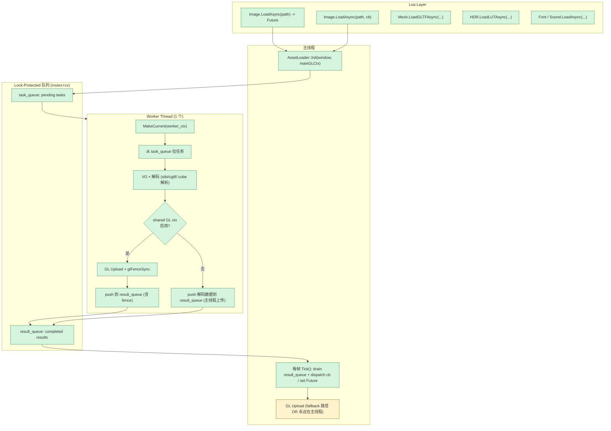

# Phase G.1 异步资源加载 — DESIGN (设计) 文档

> **阶段**：6A Workflow — 阶段 2 Architect
> **创建日期**：2026-05-17

---

## 1. 整体架构



## 2. 数据结构

### 2.1 Future / FutureState

```cpp
namespace AssetLoader {

enum class TaskType { Image, GLTF, LUT, Font, Sound };

struct FutureStateBase {
    std::atomic<int> status{0};   // 0=pending, 1=ready, 2=error
    std::string errorMsg;          // 仅 status==2 时有效
    // 派生类持各自的 raw decoded data + 上传完的 GL 资源 id
};

template<typename T>
struct Future {
    std::shared_ptr<FutureStateBase> state;
    bool IsReady() const { return state->status.load() != 0; }
    bool IsError() const { return state->status.load() == 2; }
    T*   Get();    // 调度后 Lua userdata
    const std::string& GetError() const { return state->errorMsg; }
};

}
```

### 2.2 Task

```cpp
struct Task {
    TaskType type;
    std::string path;
    std::shared_ptr<FutureStateBase> state;   // shared with Future / Lua
    int extraInt;       // Font: size; Sound: 0; etc.
};
```

### 2.3 Module-level state

```cpp
namespace AssetLoader {
    static std::thread             g_worker;
    static std::deque<Task>        g_taskQueue;
    static std::deque<Task>        g_resultQueue;
    static std::mutex              g_taskMutex;
    static std::mutex              g_resultMutex;
    static std::condition_variable g_taskCv;
    static std::atomic<bool>       g_shouldStop{false};
    static void*                   g_mainWindow = nullptr;
    static void*                   g_mainCtx    = nullptr;
    static void*                   g_workerCtx  = nullptr;
    static bool                    g_sharedCtxOk = false;   // false = fallback main-thread upload
}
```

## 3. 关键路径

### 3.1 Image 异步路径

```
[Main]  Lua Image.LoadAsync("foo.png")
   ↓
[Main]  AssetLoader::LoadImageAsync — push Task to task_queue, notify cv
   ↓
[Worker] 拉 Task, fopen + stbi_load → raw RGBA buffer
   ↓
[Worker] 若 g_sharedCtxOk: glGenTextures + glTexImage2D + glFenceSync, 状态 → ready_pending_fence
[Worker] 否则: 仅把 raw buffer 塞 state, 状态 → ready_pending_upload
   ↓
[Worker] push Task 到 result_queue, notify
   ↓
[Main]  Tick(): drain result_queue
   ↓
[Main]  若 ready_pending_fence: ClientWaitSync(fence, timeout=0)
            完成 → state->status = 1 (ready)
            未完成 → 放回 result_queue 下帧再试
[Main]  若 ready_pending_upload: backend->CreateTexture(...) + state->status = 1
   ↓
[Main]  若 Task 带 callback: 调 cb(image_userdata, err)
[Main]  若 Future 风格: Lua 端下次 Future:IsReady() 返 true
```

### 3.2 Mesh/glTF 异步路径

cgltf 解析在 worker, 内嵌纹理用同 worker 串行 stbi_load 解码 (单纹理也走 stbi). 上传在主线程 (mesh + 多纹理) 或共享 ctx 在 worker.

### 3.3 LUT 异步路径

.cube 文本解析或 stbi_load_16. 上传走 backend->CreateLUT3D / CreateLUT3DFloat. 与 Image 路径几乎一致.

### 3.4 Font 异步路径

Worker 读 TTF 二进制 + stbtt_InitFont. 主线程预烘焙 ASCII (因 BakeGlyph 调 ReplaceTexture 需主线程).

### 3.5 Sound 异步路径

miniaudio `ma_sound_init_from_file` 在 worker (miniaudio 内部线程安全).

## 4. 文件布局

| 新增文件 | 用途 |
|---------|------|
| ChocoLight/include/asset_loader.h | AssetLoader namespace + Future + LoadXxxAsync API |
| ChocoLight/src/asset_loader.cpp | 实现: worker thread + queue + Init/Shutdown/Tick |

| 改动文件 | 改动点 |
|---------|-------|
| ChocoLight/src/cc_core.cpp 或 light.cpp | Init: 启动 AssetLoader; 帧循环: 调 Tick; Shutdown: 停 |
| ChocoLight/src/light_graphics.cpp | 新增 Lua binding: l_Image_LoadAsync 等 5 套 |
| ChocoLight/src/light_graphics_image.cpp | 提供 Image::CreateFromAsyncResult 辅助 (从 raw bytes 创 Image userdata) |
| ChocoLight/src/light_graphics_mesh.cpp | 同 |
| ChocoLight/src/hdr_renderer.cpp | LUT 异步辅助 (或 light_graphics.cpp 端新增) |
| ChocoLight/CMakeLists.txt | 加 asset_loader.cpp |

## 5. Lua 表面 (5 套对称)

```lua
-- 共同模式: 第二参数可选, 是 function 或 nil

Light.Graphics.Image.LoadAsync(path[, cb]) -> Future or nil
Light.Graphics.Mesh.LoadGLTFAsync(path[, cb]) -> Future or nil
Light.Graphics.HDR.LoadLUTAsync(path[, cb]) -> Future or nil
Light.Graphics.Font(path, size, async=true[, cb]) -> Future
                            -- 重载现有 Font(path, size) (sync); async=true 走异步
                            -- 或加新 Light.Graphics.LoadFontAsync, 待用户偏好
Light.Audio.Sound.LoadAsync(path[, cb]) -> Future
```

Future userdata 方法:
```lua
h:IsReady() -> bool
h:IsError() -> bool
h:Get() -> resource, err   -- ready 时返 resource (nil err); error 时返 (nil, err); pending 时返 (nil, "pending")
h:GetError() -> string
```

## 6. 实施顺序

1. AssetLoader 基础设施 (Init/Shutdown/Tick + worker + queue + Future + Shared GL probe)
2. 单 P0 Image LoadAsync 端到端跑通 (Future + Callback)
3. Lua Future userdata 类型 + binding
4. Smoke 测试通过后再加 Mesh/LUT/Font/Sound
