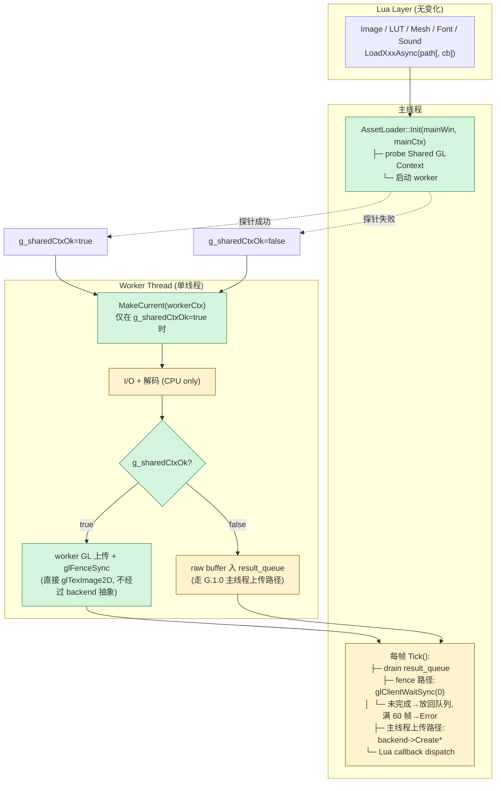

# Phase G.1.1 Shared GL Context — DESIGN (设计) 文档

> **阶段**：6A Workflow — 阶段 2 Architect
> **创建日期**：2026-05-17
> **依赖**：[ALIGNMENT_PhaseG_1_1.md](ALIGNMENT_PhaseG_1_1.md)

---

## 1. 整体架构



## 2. 数据结构 Delta

### 2.1 `AssetLoader::FutureState` 新增字段

```cpp
struct FutureState {
    // ... G.1.0 既有字段 ...

    // Phase G.1.1 — Shared GL Context 路径专用
    void* glFence       = nullptr;   // GLsync (= GLsync) — worker GL 上传后写入
    int   fenceWaitFrames = 0;       // Tick 已尝试等待的帧数 (满 60 转 Error)
};
```

> `void*` 而非 `GLsync`：避免 `asset_loader.h` 必须 `#include <glad/gl.h>`，保持头文件轻量；`asset_loader.cpp` 内强转。

### 2.2 模块级状态新增

```cpp
namespace AssetLoader {
    // ... 既有字段 ...
    static void* g_mainWin     = nullptr;   // light_ui.cpp 传入
    static void* g_mainCtx     = nullptr;   // 同上
    static void* g_workerCtx   = nullptr;   // probe 成功时持有, Shutdown 销毁
    static std::atomic<bool> g_sharedCtxOk{false};
}
```

## 3. 接口契约变更

### 3.1 `PlatformWindow` (新增 1 个 API)

```cpp
namespace PlatformWindow {
    // 既有
    void* CreateGLContext(void* win);

    // Phase G.1.1 新增 —— 创建一个与当前主 ctx 共享的 GL context
    // 调用前提: 主 ctx 必须 current. 内部设置 SDL_GL_SHARE_WITH_CURRENT_CONTEXT=1.
    // 返 nullptr → 不支持 shared ctx (调用方走 fallback)
    void* CreateSharedGLContext(void* win);
}
```

### 3.2 `AssetLoader::Init` 签名变更

```cpp
// G.1.0 (旧)
bool Init();

// G.1.1 (新)
//   mainWin / mainCtx: light_ui.cpp 持有的主窗口与主 GL context
//   返 false: worker thread 启动失败; shared ctx 失败仍返 true (走 fallback)
bool Init(void* mainWin, void* mainCtx);
```

## 4. 关键路径

### 4.1 启动序 (`Init` 内)

```
1. 校验 mainWin/mainCtx 非 null
2. probe Shared GL Context:
   - PlatformWindow::CreateSharedGLContext(mainWin) -> workerCtx
   - 若失败: g_sharedCtxOk=false, 不持 workerCtx
   - 若成功: g_sharedCtxOk=true, 暂存 g_workerCtx
3. 启动 worker thread (WorkerMain)
4. 日志:
   - g_sharedCtxOk=true  → "AssetLoader: Shared GL Context enabled"
   - g_sharedCtxOk=false → "AssetLoader: fallback to main-thread upload"
```

### 4.2 Worker 启动 (`WorkerMain` 入口)

```
1. 若 g_sharedCtxOk=true:
   - PlatformWindow::MakeCurrent(g_mainWin, g_workerCtx)
   - 用 gladLoadGL 加载 GL 函数指针 (worker ctx 自己的 dispatch table)
     [可选优化: 共享同一组 fn ptr]
2. stbi_set_flip_vertically_on_load_thread(0)
3. 进入 Task 拉取循环 (与 G.1.0 一致)
```

### 4.3 Worker 完成解码后的分支

```
若 g_sharedCtxOk=true:
   ┌─ 调原生 GL: glGenTextures + glPixelStorei + glTexImage2D + glGenerateMipmap
   │  (仅这些无状态机依赖的调用; 不调 backend->CreateTexture)
   ├─ glFlush() (确保命令进入 GPU 队列)
   ├─ state->glFence = glFenceSync(GL_SYNC_GPU_COMMANDS_COMPLETE, 0)
   ├─ state->resTexId = 上一步生成的 texture id
   └─ 入 result_queue (status 仍为 Pending, 等 Tick 翻 fence)

若 g_sharedCtxOk=false (fallback):
   ┌─ 把 raw 解码 buffer 塞入 state->pixels / state->lutPixels / ...
   └─ 入 result_queue (status 仍为 Pending, 等 Tick 走 backend->Create*)
```

### 4.4 `Tick` 主线程翻状态

```
对每个 result_queue 条目:
   case TaskType::Image / LUT / Font ... :
     if (state->glFence != nullptr) {
        // 走 G.1.1 fence 路径
        GLenum r = glClientWaitSync(fence, 0, 0);
        if (r == GL_ALREADY_SIGNALED || r == GL_CONDITION_SATISFIED) {
            glDeleteSync(fence);
            state->glFence = nullptr;
            state->status.store(Ready);
        } else if (r == GL_TIMEOUT_EXPIRED) {
            if (++state->fenceWaitFrames >= 60) {
                glDeleteSync(fence);
                state->glFence = nullptr;
                state->errorMsg = "fence wait exceeded 60 frames";
                state->status.store(Error);
            } else {
                // 放回 result_queue 下帧再试
                push_back_to_local_resultQueue(task);
                continue;
            }
        } else {
            glDeleteSync(fence);
            state->errorMsg = "glClientWaitSync failed";
            state->status.store(Error);
        }
     } else {
        // 走 G.1.0 主线程上传路径 (UploadImage_/UploadLUT_/...)
        UploadXxx_(*state, task.path);
     }
   // 接着原 callback dispatch 逻辑
```

### 4.5 Shutdown 序

```
1. g_shouldStop=true; cv.notify_all()
2. worker.join()
3. 若 g_workerCtx != nullptr:
   - PlatformWindow::DestroyGLContext(g_workerCtx)
   - g_workerCtx = nullptr
4. 把 result_queue 内所有 pending 标 Error (含未翻的 fence: glDeleteSync)
5. g_sharedCtxOk=false; g_running=false
```

## 5. 平台条件编译

```cpp
#if defined(__EMSCRIPTEN__) || defined(__ANDROID__) || defined(CHOCO_PLATFORM_IOS)
    // 移动 / Web: 永远 g_sharedCtxOk=false, 走 G.1.0 主线程上传
    // CreateSharedGLContext 直接返 nullptr
#else
    // 桌面: 完整 G.1.1 路径
#endif
```

## 6. 文件改动清单

| 文件 | 改动点 | 新增行数 (估) |
|------|-------|--------------|
| `@e:/jinyiNew/Light/ChocoLight/include/platform_window.h` | 加 `CreateSharedGLContext` 声明 | +5 |
| `@e:/jinyiNew/Light/ChocoLight/src/platform_window_sdl3.cpp` | 实现 `CreateSharedGLContext` | +25 |
| `@e:/jinyiNew/Light/ChocoLight/include/asset_loader.h` | `FutureState` +2 字段；`Init` 改签名 | +5 / 改 1 行 |
| `@e:/jinyiNew/Light/ChocoLight/src/asset_loader.cpp` | probe + worker GL 上传 + fence + Tick fence 路径 + Shutdown | +100~150 |
| `@e:/jinyiNew/Light/ChocoLight/src/light_ui.cpp` | `Init` 调用点改签名 | 改 1 行 |
| `@e:/jinyiNew/Light/scripts/smoke/asset_loader_async.lua` | 不动（API 表面无变化） | 0 |

## 7. 不变量

- 主线程 Lua callback dispatch 路径不变（Tick 末段，与 G.1.0 一致）。
- 5 类 `LoadXxxAsync` Lua 表面不变。
- `Future:Get()` 行为不变（pending/error/ready 三态语义一致）。
- Worker 永不调 `backend->Create*`（避免引入 backend 多线程契约）。
- Worker GL 调用集合限于：`glGenTextures` / `glPixelStorei` / `glTexImage2D` / `glTexParameteri` / `glGenerateMipmap` / `glBindTexture` / `glFlush` / `glFenceSync`。
