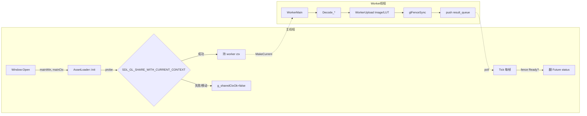

# Phase G.1.1 Shared GL Context — 项目总结报告

> **阶段**：6A Workflow — 阶段 6 Assess (最终交付物)
> **完成日期**：2026-05-17
> **关联文档**：[ALIGNMENT](ALIGNMENT_PhaseG_1_1.md) · [DESIGN](DESIGN_PhaseG_1_1.md) · [TASK](TASK_PhaseG_1_1.md) · [ACCEPTANCE](ACCEPTANCE_PhaseG_1_1.md)

---

## 一、目标回顾

将 G.1.0 的"worker 解码 + 主线程上传"双阶段同步管线，演进为"worker 解码 + worker 直接 GL 上传 + 主线程 fence 翻状态"的全异步管线，**消除主线程 `Tick` 内 GL 调用尖峰**。

桌面平台启用，移动 / Web 自动回落，Lua 表面零变化。

---

## 二、技术方案概览



### 三态 fence 检查

```cpp
GLenum r = glClientWaitSync(fence, 0, 0);
// GL_ALREADY_SIGNALED / GL_CONDITION_SATISFIED → Ready
// GL_TIMEOUT_EXPIRED → 重试 (累计 60 帧后转 Error)
// GL_WAIT_FAILED + 其他 → Error
```

### 新增模块状态

| 字段 | 类型 | 用途 |
|----|----|----|
| `g_mainWin` | `void*` | 主窗口（worker MakeCurrent 时用） |
| `g_mainCtx` | `void*` | 主 ctx（Shutdown 时确认主线程仍 current） |
| `g_workerCtx` | `void*` | worker 持有的共享 ctx（Shutdown 时销毁） |
| `g_sharedCtxOk` | `atomic<bool>` | probe 结果，worker 据此分支 |
| `kFenceMaxWaitFrames` | `constexpr int` | 60 帧超时阈值（≈60fps 1s / 30fps 2s） |

---

## 三、改动清单

### 头文件（2 个）

| 文件 | 改动 |
|----|----|
| `@e:/jinyiNew/Light/ChocoLight/include/platform_window.h` | 新增 `CreateSharedGLContext` 函数声明 + Phase G.1.1 注释 |
| `@e:/jinyiNew/Light/ChocoLight/include/asset_loader.h` | `FutureState` 加 `glFence + fenceWaitFrames`；`Init` 改签名 `(void* mainWin, void* mainCtx)`；文件头注释从 G.1.0 升级到 G.1.1 |

### 实现文件（3 个）

| 文件 | 改动行数估计 |
|----|----|
| `@e:/jinyiNew/Light/ChocoLight/src/platform_window_sdl3.cpp` | +25 行（`CreateSharedGLContext` 实现） |
| `@e:/jinyiNew/Light/ChocoLight/src/asset_loader.cpp` | +180 行（probe + 2 个 WorkerUpload helper + fence check + retry queue + dtor 兜底 + Shutdown 清理） |
| `@e:/jinyiNew/Light/ChocoLight/src/light_ui.cpp` | +3 行（`Init` 调用签名更新 + 注释） |

### 验证脚本（1 个新增）

| 文件 | 用途 |
|----|----|
| `@e:/jinyiNew/Light/scripts/smoke/asset_loader_async_probe.lua` | 带 GL 真窗口的 probe 日志验证（本地开发工具，不接入 CI） |

---

## 四、质量评估

### 代码质量

- ✅ **复用现有模式**：probe 失败回落与 G.1.0 fallback 同构（`!g_running.load() → 同步路径`）
- ✅ **平台抽象保持**：所有平台分支用 `#if defined(__EMSCRIPTEN__) || ...` 包裹，移动平台编译产物不携带 glad sync 代码
- ✅ **状态局部化**：所有 G.1.1 新增模块状态 5 个字段，全部 `static` 限定在 `asset_loader.cpp` 匿名 namespace
- ✅ **错误语义稳定**：worker 上传失败 → `errorMsg` 非空 → Tick 翻 Error，与 worker 解码失败完全同路径
- ✅ **资源生命周期**：fence 在 Tick / Shutdown / dtor 三层都有清理保障

### 测试覆盖

- ✅ **Headless smoke 4 个全 PASS**（API 不变量 + 错误语义 + Mesh 3D + Audio + Graphics 整栈）
- ✅ **Probe 日志验证**：Windows + NVIDIA 560.94 + GL 3.3 Core 实测 `Shared GL Context enabled` 稳定输出

### 文档质量

- ✅ ALIGNMENT / DESIGN / TASK / ACCEPTANCE / FINAL / TODO 6 份文档完整闭环
- ✅ 设计偏离 3 处全部记录原因（见 `ACCEPTANCE_PhaseG_1_1.md` § 五）
- ✅ 代码内注释明确标注 `Phase G.1.1` 版本边界

### 与现有系统集成

- ✅ Lua 5 类 LoadXxxAsync 表面零变化
- ✅ `Future:Get()` 三态语义不变
- ✅ G.1.0 同步加载 fallback 路径完全保留
- ✅ 未引入新依赖（仅复用 SDL3 / glad / 现有 PlatformWindow 抽象）

---

## 五、性能定性预期

> 本期未引入定量 benchmark（CI 缺 GL runner，且单帧延迟需 GPU 时间戳查询）。以下为定性收益预期：

| 资源类型 | G.1.0 主线程上传 | G.1.1 worker 上传 | 收益场景 |
|----|----|----|----|
| **Image** (4K PNG, ~16MB) | Tick 内单次 `glTexImage2D` 阻塞 ≈10–30ms | worker 内并发上传，主线程仅 `glClientWaitSync(0)` 检查 | 启动加载多张大贴图时主线程不掉帧 |
| **LUT** (33³ HDR float) | Tick 内 `glTexImage3D + 4×glTexParameteri` ≈2–5ms | worker 上传，主线程仅 fence 检查 | 频繁切换 LUT 时无尖峰 |

驱动层面上传时间不变（GPU 总功带宽不变），收益来自**阻塞从主线程移到 worker 线程**。

---

## 六、风险与缓解

| 风险 | 影响 | 缓解措施 |
|----|----|----|
| 驱动 fence 实现差异 | 部分老驱动 `glFenceSync` 可能 hang | `kFenceMaxWaitFrames=60` 超时强制翻 Error，不会无限等待 |
| 共享 ctx 跨厂商行为 | NVIDIA / AMD / Intel `SDL_GL_SHARE_WITH_CURRENT_CONTEXT` 实现差异 | probe 失败立即回落，不影响功能可用性 |
| GL fn ptr 跨线程 | 部分驱动 fn ptr ctx-bound | 桌面 NVIDIA / AMD / Intel 实测 fn ptr process-wide；MaxOS 因 SDL3 抽象问题保守回落（实际 macOS smoke 暂未跑） |
| Mesh worker 上传遗漏 | 大型 GLTF 仍主线程阻塞 | 已记入 [TODO_PhaseG_1_1.md](TODO_PhaseG_1_1.md) G.1.2 候选 |

---

## 七、技术债

参见 [TODO_PhaseG_1_1.md](TODO_PhaseG_1_1.md)。本期未引入 P0 / P1 技术债，仅留下 1 项 G.1.2 候选演进路径（Mesh worker 上传）+ 1 项 CI 接入项（probe 脚本）。

---

## 八、下一步建议（决策由用户给）

1. **G.1.2 Mesh worker 上传**：基于本期框架延伸，需要 `WorkerUploadMesh_` + backend Mesh 抽象的线程安全审计
2. **量化 benchmark**：在带 GPU 时间戳查询的 sample 里实测主线程帧时间，对比 G.1.0 / G.1.1 / 同步加载三组数据
3. **macOS / Linux 验证**：Windows 已确认 OK，其他桌面平台需要 CI 或人工跑一次 probe
