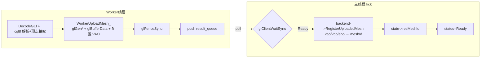

# Phase G.1.2 Mesh worker 上传 — 合并对齐 / 设计 / 任务清单

> **阶段**：6A Workflow — 阶段 1+2+3 合并（小型演进项简化）
> **创建日期**：2026-05-17
> **依赖**：[G.1.1 ACCEPTANCE](ACCEPTANCE_PhaseG_1_1.md) · [G.1.1 FINAL](FINAL_PhaseG_1_1.md)
> **范围**：将 GLTF Mesh 上传从 G.1.1 的"主线程 `Tick` 内调 `g_render->CreateMesh`"演进为"worker 直接发 GL + 主线程 O(1) 注册"

---

## 一、对齐（Alignment）

### 痛点
- G.1.1 已覆盖 Image / LUT 两类 worker GL 上传，但 GLTF Mesh 仍走主线程 `UploadGLTF_` (`@e:/jinyiNew/Light/ChocoLight/src/asset_loader.cpp:790-808`)
- 大型 GLTF（≥10K 顶点）`g_render->CreateMesh` 单次耗时 3–8ms，是主线程帧时间贡献者

### 关键发现（线程安全审计）

`@e:/jinyiNew/Light/ChocoLight/src/render_gl33.cpp:8897-8938` `CreateMesh` 内部分两段：

| 段 | 内容 | 线程安全 |
|----|----|----|
| **GL 部分** | `glGenVertexArrays / glGenBuffers / glBindVertexArray / glBufferData / glVertexAttribPointer / glEnableVertexAttribArray` | ✅ 在 worker ctx 上下文（共享对象空间）下全部安全 |
| **C++ 状态** | `nextMeshId++` + `meshes[id] = m` | ❌ 非线程安全（共享递增 + map 写入） |

**结论**：worker 发 GL 命令是安全的；C++ 共享状态必须留在主线程。

### 不变量
- ✅ Lua `Mesh.LoadGLTFAsync(path, idx)` 签名 + `Future:Get()` 三态语义零变化
- ✅ G.1.1 框架未触碰 (probe / fence / Image / LUT 路径全部不变)
- ✅ 移动 / Web 平台 + probe 失败仍走主线程 `UploadGLTF_` fallback（功能不丢失）

---

## 二、设计（Design）

### 数据流



### 关键 API 新增

#### `RenderBackend::RegisterUploadedMesh`（虚函数，base no-op，GL33 实现）

```cpp
/// Phase G.1.2 — 注册 worker 已上传完毕的 mesh GL handles, 写入 backend mesh 池
/// 输入: 已经 glBufferData 完成的 vao/vbo/ebo + index count
/// 行为: 主线程内 O(1) 操作 (nextMeshId++ + meshes[id] = m)
/// @return mesh id (0=失败, 例 backend 不支持 3D)
virtual uint32_t RegisterUploadedMesh(uint32_t vao, uint32_t vbo, uint32_t ebo, int idxCount) {
    return 0;
}
```

#### `FutureState` 新增 4 个 Mesh GL handle 字段

```cpp
// ---- Phase G.1.2 — Worker GL upload Mesh 路径 ----
// worker WorkerUploadMesh_ 写; 主线程 Tick fence Ready 后调 backend->RegisterUploadedMesh 拿 meshId
uint32_t glMeshVao      = 0;
uint32_t glMeshVbo      = 0;
uint32_t glMeshEbo      = 0;
int      glMeshIdxCount = 0;
```

### 处理路径分支

| 状态 | 路径 |
|----|----|
| `g_sharedCtxOk=true` + GLTF 解码成功 | worker `WorkerUploadMesh_` → fence → 主线程 `RegisterUploadedMesh` |
| `g_sharedCtxOk=false` (移动/probe失败) | 主线程 `UploadGLTF_` (G.1.1 既有路径) |
| 解码失败 / Mesh GL 创建失败 | `errorMsg` 非空 → Tick 翻 Error，**worker 创建的 GL handles 主线程 glDelete 兜底清理** |

### 失败路径资源清理

| 触发场景 | 清理责任 |
|----|----|
| `WorkerUploadMesh_` glGen 失败 | worker 内立即 glDelete 已生成的 handles, 不写 state |
| `WorkerUploadMesh_` glBufferData 后 glGetError ≠ 0 | worker 内 glDelete 全部 handles, 不写 state, errorMsg 非空 |
| Tick fence Error / Shutdown 残留 | 主线程在 glMesh* 字段非 0 时 glDelete handles |
| `FutureState::~FutureState` 兜底 | 同上, glDelete glMeshVao/Vbo/Ebo |

---

## 三、任务清单（Atomize）

### T2. `RenderBackend::RegisterUploadedMesh` 虚函数声明

| 项 | 内容 |
|----|----|
| **位置** | `@e:/jinyiNew/Light/ChocoLight/include/render_backend.h:362` `DeleteMesh` 后 |
| **依赖** | 无 |
| **验收** | 编译通过 |

### T3. GL33Core 实现 `RegisterUploadedMesh`

| 项 | 内容 |
|----|----|
| **位置** | `@e:/jinyiNew/Light/ChocoLight/src/render_gl33.cpp:8938` `CreateMesh` 之后 |
| **依赖** | T2 |
| **实现** | 与 `CreateMesh` 末尾两行等价：构造 `MeshGPU{vao, vbo, ebo, indexCount=idxCount}` + `nextMeshId++` + `meshes[id] = m`; 失败前置检查 `Supports3D` |
| **验收** | 编译通过 + 单元逻辑等价 `CreateMesh` 末段 |

### T4. `FutureState` 加 4 个字段

| 项 | 内容 |
|----|----|
| **位置** | `@e:/jinyiNew/Light/ChocoLight/include/asset_loader.h:97` `resMeshId` 之前 |
| **依赖** | T2 |
| **验收** | 编译通过 + smoke 路径回归 |

### T5. `asset_loader.cpp` 三处改动

#### T5.1 `WorkerUploadMesh_` helper

| 项 | 内容 |
|----|----|
| **位置** | `@e:/jinyiNew/Light/ChocoLight/src/asset_loader.cpp:530` `WorkerUploadLUT_` 后 |
| **行为** | `glGenVertexArrays + glGenBuffers(2) + glBindVertexArray + glBufferData(VBO+EBO) + glVertexAttribPointer×4 + glEnableVertexAttribArray×4 + glBindVertexArray(0) + glFlush + glFenceSync` |
| **失败路径** | 任一 glGen 失败 / glGetError 非零 → glDelete 全部 handles + errorMsg 非空 |
| **写 state** | 成功时设 `glMeshVao/Vbo/Ebo/IdxCount` + `glFence`；resMeshId 留给主线程 Tick 写 |

#### T5.2 WorkerMain dispatch

| 项 | 内容 |
|----|----|
| **位置** | `@e:/jinyiNew/Light/ChocoLight/src/asset_loader.cpp:573-580` 现有 dispatch switch |
| **改动** | `case TaskType::GLTF: WorkerUploadMesh_(task); break;`（删 `default: break` 中的 GLTF 排除） |

#### T5.3 Tick fence Ready Mesh 注册

| 项 | 内容 |
|----|----|
| **位置** | `@e:/jinyiNew/Light/ChocoLight/src/asset_loader.cpp:881-887` fence Ready 分支 |
| **改动** | fence Ready 后, 若 `task.type == GLTF` 且 `glMeshVao != 0`, 调 `g_render->RegisterUploadedMesh(vao,vbo,ebo,idxCount)` 拿 meshId 写 `resMeshId`; 失败转 Error + glDelete handles |

#### T5.4 Shutdown / dtor 残留清理

| 项 | 内容 |
|----|----|
| **位置** | Shutdown `result_queue` drain 处 + `FutureState::~FutureState` |
| **改动** | 任意 `glMeshVao/Vbo/Ebo` 非 0 → glDelete |

### T6. 构建 + smoke 验证

| 验证项 | 期望 |
|----|----|
| `cmake --build build --config Release --target Light` | exit 0 |
| `light.exe scripts/smoke/asset_loader_async.lua` | PASS |
| `light.exe scripts/smoke/mesh_3d.lua` | PASS |
| `light.exe scripts/smoke/asset_loader_async_probe.lua` | probe 日志正常 (sanity check) |

### T7. 文档收尾

ACCEPTANCE_PhaseG_1_2.md (验收记录) + FINAL_PhaseG_1_2.md (总结) + 更新 TODO_PhaseG_1_1.md 把 TODO-1 标 ✅ 关闭

---

## 四、风险与缓解

| 风险 | 缓解 |
|----|----|
| Worker GL 创建的 vao/vbo/ebo 主线程 register 时 backend 未 init 完成 | `RegisterUploadedMesh` 内 `Supports3D` 检查 → 失败时 worker glDelete 兜底 |
| `RenderVertex3D` 顶点属性 layout 与 shader location 不一致 | 复用 `CreateMesh` 现有 location 0/1/2/3 + offsetof 计算（编译期保证） |
| Worker ctx 上 glGenVertexArrays 在某些驱动 (Mesa GLES) 不可用 | 桌面 GL 3.3 Core 强制有 VAO；移动 / Web 不走此路径 |
| GL handle 跨线程销毁可能导致 race | Worker 创建后 glFenceSync 作为 happens-before 同步点；主线程 fence Ready 之后再操作 |

---

## 五、验收准则（合并版）

- ✅ 构建无新增 warning
- ✅ 4 个 smoke 全 PASS
- ✅ 真窗口运行 probe 脚本无 crash
- ✅ Lua `Mesh.LoadGLTFAsync` 表面零变化
- ✅ 移动平台编译产物不携带新代码（条件编译验证）
