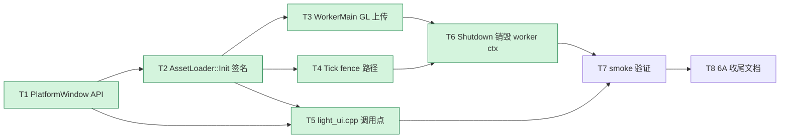

# Phase G.1.1 Shared GL Context — TASK (原子任务) 文档

> **阶段**：6A Workflow — 阶段 3 Atomize
> **创建日期**：2026-05-17
> **依赖**：[DESIGN_PhaseG_1_1.md](DESIGN_PhaseG_1_1.md)

---

## 任务依赖图

---

## T1. PlatformWindow 新增 `CreateSharedGLContext`

| 项 | 内容 |
|----|------|
| **输入契约** | 主线程已 current 主 ctx；`win` 非 null |
| **输出契约** | 桌面：返与主 ctx 共享的 `SDL_GLContext`，失败返 nullptr；移动/Web：永远返 nullptr |
| **依赖** | 无（独立改 PlatformWindow 抽象） |
| **位置** | `@e:/jinyiNew/Light/ChocoLight/include/platform_window.h:144` 后；`@e:/jinyiNew/Light/ChocoLight/src/platform_window_sdl3.cpp:262` `CreateGLContext` 旁 |
| **实现要点** | 桌面分支：`SDL_GL_SetAttribute(SDL_GL_SHARE_WITH_CURRENT_CONTEXT, 1)` → `SDL_GL_CreateContext` → 失败时打 LOG_INFO（非 ERROR，因为是 probe）；移动/Web：直接 `return nullptr` |
| **验收** | 单元测试 / 手验：在 `light.exe` 启动时主 ctx current 后调一次返非 null；Android 编译产物里此函数返 null（条件编译验证） |

---

## T2. `AssetLoader::Init` 签名变更 + probe

| 项 | 内容 |
|----|------|
| **输入契约** | `mainWin` `mainCtx` 非 null |
| **输出契约** | 启动 worker；`g_sharedCtxOk` 设置为 probe 结果；启动日志含 `Shared GL Context enabled` 或 `fallback to main-thread upload` |
| **依赖** | T1 |
| **位置** | `@e:/jinyiNew/Light/ChocoLight/include/asset_loader.h::Init`；`@e:/jinyiNew/Light/ChocoLight/src/asset_loader.cpp:454-468` |
| **实现要点** | (1) 头文件改签名；(2) 内部存 `g_mainWin/g_mainCtx`；(3) 调 `PlatformWindow::CreateSharedGLContext(mainWin)`，结果存 `g_workerCtx`；(4) 设 `g_sharedCtxOk` atomic；(5) 启动 worker（与 G.1.0 一致） |
| **验收** | `Init` 返 true 时 `g_sharedCtxOk` 反映 probe 结果；ctx 创建失败不让 `Init` 返 false |

---

## T3. `WorkerMain` 加 GL 上传分支

| 项 | 内容 |
|----|------|
| **输入契约** | T2 已设 `g_sharedCtxOk` 与 `g_workerCtx` |
| **输出契约** | 解码后视 `g_sharedCtxOk` 决定 (a) 走 worker GL 上传 + fence 或 (b) 走 raw buffer 入 result_queue |
| **依赖** | T2 |
| **位置** | `@e:/jinyiNew/Light/ChocoLight/src/asset_loader.cpp::WorkerMain` |
| **实现要点** | (1) WorkerMain 入口：若 `g_sharedCtxOk=true`，调 `PlatformWindow::MakeCurrent(g_mainWin, g_workerCtx)` + `gladLoadGL(...)`（worker 自己的 dispatch table）；(2) 5 个 Decode_ 函数后插一个 `MaybeUploadInWorker_` helper：仅 Image/LUT/Font 走（Mesh 涉及 VBO/IBO 暂不走；Sound 无 GL）；(3) `glFlush()` + `glFenceSync` 写入 `state->glFence` |
| **验收** | 桌面 build 时调试日志能看到 worker 内 `glGenTextures`/`glFenceSync` 路径触发；fallback 时不触达 GL 调用 |
| **范围裁剪** | **本期 T3 仅覆盖 Image / LUT / Font 三类**（与现有 `UploadImage_/UploadLUT_/UploadFont_` 一一对应；Mesh 走 VAO+VBO+IBO 涉及更多 backend 抽象，留 G.1.2；Sound 无 GL） |

---

## T4. `Tick` 加 fence 翻状态路径

| 项 | 内容 |
|----|------|
| **输入契约** | result_queue 条目可能含 `glFence != nullptr` 的 fence-pending 类型 |
| **输出契约** | fence 已 signaled → `state->status=Ready`；timeout 60 帧 → `state->status=Error`；其他 → 原 G.1.0 主线程上传路径 |
| **依赖** | T3（fence 写入由 T3 产出） |
| **位置** | `@e:/jinyiNew/Light/ChocoLight/src/asset_loader.cpp::Tick` |
| **实现要点** | (1) 在 `switch(task.type)` 之前加 `if (state->glFence)` 分支；(2) 用本地 std::deque 暂存"未完成"的 task，循环结束后整体 push 回 `g_resultQueue`（避免锁内死循环）；(3) `glClientWaitSync` 的 GLsync 强转 + glDeleteSync；(4) `state->fenceWaitFrames` 计数 |
| **验收** | smoke 不破；可在主线程测出 fence 翻转时刻；放回路径不死循环 |

---

## T5. `light_ui.cpp` 调用点改签名

| 项 | 内容 |
|----|------|
| **输入契约** | 主 ctx 已 current（`@e:/jinyiNew/Light/ChocoLight/src/light_ui.cpp:486`） |
| **输出契约** | `AssetLoader::Init(g_mainWindow, g_glContext)` |
| **依赖** | T2 |
| **位置** | `@e:/jinyiNew/Light/ChocoLight/src/light_ui.cpp:531-533` |
| **实现要点** | 一行改写；保留失败时的 LOG_WARN 兜底 |
| **验收** | 编译通过；启动日志能看到新增的 probe 信息 |

---

## T6. `Shutdown` 销毁 worker ctx + fence 清理

| 项 | 内容 |
|----|------|
| **输入契约** | worker thread 已 join |
| **输出契约** | `g_workerCtx` 释放；result_queue 中所有 pending fence 清理；`g_sharedCtxOk=false` |
| **依赖** | T3, T4 |
| **位置** | `@e:/jinyiNew/Light/ChocoLight/src/asset_loader.cpp::Shutdown` |
| **实现要点** | (1) join 后遍历 `g_resultQueue` + `g_taskQueue` 中可能还持 fence 的 state，调 `glDeleteSync`；(2) `PlatformWindow::DestroyGLContext(g_workerCtx)`；(3) **顺序**：必须 worker join 完毕、且主 ctx 仍 current 时销毁 |
| **验收** | 退出时无 GL 资源泄漏告警；`atexit` 没有崩溃 |

---

## T7. Smoke 验证

| 项 | 内容 |
|----|------|
| **输入契约** | T1–T6 完成 |
| **输出契约** | 全 smoke 不回归；启动日志含 probe 字符串 |
| **依赖** | T1–T6 |
| **位置** | `@e:/jinyiNew/Light/scripts/smoke/asset_loader_async.lua`（不必改）；新增手动测试步骤 |
| **实现要点** | (1) `light.exe asset_loader_async.lua` 跑 PASS；(2) `mesh_3d.lua` / `audio_3d_mixer_effect.lua` / `graphics.lua` 跑 PASS；(3) 启动日志含 `AssetLoader: Shared GL Context enabled`（headless 模式下 fallback 也 OK） |
| **验收** | 三条命令退出码 0；日志符合预期 |

---

## T8. 6A 收尾文档

| 项 | 内容 |
|----|------|
| **依赖** | T7 |
| **位置** | `docs/Phase G.1 异步资源加载/` |
| **产出** | `ACCEPTANCE_PhaseG_1_1.md` / `FINAL_PhaseG_1_1.md` / 更新 `TODO_PhaseG_1.md`（划掉 T1，新增 G.1.2 Mesh worker 上传待办） |

---

## 验收总清单

| 验证项 | 命令 / 检查点 |
|--------|--------------|
| 桌面 Release build | `cmake --build build --config Release --target Light` exit 0 |
| Lua 语法 | `lightc.exe -p scripts/smoke/asset_loader_async.lua` exit 0 |
| Async smoke | `light.exe scripts/smoke/asset_loader_async.lua` exit 0 + 2 PASS |
| Mesh 回归 | `light.exe scripts/smoke/mesh_3d.lua` exit 0 |
| Audio 回归 | `light.exe scripts/smoke/audio_3d_mixer_effect.lua` exit 0 |
| Graphics 回归 | `light.exe scripts/smoke/graphics.lua` exit 0 |
| probe 日志 | 启动 stdout 含 `Shared GL Context enabled` 或 `fallback to main-thread upload` |
| Headless 兼容 | smoke headless 模式下 probe=false 走 fallback 不报错 |
