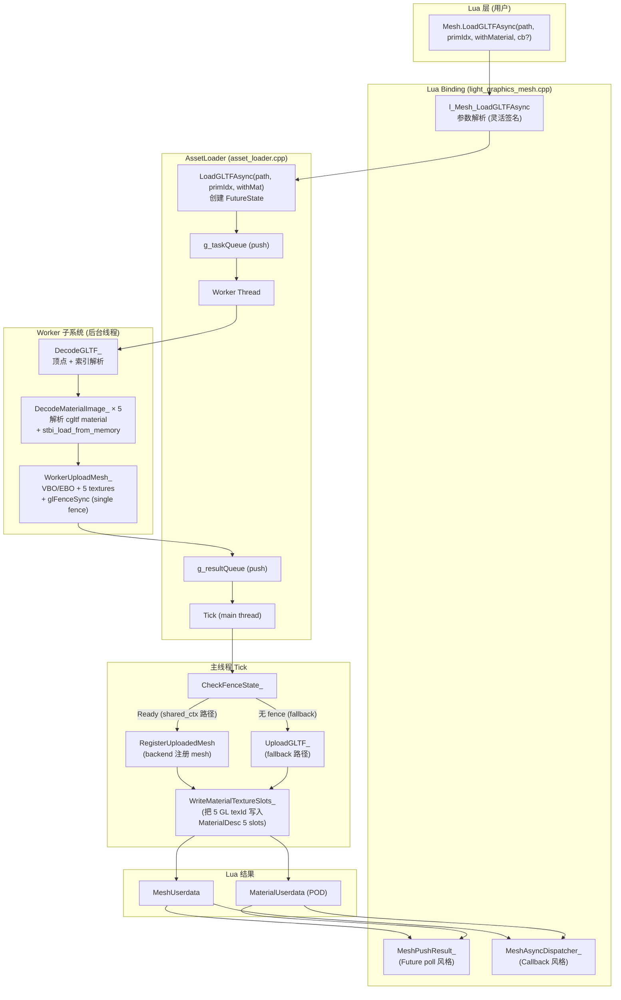
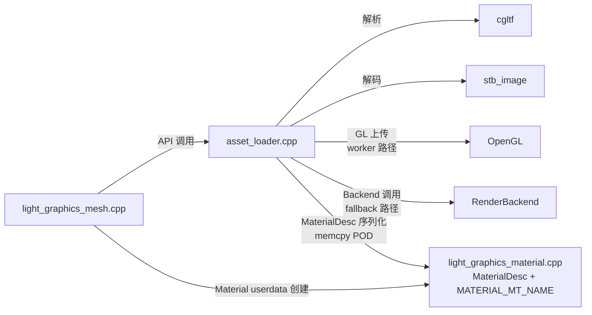
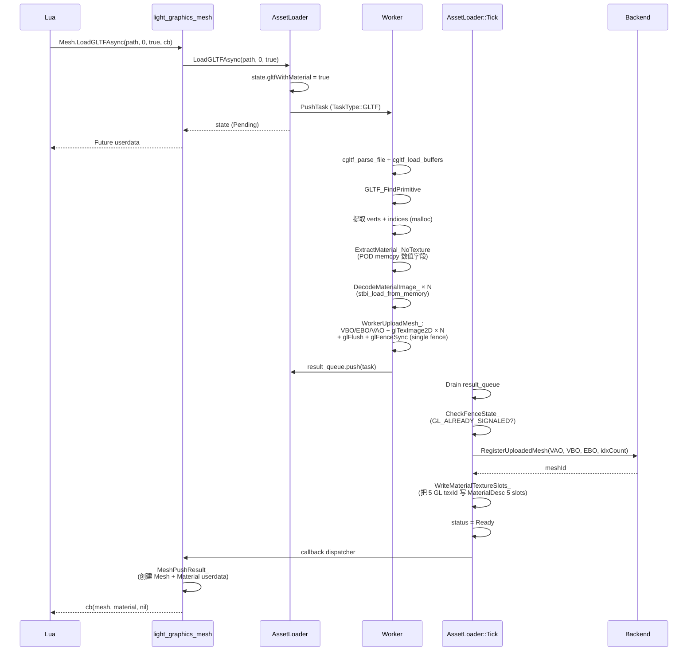
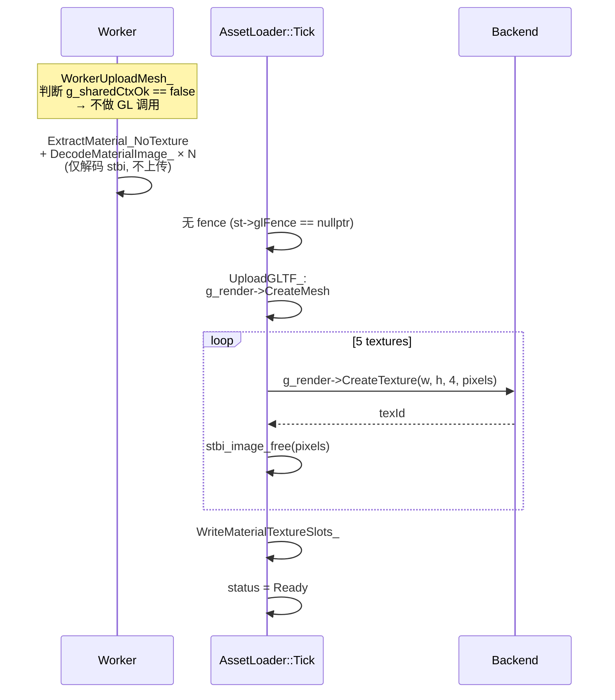
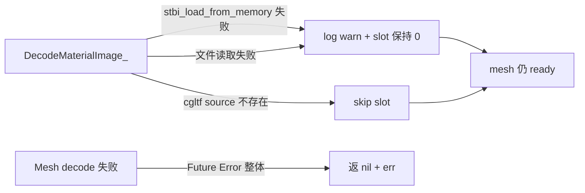

# Phase G.1.5 — 设计文档 (Design)

> **6A 工作流 阶段 2 — Architect**
> **创建日期**：2026-05-18
> **基于**：`CONSENSUS_PhaseG_1_5.md` 锁定的需求与验收

---

## 一. 整体架构



---

## 二. 分层设计

### 2.1 系统层级

| 层级 | 文件 | 职责 |
|----|----|----|
| **Lua 层** | (用户脚本) | 调 `Mesh.LoadGLTFAsync` 拿 Future / 注册 cb |
| **Binding 层** | `light_graphics_mesh.cpp` | 灵活签名解析 + Future/Callback 路径分发 |
| **AssetLoader 公共层** | `asset_loader.h/cpp` API | LoadGLTFAsync / Tick / Future 生命周期 |
| **AssetLoader Worker 层** | `asset_loader.cpp` (worker) | 解析 + 解码 + GL 上传 |
| **AssetLoader 主线程层** | `asset_loader.cpp` (Tick) | fence 检查 + RegisterUploadedMesh + Material slots 写入 |
| **Backend 层** | `render_backend.h/cpp` | 已有 `RegisterUploadedMesh` + `CreateTexture` (无新增) |

### 2.2 核心组件

#### 2.2.1 `FutureState` 扩展 (asset_loader.h)

```cpp
struct FutureState {
    // ... 现有字段 ...

    // ---- Phase G.1.5 — GLTF Material ----
    bool                          gltfWithMaterial = false;
    char                          gltfMaterialDesc[128];      // POD MaterialDesc 序列化
    std::vector<MaterialImageJob> gltfMaterialImages;
};

struct MaterialImageJob {
    int      slotIdx;        // 0..4 对应 MaterialDesc 5 个 texXxx slot
    int      w, h;
    uint8_t* pixels;         // worker malloc; 上传完释放; ~RAII 在 FutureState 析构兜底
    uint32_t glTexId;        // 上传完成后的 GL texture id (0=失败)
};
```

#### 2.2.2 `DecodeMaterialImage_` (新 helper, worker 线程)

输入：`cgltf_texture_view` + slotIdx + gltfDir
处理：3 来源逻辑 (buffer_view / data: URI / 文件路径) + `stbi_load_from_memory`
输出：填 `FutureState.gltfMaterialImages` 一个 entry

#### 2.2.3 `ExtractMaterial_NoTexture` (新 helper, worker 线程)

复用同步 `ExtractMaterial` 的数值字段提取逻辑，但 **不调** `LoadGLTFImage` (worker 不能调 backend)。
texture id slot 留 0，由主线程 `WriteMaterialTextureSlots_` 后写。

#### 2.2.4 `WriteMaterialTextureSlots_` (新 helper, 主线程)

输入：`FutureState&`
处理：从 `gltfMaterialDesc` 反序列化 MaterialDesc → 把 `gltfMaterialImages[*].glTexId` 按 slotIdx 写入 5 个 texXxx slot → 重新序列化回 `gltfMaterialDesc`
输出：MaterialDesc 完整 (含 texture id)

### 2.3 模块依赖关系



**关键**: `asset_loader.cpp` **不** include `light_graphics_material.h` (避免循环依赖)，而是用 `char[128]` POD 序列化 MaterialDesc。Material 创建在 binding 层 (`light_graphics_mesh.cpp`) 完成。

---

## 三. 数据流详细图

### 3.1 Worker 路径 (shared_ctx OK)



### 3.2 Fallback 路径 (shared_ctx 失败)



### 3.3 失败兜底数据流



---

## 四. 接口契约

### 4.1 Lua API (binding 层)

```lua
-- 灵活签名
Future = Mesh.LoadGLTFAsync(path)
Future = Mesh.LoadGLTFAsync(path, primIdx)
Future = Mesh.LoadGLTFAsync(path, primIdx, true)            -- with material
nil    = Mesh.LoadGLTFAsync(path, cb)                       -- cb(mesh, err)
nil    = Mesh.LoadGLTFAsync(path, primIdx, cb)              -- cb(mesh, err)
nil    = Mesh.LoadGLTFAsync(path, primIdx, true, cb)        -- cb(mesh, material, err)
nil    = Mesh.LoadGLTFAsync(path, primIdx, false, cb)       -- cb(mesh, err) 显式 false

-- Future poll
Future:IsReady() -> bool
Future:IsError() -> bool
Future:Get()     -> mesh             -- with_material=false
Future:Get()     -> mesh, material   -- with_material=true (失败时返 nil + err)
```

### 4.2 C++ API (asset_loader.h)

```cpp
namespace AssetLoader {
    // 改: 加 withMaterial 默认参数
    std::shared_ptr<FutureState> LoadGLTFAsync(const char* path, int primIdx,
                                                 bool withMaterial = false);

    // 新: MaterialImageJob 结构体 (内部)
    struct MaterialImageJob {
        int      slotIdx;
        int      w, h;
        uint8_t* pixels;
        uint32_t glTexId;
    };

    // FutureState 加 3 字段:
    //   bool                          gltfWithMaterial
    //   char                          gltfMaterialDesc[128]
    //   std::vector<MaterialImageJob> gltfMaterialImages
}
```

### 4.3 内部 helper (asset_loader.cpp)

```cpp
// Worker 线程
static void DecodeMaterialImage_(const cgltf_texture_view& view,
                                   int slotIdx, FutureState& st,
                                   const std::string& gltfDir);

static void ExtractMaterial_NoTexture(MaterialDesc& d,
                                        const cgltf_material* mat);

// 主线程
static void WriteMaterialTextureSlots_(FutureState& st);
```

### 4.4 binding 层 helper (light_graphics_mesh.cpp)

```cpp
// 新: 把 MaterialDesc 序列化字节 (char[128]) 反序列化 + push 一个 MaterialUserdata 到栈顶
static void PushMaterialFromBytes(lua_State* L, const char* descBytes);
```

---

## 五. 异常处理策略

### 5.1 错误分级

| 级别 | 触发条件 | 行为 | 用户感知 |
|----|----|----|----|
| **致命错误** | mesh 顶点解析失败 / cgltf parse error | Future Error + 整体失败 | `Get()` 返 nil + err |
| **装饰性失败** | image 解码失败 / source 不存在 / glTexImage2D err | log WARN + slot=0 + mesh 仍 ready | mesh 可用，texture 为 0 (默认白色 fallback) |
| **配置错误** | path 为空 / withMaterial=true 但 cgltf 无 material | Future Error / mesh 仍 ready (无 material) | 与同步路径一致 |

### 5.2 资源生命周期

| 资源 | 所有权 | 释放时机 |
|----|----|----|
| `MaterialImageJob.pixels` (worker malloc) | `FutureState.gltfMaterialImages` | 上传完释放; FutureState 析构兜底 (~MaterialImageJob 在 FutureState dtor 中遍历 stbi_image_free 未释放的) |
| `gltfData` (cgltf_data*) | `FutureState.gltfData` | 主线程 Tick 完成 material 写入后 free |
| `gltfVerts/gltfIndices` (worker malloc) | `FutureState` | mesh upload 完成后 free (与 G.1.0 一致) |
| GL texture id (worker glGenTextures) | g_render backend (一旦 RegisterUploadedMesh-like 注册) | 与 mesh 生命周期绑定; 失败时 worker 自己 glDeleteTextures 兜底 |

### 5.3 失败回滚

worker 上传失败 (任一 glTexImage2D err)：
1. 立即 `glDeleteTextures` 兜底已 gen 的 texture
2. job.glTexId 留 0
3. job.pixels 仍可能保留 (stbi 解码成功但 GL 失败) → main thread WriteMaterialTextureSlots_ 跳过 slot 写入
4. **不影响** mesh 主体的 fence 链路 (mesh fence 单独，纹理 fence 与之共用)

worker 解析 cgltf 失败 (cgltf_parse_file err)：
- 现有逻辑：`task.state->errorMsg = "cgltf_parse_file err ..."` → Tick 翻 Error
- material 字段未初始化，gltfWithMaterial 不再生效 (mesh 也已失败)

### 5.4 fence 超时处理

现有 G.1.1 fence 超时已处理 mesh handles 兜底删除：

```cpp
if (st->glMeshVao) { GLuint v = st->glMeshVao; glDeleteVertexArrays(1, &v); ... }
if (st->glMeshVbo) { ... }
if (st->glMeshEbo) { ... }
```

**G.1.5 新增**: fence 超时时也要兜底删除 material textures：

```cpp
for (auto& job : st->gltfMaterialImages) {
    if (job.glTexId) {
        GLuint t = job.glTexId; glDeleteTextures(1, &t);
        job.glTexId = 0;
    }
    if (job.pixels) { stbi_image_free(job.pixels); job.pixels = nullptr; }
}
```

放在 `CheckFenceState_` 返回 r=2 (失败) 路径。

---

## 六. 关键设计决策详细说明

### 6.1 为什么 single fence 而非 N+1 fence？

shared_ctx 路径下，worker 串行调 mesh upload + 5 texture upload，**整个 GL command 流是同一队列**。glFenceSync 在最后 glFlush 后插入一次，等待该 fence 即等待**所有先前命令完成**。

优点：
- 减少 fence 对象 (5 个 texture × 1 fence 节省 5 个 GLsync)
- Tick 主线程 CheckFenceState_ 仅一次
- 简化错误处理

缺点：
- 任一 texture 上传失败不会单独导致 fence 失败 (GL 失败立即 glGetError 抓, 不依赖 fence)

### 6.2 为什么 char[128] 序列化 MaterialDesc 而非直接 include？

`asset_loader.h` 是底层 worker thread 公共头, **不应** 依赖 `light_graphics_material.h` (binding 层)。

POD memcpy 序列化是经典做法：
- worker 内 `memcpy(state.gltfMaterialDesc, &md, sizeof(MaterialDesc));` (worker 不需要 include header)
- binding 层 `MaterialDesc* d = (MaterialDesc*)state.gltfMaterialDesc;` (binding 已 include header)

`sizeof(MaterialDesc) ≈ 80`, 留 128 字节余量防 future 字段扩展。

**Static assert** 在 binding 层做：
```cpp
static_assert(sizeof(MaterialDesc) <= 128,
              "MaterialDesc 超过 FutureState 序列化 buffer; 加大 gltfMaterialDesc[128] 容量");
```

### 6.3 为什么 worker 串行解码 5 张图？

现状：单 worker thread (asset_loader.cpp:127)。
方案 A (串行)：单工 5 张图依次 `stbi_load_from_memory`, 总耗时 ~50-100ms。
方案 B (并发)：thread pool, 多工并行解码。

**选择 A** 理由：
1. 主线程不感知 worker 内部串行 vs 并行 (反正主线程不阻塞)
2. 改并发要重构 task queue (per-task internal job queue) + 锁，复杂度跳升
3. G.1.6 (后续 phase) 可单独优化为 thread pool, 不影响 G.1.5 用户 API

---

## 七. 性能模型

### 7.1 Worker 路径时序 (shared_ctx OK)

| 阶段 | 估时 | 主线程影响 |
|----|----|----|
| cgltf parse + load buffers | 5-20ms | 0 |
| 提取 verts + indices (malloc 1MB) | 1-5ms | 0 |
| ExtractMaterial 数值字段 | < 0.1ms | 0 |
| stbi_load_from_memory × 5 (1024×1024 PNG) | 30-80ms | 0 |
| WorkerUploadMesh_ (VBO + EBO + 5 textures) | 5-20ms | 0 |
| glFenceSync | < 0.01ms | 0 |
| **Worker 总计** | **40-125ms** | **0** |
| Tick CheckFenceState_ | < 0.01ms | < 0.01ms |
| RegisterUploadedMesh + WriteMaterialTextureSlots_ | < 0.1ms | < 0.1ms |
| **主线程 P95 帧时间增量** | — | **< 1ms** ✅ 达标 |

### 7.2 Fallback 路径时序

| 阶段 | 估时 | 主线程影响 |
|----|----|----|
| Worker 解码 (含 5 stbi_load) | 35-100ms | 0 |
| Tick UploadGLTF_ CreateMesh | 1-3ms | 1-3ms |
| Tick CreateTexture × 5 (1024×1024) | 5-15ms | 5-15ms |
| **主线程单帧总计** | — | **6-18ms** (一帧内完成, 可能丢一帧) |

fallback 路径下若纹理特别大 (4K) 可能掉帧，但仍优于同步 LoadGLTF 全程阻塞。

---

## 八. 测试策略

### 8.1 Smoke 用例覆盖矩阵

| # | 用例 | 命中路径 | 验证点 |
|----|----|----|----|
| 1 | LoadGLTFAsync (无 material) | worker only mesh | mesh 单值 |
| 2 | LoadGLTFAsync (with material) | worker + 5 textures | (mesh, material) 双值 |
| 3 | Material 数值字段 | ExtractMaterial_NoTexture | baseColorFactor / metallic / roughness 准确 |
| 4 | Material baseColor texture id | DecodeMaterialImage_ + WriteSlots | texBaseColor != 0 |
| 5 | Callback 风格 (with material) | MeshAsyncDispatcher_ | cb 收 3 参 |
| 6 | 错误路径: 文件不存在 | DecodeGLTF_ 错误 | Future Error + errMsg |
| 7 | 错误路径: 损坏 GLB | cgltf parse fail | Future Error |
| 8 | with_material=false 默认行为 | 现有路径不破坏 | mesh 1 值 (回归保护) |

### 8.2 Fixture 设计

`scripts/smoke/assets_g1_5/test_box_textured.glb`：
- 1 mesh, 1 primitive, 1 material
- 4 vertices (quad)
- baseColorFactor = [0.8, 0.5, 0.2, 1.0] (橙色)
- metallicFactor = 0.7
- roughnessFactor = 0.3
- baseColorTexture = 1×1 PNG (红色 0xFF0000FF)

生成工具：`dev/gen_test_glb.py` (Python 脚本, 一次性运行后 .glb 入仓)。

---

## 九. 改动清单预测

| 文件 | 改动类型 | 估行数 |
|----|----|----|
| `@e:/jinyiNew/Light/ChocoLight/include/asset_loader.h` | 加 `MaterialImageJob` 结构 + `gltfWith*` 字段 + LoadGLTFAsync 第三参数 | +25 |
| `@e:/jinyiNew/Light/ChocoLight/src/asset_loader.cpp` | `DecodeMaterialImage_` + `ExtractMaterial_NoTexture` + `ReadImageBytes_` + WorkerUploadMesh_ 内 5 textures upload + Tick 内 WriteSlots + UploadGLTF_ 内 5 textures fallback + LoadGLTFAsync 加参数 + FutureState dtor 兜底 + fence 失败兜底 textures | +250 |
| `@e:/jinyiNew/Light/ChocoLight/src/light_graphics_mesh.cpp` | `l_Mesh_LoadGLTFAsync` 加 with_material 解析 + Push (mesh, material) 双值 + cb 3 参 + `WriteMaterialTextureSlots_` 实际操作 (复用 light_graphics_material 内的 MaterialDesc) | +80 |
| `scripts/smoke/asset_loader_async_gltf.lua` | 新建 smoke (8 用例) | +120 |
| `scripts/smoke/assets_g1_5/test_box_textured.glb` | 新建 fixture (~1.2 KB binary) | binary |
| `dev/gen_test_glb.py` | 新建 generator | +150 |
| `.github/workflows/build-templates.yml` | 加 phaseG15Smoke 调用 | +3 |
| `docs/Phase G.1.5.../*.md` | 6A 文档 (ALIGNMENT + CONSENSUS + DESIGN + TASK + ACCEPTANCE + FINAL + TODO) | +1500 |

---

## 十. 下一步

进入 **6A 阶段 3 — Atomize**, 生成 `TASK_PhaseG_1_5.md` (原子任务卡 + 依赖图)。
