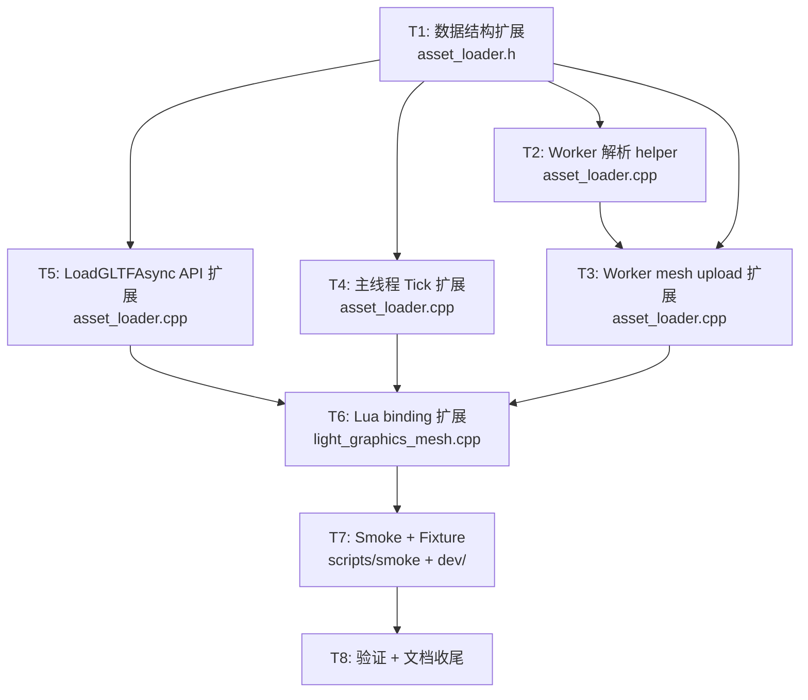

# Phase G.1.5 — 任务分解 (Atomize)

> **6A 工作流 阶段 3 — Atomize**
> **创建日期**：2026-05-18
> **基于**：`DESIGN_PhaseG_1_5.md` 锁定的架构

---

## 一. 任务依赖图



**关键路径**: T1 → T2 → T3 → T6 → T7 → T8 (~8 个任务串行)

---

## 二. 原子任务卡

### T1. 数据结构扩展 — `asset_loader.h`

**输入契约**:
- 现有 `FutureState` 结构 (asset_loader.h:63-139)
- 现有 `LoadGLTFAsync(path, primIdx)` 签名 (asset_loader.h:237)

**输出契约**:
- `MaterialImageJob` struct 已在 namespace AssetLoader 内
- `FutureState` 加 3 个字段:
  - `bool gltfWithMaterial = false`
  - `char gltfMaterialDesc[128]` (POD 序列化 MaterialDesc)
  - `std::vector<MaterialImageJob> gltfMaterialImages`
- `LoadGLTFAsync` 第三参数 `bool withMaterial = false` (默认值保证向后兼容)
- `FutureState::~FutureState()` 兜底释放 `gltfMaterialImages` 内未释放的 pixels

**实现约束**:
- 仅改 .h，不破坏 ABI (字段加在尾部)
- 不 include `light_graphics_material.h` (避免循环依赖)
- `MaterialImageJob` 定义在 namespace 内 public 可见

**依赖关系**: 无前置依赖；后置为 T2/T3/T4/T5

**验收标准**:
- [ ] Light.dll 在 desktop 编译通过
- [ ] 现有 `LoadGLTFAsync(path, primIdx)` 1-2 参数调用零回归 (默认 withMaterial=false)
- [ ] `static_assert(sizeof(MaterialDesc) <= 128)` 在 binding 层验证

**估时**: 30 分钟

---

### T2. Worker 解析 helpers — `asset_loader.cpp`

**输入契约**:
- T1 已完成
- 现有 `DecodeGLTF_` (asset_loader.cpp:308-474)
- 现有同步 `LoadGLTFImage` 实现 (light_graphics_mesh.cpp:375-443) 作为参考

**输出契约**:
- `ReadImageBytes_(img, gltfDir, outBytes)` — 复用 3 来源逻辑 (buffer_view / data: URI / file)，仅返回 raw bytes (不调 stbi)
- `DecodeMaterialImage_(view, slotIdx, st, gltfDir)` — 调 ReadImageBytes_ + stbi_load_from_memory，filling `MaterialImageJob` 进 `st.gltfMaterialImages`
- `ExtractMaterial_NoTexture(d, mat)` — 提取 MaterialDesc 全数值字段，texture id slot 留 0
- 修改 `DecodeGLTF_`: mesh 解析完成后, 若 `state.gltfWithMaterial == true`，调 ExtractMaterial_NoTexture + 5 次 DecodeMaterialImage_

**实现约束**:
- 在 `asset_loader.cpp` 内 `#include "light_graphics_material.h"` (.cpp 文件 include OK)
- POD memcpy: `memcpy(state.gltfMaterialDesc, &md, sizeof(MaterialDesc))`
- ExtractMaterial_NoTexture 不调 backend (worker thread 不持锁 backend)
- 5 image 串行 stbi_load_from_memory，任一失败仅 log warn + skip

**依赖关系**: T1 ✅；后置 T3

**验收标准**:
- [ ] worker 解析后 `state.gltfMaterialDesc` 字节序列化 MaterialDesc 数值字段正确
- [ ] `state.gltfMaterialImages` 含 cgltf material 实际指定的 textures (非空 cgltf_image)
- [ ] image 文件不存在时 log warn 且不 push job (slot 保持 0)
- [ ] mesh 解析失败时 (顶点错误) 整个 Future Error，material 字段不读

**估时**: 90 分钟

---

### T3. Worker mesh upload 扩展 — `asset_loader.cpp:WorkerUploadMesh_`

**输入契约**:
- T1 + T2 已完成
- 现有 `WorkerUploadMesh_` (asset_loader.cpp:529-604) 完成 VBO/EBO/VAO upload + single fence

**输出契约**:
- mesh upload 成功后, 若 `st.gltfMaterialImages` 非空，串行：
  1. `glGenTextures(1, &tex)` per job
  2. `glTexParameteri ×4` (LINEAR + CLAMP)
  3. `glTexImage2D(GL_TEXTURE_2D, 0, GL_RGBA8, w, h, 0, GL_RGBA, GL_UNSIGNED_BYTE, pixels)`
  4. `glGetError` check, 失败 `glDeleteTextures` + log warn + skip
  5. `stbi_image_free(job.pixels)` + `job.pixels = nullptr`
  6. `job.glTexId = tex`
- 全部 textures 上传完后, **共享 mesh 的 single fence** (即 `glFenceSync` 在所有命令后只调一次)
- mesh upload 失败时, 已 gen 的 textures 兜底 glDeleteTextures

**实现约束**:
- 仅在 `g_sharedCtxOk == true` 路径生效 (移动/web 平台 #if 已排除)
- 任一 texture 失败不影响其他 textures 也不影响 mesh
- worker GL ctx 已在 WorkerMain 开始时 MakeCurrent (现有 G.1.1 保证)

**依赖关系**: T1 ✅ + T2 ✅；后置 T6

**验收标准**:
- [ ] 5 textures 上传后 fence 单调 GL_ALREADY_SIGNALED 主线程查询通过
- [ ] 任一 texture 上传失败 → 该 job.glTexId == 0, 但 mesh 仍 valid
- [ ] mesh 失败时 5 textures 全 glDeleteTextures, 资源不泄漏

**估时**: 60 分钟

---

### T4. 主线程 Tick 扩展 — `asset_loader.cpp::Tick`

**输入契约**:
- T1 已完成
- 现有 `Tick` GLTF 路径 (asset_loader.cpp:1018-1051) `RegisterUploadedMesh`
- 现有 `UploadGLTF_` fallback 路径 (asset_loader.cpp:910-941)

**输出契约**:
- 新 helper `WriteMaterialTextureSlots_(FutureState& st)`:
  - 反序列化 `MaterialDesc d; memcpy(&d, st.gltfMaterialDesc, sizeof(MaterialDesc))`
  - 遍历 `st.gltfMaterialImages`, 按 `slotIdx` 写入 `d.tex{BaseColor,MetallicRoughness,Normal,Emissive,Occlusion} = job.glTexId`
  - 重新序列化: `memcpy(st.gltfMaterialDesc, &d, sizeof(MaterialDesc))`
- Worker 路径 (fence Ready GLTF): RegisterUploadedMesh 后调用 WriteMaterialTextureSlots_
- Fallback 路径 (`UploadGLTF_` after `g_render->CreateMesh`): 遍历 `gltfMaterialImages` 调 `g_render->CreateTexture` + 写 `job.glTexId` + WriteMaterialTextureSlots_
- fence 失败 (CheckFenceState_ r=2) 兜底: 遍历 `gltfMaterialImages` glDeleteTextures + stbi_image_free

**实现约束**:
- 主线程在调 backend 前 `g_render` non-null 检查 (现有约束)
- WriteMaterialTextureSlots_ 必须 idempotent (允许多次调用)
- log INFO 记录 "Material textures upload ok (N=X)" 或 WARN

**依赖关系**: T1 ✅；后置 T6

**验收标准**:
- [ ] Worker 路径 fence Ready 后 MaterialDesc.texXxx 正确填入
- [ ] Fallback 路径 5 CreateTexture 都成功，slot 全填
- [ ] fence 失败时 textures 全释放，无 GL 资源泄漏
- [ ] WriteMaterialTextureSlots_ 重复调用不破坏数据

**估时**: 60 分钟

---

### T5. LoadGLTFAsync API 扩展 — `asset_loader.cpp`

**输入契约**:
- T1 已完成 (signature)
- 现有 `LoadGLTFAsync(path, primIdx)` impl (asset_loader.cpp:1417-1439)

**输出契约**:
- `LoadGLTFAsync(path, primIdx, withMaterial)` 签名一致
- impl 内 `state->gltfWithMaterial = withMaterial`
- 其余逻辑不变

**实现约束**:
- 仅 1 行新增 (state field 写入)
- `withMaterial = false` 默认参数保证向后兼容

**依赖关系**: T1 ✅；后置 T6

**验收标准**:
- [ ] 编译通过
- [ ] state.gltfWithMaterial 在 worker 内可读

**估时**: 10 分钟

---

### T6. Lua binding 扩展 — `light_graphics_mesh.cpp`

**输入契约**:
- T3 (worker upload) + T4 (tick) + T5 (LoadGLTFAsync API) 已完成
- 现有 `l_Mesh_LoadGLTFAsync` (light_graphics_mesh.cpp:655-686)
- 现有 `MeshPushResult_` / `MeshAsyncDispatcher_`

**输出契约**:
- `l_Mesh_LoadGLTFAsync` 灵活参数解析:
  ```
  args[1] = path (string)
  args[2] = (cb fn) | (primIdx number)
  args[3] = (cb fn when args[2]=number) | (withMaterial bool)
  args[4] = (cb fn when args[3]=bool)
  ```
- `MeshPushResult_` 改造:
  - 若 `state.gltfWithMaterial == true && state.status == Ready`: push (Mesh, Material) 双值
  - 否则: push Mesh 单值
- `MeshAsyncDispatcher_` 改造:
  - 若 `state.gltfWithMaterial == true`: cb(mesh, material, err) 3 参
  - 否则: cb(mesh, err) 2 参 (现有行为)
- 新 helper `PushMaterialFromBytes(L, descBytes)`:
  - `MaterialDesc* d = lua_newuserdata(L, sizeof(MaterialDesc))`
  - `memcpy(d, descBytes, sizeof(MaterialDesc))`
  - `luaL_getmetatable(L, MATERIAL_MT_NAME)` + `lua_setmetatable`
- `static_assert(sizeof(MaterialDesc) <= 128, "...")`

**实现约束**:
- LoadGLTFAsync 现有 1/2 参数调用不破坏 (向后兼容)
- 错误路径 cb 3 参时 mesh=nil + material=nil + err=string
- callback 错误 log WARN 不抛 Lua error (Q3 决策)

**依赖关系**: T3 ✅ + T4 ✅ + T5 ✅；后置 T7

**验收标准**:
- [ ] 6 种调用形式 (Q3.4.2 列表) 全工作
- [ ] Future:Get() with material 返 (mesh, material) 双值
- [ ] cb 风格 with material 收 3 参
- [ ] 现有 1-2 参数调用零回归
- [ ] static_assert 编译期通过

**估时**: 90 分钟

---

### T7. Smoke + Fixture

**输入契约**:
- T6 已完成
- T7.1 generator 工具 + T7.2 .glb fixture + T7.3 smoke 脚本

**输出契约**:

#### T7.1. `dev/gen_test_glb.py` (Python 一次性脚本)

- 生成 `scripts/smoke/assets_g1_5/test_box_textured.glb`
- 1 mesh / 1 primitive / 4 vertices (quad)
- baseColorFactor = [0.8, 0.5, 0.2, 1.0]
- metallicFactor = 0.7
- roughnessFactor = 0.3
- baseColorTexture = 1×1 红色 RGBA PNG (0xFF, 0x00, 0x00, 0xFF)
- 总大小 ~1.2 KB

**注**: 一次性脚本, 输入 cd e:\jinyiNew\Light & python dev/gen_test_glb.py 生成 .glb 后入 repo. 后续维护时可重跑.

#### T7.2. `scripts/smoke/assets_g1_5/test_box_textured.glb`

- 由 T7.1 生成的 binary
- 入 git (二进制资源)

#### T7.3. `scripts/smoke/asset_loader_async_gltf.lua`

8 个用例:

```lua
-- Case 1: LoadGLTFAsync 无 material (回归保护)
-- Case 2: LoadGLTFAsync with_material Future poll
-- Case 3: Material 数值字段验证 (baseColorFactor / metallic / roughness)
-- Case 4: Material baseColor texture id 非 0
-- Case 5: callback 风格 with_material (cb 3 参)
-- Case 6: callback 风格 without material (cb 2 参, 回归保护)
-- Case 7: 错误路径: 文件不存在 → Future Error
-- Case 8: 错误路径: 损坏文件 → Future Error
```

**实现约束**:
- smoke 必须能在 headless CI 跑 (无 GL 时 fallback 到 LoadGLTFAsync 报 worker not running 错误, 此时仅验证 API 表面 + Lua 语法)
- 用 `lightc -p` 验证 Lua 语法
- assets_g1_5/test_box_textured.glb 用相对路径

#### T7.4. `.github/workflows/build-templates.yml`

加 phaseG15Smoke 调用:

```yaml
- name: Run Phase G.1.5 GLTF Async smoke
  run: & "$runtimeDir\light.exe" "scripts\smoke\asset_loader_async_gltf.lua"
```

**依赖关系**: T6 ✅；后置 T8

**验收标准**:
- [ ] gen_test_glb.py 运行成功输出 .glb
- [ ] cgltf_parse_file 加载 .glb 成功 (本地工具校验)
- [ ] smoke 在本地 light.exe 运行 exit=0 + 0 FAIL
- [ ] CI workflow yaml 校验通过

**估时**: 120 分钟 (含 generator 写 + 调试)

---

### T8. 验证 + 文档收尾

**输入契约**: T1~T7 全完成

**输出契约**:
- 本地编译: `cmake --build ChocoLight/build --config Release --target Light`
- 本地全套 smoke 回归 (10+ smokes 全 exit=0)
- `ACCEPTANCE_PhaseG_1_5.md`: 验收记录 + 回归矩阵
- `FINAL_PhaseG_1_5.md`: 总结报告 + 经验沉淀
- `TODO_PhaseG_1_5.md`: 待办事项 (sampler 支持 / KTX / mipmap 等 future work)
- Git commit + push (单 commit "Phase G.1.5: GLTF Material + Embedded Texture Async")
- gh CI watch 全 6 平台 success

**依赖关系**: T7 ✅

**验收标准**:
- [ ] 8/8 smoke 用例 exit=0 + 全 PASS
- [ ] 现有 hdr/window_lifecycle/probe/async/ssao/mesh_3d/bloom/taa/f2_multi 9/9 回归 0 FAIL
- [ ] CI 6/6 平台全 success (windows/linux/macos/web/ios/android)
- [ ] 3 文档 (ACCEPTANCE/FINAL/TODO) 完整

**估时**: 90 分钟

---

## 三. 任务汇总

| ID | 任务 | 估时 | 依赖 | 关键产出 |
|----|----|----|----|----|
| T1 | 数据结构扩展 | 30m | - | asset_loader.h +25 行 |
| T2 | Worker 解析 helpers | 90m | T1 | DecodeMaterialImage_, ExtractMaterial_NoTexture, ReadImageBytes_ +120 行 |
| T3 | Worker mesh upload 扩展 | 60m | T1+T2 | WorkerUploadMesh_ +60 行 |
| T4 | 主线程 Tick 扩展 | 60m | T1 | WriteMaterialTextureSlots_ + 兜底 +50 行 |
| T5 | LoadGLTFAsync API 扩展 | 10m | T1 | +1 行 (state field 写入) |
| T6 | Lua binding 扩展 | 90m | T3+T4+T5 | l_Mesh_LoadGLTFAsync 灵活解析 + Push 2 值 + cb 3 参 +80 行 |
| T7 | Smoke + Fixture | 120m | T6 | gen_test_glb.py + .glb fixture + smoke (8 cases) + CI yaml +290 行 |
| T8 | 验证 + 文档 | 90m | T7 | ACCEPTANCE/FINAL/TODO + commit + push |
| **总计** | | **~9h** | | |

---

## 四. 风险点

| 风险 | 概率 | 影响 | 缓解 |
|----|----|----|----|
| MaterialDesc 实际 sizeof > 128 | 低 | 编译失败 | static_assert 提前发现; 加大 buffer |
| cgltf_image base64 解码 worker 性能 | 低 | worker 慢 | 已串行解码, 不影响主线程 |
| Worker GL 上下文 share 失败导致 fallback | 中 | 主线程 5 textures 一帧上传 | fallback 路径 < 10ms 可接受; 现有 G.1.1 探针机制已覆盖 |
| GLB fixture 文件兼容性 (cgltf 不接受) | 低 | smoke 失败 | gen_test_glb.py 用 cgltf 的官方 sample 模板 |
| static_assert 在 .h vs .cpp 位置矛盾 | 低 | 循环 include | static_assert 放 light_graphics_mesh.cpp 顶部 (binding 层 include 了 material header) |
| 移动端/Web 路径 #if 排除引起遗漏 | 低 | 移动端 fallback 不支持 material | 验收时显式覆盖 fallback 路径用例 |

---

## 五. 测试用例覆盖矩阵

| 用例 | T1 | T2 | T3 | T4 | T5 | T6 | T7 |
|----|----|----|----|----|----|----|----|
| Case 1: 无 material (回归) | ✓ | ✓ | - | ✓ | ✓ | ✓ | ✓ |
| Case 2: with material Future poll | ✓ | ✓ | ✓ | ✓ | ✓ | ✓ | ✓ |
| Case 3: 数值字段 | - | ✓ | - | ✓ | - | ✓ | ✓ |
| Case 4: texture id 非 0 | - | ✓ | ✓ | ✓ | - | ✓ | ✓ |
| Case 5: cb with material | - | ✓ | ✓ | ✓ | - | ✓ | ✓ |
| Case 6: cb without material (回归) | - | - | - | - | - | ✓ | ✓ |
| Case 7: 文件不存在 | ✓ | - | - | - | ✓ | ✓ | ✓ |
| Case 8: 损坏文件 | ✓ | - | - | - | ✓ | ✓ | ✓ |

---

## 六. 下一步

进入 **6A 阶段 4 — Approve** (用户审批最终任务计划)。
