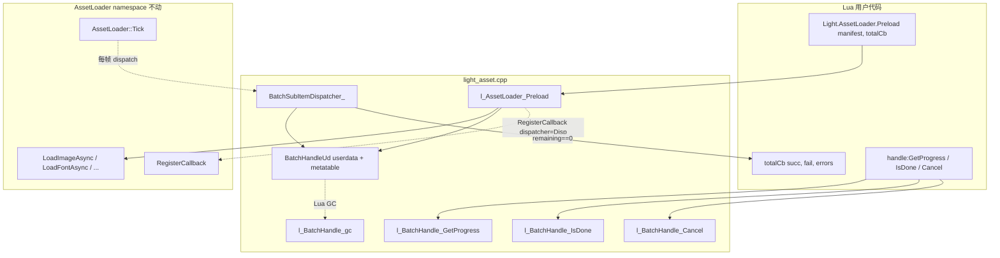

# Phase G.1.6 — 异步预加载 manifest (DESIGN)

> **创建日期**: 2026-05-18
> **依赖**: [ALIGNMENT_PhaseG_1_6.md](ALIGNMENT_PhaseG_1_6.md)

---

## 一. 整体架构图



---

## 二. 关键数据结构

### 2.1 BatchHandleUd (C++ struct, Lua userdata payload)

```cpp
namespace {

struct BatchErrorEntry {
    std::string path;
    std::string err;
};

struct BatchHandleUd {
    int                                       total      = 0;     // manifest 子任务总数
    int                                       remaining  = 0;     // 未完成数 (主线程 only, 不需原子)
    int                                       succ       = 0;     // 成功数
    std::vector<BatchErrorEntry>              errors;             // 失败列表
    int                                       totalCbRef = -1;    // Lua registry ref → totalCb 函数 (无 cb 时 -1)
    bool                                      cancelled  = false; // advisory flag
    lua_State*                                L          = nullptr;

    // 持有所有子 future 的强引用, 保证 BatchHandle 存活时它们也存活
    // (避免用户提前丢弃 handle 导致 sub-future shared_ptr 引用计数归零)
    std::vector<std::shared_ptr<AssetLoader::FutureState>> futures;
};

} // namespace
```

**为什么 remaining 不需要 atomic?**
- dispatcher 仅在主线程 Tick 内调用 (asset_loader.cpp 不变量)
- Lua API 调用 (Preload / GetProgress / IsDone / Cancel) 也在主线程
- 单线程访问, 无竞争

### 2.2 BatchSubItemRefHolder (per-future Lua registry ref)

每个子 future 走 `RegisterCallback` 时, `cbLuaRef` 槽存放的是 BatchHandle userdata 在 LUA_REGISTRYINDEX 的引用. 每个子 future 一个独立 ref, 都指向同一个 userdata:

```cpp
// 在 l_AssetLoader_Preload 内, 对每个子 future:
lua_pushvalue(L, batchUdStackIdx);                       // dup BatchHandle userdata
int subRef = luaL_ref(L, LUA_REGISTRYINDEX);             // 唯一 ref id
AssetLoader::RegisterCallback(state, BatchSubItemDispatcher_, L, subRef);
```

---

## 三. 数据流

### 3.1 Preload 调用路径

```
User: Light.AssetLoader.Preload({...}, totalCb)
    │
    ▼
l_AssetLoader_Preload (主线程):
  1. luaL_checktype(L, 1, LUA_TTABLE)             // 校验 manifest
  2. 可选 totalCb (arg2 == function)
  3. 创建 BatchHandleUd userdata + 元表
     ud.totalCbRef = (totalCb ? luaL_ref totalCb : -1)
     ud.L = L
  4. 遍历 manifest:
     for each (type, list) in manifest:
         for each entry in list:
             解析 path / size / primIdx / withMaterial
             state = AssetLoader::LoadXxxAsync(...)
             ud.futures.push_back(state)
             ud.total++; ud.remaining++
             立即 Error 路径 (LoadXxxAsync 同步返 Error):
                 // 不走 Tick, 主线程同步触发 Disp
                 BatchSubItemDispatcher_(L, state.get(), 0)
                 continue
             // 异步路径: 注册 dispatcher
             lua_pushvalue(L, batchUdStackIdx)
             int subRef = luaL_ref(L, LUA_REGISTRYINDEX)
             RegisterCallback(state, BatchSubItemDispatcher_, L, subRef)
  5. Empty manifest 兜底:
     if (ud.total == 0) {
         FireTotalCb_(ud)        // 立即触发 totalCb(0, 0, {})
     }
  6. push BatchHandle userdata 到栈, return 1
```

### 3.2 子 future 完成 (主线程 Tick → dispatcher)

```
AssetLoader::Tick:
  drain result_queue
  for each completed state:
      if (state.dispatcher && state.cbLuaState && state.cbLuaRef >= 0) {
          state.dispatcher(state.cbLuaState, state.get(), state.cbLuaRef);
          luaL_unref(state.cbLuaState, LUA_REGISTRYINDEX, state.cbLuaRef);   // 释放 batch ud ref (1 个)
          ...
      }

BatchSubItemDispatcher_(L, state, batchUdRef):
  1. lua_rawgeti(L, LUA_REGISTRYINDEX, batchUdRef) → BatchHandle userdata 在栈顶
  2. ud = (BatchHandleUd*) luaL_testudata(L, -1, BATCH_MT)
  3. lua_pop(L, 1)
  4. if (!ud) return                                 // 防御: handle 已 GC (理论不会, refs 还在)
  5. if (state.status == Ready) ud.succ++;
     else { ud.errors.push_back({...}); }
  6. ud.remaining--;
  7. if (ud.remaining == 0 && !ud.cancelled) {
         FireTotalCb_(ud)
     }
```

### 3.3 立即 Error 路径 (LoadXxxAsync 同步返 Error)

某些 LoadXxxAsync 在 worker 未启动时走 fallback 同步加载, 失败立即返 Error 状态. 此时:
- state 不入 result_queue → Tick 不会触发 dispatcher
- l_AssetLoader_Preload 内必须**主动调一次** dispatcher (与 8 个 LoadAsync binding 模式一致)
- 但不走 RegisterCallback (避免 dispatcher 重复触发)

```cpp
auto state = AssetLoader::LoadImageAsync(path);
if (state->status.load() != Pending) {
    // 立即 Error 或 立即 Ready (sync fallback 走通)
    BatchSubItemDispatcher_(L, state.get(), -1 /* no batchUdRef, 直接读栈 */);
    continue;
}
// 异步路径
...
```

⚠️ 立即路径调 dispatcher 时 batchUdRef 还没 ref. 需要让 dispatcher 接受 -1 表示 "用栈上 batchUd". 改 dispatcher 签名复杂; 更简单方案:

**方案 A**: 立即同步路径在 binding 层手动 inline 处理 (不走 dispatcher):
```cpp
if (state->status.load() == Ready) ud->succ++;
else                                ud->errors.push_back({path, errMsg});
ud->remaining--;
// 不调 dispatcher; 全部完成后由最后一个异步子 future 的 dispatcher 触发总 cb
// 边界: 如果所有子 future 都立即 Error → ud->remaining=0 → 主动触发总 cb
```

✅ **采纳方案 A**. 简单且无需扩 dispatcher 签名. 立即路径与异步路径在 ud 状态更新逻辑上一致, 唯一区别是异步路径多走一遍 RegisterCallback + Tick + dispatcher.

### 3.4 总 cb 触发 (FireTotalCb_)

```cpp
static void FireTotalCb_(BatchHandleUd* ud) {
    if (!ud || !ud->L || ud->totalCbRef < 0) return;

    lua_State* L = ud->L;
    lua_rawgeti(L, LUA_REGISTRYINDEX, ud->totalCbRef);
    if (!lua_isfunction(L, -1)) {
        lua_pop(L, 1);
        luaL_unref(L, LUA_REGISTRYINDEX, ud->totalCbRef);
        ud->totalCbRef = -1;
        return;
    }

    lua_pushinteger(L, ud->succ);
    lua_pushinteger(L, (int)ud->errors.size());

    // errors 表: { {path="...", err="..."}, ... }
    lua_createtable(L, (int)ud->errors.size(), 0);
    for (size_t i = 0; i < ud->errors.size(); ++i) {
        lua_createtable(L, 0, 2);
        lua_pushstring(L, ud->errors[i].path.c_str());
        lua_setfield(L, -2, "path");
        lua_pushstring(L, ud->errors[i].err.c_str());
        lua_setfield(L, -2, "err");
        lua_rawseti(L, -2, (int)i + 1);
    }

    if (lua_pcall(L, 3, 0, 0) != 0) {
        const char* errStr = lua_tostring(L, -1);
        CC::Log(CC::LOG_WARN, "AssetLoader.Preload total cb error: %s",
                errStr ? errStr : "(none)");
        lua_pop(L, 1);
    }

    luaL_unref(L, LUA_REGISTRYINDEX, ud->totalCbRef);
    ud->totalCbRef = -1;     // 防重复触发
}
```

---

## 四. Lua API 接口契约

### 4.1 Light.AssetLoader.Preload(manifest [, totalCb])

| 参数 | 类型 | 是否必需 | 说明 |
|------|------|---------|------|
| manifest | table | 必需 | 见下表 6 个字段 |
| totalCb | function 或 nil | 可选 | 全部完成后调一次, `function(succ, fail, errors)`; 缺省时用户用 handle:GetProgress 轮询 |

**manifest 字段** (任意字段缺省 = 跳过):

| 字段 | 元素类型 | 说明 |
|------|---------|------|
| `images` | string array | 路径列表, 走 `LoadImageAsync` |
| `sounds` | string array | 路径列表, 走 `LoadSoundAsync` |
| `cubeLUTs` | string array | .cube 路径列表, 走 `LoadCubeLUTAsync` |
| `haldLUTs` | string array | HALD PNG 路径列表, 走 `LoadHaldLUTAsync` |
| `fonts` | table array | `{ {path=..., size=16}, ... }`, 走 `LoadFontAsync` |
| `meshes` | table array | `{ {path=..., primIdx=0, withMaterial=false}, ... }`, 走 `LoadGLTFAsync` |

**返回值**: BatchHandle userdata

### 4.2 BatchHandle 方法

| 方法 | 签名 | 说明 |
|------|------|------|
| `:GetProgress()` | → done(int), total(int), errors(int) | 实时查询 |
| `:IsDone()` | → boolean | done == total |
| `:Cancel()` | → nil | 标 cancelled, 子 future 仍跑完, 但总 cb 不再触发 |
| `__tostring` | "Light.AssetLoader.BatchHandle(d/N)" | 调试 |
| `__gc` | — | 清理 totalCbRef + futures vector 析构 |

### 4.3 totalCb 签名

```lua
function totalCb(succ, fail, errors)
    -- succ: int, 成功完成的子任务数
    -- fail: int, 失败的子任务数 (= #errors)
    -- errors: table, { {path="...", err="..."}, ... }, 顺序与失败发生顺序一致
end
```

---

## 五. 元表注册

### 5.1 BatchHandle metatable

```cpp
static const char* kBatchHandleMT = "Light.AssetLoader._BatchHandle";

static const luaL_Reg kBatchHandleMethods[] = {
    { "GetProgress", l_BatchHandle_GetProgress },
    { "IsDone",      l_BatchHandle_IsDone      },
    { "Cancel",      l_BatchHandle_Cancel      },
    { nullptr,       nullptr                   },
};

static int luaopen_Light_AssetLoader(lua_State* L) {
    // 注册 BatchHandle metatable
    if (luaL_newmetatable(L, kBatchHandleMT)) {
        luaL_setfuncs(L, kBatchHandleMethods, 0);
        lua_pushvalue(L, -1);
        lua_setfield(L, -2, "__index");
        lua_pushcfunction(L, l_BatchHandle_gc);
        lua_setfield(L, -2, "__gc");
        lua_pushcfunction(L, l_BatchHandle_tostring);
        lua_setfield(L, -2, "__tostring");
    }
    lua_pop(L, 1);

    // 注册 Light.AssetLoader 模块
    static const luaL_Reg fns[] = {
        { "Preload", l_AssetLoader_Preload },
        { nullptr,   nullptr               },
    };
    LT::RegisterModule(L, "AssetLoader", fns);
    return 1;
}
```

---

## 六. 异常处理矩阵

| 场景 | 处理 |
|------|------|
| Preload(nil) | luaL_argerror(1, "manifest must be table") |
| Preload({}) | total=0 → 立即触发 totalCb(0, 0, {}); 返 BatchHandle (succ=0/total=0) |
| Preload({images={123}}) | 第一个 entry 处 luaL_argerror, 已创建的 batch ud 由 Lua GC 回收 |
| Preload({foo={"a"}}, cb) | 未识别字段 `foo` 被忽略 + CC::Log(LOG_WARN), batch 仍创建 |
| Preload(m, "not_func") | luaL_argerror(2, "totalCb must be function or nil") |
| LoadImageAsync 立即 Error | 不入 result_queue; binding 层立即更新 ud + 检查 remaining==0 |
| totalCb 抛 Lua error | pcall 捕获 + LOG_WARN, 不向上抛 |
| handle:Cancel() 后 future 仍 Ready | dispatcher 仍触发 → ud.remaining-- + ud.succ++; remaining==0 时检查 cancelled flag, true 则跳过 FireTotalCb_ |
| 用户丢弃 handle 引用 | totalCb 仍能触发 (futures vector 持有 shared_ptr; 子 future 的 cbLuaRef 持有 batch ud 引用), GC 不会过早 |
| 进程退出, 未完成的 batch | AssetLoader::Shutdown → Pending future Set Error("AssetLoader shutdown") → 各自 dispatch → batch 总 cb 仍触发 (用户 sample 退出路径已通过 G.1.3 修复) |

---

## 七. 性能特征

### 7.1 时间复杂度

| 操作 | 复杂度 | 说明 |
|------|-------|------|
| Preload(N=100) | O(N) | 6 次 LoadXxxAsync 入队 (mutex) + 6 次 luaL_ref |
| dispatcher 单次 | O(1) | ud 字段更新 + Lua rawgeti |
| FireTotalCb_ | O(F) | F 是失败数, 构建 errors 表 |
| GetProgress | O(1) | 三个 int 字段 |

### 7.2 内存占用

| 实体 | 大小 | 说明 |
|------|------|------|
| BatchHandleUd | ~80B + 子项 | sizeof(struct) ≈ 80, 加 vector overhead |
| 每个 future | sizeof(FutureState) ≈ 200B | shared_ptr 引用计数 1 (futures vector 持有) |
| 每个 sub-cb registry slot | 1 个 lua_Number | luaL_ref 内部用 array 存, GC 时归还 |

100 个资源 batch 内存峰值: ~80B + 100 × 200B + 100 ints ≈ 21KB. 微不足道.

---

## 八. 与现有架构集成点

### 8.1 不动文件

- `asset_loader.h`
- `asset_loader.cpp`
- `light_ui.cpp`
- 8 个现有 LoadAsync binding 文件

### 8.2 新增文件

- `ChocoLight/src/light_asset.cpp` (主体, ~400 行预估)
- `docs/Phase G.1.6 Async Preload Manifest/*.md`
- `scripts/smoke/asset_loader_preload.lua`

### 8.3 改动文件

- `ChocoLight/CMakeLists.txt` — source list 加 `light_asset.cpp`
- `lumen-master/src/light/light.cpp` — g_lightModules[] 加 1 行
- `.github/workflows/build-templates.yml` — smoke 引用 + 6 平台调用 (Windows / Linux / macOS / iOS / Android / Emscripten)
- `docs/HANDOFF_REMAINING_TASKS.md` — 同步 Phase G.1.6 完成

---

## 九. 风险评估

| 风险 | 级别 | 缓解 |
|------|-----|------|
| LoadXxxAsync 立即 Error 路径漏掉 dispatcher 触发 | 低 | binding 层显式检查 status != Pending; remaining==0 主动 fire |
| BatchHandle GC 早于子 future 完成 | 极低 | sub-cb 的 LUA_REGISTRYINDEX ref 持有 ud 强引用, GC 不可能发生 |
| Cancel 后子 future 仍占资源 | 设计预期 | advisory 语义, 用户可自行 GC futures (handle 析构会做) |
| totalCb 内 yield (coroutine) | 中 | pcall 不支持 yield, lua 5.1 限制; 文档说明 totalCb 不能 yield |
| manifest 字段名 typo (foo / iamges) | 低 | LOG_WARN 提示未识别字段, 但不抛 |
| 6 平台 stb_image / cgltf 行为差异 | 低 | 沿用 G.1.0 ~ G.1.5 已经验证的入口, 不引入新解码路径 |

---

## 十. 实施顺序

1. **light_asset.cpp 骨架** — luaopen + metatable + 空 Preload
2. **BatchHandleUd + dispatcher** — 核心数据结构
3. **manifest 解析 6 字段** — 调 LoadXxxAsync, 立即 Error 处理
4. **FireTotalCb_** — 构建 errors 表 + pcall
5. **方法绑定** — GetProgress / IsDone / Cancel / __gc / __tostring
6. **CMakeLists + lumen module** — 编译接入
7. **smoke 脚本 + CI 接入** — 6 用例 (空 / 单类 / 多类 / 失败 / cancel / progress)
8. **FINAL / ACCEPTANCE / TODO / HANDOFF** — 收尾文档
