# Phase G.1.6 — 异步预加载 manifest (TASK)

> **依赖**: [ALIGNMENT](ALIGNMENT_PhaseG_1_6.md) · [DESIGN](DESIGN_PhaseG_1_6.md)

---

## 任务依赖图

```mermaid
graph LR
    T1[T1 骨架 + metatable] --> T2[T2 BatchHandleUd struct]
    T2 --> T3[T3 dispatcher BatchSubItemDispatcher_]
    T3 --> T4[T4 manifest 6 字段解析 + LoadXxxAsync]
    T4 --> T5[T5 FireTotalCb_ + errors 表]
    T5 --> T6[T6 方法绑定 GetProgress/IsDone/Cancel/__gc/__tostring]
    T6 --> T7[T7 CMake + lumen module table 集成]
    T7 --> T8[T8 smoke asset_loader_preload.lua]
    T8 --> T9[T9 CI 6 平台接入]
    T9 --> T10[T10 文档收尾]
```



---

## T1 ｜ light_asset.cpp 骨架 + metatable 注册

**输入**: ALIGNMENT + DESIGN 文档
**输出**:
- 新文件 `ChocoLight/src/light_asset.cpp`
- 编译通过 (链接尚未接入 lumen, 无 luaopen 调用)
- `luaopen_Light_AssetLoader` 注册 BatchHandle metatable + Preload 占位函数

**验收**:
- 文件结构正确 (头注释 / include / namespace)
- `kBatchHandleMT` 字符串常量正确
- BatchHandle metatable 元方法占位 (`l_BatchHandle_*` 全为空实现)
- `Preload` 占位仅返 `lua_pushnil` + 1

---

## T2 ｜ BatchHandleUd 数据结构

**输入**: T1 骨架
**输出**: 在 `light_asset.cpp` 内 anonymous namespace 中定义:
- `BatchErrorEntry` struct
- `BatchHandleUd` struct (含 8 字段, 见 DESIGN §2.1)
- Helper: `BatchHandleUd* GetBatchUd(lua_State*, int)` 用 `luaL_checkudata`

**验收**:
- 字段全 (total/remaining/succ/errors/totalCbRef/cancelled/L/futures)
- futures vector 持 shared_ptr<FutureState>, 不持 raw ptr
- `__gc` 析构 vector + luaL_unref(totalCbRef)

---

## T3 ｜ BatchSubItemDispatcher_

**输入**: T2 BatchHandleUd
**输出**: `BatchSubItemDispatcher_(void* L, FutureState* state, int batchUdRef)` 实现

**职责**:
1. lua_rawgeti 拉 batch ud
2. 更新 ud.succ / ud.errors / ud.remaining
3. ud.remaining == 0 && !ud.cancelled → FireTotalCb_

**验收**:
- 主线程独占 (无锁)
- ud 已 GC (luaL_testudata 返 nullptr) 时安全返回
- state.errorMsg 空时填默认字符串
- errors entry 的 path 字段: 需要从 state 推回 — 见 T4 处理

---

## T4 ｜ manifest 解析 + LoadXxxAsync 派发

**输入**: T3 dispatcher 可用
**输出**: `l_AssetLoader_Preload(lua_State* L)` 完整实现

**子步骤**:
- **T4.1** ｜ 参数校验
  - arg1: table (luaL_checktype)
  - arg2: function 或 nil 或 缺省

- **T4.2** ｜ 创建 BatchHandle userdata
  - placement-new 调 BatchHandleUd 默认构造
  - 设置 metatable
  - ud.L = L
  - ud.totalCbRef = (arg2 函数 ? luaL_ref(L, REGISTRY) : -1)

- **T4.3** ｜ 遍历 6 个字段
  - 函数: `static int ProcessImages_(L, manifestIdx, ud)`, 返 entry 数
  - 函数: `static int ProcessSounds_(...)`
  - 函数: `static int ProcessCubeLUTs_(...)`
  - 函数: `static int ProcessHaldLUTs_(...)`
  - 函数: `static int ProcessFonts_(...)`  (字段 size 默认 16)
  - 函数: `static int ProcessMeshes_(...)` (字段 primIdx=0 / withMaterial=false)
  - 每个函数内调 `AppendOne_(ud, path, state)`

- **T4.4** ｜ `AppendOne_(ud, path, state)` helper
  ```cpp
  ud.total++; ud.remaining++;
  ud.futures.push_back(state);

  if (state->status.load() == Pending) {
      // 异步路径: 注册 dispatcher
      lua_pushvalue(L, batchUdStackIdx);
      int subRef = luaL_ref(L, LUA_REGISTRYINDEX);
      AssetLoader::RegisterCallback(state, BatchSubItemDispatcher_, L, subRef);
  } else {
      // 立即 Ready / Error: 同步更新 ud (不走 dispatcher)
      if (state->status.load() == Ready) ud.succ++;
      else                                ud.errors.push_back({path, state->errorMsg});
      ud.remaining--;
  }
  ```

- **T4.5** ｜ 空 manifest / 全部立即完成 兜底
  - 遍历结束后 `if (ud.remaining == 0)` 主动调 FireTotalCb_

**验收**:
- 6 字段全覆盖
- 未识别字段 LOG_WARN 但不抛
- entry 类型错: luaL_argerror

---

## T5 ｜ FireTotalCb_

**输入**: T4 manifest 解析完成
**输出**: `FireTotalCb_(BatchHandleUd* ud)` 实现

**职责**:
- 检查 totalCbRef >= 0 && ud.L 非空
- 构建 errors table (`{ {path=..., err=...}, ... }`)
- lua_pcall(3, 0, 0), 错误 LOG_WARN
- luaL_unref totalCbRef, 置 -1 防重复

**验收**:
- totalCbRef == -1 时直接返
- errors 顺序保留 (push 时按 vector 顺序)
- pcall 异常不向上抛

---

## T6 ｜ BatchHandle 方法

**输入**: T2-T5 完成
**输出**: 4 个方法 + 2 个元方法

- `l_BatchHandle_GetProgress` → 3 个 int (done, total, errors_count)
  - done = total - remaining
- `l_BatchHandle_IsDone` → boolean
- `l_BatchHandle_Cancel` → nil (set ud.cancelled = true)
- `l_BatchHandle_gc` → 显式调用 BatchHandleUd 析构 (placement-new 对应);  ud.totalCbRef >= 0 时 luaL_unref
- `l_BatchHandle_tostring` → "Light.AssetLoader.BatchHandle(d/N)"

**验收**:
- Cancel 后 GetProgress 仍返实时 done
- IsDone 在 Cancel 后仍按 remaining==0 判断
- __gc 析构 vector<shared_ptr> + 子 future 自动 release

---

## T7 ｜ CMake + lumen module 集成

**输入**: T1-T6 完整 light_asset.cpp
**输出**:
- `ChocoLight/CMakeLists.txt`: source list 加 `light_asset.cpp` (紧邻 asset_loader.cpp)
- `lumen-master/src/light/light.cpp`: g_lightModules[] 加 `{"Light.AssetLoader", "luaopen_Light_AssetLoader"}`

**验收**:
- ChocoLight.dll / Light.dll 链接成功
- light.exe 启动后 `Light.AssetLoader.Preload` 可见 (lightc -p 不抛 unknown global)

---

## T8 ｜ smoke asset_loader_preload.lua

**输入**: T7 编译通过
**输出**: `scripts/smoke/asset_loader_preload.lua`, 6 用例:

1. **空 manifest** ｜ Preload({}, cb) → cb(0, 0, {}), handle:IsDone()==true
2. **单类多张 Image** ｜ Preload({images={"a.png","b.png"}}, cb) → cb(2, 0, {}) (使用 existing test 资源 / fallback path)
3. **多类型混合** ｜ Preload({images={...}, fonts={{path=..., size=16}}}, cb) → cb(N, 0, {})
4. **失败注入** ｜ Preload({images={"/nonexistent/foo.png"}}, cb) → cb(0, 1, {{path=..., err=...}})
5. **进度查询** ｜ 在 dispatch 前调 GetProgress() → 返 (0, N, 0); 主循环跑后再调 → (N, N, 0)
6. **Cancel** ｜ Preload(...) 后立即 Cancel() → 主循环跑后 cb 不触发, 但 IsDone 仍 true

**约束**:
- 必须 headless 兼容 (使用 LUTs/PNG smoke 资源或 inline sync fallback)
- 不开窗口 (沿用 asset_loader_async.lua 模式)
- 用 print/io.write 不依赖 CC::Log 输出格式
- 最末 `=== Phase G.1.6 Async Preload Manifest smoke: ALL TESTS PASSED ===`

**验收**: 本地 / CI 6 平台同样 PASS

---

## T9 ｜ CI 接入

**输入**: T8 smoke 跑通
**输出**: `.github/workflows/build-templates.yml`

每个平台 (Windows / Linux / macOS / iOS / Android / Emscripten) job 加:
```
$phaseG16Smoke = ...resolve...asset_loader_preload.lua
& "$light" $phaseG16Smoke
if ($LASTEXITCODE -ne 0) { exit $LASTEXITCODE }
```

**约束**:
- iOS / Android / Emscripten 没有 light.exe 跑, 只 build 验证 — 沿用现有 phase smoke pattern (只在 Windows / Linux / macOS 执行)
- 实际 CI 现状: phaseG1VramSmoke 等 smoke 只在 Windows job 跑过

**验收**: 6 平台 build 绿, Windows smoke 包含 G.1.6 行

---

## T10 ｜ 文档收尾

**输入**: T1-T9 完成
**输出**:
- `FINAL_PhaseG_1_6.md` — 交付总结 + API 文档 + 性能数据 + 6 平台 CI 截图引用
- `ACCEPTANCE_PhaseG_1_6.md` — 验收检查清单 + 实测日志
- `TODO_PhaseG_1_6.md` — 后续可选 (sub-cb / results 嵌套 / yield 支持)
- `docs/HANDOFF_REMAINING_TASKS.md` — §1 改为 "已交付 Phase G.1.0 - G.1.6"

**验收**:
- 文档链接全无 404
- HANDOFF 顶部交付状态摘要更新
