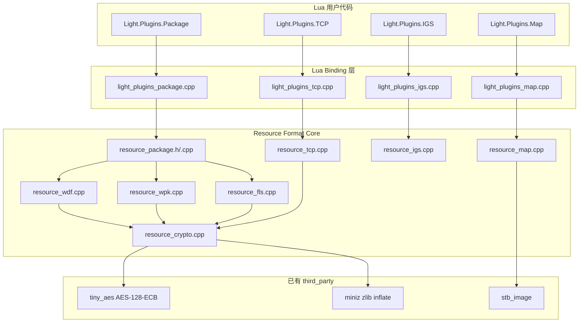
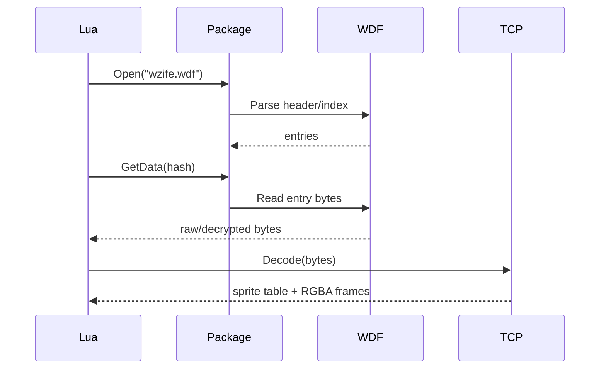
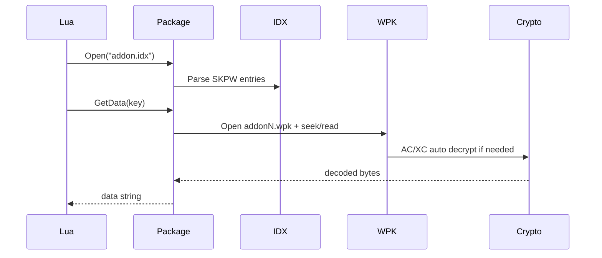
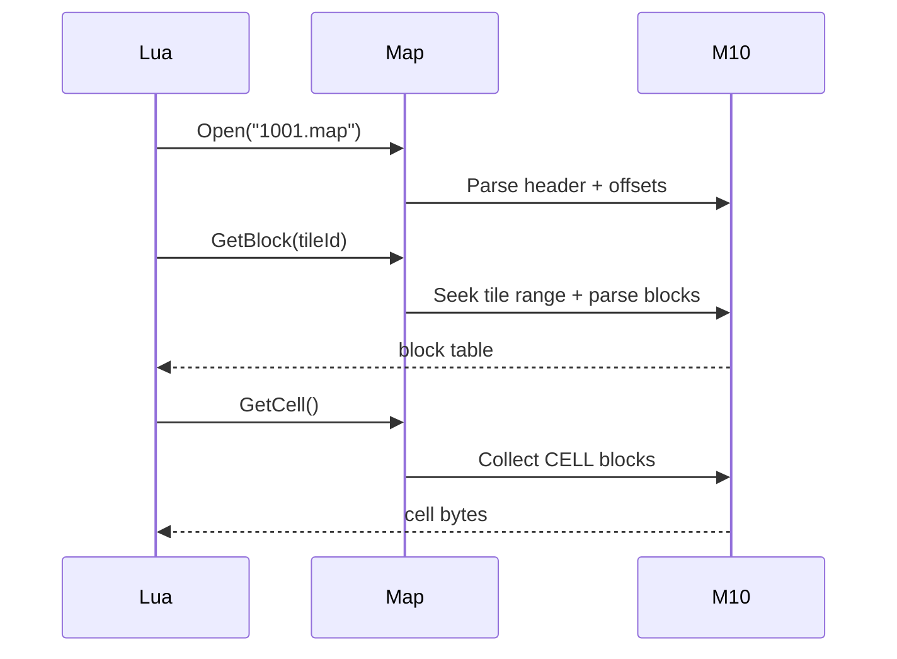

# Phase G.3 — 资源格式插件集成 (DESIGN)

> **创建日期**: 2026-05-19  
> **依赖**: [ALIGNMENT_PhaseG_3.md](ALIGNMENT_PhaseG_3.md)  
> **设计结论**: 采用“统一容器读取 + 独立格式解码 + MAP 分阶段”的插件化架构

---

## 一. 总体架构



### 1.1 设计目标

- 容器格式和资源解码格式解耦。
- 不继续扩大现有 `light_plugins.cpp`。
- 新 API 遵守 `Light.Plugins` 当前错误与二进制返回约定。
- 支持测试资源目录 `E:\jinyiNew\Light\assets` 的基础验证。
- 后续可在不破坏 API 的前提下补 `MAPX/gmx_map/WDFH/SFDW` 样本验证。

### 1.2 模块拆分

| 模块 | 职责 | 主要文件 |
|---|---|---|
| Package | WDF/WPK/FLS 自动识别与条目读取 | `light_plugins_package.cpp`, `resource_package.*`, `resource_wdf.cpp`, `resource_wpk.cpp`, `resource_fls.cpp` |
| TCP | TCP-SP/TP/RP 探测和 RGBA 解码 | `light_plugins_tcp.cpp`, `resource_tcp.*` |
| IGS | IGS 探测和 RGBA 解码 | `light_plugins_igs.cpp`, `resource_igs.*` |
| Map | M1.0 基础解析，预留 gmx_map/MAPX | `light_plugins_map.cpp`, `resource_map.*` |
| Crypto | AC/XC/SFDW/FLS 等解密和压缩解包辅助 | `resource_crypto.*` |

---

## 二. Lua API 设计

### 2.1 `Light.Plugins.Package`

```lua
local Package = require("Light.Plugins.Package")

local pkg, err = Package.Open("assets/wzife.wdf")
if not pkg then error(err) end

local info = pkg:GetInfo()
local entries = pkg:List()
local data, err = pkg:GetData(entries[1].key)
pkg:Close()
```

#### 函数表

| API | 返回 | 说明 |
|---|---|---|
| `Package.Probe(pathOrData [, options])` | `table | nil, err` | 只探测格式，不常驻打开 |
| `Package.Open(path [, options])` | `PackageHandle | nil, err` | 打开文件路径 |
| `Package.OpenData(data [, options])` | `PackageHandle | nil, err` | 从 Lua string 打开内存数据，v1 可选 |
| `handle:GetInfo()` | `table` | 返回格式、条目数、magic、路径等 |
| `handle:List()` | `table | nil, err` | 返回条目数组 |
| `handle:Has(key)` | `boolean` | key 是否存在 |
| `handle:GetData(key [, options])` | `string | nil, err` | 读取条目数据 |
| `handle:Close()` | `true` | 关闭文件，幂等 |
| `handle:__tostring()` | `string` | 调试字符串 |

#### `GetInfo()` 结果

```lua
{
    kind = "WDF",              -- WDF/WPK/FLS
    subtype = "PFDW",          -- PFDW/WDFP/WDFX/WDFH/SFDW/WDFS/SKPW/0SLF
    path = "assets/wzife.wdf",
    count = 4148,
    indexOffset = 110021335,
    supported = true,
}
```

#### `List()` 条目结果

容器差异较大，统一字段采用“公共字段 + 格式字段”：

```lua
{
    {
        key = 123456789,        -- WDF/FLS: number；WPK: md5 hex 或 archive:index 字符串
        id = 123456789,         -- 可选，WDF/FLS hash/file_id
        offset = 1234,
        size = 5678,
        packedSize = 5678,
        archive = 0,            -- WPK 可选
        md5 = "...",           -- WPK 可选
        raw = false,            -- 是否未经解密/解包
    }
}
```

#### `GetData(key [, options])`

`options`：

```lua
{
    raw = false,          -- true 时尽量返回容器原始 bytes，不做 AC/XC 或 SFDW 数据解密
    decode = true,        -- true 时执行格式已知的解密/解包
    maxBytes = nil,       -- 保护性读取上限，可选
}
```

默认策略：

- WDF/PFDW：读取条目原始数据。
- WDFH：读取后执行 WDFH 数据 XOR 解密。
- SFDW/WDFS：读取后执行 SFDW-like 数据解密。
- WPK：读取 IDX 指向的 WPK 分卷数据，自动识别 AC/XC。
- FLS：读取后按 FLS 条目 hash 执行自动解密判定。

### 2.2 `Light.Plugins.TCP`

```lua
local TCP = require("Light.Plugins.TCP")
local data = assert(pkg:GetData(hash))
local sprite = assert(TCP.Decode(data))
```

| API | 返回 | 说明 |
|---|---|---|
| `TCP.Probe(data)` | `table | nil, err` | 探测 SP/TP/RP 与基础头信息 |
| `TCP.Decode(data [, options])` | `table | nil, err` | 解码全部帧为 RGBA |
| `TCP.DecodeFrame(data, index [, options])` | `table | nil, err` | 解码单帧，后续优化用 |

统一返回：

```lua
{
    format = "TCP-SP",
    directions = 8,
    framesPerDirection = 10,
    width = 62,
    height = 94,
    x = 31,
    y = 85,
    palette = "rgb565",
    frames = {
        {
            index = 1,
            x = 0,
            y = 0,
            width = 62,
            height = 94,
            pixels = "...RGBA8888...",
        }
    }
}
```

`options`：

```lua
{
    maxFrames = nil,      -- 限制解码帧数，smoke 可用
    frame = nil,          -- 只解单帧
    rgbaOrder = "RGBA",  -- v1 固定 RGBA
}
```

### 2.3 `Light.Plugins.IGS`

```lua
local IGS = require("Light.Plugins.IGS")
local sprite = assert(IGS.Decode(data))
```

| API | 返回 | 说明 |
|---|---|---|
| `IGS.Probe(data)` | `table | nil, err` | 解析 IGS 头和帧数量 |
| `IGS.Decode(data [, options])` | `table | nil, err` | 解码全部帧 |
| `IGS.DecodeFrame(data, index [, options])` | `table | nil, err` | 解码单帧 |

IGS 返回结构与 TCP 保持一致，`format` 使用 `IGS-I0/IGS-T0/IGS-I1/IGS-T1/IGS-I5/IGS-T5`。

### 2.4 `Light.Plugins.Map`

```lua
local Map = require("Light.Plugins.Map")
local mf = assert(Map.Open("assets/1001.map"))
local info = mf:GetInfo()
local block = assert(mf:GetBlock(1))
```

| API | 返回 | 说明 |
|---|---|---|
| `Map.Probe(pathOrData [, options])` | `table | nil, err` | 探测 MAP 子类型 |
| `Map.Open(path [, options])` | `MapHandle | nil, err` | 打开 MAP 文件 |
| `Map.OpenData(data [, options])` | `MapHandle | nil, err` | 从 Lua string 打开，v1 可选 |
| `handle:GetInfo()` | `table` | 地图尺寸、tile 数、子类型 |
| `handle:GetBlock(tileId)` | `table | nil, err` | 获取 tile block 原始数据 |
| `handle:GetCell()` | `string | nil, err` | 汇总 CELL/LLLC 数据 |
| `handle:GetTileImage(tileId [, options])` | `table | nil, err` | v1 可先返回 JPEG/PNG 原始数据，后续返回 RGBA |
| `handle:GetMaskInfo(maskId)` | `table | nil, err` | mask 矩形元数据 |
| `handle:Close()` | `true` | 幂等关闭 |

#### MAP 子类型策略

| 子类型 | v1 策略 | 样本 |
|---|---|---|
| M1.0 / `0.1M` | 实现基础头、索引、tile block、CELL/MASK 元数据 | `assets/1001.map` |
| MAPX | 先 Probe，完整 JPEG/JPGH 后置 | 暂无明确样本 |
| M2.5/M3.0/ROL0 | 先 Probe，完整解析后置 | 暂无明确样本 |
| GMX PNAM/MANP | 保留 parser kind，等待样本 | 当前 assets 未覆盖 |

---

## 三. 核心数据结构

### 3.1 Package 条目

```cpp
struct ResourceEntry {
    std::string keyText;
    uint32_t    id = 0;
    uint64_t    offset = 0;
    uint64_t    size = 0;
    uint64_t    packedSize = 0;
    uint32_t    archive = 0;
    std::array<uint8_t, 16> md5 = {};
    bool        hasMd5 = false;
};
```

### 3.2 Package parser 接口

```cpp
class IResourcePackage {
public:
    virtual ~IResourcePackage() = default;
    virtual PackageInfo GetInfo() const = 0;
    virtual const std::vector<ResourceEntry>& List() const = 0;
    virtual bool Has(const ResourceKey& key) const = 0;
    virtual bool Read(const ResourceKey& key, ReadOptions opts, std::string* out, std::string* err) = 0;
};
```

### 3.3 Lua userdata

每个 handle 使用独立 metatable 和 magic：

| Userdata | Magic 建议 | 模块 |
|---|---|---|
| PackageHandle | `PKGC` | Package |
| MapHandle | `MAPC` | Map |

`TCP/IGS` v1 仅提供纯函数，不需要长期 handle。

---

## 四. 格式解析设计

### 4.1 WDF

支持：

- `PFDW/WDFP`
- `WDFX`
- `WDFH`
- `SFDW/WDFS`

不支持：

- `NXPK`
- `MHWD`

#### PFDW/WDFP

头部：

```text
magic[4]
count u32
indexOffset u32
```

索引条目：

```text
hash u32
offset u32
size u32
compressedSize u32
```

#### SFDW/WDFS

实现策略：

```text
magic[4]
count u32
indexOffset u32
...
indexOffset:
  keyBlock[16]
  idxByteSize u32
  encryptedIndex[idxByteSize]
```

- `SFDW/WDFS` 作为同一 parser 分支。
- AES key 由 `keyBlock` 与固定常量 XOR 生成。
- 索引区 AES-128-ECB 解密。
- 条目数据只解密前 `min(size, 512)` 且 16 字节对齐部分。

#### WDFH/WDFX

- 按 `wdf_crypto.py` 的索引/数据 XOR 逻辑移植。
- 若样本缺失，先实现静态逻辑和 unsupported-safe 分支，后续补样本验证。

### 4.2 WPK/IDX

IDX magic：`SKPW`。

设计：

- `Package.Open("addon.idx")` 自动定位同目录 `addon0.wpk` 等分卷。
- `options.wpkDir` 可覆盖分卷目录。
- `options.folderName` 可覆盖分卷前缀。

读取流程：

```text
IDX -> entries -> choose WPK archive -> seek(offset) -> read(size) -> AC/XC auto decrypt -> optional decompress
```

AC/XC 处理来自 `xyq_decrypt.py`：

- `XC` magic: `0x4358`
- `AC` magic: `0x4341`
- AC 使用 AES-128-ECB。
- 解密后执行 deobfuscate 和压缩探测。

### 4.3 FLS

FLS magic：`0SLF`。

头部：

```text
magic[4]
count u32
indexOffset u32
```

索引条目：16 字节，解密后包含：

```text
hash u32
flag u32
size u32
offset u32
```

读取策略：

- 打开时读取并解密索引。
- `GetData(hash)` 读取数据。
- 默认自动判断 raw/decrypted 哪个更像有效资源。
- `options.raw=true` 时不执行数据解密。

### 4.4 TCP

支持类型：

| 类型 | Magic | 参考函数 |
|---|---|---|
| SP | `0x5053` | `_read_sp_tcp_bytes`, `_decode_sp_frame` |
| TP | `0x5054` | `_read_tp_tcp_bytes`, `_decode_tp_frame` |
| RP | `0x5052` | `_read_rp_tcp_bytes`, `_decode_rp_frame` |

SP 关键点：

- 头部 16 字节。
- 调色板支持 RGB565 和特殊 `0x800F` BGR888。
- 帧偏移表偏移 = `header_len + palette_size`。
- stored offset 需要加 `header_len` 得到绝对偏移。
- 帧内 RLE 支持透明跳过、连续像素、重复像素、alpha/blend/overlay。

v1 优先：

- 先完整覆盖 assets 中 SP 样本。
- TP/RP parser 先实现 Probe 和基本 Decode，复杂分支按样本验证推进。

### 4.5 IGS

支持格式：

- `0x3049` / I0
- `0x3054` / T0
- `0x3149` / I1
- `0x3154` / T1
- `0x3549` / I5
- `0x3554` / T5

流程：

```text
IgsHeader(14) -> frameInfo[groups*frames] -> line length/offset tables -> optional palette -> pixel data -> RGBA frames
```

v1 要求：

- 完成 Probe。
- Decode 能处理外部代码已确认的常见 IGS indexed/truecolor 分支。
- 没有样本时 smoke 只做 synthetic/minimal header Probe。

### 4.6 MAP

#### M1.0 / `0.1M`

当前 assets 样本 `1001.map` 前 4 字节：

```text
30 2E 31 4D = "0.1M"
```

按 `map_core.py`，这是 M1.0 的小端/反序表现。

v1 实现：

- Probe 识别 `M1.0/0.1M`。
- 读取地图尺寸、tile 尺寸、行列数、tile offset 表。
- 解析 tile block：`flag u32 + size u32 + data`。
- 提供 `GetBlock(tileId)` 和 `GetCell()`。
- JPEG 解码和整图渲染后置。

#### GMX PNAM/MANP

`gmx_map.cpp` 显示结构：

```text
MapHeader(12): magic + width + height
cell_indices: uint32[ceil(height/240)*ceil(width/320)]
mask_offset: uint32
mask table: mask_count + uint32[mask_count]
```

但当前缺少样本，且注释 `PNAM` 与常量 `0x504E414D` 有字节序疑点。v1 仅保留 Probe/unsupported 分支：

```lua
nil, "unsupported MAP subtype: GMX_MAP sample required"
```

---

## 五. 数据流

### 5.1 容器读取到 TCP 解码



### 5.2 WPK 分卷读取



### 5.3 MAP M1.0 基础读取



---

## 六. 错误处理

### 6.1 运行时错误

统一返回：

```lua
nil, err
```

示例：

```lua
local pkg, err = Package.Open("missing.wdf")
-- nil, "open failed: missing.wdf"
```

### 6.2 参数错误

使用 `luaL_check*` 抛 Lua 参数错误，符合现有插件工具库约定。

### 6.3 Unsupported 与坏文件区分

| 场景 | 错误 |
|---|---|
| NXPK/MHWD | `unsupported WDF subtype: NXPK` |
| gmx_map 无样本路径 | `unsupported MAP subtype: GMX_MAP sample required` |
| magic 不认识 | `unknown package format` / `unknown map format` |
| 索引越界 | `invalid index offset` |
| 条目不存在 | `entry not found` |
| 解密依赖不满足 | `decrypt failed: ...` |

---

## 七. 测试设计

### 7.1 Smoke 文件

建议新增：

```text
scripts/smoke/resource_formats.lua
```

测试流程：

1. require surface：`Package/TCP/IGS/Map` 都可加载。
2. 无 assets 环境：只跑 synthetic Probe 和 API surface。
3. 有 assets 环境：读取 `LIGHT_TEST_ASSETS` 或项目根 `assets`。
4. 验证：
   - `wzife.wdf` -> PFDW。
   - `addon.idx` -> SKPW，能找到分卷。
   - `interface.fls/magic.fls` -> 0SLF。
   - 任意 `.tcp` -> TCP-SP Probe + Decode 前 1 帧。
   - `1001.map` -> M1.0 Probe + GetInfo。

### 7.2 测试资源约定

- `assets/` 是本地测试资源，不提交 git。
- CI 无大资源时 smoke 自动跳过大样本。
- 若用户本地运行完整验证，设置：

```powershell
$env:LIGHT_TEST_ASSETS="E:\jinyiNew\Light\assets"
```

### 7.3 样本覆盖缺口

| 格式 | 当前样本 | 后续需要 |
|---|---|---|
| PFDW/WDFP | 有 `wzife.wdf` | 补 WDFX/WDFH/SFDW/WDFS 样本 |
| WPK/IDX | 有 `addon.idx/addon0.wpk` | 补 AC/XC 明确样本 |
| FLS | 有 `interface.fls/magic.fls` | 从条目中定位 IGS/TCP 样本 |
| TCP-SP | 有多份 `.tcp` | 补 TP/RP 样本 |
| IGS | 未直接发现 | 从包内提取或用户补 `.igs` |
| MAP M1.0 | 有 `1001.map` | 补 MAPX/M2.5/M3.0/ROL0 |
| gmx_map | 未发现 | 补 PNAM/MANP 样本 |

---

## 八. 集成点

### 8.1 CMake

新增源文件加入 `LIGHT_SOURCES`：

```text
light_plugins_package.cpp
light_plugins_tcp.cpp
light_plugins_igs.cpp
light_plugins_map.cpp
resource_package.cpp
resource_wdf.cpp
resource_wpk.cpp
resource_fls.cpp
resource_crypto.cpp
resource_tcp.cpp
resource_igs.cpp
resource_map.cpp
```

### 8.2 `light.h`

新增声明：

```cpp
LIGHT_API int luaopen_Light_Plugins_Package(lua_State* L);
LIGHT_API int luaopen_Light_Plugins_TCP(lua_State* L);
LIGHT_API int luaopen_Light_Plugins_IGS(lua_State* L);
LIGHT_API int luaopen_Light_Plugins_Map(lua_State* L);
```

### 8.3 lumen module table

新增：

```cpp
{"Light.Plugins.Package", "luaopen_Light_Plugins_Package"},
{"Light.Plugins.TCP",     "luaopen_Light_Plugins_TCP"},
{"Light.Plugins.IGS",     "luaopen_Light_Plugins_IGS"},
{"Light.Plugins.Map",     "luaopen_Light_Plugins_Map"},
```

### 8.4 API 文档

更新：

```text
docs/api/Light_Plugins.md
```

追加本阶段 4 个模块的函数表、示例、错误约定和测试资源说明。

---

## 九. 分阶段执行建议

### G.3.1 Package MVP

- 完成 `Package.Probe/Open/GetInfo/List/GetData/Close`。
- 覆盖 PFDW、SKPW、0SLF。
- 完成 smoke 大资源跳过机制。

### G.3.2 TCP-SP MVP

- 完成 TCP Probe。
- 完成 SP 样本 Decode 前 N 帧。
- TP/RP 先 Probe，Decode 按样本补。

### G.3.3 FLS/WPK 解密增强 + IGS Probe

- 完善 FLS 数据自动解密。
- 完善 WPK AC/XC/decompress。
- IGS 完成 Probe + 基础 Decode。

### G.3.4 Map M1.0 基础

- 完成 `1001.map` Probe/Open/GetInfo/GetBlock/GetCell`。
- JPEG/MASK 渲染作为后续增强。

### G.3.5 扩展样本驱动补齐

- WDFX/WDFH/SFDW/WDFS。
- TCP-TP/RP。
- MAPX/M2.5/M3.0/ROL0。
- gmx_map PNAM/MANP。

---

## 十. 质量门控

- 单个源文件避免过大，核心解析代码按格式拆分。
- 所有读取必须做边界检查：offset、size、count、乘法溢出。
- 解密和解压必须有最大输出保护。
- 大文件读取避免无意义整体复制，除非 API 明确需要返回 Lua string。
- smoke 不依赖未提交的大 assets。
- 新模块注册不得触发 `object is a static module`。
