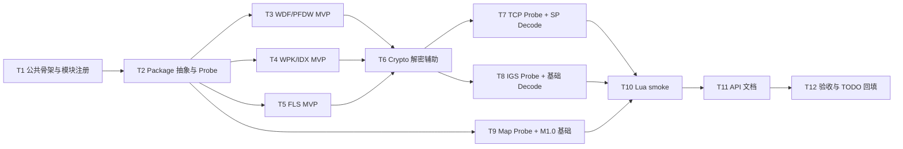

# Phase G.3 — 资源格式插件集成 (TASK)

> **依赖**: [ALIGNMENT](ALIGNMENT_PhaseG_3.md) · [DESIGN](DESIGN_PhaseG_3.md)  
> **原则**: 先容器读取，后资源解码；先 assets 可验证路径，后样本缺口路径

---

## 任务依赖图

---

## T1 ｜公共骨架与模块注册

**输入**: ALIGNMENT + DESIGN

**输出**:

- 新增源文件骨架：
  - `ChocoLight/src/light_plugins_package.cpp`
  - `ChocoLight/src/light_plugins_tcp.cpp`
  - `ChocoLight/src/light_plugins_igs.cpp`
  - `ChocoLight/src/light_plugins_map.cpp`
  - `ChocoLight/src/resource_package.cpp`
  - `ChocoLight/src/resource_wdf.cpp`
  - `ChocoLight/src/resource_wpk.cpp`
  - `ChocoLight/src/resource_fls.cpp`
  - `ChocoLight/src/resource_crypto.cpp`
  - `ChocoLight/src/resource_tcp.cpp`
  - `ChocoLight/src/resource_igs.cpp`
  - `ChocoLight/src/resource_map.cpp`
  - 对应 `.h` 文件按需新增

**实现约束**:

- 不继续扩大 `light_plugins.cpp`。
- 每个 `luaopen_Light_Plugins_*` 返回模块 table。
- 不使用 `luaL_register(L, "Light.Plugins.Xxx", ...)`。
- 运行时错误按 `nil, err` 返回。

**验收**:

- `require("Light.Plugins.Package")` 可加载。
- `require("Light.Plugins.TCP")` 可加载。
- `require("Light.Plugins.IGS")` 可加载。
- `require("Light.Plugins.Map")` 可加载。
- 参数错误走 Lua 原生参数错误。
- 空实现阶段 smoke 不崩溃。

---

## T2 ｜Package 抽象与 Probe

**输入**: T1 骨架

**输出**:

- `IResourcePackage` 抽象接口。
- `PackageInfo`、`ResourceEntry`、`ReadOptions`、`ResourceKey`。
- `Package.Probe(pathOrData [, options])`。
- `Package.Open(path [, options])` 基础 dispatch。

**职责**:

1. 读取前 16~32 字节。
2. 识别：
   - `PFDW/WDFP/WDFX/WDFH/SFDW/WDFS/NXPK/MHWD`
   - `SKPW`
   - `0SLF`
3. 对 `NXPK/MHWD` 返回 unsupported。
4. 分发到 WDF/WPK/FLS parser。

**验收**:

- `wzife.wdf` Probe 返回 `kind="WDF", subtype="PFDW"`。
- `addon.idx` Probe 返回 `kind="WPK", subtype="SKPW"`。
- `interface.fls` Probe 返回 `kind="FLS", subtype="0SLF"`。
- 未知文件返回 `nil, "unknown package format"`。

---

## T3 ｜WDF/PFDW MVP

**输入**: T2 Package 抽象

**输出**:

- `WdfPackage` parser。
- PFDW/WDFP 头读取。
- 索引表读取。
- `List/Has/GetData/GetInfo`。

**实现约束**:

- 所有 `count * entrySize` 做溢出检查。
- 所有 offset/size 验证在文件范围内。
- `GetData` 读取失败返回 `nil, err`。

**验收**:

- `assets/wzife.wdf` 可 Open。
- `GetInfo().count > 0`。
- `List()` 返回条目数组。
- `GetData(firstEntry.key)` 返回非空 string。

---

## T4 ｜WPK/IDX MVP

**输入**: T2 Package 抽象

**输出**:

- `WpkPackage` parser。
- IDX `SKPW` 索引读取。
- 分卷 WPK 自动定位。
- 基础 `List/Has/GetData`。

**实现约束**:

- 默认从 idx 同目录找 `{folderName}{wpk_id}.wpk`。
- `options.wpkDir` 和 `options.folderName` 预留。
- 外部分卷缺失返回明确错误。
- 先完成 raw read，再接 T6 AC/XC 解密。

**验收**:

- `assets/addon.idx` 可 Open。
- `List()` 返回条目。
- 对首个非 external 条目，能定位 `addon0.wpk` 并读取 bytes。

---

## T5 ｜FLS MVP

**输入**: T2 Package 抽象

**输出**:

- `FlsPackage` parser。
- `0SLF` 头读取。
- 16 字节索引条目解密。
- `List/Has/GetData`。

**实现约束**:

- 索引解密按 `mx_fls.py`/`gmx_fls.cpp` 对照移植。
- 数据读取默认 raw；T6 后补自动 decrypt 判定。
- offset/size 必须边界检查。

**验收**:

- `assets/interface.fls` 可 Open。
- `assets/magic.fls` 可 Open。
- `GetInfo().count > 0`。
- `GetData(firstEntry.key)` 返回非空 string。

---

## T6 ｜Crypto 解密与解包辅助

**输入**: T3/T4/T5 基础读可用

**输出**:

- WDFH/SFDW/WDFS 索引与数据解密辅助。
- WPK AC/XC 解密。
- deobfuscate。
- zlib/miniz 解包。
- FLS 数据解密辅助。

**实现约束**:

- AES 复用 `tiny_aes`。
- zlib 复用 `miniz`。
- 不新增 pycryptodome/lz4/zstd 等运行时依赖。
- 解压输出设置安全上限。
- 自动解密必须保守，不能破坏 raw 正常数据。

**验收**:

- AC/XC magic 能正确识别。
- `Package.GetData(key, {raw=true})` 跳过解密。
- `Package.GetData(key)` 默认执行已确认格式的解密/解包。
- 无样本覆盖的子类型至少能返回明确 unsupported 或 validation required。

---

## T7 ｜TCP Probe + SP Decode

**输入**: T1 模块骨架 + T6 可选解密辅助

**输出**:

- `TCP.Probe(data)`。
- `TCP.Decode(data [, options])`。
- `TCP.DecodeFrame(data, index [, options])`。
- SP/RGB565/BGR888 调色板解析。
- SP RLE 解码到 RGBA。

**实现约束**:

- v1 优先覆盖 assets 中 `SP` 样本。
- `options.maxFrames` 控制 smoke 解码成本。
- 帧宽高设最大保护，例如 4096。
- 对 TP/RP 先 Probe，Decode 可分阶段补齐。

**验收**:

- `assets/剑侠客.tcp` Probe 返回 `format="TCP-SP"`。
- Decode 前 1 帧返回 `pixels` string。
- `#pixels == width * height * 4`。

---

## T8 ｜IGS Probe + 基础 Decode

**输入**: T1 模块骨架

**输出**:

- `IGS.Probe(data)`。
- `IGS.Decode(data [, options])`。
- `IGS.DecodeFrame(data, index [, options])`。

**实现约束**:

- 支持 I0/T0/I1/T1/I5/T5 Probe。
- Decode 先实现外部代码已明确的 indexed/truecolor 常见路径。
- 若无真实样本，smoke 仅做 synthetic header Probe。

**验收**:

- synthetic IGS 头 Probe 成功。
- 如果从 FLS/WDF 发现 IGS 条目，Decode 前 1 帧成功。
- 无样本时不阻塞整体 Phase 验收，但 TODO 记录样本缺口。

---

## T9 ｜Map Probe + M1.0 基础

**输入**: T1 模块骨架

**输出**:

- `Map.Probe(pathOrData [, options])`。
- `Map.Open(path [, options])`。
- `MapHandle:GetInfo()`。
- `MapHandle:GetBlock(tileId)`。
- `MapHandle:GetCell()`。
- `MapHandle:Close()`。

**实现约束**:

- v1 重点覆盖 `assets/1001.map` 的 `0.1M/M1.0`。
- tile block 数据可先以 raw string 返回。
- JPEG 修复/整图渲染/MASK LZO 后置。
- GMX PNAM/MANP 因无样本，先返回 unsupported sample required。

**验收**:

- `1001.map` Probe 返回 `kind="MAP", subtype="M1.0"`。
- Open 后 `GetInfo().width > 0`、`GetInfo().height > 0`。
- `GetBlock(1)` 返回 table。
- `GetCell()` 若 CELL block 存在，返回 string；不存在返回 `nil, err` 且不崩溃。

---

## T10 ｜Lua smoke

**输入**: T1~T9

**输出**:

- `scripts/smoke/resource_formats.lua`。
- CI runtime smoke 注册。

**测试分层**:

1. API surface：无 assets 也必须通过。
2. synthetic：最小头部 Probe。
3. assets：检测 `LIGHT_TEST_ASSETS` 或 `assets/` 存在后运行。

**验收**:

- 无 assets 环境 smoke 不失败，输出 skip。
- 有 assets 环境覆盖 WDF/WPK/FLS/TCP/MAP。
- 每个失败有明确错误文本。

---

## T11 ｜API 文档

**输入**: 实际 API 完成

**输出**:

- 更新 `docs/api/Light_Plugins.md`。
- 记录 `Package/TCP/IGS/Map` API。
- 添加测试资源环境变量说明。

**验收**:

- 函数签名与实现一致。
- 示例可运行。
- `nil, err` 约定清晰。
- Unsupported 范围明确列出。

---

## T12 ｜验收与 TODO 回填

**输入**: T10/T11 完成

**输出**:

- 更新 `ACCEPTANCE_PhaseG_3.md`。
- 更新 `TODO_PhaseG_3.md`。
- 记录样本覆盖和缺口。

**验收**:

- 所有已实现任务有验证证据。
- 未实现项均在 TODO 中说明原因和下一步。
- 不声称未验证格式已完成。

---

## 实施顺序建议

1. T1 → T2 → T3：先让 `wzife.wdf` 跑通。
2. T4 → T5：补 WPK/FLS 容器。
3. T10 初版：建立 smoke 框架。
4. T7：用 `.tcp` 样本做 SP 解码。
5. T9：用 `1001.map` 做 M1.0 基础。
6. T6/T8：按样本逐步增强解密和 IGS。
7. T11/T12：文档与验收收尾。

---

## 并行化建议

可并行任务：

- WDF/WPK/FLS parser 的静态实现可以并行设计，但最终需统一到 Package 接口。
- TCP 与 MAP 可以在 Package MVP 后并行。
- IGS 可独立推进，但真实样本定位依赖 Package 能读 FLS/WDF。

不可并行任务：

- T1 模块骨架必须先于所有 Lua binding。
- T2 Package 抽象必须先于 WDF/WPK/FLS 接入。
- T10 smoke 最终版依赖各模块 API 稳定。
