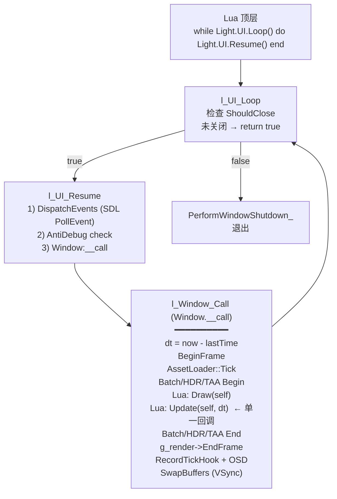

# Phase H.0 Tick-Render 解耦 — ALIGNMENT 对齐文档

> **阶段**: 6A Workflow — 阶段 1 Align
> **目标**: 模糊需求 → 精确规范
> **创建日期**: 2026-05-19
> **基线**: F.1.5 完结后启动; 来源 `docs/HANDOFF_REMAINING_TASKS.md` §3 选项 A.2

---

## 1. 项目上下文分析

### 1.1 当前主循环结构 (light_ui.cpp + platform_window_sdl3.cpp)



**关键观察**:

1. **Update 与 Render 完全耦合** — `Update(dt)` 在 `Window:__call` 内调用一次, dt 是 wall-clock; 无 fixed timestep 概念.
2. **`dt` 随 VSync 变化** — 60Hz 显示器: dt ≈ 16.67ms; 144Hz: dt ≈ 6.94ms. 物理 / 动画行为随显示器刷新率漂移.
3. **顺序 Draw → Update** — 先渲染当前状态, 后推进逻辑. 用户必须理解这个反直觉顺序才能正确写动画.
4. **物理 / 动画当前由 Lua 主动 Step**:
   - `light_physics.cpp::l_World_Step` (Box2D)
   - `light_physics3d.cpp::l_World_Step` (Bullet)
   - `light_animation.cpp::l_Animator_Update`
   - 32 个 sample 内大都直接 `world:Update(dt)` 或 `animator:Update(dt)`, dt 仍是 wall-clock.
5. **Web 平台 RunMainLoop 已实现但未启用** — `platform_window_sdl3.cpp:622-629` 有 `emscripten_set_main_loop_arg` 包装, 但 `light_ui.cpp` 当前依然走 `while UI.Loop() do UI.Resume() end` 模式 (依赖 ASYNCIFY 或被动 yield).

### 1.2 32 个 sample 的固定模板

```lua
function Demo:Update(dt)        -- 当前唯一 Update 回调
    -- 用户在此处推进:
    --   ・物理 (world:Step(dt))
    --   ・动画 (animator:Update(dt))
    --   ・相机 (camera angle += rotSpeed * dt)
    --   ・自定义状态机
end

function Demo:Draw()
    -- 用户在此处绘制
end

Demo:Open(W, H, 'title')
while Light.UI.Loop() do Light.UI.Resume() end
```

### 1.3 业界对照 (Glenn Fiedler / Godot / UE5 / Unity)

| 引擎 | 逻辑频率 | 渲染频率 | 解耦方式 | 备注 |
|------|---------|---------|---------|------|
| **Glenn Fiedler "Fix Your Timestep"** | fixed (默认 60Hz) | 显示器刷新率 | accumulator + alpha 插值 | 业界经典 |
| **Godot** | `_physics_process` 60Hz fixed | `_process` 显示器刷新率 | 两个独立回调 | 真正解耦 |
| **Unity** | `FixedUpdate` 50Hz | `Update` 显示器刷新率 | 但 `Update` 仍耦合渲染 | 半解耦 |
| **UE5** | `Tick` (variable) | `Tick` (variable) | 同一函数, dt 含 GPU+CPU | 未真解耦 |
| **Box2D 文档** | 推荐 fixed 60Hz | 任意 | 用户自管 accumulator | 用户责任 |
| **Bullet 文档** | `stepSimulation(dt, maxSubSteps, fixedTimeStep)` | 任意 | 内部 sub-step | 引擎内置 |

**结论**: ChocoLight 当前接近 Unity 风格但更 naive (没有 FixedUpdate). 业界主流是**双回调 + accumulator + alpha 插值** (Godot / Fiedler 模式).

---

## 2. 原始需求

> **来源**: `docs/HANDOFF_REMAINING_TASKS.md` §3 选项 A.2
>
> **Tick-Render 解耦**: 60Hz 逻辑 + VSync 渲染, 为未来插帧 / 网络同步铺路 (估时 8-15h, 架构级)

**用户已通过 4 项决策确认 (2026-05-19)**:

1. ✅ **新增 API 不破旧版** — 现有 `Update(dt)` 保留 wall-clock 语义, 新增 `OnFixedUpdate(dt)` + `OnRender(alpha, dt)`
2. ✅ **提供 alpha 插值参数** — Render 帧接收 `alpha ∈ [0, 1]` 表示距离上次 fixed update 的进度
3. ✅ **物理引擎自动 Step** — Box2D / Bullet World 注册后引擎自动 Step (不再需用户手动 World:Step)
4. ✅ **全平台一致 (含 Web)** — Web 同步使用 fixed timestep, 内嵌 emscripten_set_main_loop

---

## 3. 边界确认 (任务范围)

### 3.1 IN SCOPE (本阶段必做)

| # | 项 | 说明 |
|---|---|------|
| 1 | `Light::Time` C++ 模块 | 全局 accumulator + 配置 fixedDt + spiral guard |
| 2 | `Light.Time` Lua API | `SetFixedTimestep(hz)` / `GetFixedTimestep` / `SetMaxFixedStepsPerFrame` / `GetAccumulator` / `GetAlpha` |
| 3 | Window 双新回调 | `OnFixedUpdate(dt)` (固定频率) / `OnRender(alpha, dt)` (渲染频率) |
| 4 | 主循环重构 | `l_Window_Call` 内插入 fixed-step accumulator 阶段; 调用顺序: FixedUpdate × N → Update (兼容旧) → OnRender (新) → Draw (旧) |
| 5 | 物理引擎自动 Step | Box2D `b2World` + Bullet `btDynamicsWorld` 注册到全局列表; FixedUpdate 内自动 `Step(fixedDt)` |
| 6 | 物理 World 注册 API | `Light.Physics.SetAutoStep(world, bool)` / `Light.Physics3D.SetAutoStep(world, bool)`; 默认 `true` 但保留 `false` 兼容老 sample |
| 7 | Web 平台主循环 | `__EMSCRIPTEN__` 下 `light_ui.cpp` 改用 `emscripten_set_main_loop_arg` (内嵌 fix-step 一致) |
| 8 | `samples/demo_tick_render/` | 新增完整 sample, 演示 60Hz 物理 + 144Hz 渲染 + alpha 插值; 绘制双小方块对比无 / 有 alpha |
| 9 | smoke 自动化 | `scripts/smoke/tick_render.lua` 验证 API 完整性 + accumulator 边界 + spiral guard + alpha 范围 |
| 10 | CI 6 平台验证 | Win/Linux/macOS/Android/iOS/Web 全部 build success |
| 11 | 6A 7 件套文档 | ALIGNMENT/CONSENSUS/DESIGN/TASK/ACCEPTANCE/FINAL/TODO |

### 3.2 OUT OF SCOPE (本阶段不做)

| # | 项 | 原因 |
|---|---|------|
| 1 | 多线程逻辑 (Tick 线程 / Render 线程分离) | 跨线程 Lua 状态非常复杂 (Lua VM 单线程); 用户决策 4 仅要求"逻辑/渲染 *频率* 解耦", 不要求线程解耦 |
| 2 | 网络同步 / 插帧 / Frame Generation | 上层应用功能, 与底层 Tick-Render 解耦无关 |
| 3 | Animation 自动 Update | Lua 已有 `animator:Update(dt)` 模式 + ECS 系统封装 (`world:Update(dt)` 内置 _AnimationSystem); 不再增引擎自动调度 (用户场景多变) |
| 4 | TAA / DRS / motion vector 适配 | F.1.5 GPU timer 已与 wall-clock dt 解耦; jitter / motion vector 仍走 Render 帧 (用户透明) |
| 5 | TextRenderer / SpriteAnim 内部 Update | 不主动迁移, 由用户在 OnFixedUpdate / Update 中按需调 |
| 6 | 改 32 个老 sample | 零回归保证, sample 内 `Update(dt)` 仍正常工作 |
| 7 | iOS / Android 主循环优化 | iOS / Android SDL3 已有 paused 状态机; 本阶段不动平台特定路径 |

---

## 4. 需求理解 (对现有项目的理解)

### 4.1 修改面 (估算 LOC)

| 文件 | 改动类型 | 估算 LOC |
|------|---------|---------|
| `ChocoLight/src/light_time.cpp` (新建) | 新建 | ~150 |
| `ChocoLight/src/light_time.h` (新建) | 新建 | ~60 |
| `ChocoLight/src/light_ui.cpp` | 修改 (主循环重构) | ~50 |
| `ChocoLight/src/platform_window_sdl3.cpp` | 修改 (Web 主循环) | ~30 |
| `ChocoLight/src/light_physics.cpp` | 修改 (auto-step 注册) | ~40 |
| `ChocoLight/src/light_physics3d.cpp` | 修改 (auto-step 注册) | ~40 |
| `lumen-master/src/lumen/lumen.cpp` (Lua bridge) | 修改 (Time 注册) | ~20 |
| `samples/demo_tick_render/main.lua` (新建) | 新建 | ~200 |
| `samples/demo_tick_render/README.md` (新建) | 新建 | ~80 |
| `scripts/smoke/tick_render.lua` (新建) | 新建 | ~250 |
| 6A 7 件套文档 | 新建 | ~2000 |
| **总计** | | **~2920 LOC** |

### 4.2 与 F 系列 / G 系列已交付的关系

- ✅ **F.1.5 GPU Timer**: 互补. F.1.5 解决 DRS 决策的 GPU 时间精确性; H.0 解决 Lua 逻辑频率漂移. 两个独立但配合.
- ✅ **G.0 Lua Hot Reload**: 兼容. OnFixedUpdate / OnRender 也走 hot reload Preserve(key, factory) 路径; 状态保留方式不变.
- ✅ **G.1.6 Async Asset Preload**: 不影响. AssetLoader::Tick 仍在每个 Render 帧调一次 (与 OnFixedUpdate 频率不耦合).
- ✅ **G.1.7 Lua API Robustness**: 兼容. 新增 API 全部走 LT::CheckXxx 模板, 类型安全.

---

## 5. 疑问澄清

### 5.1 已基于项目内容自决 (无需用户确认)

| # | 疑问 | 决策 | 依据 |
|---|------|------|------|
| Q1 | fixedDt 默认值? | **60 Hz (1/60 ≈ 16.667ms)** | Box2D / Bullet / Godot 业界默认 |
| Q2 | 累积上限 (spiral guard)? | **maxFixedStepsPerFrame = 8 (~133ms)** | Glenn Fiedler 经典推荐; 8 步 60Hz = 0.13s |
| Q3 | 单帧最大 frameTime clamp? | **0.25 s** | Glenn Fiedler 经典 (防 alt-tab 后回来卡爆) |
| Q4 | 顺序: FixedUpdate vs Update vs OnRender? | **FixedUpdate × N → Update (旧) → OnRender (新) → Draw (旧)** | 物理先推进; 旧 Update 兼容; OnRender 用最新状态; Draw 是 deprecated 渐进 |
| Q5 | OnFixedUpdate 没定义时的行为? | **静默跳过 (nil → 不调)** | 同 Update / Draw 现行行为 |
| Q6 | OnRender 没定义时的行为? | **fallback 到 Draw 路径 (兼容)** | 老 sample 不需迁移 |
| Q7 | alpha 计算公式? | **alpha = accumulator / fixedDt** | Fiedler 经典; 范围 [0, 1) |
| Q8 | World:Step API 是否保留? | **保留** (设 `SetAutoStep(false)` 后用户可手动 Step) | 老 sample 兼容; 新 API 是 opt-in |
| Q9 | 物理 auto-step 时机? | **每个 FixedUpdate 内部, Lua FixedUpdate 之前** | 物理状态对 FixedUpdate 可见; 用户写 collision response 在 FixedUpdate 中 |
| Q10 | Web 主循环帧率? | **emscripten_set_main_loop fps=0 (浏览器 requestAnimationFrame)** | 浏览器决定; 内部 fix-step accumulator 自适应 |
| Q11 | 多 World 注册顺序? | **创建顺序; FIFO Step** | 简单可预测 |
| Q12 | Time 模块多实例? | **单实例 (全局)** | 主循环只有一个; 多 instance 没有意义 |

### 5.2 需用户拍板的决策点 (无)

经决策投票阶段已 4 项全选 (新 API + alpha + 物理 auto + 全平台), 关键路径无歧义. **进入下一阶段 (CONSENSUS) 无需更多用户确认**.

### 5.3 留观察 (实施时若发现可中断)

| # | 项 | 处理 |
|---|----|------|
| O1 | 老 sample physics 显式 World:Step 与 auto-step 是否冲突? | 若 SetAutoStep 默认 true 而 sample 仍 Step → 双 Step 物理震荡. 实施时改默认 false 或加 audit log |
| O2 | Lua 5.4 GC 与高频 OnFixedUpdate (60Hz) 压力 | 实施前 benchmark; 若 GC pause > 1ms 考虑增量 GC |
| O3 | iOS 后台暂停时 accumulator 爆炸 | OnAppPause 事件清空 accumulator (TODO 内, 不阻塞主交付) |

---

## 6. 行业知识总结 (用于 DESIGN / TASK)

### 6.1 Glenn Fiedler "Fix Your Timestep" 核心代码

```cpp
const double dt = 1.0 / 60.0;  // fixed
double t = 0.0;
double currentTime = hires_time_in_seconds();
double accumulator = 0.0;

while (running) {
    double newTime = hires_time_in_seconds();
    double frameTime = newTime - currentTime;
    if (frameTime > 0.25) frameTime = 0.25;  // spiral guard
    currentTime = newTime;
    accumulator += frameTime;

    while (accumulator >= dt) {
        previousState = currentState;
        integrate(currentState, t, dt);  // FixedUpdate
        t += dt;
        accumulator -= dt;
    }

    const double alpha = accumulator / dt;
    State state = lerp(previousState, currentState, alpha);
    render(state);  // OnRender(alpha)
}
```

### 6.2 Godot 风格双回调 (PR 草案要参考)

```gdscript
func _physics_process(delta):  # fixed dt = 1/60
    velocity += gravity * delta
    move_and_slide()

func _process(delta):  # frame dt
    $Sprite.rotation = lerp_angle(prev, curr, _alpha)
```

### 6.3 Bullet `stepSimulation` 内部 sub-step (借鉴模式)

```cpp
world->stepSimulation(dt, maxSubSteps=10, fixedTimeStep=1.0/60.0);
// 内部累积 dt, 每超过 fixedTimeStep 触发一次 internalSingleStepSimulation;
// maxSubSteps 是单帧上限.
```

→ ChocoLight 的 H.0 实现等同于"在引擎层显式实现这个 accumulator", 而不依赖 Bullet 内部.

---

## 7. 文档版本

| 版本 | 日期 | 修订 |
|------|------|------|
| v1.0 | 2026-05-19 | 初稿 — 基于用户 4 项决策 + 项目内代码调研 |
