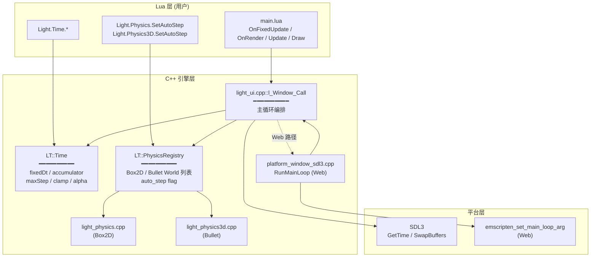

# Phase H.0 Tick-Render 解耦 — DESIGN 设计文档

> **阶段**: 6A Workflow — 阶段 2 Architect
> **基线**: ALIGNMENT_PhaseH_0.md + CONSENSUS_PhaseH_0.md
> **状态**: ✅ 设计就绪, 等待 TASK 拆分

---

## 1. 整体架构

### 1.1 模块依赖图



### 1.2 分层职责

| 层 | 职责 | 不做 |
|----|------|------|
| Lua 用户层 | 业务逻辑 / 渲染参数 / 状态机 | 主循环 / 时序控制 |
| `Light.Time` Lua API | 暴露配置和查询 | 持状态 (delegate to LT::Time) |
| `LT::Time` C++ | 时序状态 + accumulator + spiral guard | Lua VM 调度 |
| `light_ui.cpp` 主循环 | 调度 FixedUpdate / Update / OnRender / Draw | 时序计算 (delegate to LT::Time) |
| `LT::PhysicsRegistry` | 全局 World 列表 + auto_step flag | 实际物理计算 (delegate to Box2D/Bullet) |
| Box2D / Bullet | 物理 step | 时序累积 |
| SDL3 / Emscripten | wall-clock + swap | 业务 |

---

## 2. 数据结构

### 2.1 LT::Time 内部 (light_time.h + light_time.cpp)

```cpp
namespace LT {

// 时序配置 + 运行状态 (单例, 全局共享)
struct TimeState {
    // 配置 (用户可改)
    double fixedDt              = 1.0 / 60.0;   // 固定 dt (s); SetFixedTimestep(hz) 改为 1/hz
    int    maxFixedStepsPerFrame = 8;           // 单帧 fixed-step 上限 (spiral guard)
    double frameTimeClamp       = 0.25;         // 单帧 frameTime 上限 (s)

    // 运行状态 (自动维护)
    double accumulator          = 0.0;
    double lastTime             = 0.0;          // 0 = 未初始化
    double alpha                = 0.0;          // [0, 1)
    int    lastFixedStepCount   = 0;            // 最近一帧 fixed step 实际数

    // 警告状态 (诊断)
    bool   warnedSpiralLastFrame = false;       // 上一帧触顶, 用于节流 log
};

// 公开接口
void   Init();                        // Window:Open 时调一次
void   Shutdown();                    // Window 关闭时调
void   BeginFrame();                  // 每个 Window:__call 入口调
                                       // 内部更新 lastTime / accumulator / alpha
void   ConsumeFixedStep();            // 单步消耗 (accumulator -= fixedDt + step++)
bool   ShouldStepFixed();             // accumulator >= fixedDt && step < max
void   FinalizeFrame();               // 计算 alpha + clamp accumulator

// 查询 / 配置
double GetFixedDt();
int    GetFixedHz();                  // (int)(1.0 / fixedDt + 0.5)
void   SetFixedHz(int hz);            // hz ∈ [1, 1000], 否则 warning + clamp
int    GetMaxFixedStepsPerFrame();
void   SetMaxFixedStepsPerFrame(int n);  // n ∈ [1, 64]
double GetFrameTimeClamp();
void   SetFrameTimeClamp(double s);   // s ∈ [0.01, 1.0]
double GetAlpha();
double GetAccumulator();
int    GetLastStepCount();
double GetLastFrameTime();            // 上一帧实际 frameTime (s)

}  // namespace LT
```

### 2.2 LT::PhysicsRegistry (内嵌 light_time.cpp 内, 简单实现)

```cpp
namespace LT {

// 物理 World 注册项 (类型擦除, 用回调函数指针)
struct PhysicsWorldEntry {
    void*  worldPtr;                  // b2World* 或 btDynamicsWorld*
    void   (*stepFunc)(void*, double); // 注入的 step 函数 (Box2D / Bullet 各自实现)
    bool   autoStep = false;          // 默认 false, 用户 SetAutoStep(true) 启用
};

// 注册 / 注销 / 查询
void   RegisterPhysicsWorld(void* world, void (*stepFn)(void*, double));
void   UnregisterPhysicsWorld(void* world);
void   SetAutoStep(void* world, bool on);
bool   GetAutoStep(void* world);
void   StepAllAuto(double dt);        // 主循环 FixedUpdate 内调用; 遍历 autoStep=true 的 world

}  // namespace LT
```

**Box2D / Bullet 各自提供 step 函数指针**:

```cpp
// light_physics.cpp 内
static void Box2DWorldStepThunk_(void* world, double dt) {
    auto* w = static_cast<World*>(world);    // ChocoLight 包装类型
    if (w && w->alive && w->world) {
        w->world->Step((float)dt, 8, 3);     // Box2D 内部 sub-step
    }
}

// CreateWorld 内
LT::RegisterPhysicsWorld(w, &Box2DWorldStepThunk_);

// DestroyWorld 内
LT::UnregisterPhysicsWorld(w);
```

```cpp
// light_physics3d.cpp 内
static void BulletWorldStepThunk_(void* world, double dt) {
    auto* w = static_cast<World3D*>(world);
    if (w && w->alive && w->world) {
        w->world->stepSimulation((float)dt, /*maxSubSteps=*/1, (float)dt);
    }
}
```

---

## 3. 接口契约

### 3.1 Lua API 详细签名

#### `Light.Time` 模块 (新)

```lua
-- 时序配置
Light.Time.SetFixedTimestep(hz)
  -- @param hz integer | number  逻辑频率 (1 ≤ hz ≤ 1000)
  -- @return nil
  -- @raises 类型错 / 范围错 → Lua error

Light.Time.GetFixedTimestep()
  -- @return integer  当前 fixedHz (= 1/fixedDt 取整)

Light.Time.GetFixedDt()
  -- @return number   当前 fixedDt (s, 高精度)

Light.Time.SetMaxFixedStepsPerFrame(n)
  -- @param n integer  [1, 64]
  -- @return nil
  -- @raises 越界 → error

Light.Time.GetMaxFixedStepsPerFrame()
  -- @return integer

Light.Time.SetFrameTimeClamp(s)
  -- @param s number   [0.01, 1.0]  单帧 frameTime 上限
  -- @return nil
  -- @raises 越界 → error

Light.Time.GetFrameTimeClamp()
  -- @return number

-- 运行时查询 (在 OnFixedUpdate / OnRender / Update 内可调)
Light.Time.GetAlpha()
  -- @return number    [0, 1)  距上次 fixed update 的进度 (用于状态 lerp)

Light.Time.GetAccumulator()
  -- @return number    累积器值 (s)

Light.Time.GetLastStepCount()
  -- @return integer   上一帧实际 fixed step 数 (调试)

Light.Time.GetLastFrameTime()
  -- @return number    上一帧 frameTime (s, wall-clock; 已 clamp)
```

#### `Light.Physics` / `Light.Physics3D` 扩展

```lua
Light.Physics.SetAutoStep(world, enabled)
  -- @param world userdata  Box2D world (CheckWorld 校验, magic 防御)
  -- @param enabled boolean
  -- @return nil
  -- @raises world 类型错 / enabled 非 boolean → error

Light.Physics.GetAutoStep(world)
  -- @return boolean

-- 同上 Light.Physics3D.SetAutoStep / GetAutoStep
```

#### `Window` 新回调约定

```lua
-- 新 (推荐)
function Window:OnFixedUpdate(dt)
  -- @param dt number   等于 fixedDt (永远固定)
  -- @semantics  每帧调 0..maxFixedStepsPerFrame 次 (累积器决定)
  -- @use 物理 / 网络同步 / 决定性逻辑

function Window:OnRender(alpha, dt)
  -- @param alpha number  [0, 1)  距上次 fixed update 进度
  -- @param dt number     wall-clock frameTime (已 clamp)
  -- @semantics  每帧调一次 (在 Draw / Update 之后)
  -- @use 状态 lerp / 渲染相关 dt 用法

-- 兼容 (老; 不推荐 + 不破坏)
function Window:Update(dt)   -- dt = wall-clock; 每帧 1 次, 不变
function Window:Draw()       -- 每帧 1 次, 不变
```

### 3.2 C++ 内部接口

见 §2.1 / §2.2.

---

## 4. 数据流图

### 4.1 单帧时序 (Mermaid sequence)

```mermaid
sequenceDiagram
    participant Lua as Lua main.lua
    participant UI as light_ui.cpp::l_Window_Call
    participant Time as LT::Time
    participant Phys as LT::PhysicsRegistry
    participant GL as RenderBackend

    Lua->>UI: while UI.Loop() do UI.Resume() end
    UI->>Time: BeginFrame()
    Time->>Time: frameTime = now - lastTime; clamp
    Time->>Time: accumulator += frameTime

    loop accumulator >= fixedDt && step < maxStep
        UI->>Time: ShouldStepFixed() ? true
        UI->>Phys: StepAllAuto(fixedDt)
        Phys->>Phys: 遍历 autoStep=true 的 World
        Phys-->>UI: (Box2D / Bullet step 完成)
        UI->>Lua: OnFixedUpdate(fixedDt)
        Lua-->>UI: 返回
        UI->>Time: ConsumeFixedStep() (acc -= fixedDt; step++)
    end

    UI->>Time: FinalizeFrame() (alpha = acc/fixedDt; clamp)
    UI->>GL: BeginFrame + AssetLoader::Tick + Batch/HDR/TAA::Begin + Jitter
    UI->>Lua: Draw()                  # 旧
    Lua-->>UI: 返回
    UI->>Lua: Update(frameTime)        # 旧
    Lua-->>UI: 返回
    UI->>Lua: OnRender(alpha, frameTime)  # 新
    Lua-->>UI: 返回
    UI->>GL: Batch/HDR/TAA::End + EndFrame
    UI->>GL: RecordTickHook + DrawRecordOSD + SwapBuffers
```

### 4.2 三种典型场景的累积器轨迹

#### 场景 A — 60Hz 显示器, fixedDt=1/60 (理想)

```
frame   frameTime  accumulator  steps  alpha
1       16.67ms    16.67ms      1      0.0
2       16.67ms    16.67ms      1      0.0
3       16.67ms    16.67ms      1      0.0
... 完美一对一
```

#### 场景 B — 144Hz 显示器, fixedDt=1/60

```
frame   frameTime  accumulator  steps  alpha
1       6.94ms     6.94ms       0      0.42
2       6.94ms     13.88ms      0      0.83
3       6.94ms     20.82ms       1      0.25  (consumed 16.67)
4       6.94ms     11.09ms       0      0.67
5       6.94ms     18.03ms       1      0.08  (consumed 16.67)
... 平均每 12 个 render 帧 5 个 fixed step (60/144 = 0.417)
```

#### 场景 C — 低帧率 (10Hz), fixedDt=1/60, maxStep=8

```
frame   frameTime  accumulator  steps  alpha       备注
1       100ms      100ms         6      0.0        消耗 6 × 16.67 = 100; 余 0
2       250ms→0.25 (clamp) → 250 → 累积 250ms       8       某些累   超 maxStep 阈值
                                                                     强制 acc = 4 * fixedDt = 66.67
3       100ms      166.67ms      8      0.0        触顶, acc = 66.67
... spiral 防御稳定
```

### 4.3 物理 auto-step 决策树

```mermaid
flowchart TD
    A[FixedUpdate 阶段每步入口] --> B{物理 World 列表为空?}
    B -- 是 --> Z[跳过, return]
    B -- 否 --> C[遍历每个 World]
    C --> D{world.autoStep == true?}
    D -- 否 --> C
    D -- 是 --> E{world.alive?}
    E -- 否 --> C
    E -- 是 --> F[stepFunc(world, fixedDt)]
    F --> C
```

---

## 5. 异常处理策略

### 5.1 OnFixedUpdate Lua 错误

```cpp
lua_getfield(L, 1, "OnFixedUpdate");
if (lua_isfunction(L, -1)) {
    lua_pushvalue(L, 1);
    lua_pushnumber(L, fixedDt);
    if (lua_pcall(L, 2, 0, 0)) {
        CC::Log(CC::LOG_ERROR, "OnFixedUpdate: %s", lua_tostring(L, -1));
        lua_pop(L, 1);
    }
} else {
    lua_pop(L, 1);
}
// 关键: 错误不影响下一个 step (accumulator 仍正常 -=)
//       不影响 OnRender / Draw / Update 调度
```

### 5.2 OnRender Lua 错误

同上, 不影响后续 EndFrame / SwapBuffers.

### 5.3 物理 stepFunc 异常

C++ 异常用 try/catch 包. Box2D / Bullet 文档承诺不抛异常, 但用户自定义 contact callback 可能间接抛 (Lua callback 内 raise). 用 `lua_pcall` 在 light_physics 已有保护.

### 5.4 Spiral 触顶诊断

```cpp
if (state.lastFixedStepCount >= state.maxFixedStepsPerFrame) {
    if (!state.warnedSpiralLastFrame) {
        CC::Log(CC::LOG_WARN, "Tick-Render: spiral guard hit (frameTime=%.3f, %d steps)",
                state.lastFrameTime, state.lastFixedStepCount);
        state.warnedSpiralLastFrame = true;
    }
} else {
    state.warnedSpiralLastFrame = false;   // 退出 spiral, 重置 log 节流
}
```

每次进入 / 退出 spiral 状态时 log 一次, 避免刷屏.

### 5.5 类型 / 范围校验

| API | 校验 | 错误处理 |
|-----|------|---------|
| `SetFixedTimestep(hz)` | hz 是 number; hz ∈ [1, 1000] | `luaL_error` + 不修改状态 |
| `SetMaxFixedStepsPerFrame(n)` | n ∈ [1, 64] | 同上 |
| `SetFrameTimeClamp(s)` | s ∈ [0.01, 1.0] | 同上 |
| `SetAutoStep(world, en)` | world 是已注册 World userdata; en 是 boolean | 不存在 → silent skip + WARN log |

---

## 6. 与已有系统的集成点

### 6.1 与 F.1.5 (GPU Timer) 的关系

- F.1.5 用 GPU timer 提供精确 GPU 帧时间给 DRS, 不依赖 Lua-side dt.
- H.0 不影响 F.1.5: GPU timer 仍在 Render 阶段 (BeginFrame / EndFrame) 包裹.
- DRS 决策器 `UpdateDRS` 仍由 Lua 在 `OnRender` 或 `Update` 内调用 (用户透明).

### 6.2 与 G.0 (Hot Reload) 的关系

- 用户在新模块定义 `OnFixedUpdate` / `OnRender` 后, hot reload 期间这两个回调随 `Light.Reload.Module` 自动重新装载.
- `Light.Time.*` 状态不重置 (引擎全局, 不属于热重载范围).
- Window registry ref 保留 → 回调表自动指向新模块.

### 6.3 与 G.1.7 (Lua API Robustness) 的关系

- `Light.Time.SetFixedTimestep` 等 API 走 LT::CheckXxx 模板.
- `Light.Physics.SetAutoStep(world)` 用 `LT::CheckInstance<World>(L, 1, LT_MAGIC_PHYSICS_WORLD)` 防御.

### 6.4 与 ECS (Phase D) 的关系

- 用户在 ECS 内自然写: `function Game:OnFixedUpdate(dt) world:Update(dt) end` (其中 ECS world 用 fixed dt).
- ECS 内置 `_AnimationSystem` / `_DrawSkinnedMesh` 不变; 用户决定在哪个回调 (Update / OnFixedUpdate / OnRender) 内调.

---

## 7. 配置文件 / 常量

### 7.1 编译期常量 (light_time.h)

```cpp
namespace LT {
constexpr double kDefaultFixedDt              = 1.0 / 60.0;   // 60Hz
constexpr int    kDefaultMaxFixedStepsPerFrame = 8;
constexpr double kDefaultFrameTimeClamp       = 0.25;          // 250ms
constexpr int    kFixedHzMin                  = 1;
constexpr int    kFixedHzMax                  = 1000;
constexpr int    kMaxStepMin                  = 1;
constexpr int    kMaxStepMax                  = 64;
constexpr double kFrameClampMin               = 0.01;          // 10ms
constexpr double kFrameClampMax               = 1.0;           // 1s
constexpr double kAccumulatorMaxFactor        = 4.0;           // acc 上限 = fixedDt * 4
}
```

无运行时配置文件 / 环境变量.

---

## 8. 文档版本

| 版本 | 日期 | 修订 |
|------|------|------|
| v1.0 | 2026-05-19 | 初稿 — 完整设计, 覆盖 §1~§7 |
