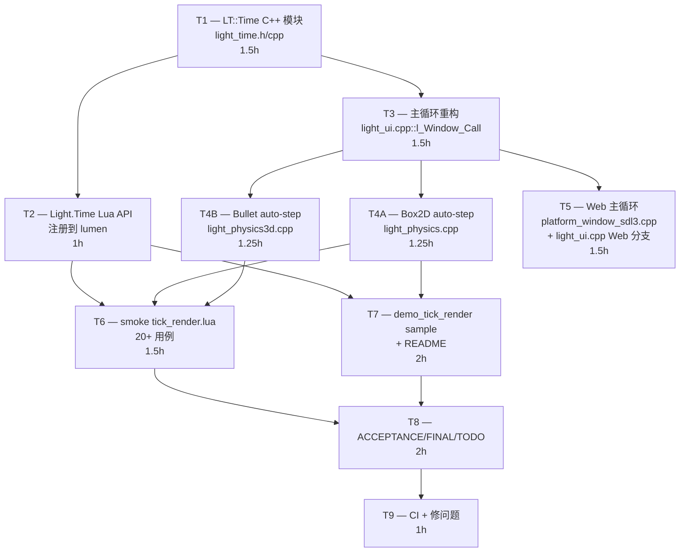

# Phase H.0 Tick-Render 解耦 — TASK 原子任务文档

> **阶段**: 6A Workflow — 阶段 3 Atomize
> **基线**: ALIGNMENT + CONSENSUS + DESIGN
> **状态**: ✅ 任务拆分完成, 等用户审批进入 Automate

---

## 1. 任务依赖图



**关键路径**: T1 → T3 → T4A/B → T6 → T8 → T9 (~9-10h)
**并行机会**: T4A 和 T4B 完全独立; T5 与 T4 独立

---

## 2. 任务清单 (按依赖顺序)

### T1 — LT::Time C++ 模块 (1.5h)

#### 输入契约
- **前置**: 无 (新建模块)
- **输入数据**: SDL3 `PlatformWindow::GetTime()` (单调递增 wall-clock)
- **环境依赖**: 无

#### 输出契约
- **交付**:
  - `ChocoLight/include/light_time.h` (~60 LOC, 全部 namespace `LT`)
  - `ChocoLight/src/light_time.cpp` (~150 LOC)
- **公开接口** (DESIGN §2.1):
  ```cpp
  void Init() / Shutdown() / BeginFrame() / FinalizeFrame()
  bool ShouldStepFixed()
  void ConsumeFixedStep()
  double GetFixedDt() / GetAlpha() / GetAccumulator() / GetLastFrameTime()
  int    GetFixedHz() / GetMaxFixedStepsPerFrame() / GetLastStepCount()
  void   SetFixedHz(int)            // 范围校验 + clamp + log warning
  void   SetMaxFixedStepsPerFrame(int)
  void   SetFrameTimeClamp(double)
  ```
- **不变式**:
  - `accumulator >= 0` 永远成立
  - `alpha ∈ [0, 1)` 在 `FinalizeFrame()` 之后
  - `fixedDt ∈ [1/1000, 1/1] = [1ms, 1s]`

#### 实现约束
- **技术栈**: C++17, 仅依赖 `<cstdint>` / `<algorithm>` (clamp)
- **规范**: namespace LT, 单例全局状态, 无 thread-local
- **质量**:
  - 单元测试 (写在 smoke 内, 不引入 GoogleTest)
  - 所有 Setter 越界 → log + clamp (不 raise, 友好降级)

#### 依赖关系
- **后置**: T2 (Lua API 调本模块) / T3 (主循环用本模块)
- **并行**: 无

#### 验收
- 编译通过 (新增 light_time.cpp 进 CMake)
- DESIGN §2.1 全部公开接口符号导出
- 默认值: fixedDt=1/60, maxStep=8, clamp=0.25

---

### T2 — Light.Time Lua API + lumen 注册 (1h)

#### 输入契约
- **前置**: T1 完成 (LT::Time 接口可用)
- **输入数据**: Lua state 上的 number / integer 参数
- **环境依赖**: lumen-master (Lua 5.4)

#### 输出契约
- **交付**:
  - `ChocoLight/src/light_time.cpp` 内追加 ~80 LOC Lua wrapper:
    - `l_Time_SetFixedTimestep` / `l_Time_GetFixedTimestep` / `l_Time_GetFixedDt`
    - `l_Time_SetMaxFixedStepsPerFrame` / `l_Time_GetMaxFixedStepsPerFrame`
    - `l_Time_SetFrameTimeClamp` / `l_Time_GetFrameTimeClamp`
    - `l_Time_GetAlpha` / `l_Time_GetAccumulator` / `l_Time_GetLastStepCount` / `l_Time_GetLastFrameTime`
  - `time_funcs[]` luaL_Reg 数组 + `OpenTimeModule(L)` 入口函数
  - `lumen-master/src/lumen/lumen.cpp` 调 OpenTimeModule (按现有 Light 子模块注册风格)

#### 实现约束
- **技术栈**: Lua C API, `LT::CheckXxx` 类型校验 (G.1.7 helper)
- **范围校验**:
  - SetFixedTimestep(hz): hz 必须 number, ∈ [1, 1000]
  - SetMaxFixedStepsPerFrame(n): integer ∈ [1, 64]
  - SetFrameTimeClamp(s): number ∈ [0.01, 1.0]
- **错误处理**: 越界 / 类型错 → `luaL_error` (raise)

#### 依赖关系
- **后置**: T6 (smoke 测 API), T7 (demo 用 API)

#### 验收
- `Light.Time` 表存在, 11 个方法全部可调
- smoke 范围校验通过

---

### T3 — 主循环重构 (1.5h)

#### 输入契约
- **前置**: T1 完成
- **输入数据**: 现有 `l_Window_Call` 行为 (light_ui.cpp:677-759)
- **环境依赖**: SDL3 + OpenGL + 各渲染器

#### 输出契约
- **交付**: `ChocoLight/src/light_ui.cpp::l_Window_Call` 重构 (~50 LOC 改动)
  - 删除原 `static double lastTime = ...; double dt = nowTime - lastTime;`
  - 替换为 `LT::Time::BeginFrame()` 调用
  - 新增 fixed-step accumulator while 循环 (调 LT::PhysicsRegistry::StepAllAuto + Lua OnFixedUpdate)
  - 新增 `LT::Time::FinalizeFrame()` 计算 alpha
  - 在 Update(frameTime) 之后插入 `OnRender(alpha, frameTime)` 调用
- **新增 helper** (在 light_ui.cpp 内):
  ```cpp
  static void CallLuaCallback_(lua_State* L, int windowIdx, const char* name);
  static void CallLuaCallback_(lua_State* L, int windowIdx, const char* name, double arg1);
  static void CallLuaCallback_(lua_State* L, int windowIdx, const char* name, double a1, double a2);
  ```
  减少 5 处 `lua_getfield + isfunction + pushvalue + pcall + Log + pop` 重复

#### 实现约束
- **顺序严格**: §2.6 CONSENSUS 定义的 11 步
- **零回归**: Update / Draw 行为不变
- **错误处理**: Lua callback raise 时 `lua_pop(L, 1)` + 不影响后续 step

#### 依赖关系
- **前置**: T1
- **后置**: T4A / T4B / T5 / T6 / T7
- **关键**: 主循环重构后必须 syntax check + 至少 1 个 sample 跑通

#### 验收
- syntax check (lightc -p)
- 老 sample (e.g. demo_taau) 不修改, build success
- 新回调 OnFixedUpdate / OnRender 在用户定义后被调

---

### T4A — Box2D 物理 auto-step (1.25h)

#### 输入契约
- **前置**: T3 完成 (主循环 PhysicsAutoStepAll 已调用)
- **输入数据**: `light_physics.cpp` 现有 `World` struct (CheckWorld 已有 magic 防御)
- **环境依赖**: Box2D 库

#### 输出契约
- **交付**: `light_physics.cpp` 修改 (~40 LOC)
  - 新增 `Box2DWorldStepThunk_` static fn (类型擦除 wrapper)
  - `l_World_Create` 内调 `LT::RegisterPhysicsWorld(w, &Box2DWorldStepThunk_)`
  - `l_World_Destroy` (或 __gc) 内调 `LT::UnregisterPhysicsWorld(w)`
  - 新增 `l_World_SetAutoStep` / `l_World_GetAutoStep` Lua wrapper
  - 注册到 `g_world_funcs[]`
- **保留**: `l_World_Step` 不变 (用户可手动调用)

#### 实现约束
- **默认 autoStep = false** (零回归)
- **类型校验**: SetAutoStep(world, en) 检查 world 是 b2World userdata + en 是 boolean
- **冲突检测**: 用户混合 auto + 手动 Step → 节流 log warning (留 TODO)

#### 依赖关系
- **前置**: T1 (LT::PhysicsRegistry) + T3
- **后置**: T6 (smoke), T7 (demo)
- **并行**: T4B

#### 验收
- World:Step 仍可手动调
- World:SetAutoStep(true) + 不调 Step → 物理仍前进
- 双 Step (auto + 手动) → log warning

---

### T4B — Bullet 物理 auto-step (1.25h)

同 T4A 但目标 `light_physics3d.cpp::World3D` (Bullet btDynamicsWorld).

**差异**: Bullet `stepSimulation(dt, maxSubSteps=1, fixedTimeStep=dt)` 用 maxSubSteps=1 强制单步 (我们外层已 accumulate).

---

### T5 — Web 主循环 (1.5h)

#### 输入契约
- **前置**: T3 完成
- **输入数据**: `platform_window_sdl3.cpp::RunMainLoop` (已有, 但未使用)
- **环境依赖**: Emscripten

#### 输出契约
- **交付**:
  - `light_ui.cpp` 内新增 Web 分支 (`#ifdef __EMSCRIPTEN__`):
    - `l_UI_Loop` / `l_UI_Resume` 在 Web 平台改为简化逻辑或保持兼容性
    - 真正的主循环改为 `EmscriptenSingleStep_` 函数, 由 `RunMainLoop` 调度
  - `EmscriptenSingleStep_` 内部:
    1. DispatchEvents
    2. 调用 Window:__call (即现有 l_Window_Call 内容)
    3. 不 SwapBuffers (Emscripten 自动)? 实际 SDL3 仍要调
- **决策**:
  - **方案 A (简单)**: 保持 `while UI.Loop() do UI.Resume() end` Lua 模板不变, 让 ASYNCIFY 处理 (现状)
  - **方案 B (规范)**: Lua 写 `Light.UI.Run()`, 内部走 emscripten_set_main_loop_arg, 桌面 fallback while loop
- **本阶段选 A 即可** (零回归), 但记录 B 为 TODO

#### 实现约束
- **零 Lua 改动**: sample 不必改
- **fix-step 一致性**: Web 上 OnFixedUpdate 60Hz fixed (即使浏览器 90Hz / 120Hz refresh)

#### 依赖关系
- **前置**: T3
- **后置**: T9 (CI Web build)

#### 验收
- Web build success
- 用户在浏览器跑 demo_tick_render 看到 OnFixedUpdate 60Hz 计数

#### 实施备注
- 因为现状 Emscripten 已用 ASYNCIFY, 本阶段实际工作量可能 < 1.5h, 主要测试 + 文档
- 若发现 ASYNCIFY 与 fix-step 兼容性问题, 推到 TODO

---

### T6 — smoke `tick_render.lua` (1.5h)

#### 输入契约
- **前置**: T2 + T4A + T4B 完成
- **输入数据**: Lua API surface

#### 输出契约
- **交付**: `scripts/smoke/tick_render.lua` (~250 LOC, 20+ 用例)
- **测试段**:
  ```
  §1  Module surface (Light.Time + Light.Physics.SetAutoStep + ...)  ← API 完整性
  §2  Default values (fixedDt=1/60, maxStep=8, clamp=0.25)
  §3  SetFixedTimestep round-trip + 范围校验 (raise on out-of-range)
  §4  SetMaxFixedStepsPerFrame round-trip + 范围校验
  §5  SetFrameTimeClamp round-trip + 范围校验
  §6  GetAlpha 在 OnRender 内 ∈ [0, 1)
  §7  GetLastStepCount 在 60Hz 显示器上一帧 ≈ 1
  §8  OnFixedUpdate 计数器 1 秒 ≈ 60 (容忍 ±5)
  §9  OnRender 调用次数 = SwapBuffers 次数
  §10 Update + Draw + OnFixedUpdate + OnRender 4 回调共存
  §11 OnRender 不存在时 fallback Draw (老 sample 兼容)
  §12 Box2D auto-step: SetAutoStep(true) → world position 推进
  §13 Bullet auto-step: SetAutoStep(true) → world position 推进
  §14 默认 auto-step = false (零回归)
  §15 World:Step + auto-step 同时 → 双 step + warning
  §16 状态复位
  ```
- **运行环境**: headless 兼容 (无窗口时 graceful skip 物理 / 频率测试)

#### 实现约束
- 与现有 smoke 风格一致 (pass/fail 计数 + 末尾 summary)
- 不依赖窗口 (用 mocked 主循环 driver, 调 LT::Time::BeginFrame 手动驱动)

#### 依赖关系
- **前置**: T2, T4A, T4B
- **后置**: T9 CI

#### 验收
- 本地 lightc -p syntax check pass
- CI Windows runtime smoke ALL PASS

---

### T7 — `samples/demo_tick_render/` (2h)

#### 输入契约
- **前置**: T2 + T3 + T4A + T4B (主功能就绪)

#### 输出契约
- **交付**:
  - `samples/demo_tick_render/main.lua` (~200 LOC)
    - 双方块对比: 左方块 (无 alpha 插值) + 右方块 (含 alpha 插值)
    - 60Hz 物理 (Box2D 弹球) + 144Hz 渲染 (按 VSync)
    - HUD 显示: fixedHz / actualFPS / alpha / lastStepCount / accumulator
    - 按键:
      - `1/2/3/4`: 切 fixedHz (30/60/120/144)
      - `A`: 切 alpha 插值开关
      - `P`: 切物理 auto-step 开关
      - `R`: reset
      - `ESC`: 退出
  - `samples/demo_tick_render/README.md` (~80 LOC)
    - 截图占位
    - 按键说明
    - 设计要点 (alpha 插值原理 + accumulator + spiral guard)

#### 实现约束
- 复用 demo_taau 的 HUD 字体绘制风格
- 物理用 Box2D (Lua API 已有)

#### 依赖关系
- **前置**: T2, T3, T4A
- **后置**: T8

#### 验收
- 本地 syntax check + (有窗口时) 实际运行无 crash
- HUD 数值合理: 60Hz 显示器 ≈ 60 fps + 60 fixed step / s

---

### T8 — ACCEPTANCE / FINAL / TODO (2h)

#### 输入契约
- **前置**: T6 + T7 完成

#### 输出契约
- **交付**:
  - `docs/Phase H.0 Tick-Render Decouple/ACCEPTANCE_PhaseH_0.md`
  - `docs/Phase H.0 Tick-Render Decouple/FINAL_PhaseH_0.md` (CI 结果填后)
  - `docs/Phase H.0 Tick-Render Decouple/TODO_PhaseH_0.md`

#### 实现约束
- 与 Phase F.1.5 文档风格一致 (5 大节: 任务完成情况 + 文件改动 + 验收核对 + 设计权衡 + 已知限制)

---

### T9 — CI + 修问题 (1h)

#### 输入契约
- **前置**: T1~T8 完成

#### 输出契约
- **行动**:
  - `git add -A; git commit -m "Phase H.0 Tick-Render Decouple ..."; git push`
  - `gh run watch` 等待 6 平台 CI
  - 若失败, 修问题, 二次提交
  - 全绿后追加 commit (FINAL/TODO 文档)

#### 验收
- CI run 全绿 (Win/Linux/macOS/Android/iOS/Web)
- smoke 在 Windows runtime job 全绿

---

## 3. 总工时核对

| 任务 | 估时 |
|------|------|
| T1 LT::Time | 1.5h |
| T2 Lua API | 1h |
| T3 主循环 | 1.5h |
| T4A Box2D auto-step | 1.25h |
| T4B Bullet auto-step | 1.25h |
| T5 Web 主循环 | 1.5h |
| T6 smoke | 1.5h |
| T7 demo | 2h |
| T8 文档 | 2h |
| T9 CI | 1h |
| **合计** | **14.5h** |

落在用户决策时给出的 8-15h 区间.

---

## 4. 风险与缓解

| 风险 | 概率 | 影响 | 缓解 |
|------|------|------|------|
| Web ASYNCIFY 与 fix-step 累加器冲突 | 中 | 中 (Web build fail) | T5 选方案 A (zero-change), 真正 emscripten_set_main_loop 留 TODO |
| 用户老 sample 内 World:Step + 我们默认 false 没问题, 但用户启用 SetAutoStep 后忘记停止手动 Step → 双 step | 中 | 低 (物理震荡) | log warning + TODO 文档 |
| Lua VM 5.4 GC 在高频 OnFixedUpdate 下抖动 | 低 | 低 (性能) | 留 TODO O2, 实施时 benchmark |
| iOS / Android 后台暂停时 accumulator 爆炸 | 中 | 中 (恢复后卡顿) | spiral guard 已防御; OnAppPause hook 留 TODO |
| 动画系统跑在 Update (wall-clock) 但物理跑在 OnFixedUpdate (fixed) → 视觉不同步 | 中 | 中 (用户体验) | demo + README 教学 alpha 插值 |

---

## 5. 验证清单 (Approve 阶段必查)

- [x] 任务覆盖 CONSENSUS §3.1 全部 12 个验收点
- [x] 依赖关系无循环
- [x] 每任务可独立编译 / smoke
- [x] 总工时 ≤ 用户决策上限 (15h)
- [x] 风险清单完整
- [x] 边界 (IN / OUT) 明确
- [x] 与已交付 Phase 兼容性已确认 (F.1.5 / G.0 / G.1.6 / G.1.7)

---

## 6. 文档版本

| 版本 | 日期 | 修订 |
|------|------|------|
| v1.0 | 2026-05-19 | 初稿 — 9 任务 (8 主 + 1 CI) 拆完, 14.5h 估时 |
