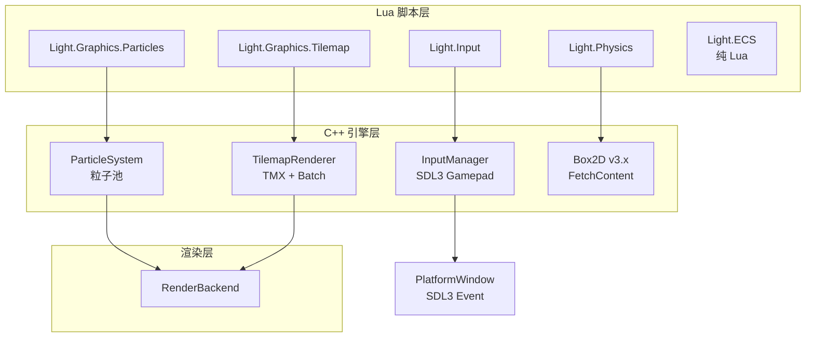
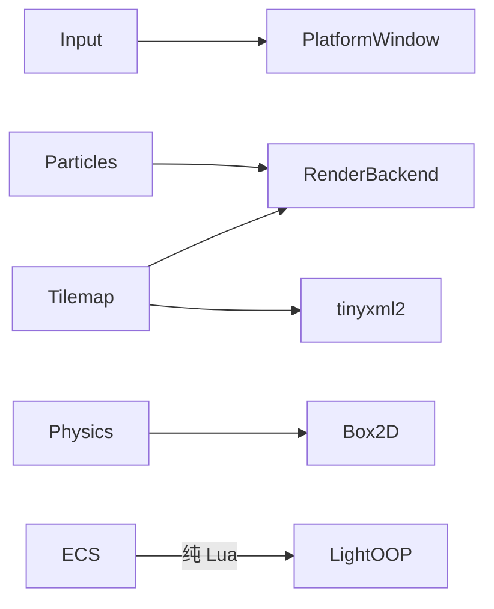

# DESIGN — Phase 2 游戏能力架构

## 整体架构



## 模块设计

### 1. 输入管理器 (Light.Input)

**文件**: `light_input.cpp` + 扩展 `platform_window_sdl3.cpp`

**PlatformWindow 扩展**:
```
Event::GamepadButton   — 按钮按下/释放
Event::GamepadAxis     — 摇杆/扳机轴值
Event::GamepadConnect  — 手柄连接/断开
```

**Lua API**:
```lua
-- 查询 API (每帧可调用)
Light.Input.IsKeyDown(key)          → bool
Light.Input.IsMouseDown(button)     → bool
Light.Input.GetMousePosition()      → x, y
Light.Input.GetTouchCount()         → int
Light.Input.GetTouch(index)         → id, x, y, pressure

-- 手柄
Light.Input.GetGamepadCount()       → int
Light.Input.IsGamepadConnected(idx) → bool
Light.Input.GetGamepadButton(idx, btn) → bool
Light.Input.GetGamepadAxis(idx, axis)  → float (-1..1)
Light.Input.GetGamepadName(idx)     → string

-- 虚拟按键映射
Light.Input.AddAction("jump", {key=SPACE, gamepadBtn=A})
Light.Input.IsActionDown("jump")    → bool
```

**内部状态**: 维护键盘/鼠标/触摸/手柄的当前帧状态快照

### 2. 粒子系统 (Light.Graphics.Particles)

**文件**: `light_particles.cpp`

**C++ 粒子池**:
```cpp
struct Particle {
    float x, y;           // 位置
    float vx, vy;         // 速度
    float ax, ay;          // 加速度 (含重力)
    float r, g, b, a;     // 颜色
    float size;            // 大小
    float life, maxLife;   // 生命周期
    float rotation, rotSpeed; // 旋转
};

struct ParticleEmitter {
    Particle* pool;        // 粒子数组
    int capacity;          // 池大小
    int activeCount;       // 活跃粒子数
    // 发射参数 (范围)
    float emitRate;        // 每秒发射数
    float minLife, maxLife;
    float minSpeed, maxSpeed;
    // ... 更多参数
};
```

**Lua API**:
```lua
local emitter = Light(Light.Graphics.Particles):New()
emitter:SetPosition(400, 300)
emitter:SetEmitRate(100)
emitter:SetLifeRange(0.5, 2.0)
emitter:SetSpeedRange(50, 200)
emitter:SetColorRange({1,0,0,1}, {1,1,0,0})  -- 红→黄渐变
emitter:SetSizeRange(2, 8)
emitter:SetGravity(0, 100)
emitter:Start()
-- 主循环中
emitter:Update(dt)
emitter:Draw()
```

### 3. Tilemap (Light.Graphics.Tilemap)

**文件**: `light_tilemap.cpp` + `third_party/tinyxml2/` (TMX 解析)

**数据结构**:
```cpp
struct TileLayer {
    int width, height;      // tile 数
    int* data;              // tile ID 数组 (0=空)
};

struct Tileset {
    uint32_t texId;         // GL 纹理
    int tileW, tileH;       // 单 tile 像素
    int columns;            // 图集列数
    int firstGid;           // TMX gid 偏移
};

struct Tilemap {
    std::vector<TileLayer> layers;
    std::vector<Tileset> tilesets;
    int tileW, tileH;       // 全局 tile 尺寸
    int mapW, mapH;          // 地图 tile 数
};
```

**Lua API**:
```lua
local map = Light(Light.Graphics.Tilemap):New()
map:Load("level1.tmx")             -- 或 map:LoadFromString(xml)
map:Draw(offsetX, offsetY)          -- 绘制所有图层
map:DrawLayer(layerIndex, ox, oy)   -- 绘制单图层
map:GetTile(layer, x, y)           → tileId
map:SetTile(layer, x, y, tileId)
map:GetMapSize()                   → w, h (tile 数)
map:GetTileSize()                  → w, h (像素)
```

**渲染优化**: 每图层一次 `DrawArrays(Quads, ...)`, 只提交视口内可见 tile

### 4. Box2D 物理 (Light.Physics)

**文件**: `light_physics.cpp`
**依赖**: Box2D v3.x via FetchContent

**Lua API**:
```lua
-- 世界
local world = Light(Light.Physics.World):New()
world:SetGravity(0, 9.8)

-- 刚体
local body = world:CreateBody("dynamic", 400, 300)
body:AddBox(32, 32)                   -- 矩形碰撞体
body:AddCircle(16)                     -- 圆形碰撞体
body:SetRestitution(0.5)
body:SetFriction(0.3)

-- 静态地面
local ground = world:CreateBody("static", 400, 580)
ground:AddBox(800, 20)

-- 模拟
world:Step(dt)

-- 查询
local x, y = body:GetPosition()
local angle = body:GetAngle()

-- 碰撞回调
world:OnCollision(function(bodyA, bodyB, contact)
    print("collision!")
end)
```

### 5. ECS (Light.ECS) — 纯 Lua

**文件**: 内嵌 Lua 脚本 (类似 Network.Web 模块)

```lua
-- 使用
local world = Light(Light.ECS.World):New()

-- 组件
world:RegisterComponent("Position", {x=0, y=0})
world:RegisterComponent("Velocity", {vx=0, vy=0})
world:RegisterComponent("Sprite",   {image=nil, w=0, h=0})

-- 实体
local e = world:CreateEntity()
e:Add("Position", {x=100, y=200})
e:Add("Velocity", {vx=50, vy=0})

-- 系统
world:AddSystem("Movement", {"Position", "Velocity"}, function(entities, dt)
    for _, ent in ipairs(entities) do
        ent.Position.x = ent.Position.x + ent.Velocity.vx * dt
        ent.Position.y = ent.Position.y + ent.Velocity.vy * dt
    end
end)

world:Update(dt)
```

## 模块依赖图



## 接口契约

| 模块 | luaopen 函数 | 依赖 | 新文件 |
|------|-------------|------|--------|
| Input | `luaopen_Light_Input` | SDL3 Gamepad | `light_input.cpp` |
| Particles | `luaopen_Light_Graphics_Particles` | RenderBackend | `light_particles.cpp` |
| Tilemap | `luaopen_Light_Graphics_Tilemap` | RenderBackend + tinyxml2 | `light_tilemap.cpp` |
| Physics.World | `luaopen_Light_Physics` + `luaopen_Light_Physics_World` | Box2D v3 | `light_physics.cpp` |
| ECS | `luaopen_Light_ECS` | 无 (纯 Lua) | 内嵌于 `light_ecs.cpp` |
