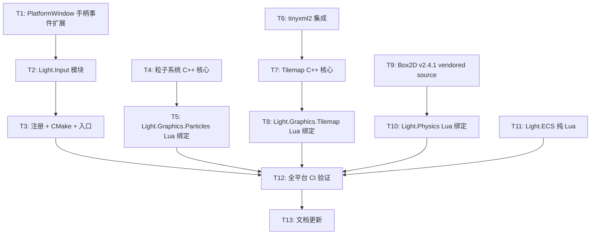

# TASK — Phase 2 原子任务清单

## 任务依赖图

## T1: PlatformWindow 手柄事件扩展

**输入**: 现有 `platform_window.h` Event 结构
**输出**: 新增 GamepadButton/GamepadAxis/GamepadConnect 事件类型
**文件**: `platform_window.h` + `platform_window_sdl3.cpp`
**验收**: PollEvent 可返回手柄事件

## T2: Light.Input 模块

**输入**: T1 完成
**输出**: `light_input.cpp` + `luaopen_Light_Input`
**功能**:
- 键盘/鼠标状态快照 (IsKeyDown, IsMouseDown, GetMousePosition)
- 多点触摸 (GetTouchCount, GetTouch)
- 手柄查询 (GetGamepadCount, GetGamepadButton, GetGamepadAxis)
- 虚拟动作映射 (AddAction, IsActionDown)
**验收**: Lua 脚本可查询所有输入设备状态

## T3: 注册 + CMake (输入)

**输入**: T2 完成
**输出**: light.h 声明, CMakeLists 添加源文件, 入口注册
**文件**: `light.h`, `CMakeLists.txt`, `main.cpp` (Android), `main.m` (iOS)
**验收**: 编译通过

## T4: 粒子系统 C++ 核心

**输入**: RenderBackend 接口
**输出**: ParticleEmitter C++ 类 (Update/Draw/配置)
**文件**: `light_particles.cpp`
**验收**: 单元: 粒子池创建/更新/销毁不泄漏

## T5: Light.Graphics.Particles Lua 绑定

**输入**: T4 完成
**输出**: `luaopen_Light_Graphics_Particles` + Lua API
**验收**: Lua 脚本创建发射器并渲染粒子

## T6: tinyxml2 集成

**输入**: 无
**输出**: `third_party/tinyxml2/` 源码
**验收**: 可编译

## T7: Tilemap C++ 核心

**输入**: T6, RenderBackend
**输出**: Tilemap 加载/渲染 C++ 类
**文件**: `light_tilemap.cpp`
**验收**: 正确解析 .tmx 并绘制

## T8: Light.Graphics.Tilemap Lua 绑定

**输入**: T7 完成
**输出**: `luaopen_Light_Graphics_Tilemap` + Lua API
**验收**: Lua 加载 tmx 文件并绘制

## T9: Box2D v2.4.1 vendored source

**输入**: 无
**输出**: `third_party/box2d` vendored source + CMake integration
**验收**: Box2D 静态库编译通过 (全平台)

## T10: Light.Physics Lua 绑定

**输入**: T9 完成
**输出**: `light_physics.cpp` + `luaopen_Light_Physics` + `luaopen_Light_Physics_World`
**验收**: Lua 创建物理世界, 刚体运动, 碰撞回调

## T11: Light.ECS 纯 Lua

**输入**: 无
**输出**: `light_ecs.cpp` (内嵌 Lua 脚本) + `luaopen_Light_ECS`
**验收**: Lua 创建实体/组件/系统, 查询遍历正常

## T12: 全平台 CI 验证

**输入**: T3, T5, T8, T10, T11
**输出**: 6 平台编译通过
**验收**: GitHub Actions 全绿

## T13: 文档更新

**输入**: T12 完成
**输出**: ENGINE_EVALUATION.md + TODO + FINAL 更新
