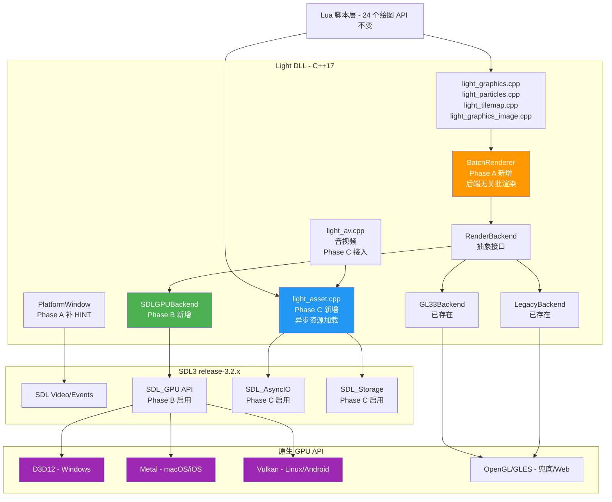
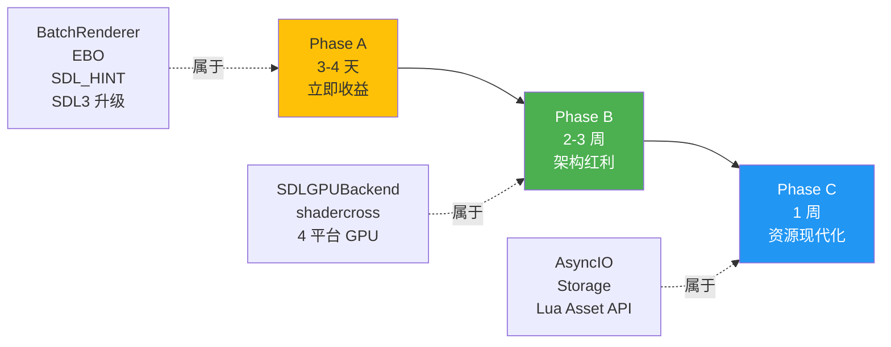
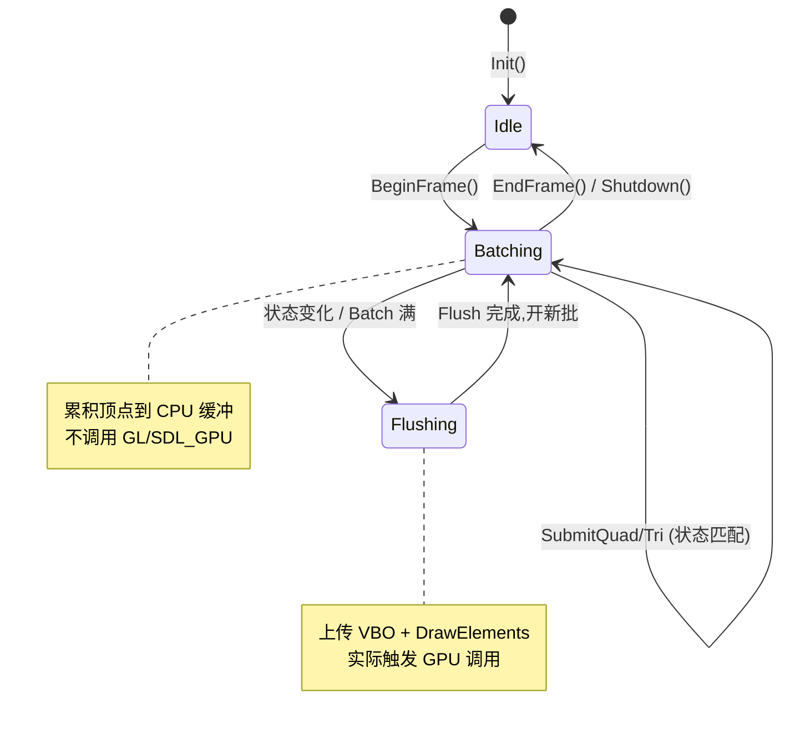
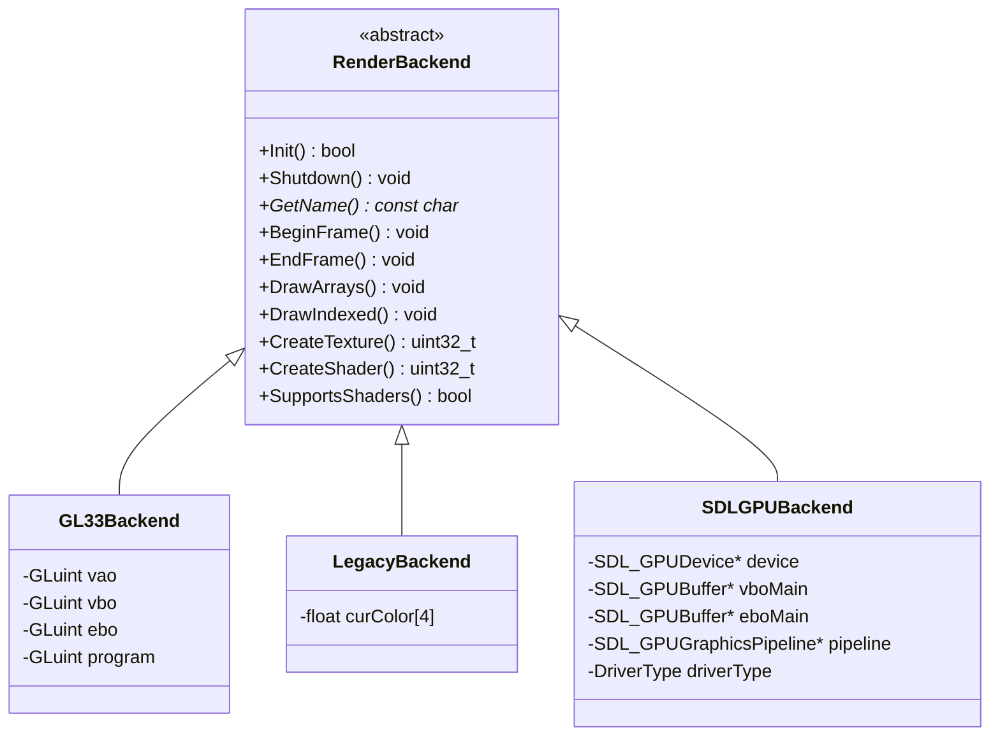
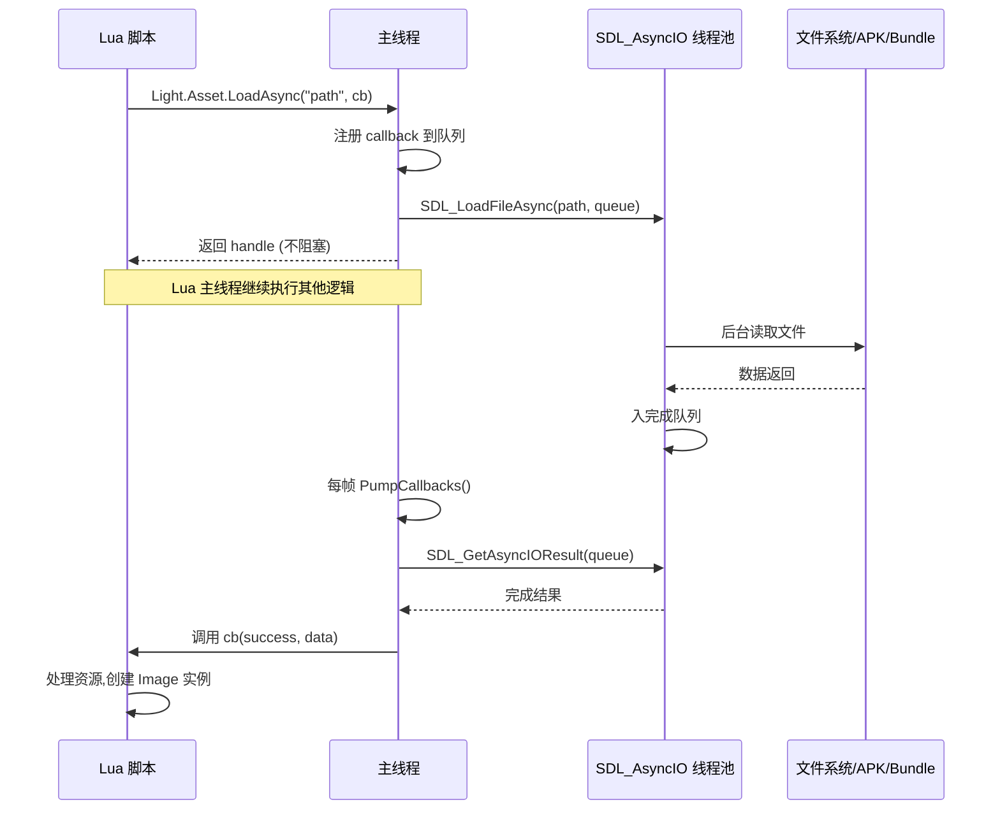
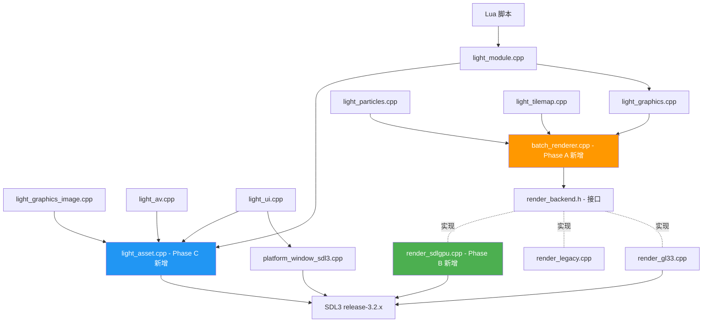
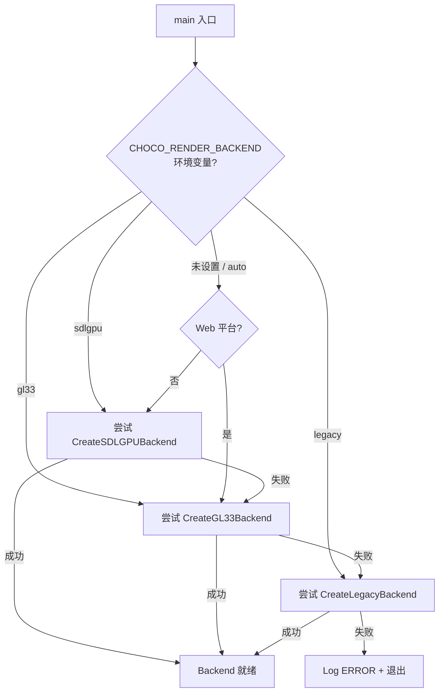
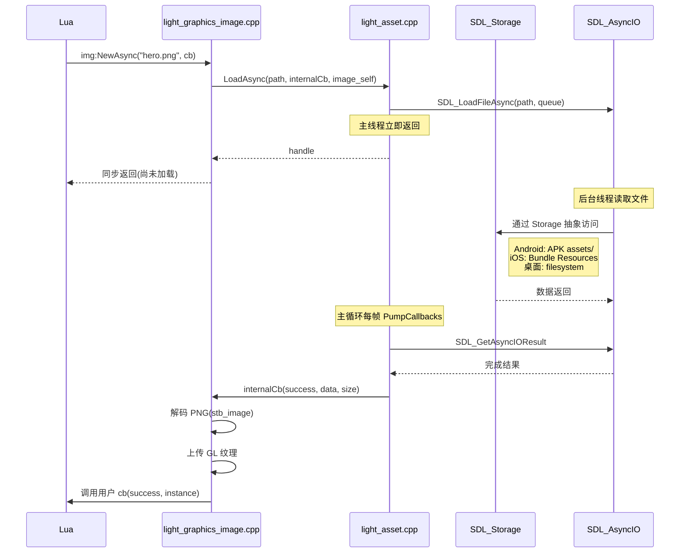

# DESIGN — ChocoLight SDL3 性能释放(三阶段架构设计)

> 创建日期: 2026-05-08 | 基于: CONSENSUS_SDL3性能释放.md
> 阶段: Phase 2 Architect

---

## 一、整体架构(三阶段完成后)

### 1.1 全局架构图



### 1.2 三阶段视图



---

## 二、分层设计

### 2.1 Phase A: BatchRenderer 层

#### 设计目标

- 后端无关:同一接口可在 GL33/Legacy/SDLGPU 上实现
- 状态变化触发自动 Flush:纹理、blend、scissor、shader、矩阵栈
- 零语义破坏:所有现有 `g_render->DrawArrays(...)` 调用点透明替换

#### 接口契约 (`include/batch_renderer.h`)

```cpp
namespace BatchRenderer {

/// 初始化批处理器,绑定到当前 RenderBackend
/// @return true 成功
bool Init(RenderBackend* backend);

/// 关闭并释放批处理器
void Shutdown();

/// 帧开始时调用,准备空批次
void BeginFrame();

/// 帧结束时调用,自动 flush 残余批次
void EndFrame();

/// 提交一个 Quad (4 顶点),自动累积到当前批次
/// 状态匹配则累积,不匹配则 Flush 后开新批
void SubmitQuad(const RenderVertex verts[4], uint32_t textureId);

/// 提交一组三角形 (count 顶点),count 必须是 3 的倍数
void SubmitTriangles(const RenderVertex* verts, int count, uint32_t textureId);

/// 提交一组线段 (count 顶点),count 必须是 2 的倍数
/// 注: 线段一般不批渲染,直接走 backend->DrawArrays,但保留接口对称
void SubmitLines(const RenderVertex* verts, int count);

/// 强制 flush 当前批次(状态切换前必须调用)
void Flush();

/// 通知状态变化,可能触发 Flush
void NotifyStateChange();

/// 性能统计(诊断用)
struct Stats {
    int drawCalls;       // 当前帧 Flush 次数
    int verticesSubmit;  // 当前帧累积顶点数
    int batchesFull;     // 因 batch 满触发的 Flush 数
    int batchesState;    // 因状态变化触发的 Flush 数
};
const Stats& GetStats();
void ResetStats();

} // namespace BatchRenderer
```

#### 关键参数

| 参数 | 值 | 理由 |
|------|---|------|
| `MAX_QUADS_PER_BATCH` | 16384 | uint16 索引上限 65536 / 4 = 16384 quad |
| `MAX_VERTICES_PER_BATCH` | 65536 | 与 EBO 大小一致 |
| `EBO_INDEX_TYPE` | uint16 | GLES 3.0 / WebGL 2 兼容 |
| 顶点格式 | `RenderVertex` (现有) | 36 字节: pos(12) + uv(8) + color(16) |

#### EBO 静态生成

```cpp
// 启动时一次生成,永久使用
std::vector<uint16_t> indices(MAX_QUADS_PER_BATCH * 6);
for (int i = 0; i < MAX_QUADS_PER_BATCH; ++i) {
    int base = i * 4;
    int idx = i * 6;
    indices[idx+0] = base + 0;
    indices[idx+1] = base + 1;
    indices[idx+2] = base + 2;
    indices[idx+3] = base + 0;
    indices[idx+4] = base + 2;
    indices[idx+5] = base + 3;
}
```

#### RenderBackend 扩展接口

```cpp
class RenderBackend {
    // ... 现有接口保持不变 ...
    
    /// Phase A 新增: 批量绘制 indexed triangles
    /// 后端实现负责上传 verts/indices 到 VBO/EBO 并 DrawElements
    virtual void DrawIndexed(const RenderVertex* verts, int vertexCount,
                             const uint16_t* indices, int indexCount,
                             uint32_t textureId) = 0;
};
```

### 2.2 Phase B: SDLGPUBackend 层

#### 设计目标

- 与 GL33Backend 平级,实现完整 RenderBackend 接口
- Shader 单源 HLSL,离线交叉编译
- 运行时透明回退到 GL33

#### 接口契约 (复用 `RenderBackend`)

`SDLGPUBackend` 实现现有 `RenderBackend` 抽象类全部纯虚方法:

```cpp
class SDLGPUBackend : public RenderBackend {
public:
    bool Init() override;
    void Shutdown() override;
    const char* GetName() const override { 
        switch (driverType) {
            case D3D12: return "SDLGPU/D3D12";
            case METAL: return "SDLGPU/Metal";
            case VULKAN: return "SDLGPU/Vulkan";
            default:    return "SDLGPU/Unknown";
        }
    }
    
    // ---- 帧控制 (映射到 SDL_GPU 命令缓冲) ----
    void BeginFrame(...) override;
    void EndFrame() override;
    
    // ---- 绘制 (映射到 SDL_PushGPUVertexUniformData + SDL_DrawGPUIndexedPrimitives) ----
    void DrawArrays(...) override;
    void DrawIndexed(...) override;  // Phase A 接口
    
    // ---- 纹理 (映射到 SDL_CreateGPUTexture / SDL_UploadToGPUTexture) ----
    uint32_t CreateTexture(...) override;
    void DeleteTexture(...) override;
    void BindTexture(...) override;
    void UpdateTexture(...) override;
    void ReplaceTexture(...) override;
    
    // ---- FBO (映射到 SDL_GPUTexture + render pass) ----
    uint32_t CreateFBO(...) override;
    void DeleteFBO(...) override;
    void BindFBO(...) override;
    void UnbindFBO() override;
    
    // ---- Shader (映射到 SDL_CreateGPUShader) ----
    bool SupportsShaders() const override { return true; }
    uint32_t CreateShader(...) override;
    void DeleteShader(...) override;
    bool UseShader(...) override;
    void UseDefaultShader() override;
    
    // ... 其他接口同 GL33Backend
    
private:
    SDL_GPUDevice* device = nullptr;
    SDL_Window*    window = nullptr;
    enum DriverType { D3D12, METAL, VULKAN, UNKNOWN } driverType = UNKNOWN;
    
    SDL_GPUGraphicsPipeline* pipelineDefault = nullptr;
    SDL_GPUBuffer*           vboMain = nullptr;
    SDL_GPUBuffer*           eboMain = nullptr;
    SDL_GPUSampler*          samplerLinear = nullptr;
};
```

#### Shader 工作流

```
┌────────────────────────────────────────────────────┐
│  shaders/default_2d.hlsl  (开发者编辑的单源)       │
└────────────────┬───────────────────────────────────┘
                 │ build_shaders.py (CI 步骤,离线)
                 ↓
┌─────────────────────────────────────────────────────┐
│  SDL_shadercross + DXC → 三套字节码                 │
│  - default_2d.spv   (Vulkan SPIR-V)                 │
│  - default_2d.msl   (Metal MSL)                     │
│  - default_2d.dxil  (D3D12 DXIL)                    │
└────────────────┬────────────────────────────────────┘
                 │ xxd / Python 脚本嵌入
                 ↓
┌─────────────────────────────────────────────────────┐
│  shaders/generated/default_2d.h                     │
│  - extern const uint8_t default_2d_vs_spv[];        │
│  - extern const size_t  default_2d_vs_spv_size;     │
│  - extern const uint8_t default_2d_vs_msl[];        │
│  - ... DXIL 同理                                     │
└────────────────┬────────────────────────────────────┘
                 │ 编译进 Light.dll
                 ↓
┌─────────────────────────────────────────────────────┐
│  render_sdlgpu.cpp 运行时按驱动选择字节码加载       │
│  SDL_CreateGPUShader(device, info_with_correct_format)│
└─────────────────────────────────────────────────────┘
```

#### 运行时后端选择算法

```cpp
RenderBackend* CreateRenderBackend() {
    // 1. 环境变量覆盖
    const char* env = getenv("CHOCO_RENDER_BACKEND");
    if (env) {
        if (strcmp(env, "gl33") == 0)    return CreateGL33Backend();
        if (strcmp(env, "legacy") == 0)  return CreateLegacyBackend();
        if (strcmp(env, "sdlgpu") == 0)  return CreateSDLGPUBackend();
        // unknown 值视为 auto
    }
    
    // 2. Web 平台:必须 GL33 (SDL_GPU 不支持 Web)
#ifdef __EMSCRIPTEN__
    return CreateGL33Backend();
#endif
    
    // 3. Auto 模式:优先 SDL_GPU,失败回退 GL33
    RenderBackend* sdlgpu = CreateSDLGPUBackend();
    if (sdlgpu) {
        CC::Log(CC::LOG_INFO, "RenderBackend: %s selected", sdlgpu->GetName());
        return sdlgpu;
    }
    CC::Log(CC::LOG_WARN, "SDL_GPU init failed, falling back to GL33");
    
    // 4. GL33 兜底
    RenderBackend* gl33 = CreateGL33Backend();
    if (gl33) return gl33;
    
    // 5. Legacy 最终兜底(仅桌面)
#if !defined(__EMSCRIPTEN__) && !defined(__ANDROID__) && !defined(CHOCO_PLATFORM_IOS)
    return CreateLegacyBackend();
#endif
    
    return nullptr;
}
```

### 2.3 Phase C: AssetSystem 层

#### 设计目标

- 异步资源加载(SDL_AsyncIO)
- 平台无关存储抽象(SDL_OpenStorage)
- Lua 同步 API 兼容,新增异步 API

#### 接口契约 (`include/light_asset.h`)

```cpp
namespace LightAsset {

/// 初始化 Asset 系统,打开默认 Storage
/// @param baseDir 桌面 Storage 根目录(Android/iOS 忽略,使用平台默认)
/// @return true 成功
bool Init(const char* baseDir = nullptr);

/// 关闭 Asset 系统
void Shutdown();

/// 异步加载结果
struct AsyncResult {
    bool        success;
    void*       data;        // 加载完成时持有数据,调用方负责 Free
    size_t      size;
    char        error[256];  // 失败时的错误信息
};

/// 异步加载回调,在主线程触发
typedef void (*AsyncCallback)(const AsyncResult& result, void* userdata);

/// 异步加载文件(后台线程)
/// @return 任务句柄,可用于取消
uint64_t LoadAsync(const char* path, AsyncCallback cb, void* userdata);

/// 同步加载文件(主线程阻塞,Web 平台默认走此路径)
/// @param[out] outSize 输出文件大小
/// @return 数据指针,失败返回 nullptr,调用方负责 Free
void* LoadSync(const char* path, size_t* outSize);

/// 释放 Load* 返回的数据
void Free(void* data);

/// 取消未完成的异步任务
void Cancel(uint64_t handle);

/// 每帧调用,触发已完成任务的回调
/// 由主循环 light_ui.cpp 自动调用
void PumpCallbacks();

} // namespace LightAsset
```

#### Lua API 设计

```lua
-- 同步 API (现有,保持兼容)
local img = Light(Light.Graphics.Image):New("hero.png")

-- Phase C 新增异步 API
local img = Light.Graphics.Image
img:NewAsync("hero.png", function(success, instance, errMsg)
    if success then
        -- instance 是 Light.Graphics.Image 实例
        myGame.heroImg = instance
    else
        print("Load failed: " .. errMsg)
    end
end)

-- 通用 Asset API(新增)
Light.Asset.LoadAsync("data/level1.json", function(ok, data, errMsg)
    if ok then
        local cfg = json.decode(data)
        loadLevel(cfg)
    end
end)
```

---

## 三、核心组件

### 3.1 BatchRenderer 状态机



### 3.2 RenderBackend 类层级(Phase B 后)



### 3.3 AsyncIO 线程模型



---

## 四、模块依赖关系



---

## 五、数据流向

### 5.1 Phase A: 渲染数据流(优化前 vs 优化后)

#### 优化前(当前 v0.3)

```
Lua Draw → light_graphics::l_Draw → 构建 4 顶点 → g_render->DrawArrays(Quads, 4)
                                                              ↓
                                                  GL33::DrawArrays:
                                                    - vector 重分配 6 顶点
                                                    - glBufferSubData
                                                    - glDrawArrays
                                                  ── 1 次 draw call/sprite ──
```

#### 优化后(Phase A)

```
Lua Draw → light_graphics::l_Draw → BatchRenderer::SubmitQuad(verts, texId)
                                              ↓
                                  累积到 CPU 缓冲(零 GL 调用)
                                              ↓
                                  状态变化时触发 Flush:
                                              ↓
                                  RenderBackend::DrawIndexed(allVerts, allIndices)
                                              ↓
                                  GL33: glBufferSubData(VBO) + glDrawElements(EBO)
                                  ── 1 次 draw call/批 ──
```

### 5.2 Phase B: 渲染后端选择数据流



### 5.3 Phase C: 资源加载数据流



---

## 六、异常处理策略

### 6.1 错误处理矩阵

| 错误场景 | 检测方式 | 响应策略 | 日志级别 |
|---------|---------|---------|---------|
| SDL_GPU 创建失败 | `SDL_CreateGPUDevice` 返回 nullptr | 自动回退 GL33 | WARN |
| GL33 创建失败 | `glCreateProgram` 链接失败 | 自动回退 Legacy(桌面)/抛错(移动) | ERROR |
| BatchRenderer 满 | 顶点数 > 65536 | 自动 Flush 开新批 | (无日志) |
| 状态切换 | 纹理/blend/shader 不一致 | 自动 Flush | (无日志) |
| Shader 编译失败 | `SDL_CompileShader` 返回错误 | 抛错给 Lua | ERROR |
| AsyncIO 文件不存在 | SDL_GetAsyncIOResult 返回 fail | 调用 cb(false, nullptr, errMsg) | INFO |
| AsyncIO 读取失败 | 同上 | 同上 | INFO |
| Storage 打开失败 | SDL_OpenStorage 返回 nullptr | 退化到直接 fopen | WARN |
| Lua 异步回调内异常 | lua_pcall 失败 | 打印 stack,继续运行 | ERROR |

### 6.2 静默异常策略

沿用现有 AntiDebug 静默异常哲学:**渐进式降级,不主动崩溃**。

- BatchRenderer Flush 内 GL 错误 → 标记 backend 失效,下帧切换 fallback
- AsyncIO 队列满 → 转同步加载,日志 WARN

---

## 七、跨平台适配

### 7.1 平台条件编译矩阵

```cmake
# CMakeLists.txt 关键决策点

# Phase A: SDL3 升级
FetchContent_Declare(SDL3
    GIT_REPOSITORY https://github.com/libsdl-org/SDL.git
    GIT_TAG        release-3.2.20  # 最新 3.2.x,具体版本以 Phase A 实施时为准
    GIT_SHALLOW    TRUE
)

# Phase B: SDL_GPU 启用
if(NOT EMSCRIPTEN)
    set(SDL_GPU ON  CACHE BOOL "" FORCE)  # 桌面+移动启用
else()
    set(SDL_GPU OFF CACHE BOOL "" FORCE)  # Web 不支持
endif()

# Phase B: shadercross 工具链
if(NOT EMSCRIPTEN AND CHOCO_BUILD_SHADERS)
    FetchContent_Declare(SDL_shadercross
        GIT_REPOSITORY https://github.com/libsdl-org/SDL_shadercross.git
        GIT_TAG        main  # 跟随 SDL3 release
    )
    # build_shaders.py 编译时调用 shadercross 生成 generated/ 头文件
endif()

# Phase C: AsyncIO 子系统(SDL3 自带,无需开关)
# Storage 同上
```

### 7.2 Phase B 平台路径

| 平台 | 主路径 | 兜底路径 | Shader 字节码格式 |
|------|--------|---------|------------------|
| Windows x64 | SDL_GPU/D3D12 | GL33 | DXIL |
| Linux x64 | SDL_GPU/Vulkan | GL33 | SPIR-V |
| macOS Universal | SDL_GPU/Metal | GL33 | MSL |
| Android arm64 (API≥26) | SDL_GPU/Vulkan | GLES3 (GL33) | SPIR-V |
| Android arm64 (API<26) | GLES3 (GL33) | — | (n/a) |
| iOS arm64 | SDL_GPU/Metal | GLES3 (GL33) | MSL |
| Web/WASM | GL33 (WebGL2) | — | (n/a) |

---

## 八、性能预期模型

### 8.1 Draw call 数量预测(典型场景)

| 场景 | v0.3 当前 | Phase A | Phase B | 备注 |
|------|---------:|--------:|--------:|------|
| 100 sprite 同纹理 | 100 | **1** | **1** | 完美批渲染 |
| 100 sprite 5 纹理 | 100 | 5 | 5 | 按纹理分批 |
| 1024 粒子 | 1024 | **1** | **1** | 单纹理粒子最佳场景 |
| Tilemap 一屏(20×15) | 300 | **1** | **1** | 单 tileset |
| 1000 字符文本(单字体) | 1000 | **1** | **1** | 字体图集 |
| 复杂 UI(20 控件 5 纹理) | 100 | 5 | 5 | 完美 |

### 8.2 CPU/GPU 性能预期

| 指标 | v0.3 | Phase A | Phase B(原生 GPU) |
|------|:----:|:-------:|:-----------------:|
| CPU draw 提交时间 | 100% | ~30% | ~10% |
| GPU 命令队列效率 | 100% | 100% | ~150-300% |
| 移动端 GPU 功耗 | 100% | ~95% | ~50-70% |
| 帧时间稳定性 | 100% | ~95% | ~70%(更稳定) |

---

## 九、设计原则核对

按 6A 工作流 Architect 阶段质量门控:

- ✅ **架构图清晰准确**:三阶段视图 + 类层级 + 时序图 + 数据流图
- ✅ **接口定义完整**:BatchRenderer / RenderBackend(扩展) / SDLGPUBackend / LightAsset 全部 C++ 接口列出
- ✅ **与现有系统无冲突**:RenderBackend 抽象保留,Lua API 零破坏,GL33 永久并存
- ✅ **设计可行性验证**:SDL_shadercross 已是 SDL3 官方推荐工作流,SDL_AsyncIO 已稳定(SDL 3.2+)
- ✅ **严格按任务范围**:不修改 Lumen / Box2D / SQLite / FFmpeg
- ✅ **与现有架构一致**:沿用 RenderBackend 抽象 + PlatformWindow 抽象 + namespace 风格
- ✅ **复用现有组件**:RenderVertex 顶点格式不变,Mat4 矩阵不变,Lua API 不变

> 进入 Phase 3 Atomize — TASK 阶段。
