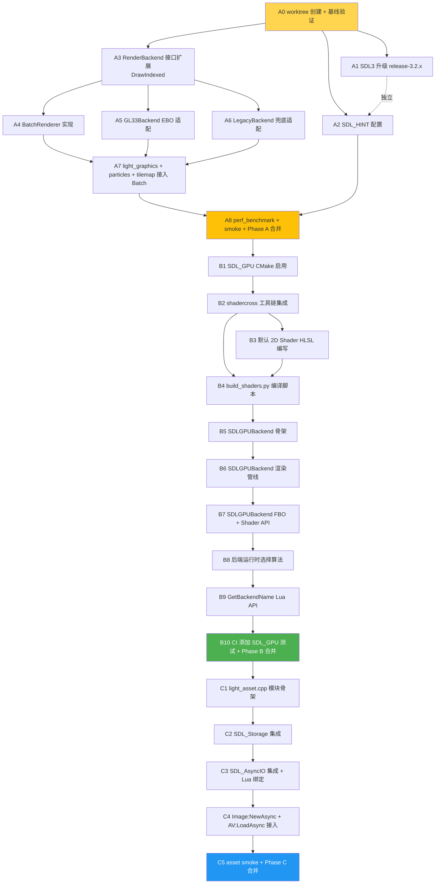

# TASK — ChocoLight SDL3 性能释放(原子任务拆分)

> 创建日期: 2026-05-08 | 基于: DESIGN_SDL3性能释放.md
> 阶段: Phase 3 Atomize

---

## 一、任务总览

三阶段共 **23 个原子任务**:

| 阶段 | 任务编号 | 任务数 | 累计工期 |
|:----:|---------|:----:|:-------:|
| Phase A | A1 ~ A8 | 8 | 3-4 天 |
| Phase B | B1 ~ B10 | 10 | 2-3 周 |
| Phase C | C1 ~ C5 | 5 | 1 周 |

---

## 二、任务依赖图



依赖关系总结:
- **A0** 是所有任务前置(创建工作环境)
- **A 阶段串行**:A1/A2/A3 可并行,但 A4 依赖 A3,A7 依赖 A4-A6,A8 是合并节点
- **B 阶段强串行**:B1→B2→B3/B4→B5→B6→B7→B8→B9→B10
- **C 阶段强串行**:C1→C2→C3→C4→C5

---

## 三、Phase A 任务详细规格(8 个原子任务)

### A0: worktree 创建 + 基线验证

**输入契约**
- 前置依赖: 无
- 输入: 当前 main 分支(commit `b8a03fd`)
- 环境: Windows + git worktree

**输出契约**
- 交付物:
  - worktree 目录: `C:\Users\Administrator\.config\superpowers\worktrees\Light\sdl3-perf-release`
  - 新分支: `feature/sdl3-perf-release`
  - 基线验证报告: 现有 6 平台 CI 全绿快照
- 验收标准:
  - worktree 工作树干净(无未提交修改)
  - `lightc -p scripts/smoke/core_runtime.lua` 通过
  - 本地 build 成功

**实现约束**
- 不污染 main 工作树脏文件(.agents/skills/、examples/、scripts/smoke/、tools/)
- worktree 创建命令使用 `git worktree add`,基于 main HEAD

**依赖**
- 后置: A1, A2, A3
- 并行: 无

---

### A1: SDL3 升级到 release-3.2.x 最新

**输入契约**
- 前置依赖: A0
- 输入: 当前 `CMakeLists.txt:39` 锁定 `release-3.2.0`

**输出契约**
- 交付物: `ChocoLight/CMakeLists.txt` GIT_TAG 升级
- 验收标准:
  - 6 平台本地 cmake configure + build 通过
  - SDL3 release-notes 评估:无破坏性 API 变化
  - SDL_GetVersion() 输出 ≥ 3.2.10

**实现约束**
- 仅修改 `GIT_TAG` 字段,不修改 SDL_* 选项
- 升级前查阅 SDL3 release notes 确认兼容性

**依赖**
- 后置: A8
- 并行: A2, A3

---

### A2: SDL_HINT 配置补齐

**输入契约**
- 前置依赖: A0
- 输入: `platform_window_sdl3.cpp::Init`

**输出契约**
- 交付物: `platform_window_sdl3.cpp` 修改
- 增加的 HINT:
  - `SDL_HINT_VIDEO_DOUBLE_BUFFER=1`
  - `SDL_HINT_MOUSE_FOCUS_CLICKTHROUGH=1`
  - `SDL_HINT_VIDEO_ALLOW_SCREENSAVER=0`
  - `SDL_HINT_APP_ID="com.chocolight.engine"`
  - `SDL_HINT_IME_IMPLEMENTED_UI="composition,candidates"`
  - `SDL_HINT_RENDER_VSYNC=0` (用户控制)
- 验收标准:
  - HINT 设置在 `SDL_Init` 之前调用
  - 本地启动日志包含 HINT 配置确认行
  - 6 平台 CI 通过

**实现约束**
- 所有 HINT 使用 `SDL_SetHint()` 设置
- 必须在 `SDL_Init` 调用之前

**依赖**
- 后置: A8
- 并行: A1, A3

---

### A3: RenderBackend 接口扩展(DrawIndexed)

**输入契约**
- 前置依赖: A0
- 输入: `include/render_backend.h` 现有抽象类

**输出契约**
- 交付物: `include/render_backend.h` 新增纯虚方法
- 接口签名:
  ```cpp
  virtual void DrawIndexed(const RenderVertex* verts, int vertexCount,
                           const uint16_t* indices, int indexCount,
                           uint32_t textureId) = 0;
  ```
- 验收标准:
  - 所有现有 Backend 实现添加 stub(可暂时调用 DrawArrays + 自构造索引)
  - 编译通过

**实现约束**
- 接口不破坏现有 DrawArrays/Texture/FBO 等方法签名
- 保持后端无关,接口不引用 GL/SDL_GPU 类型

**依赖**
- 后置: A4, A5, A6
- 并行: A1, A2

---

### A4: BatchRenderer 实现

**输入契约**
- 前置依赖: A3
- 输入: DESIGN 中的 BatchRenderer 接口契约

**输出契约**
- 交付物:
  - `ChocoLight/include/batch_renderer.h`(接口声明)
  - `ChocoLight/src/batch_renderer.cpp`(实现)
- 功能清单:
  - `Init/Shutdown/BeginFrame/EndFrame`
  - `SubmitQuad/SubmitTriangles/SubmitLines`
  - `Flush/NotifyStateChange`
  - `Stats` 性能统计
- 验收标准:
  - 单元测试: 提交 100 quad → 1 次 Flush(状态不变)
  - 单元测试: 切换纹理 → 自动 Flush
  - 单元测试: 顶点超 65536 → 自动 Flush
  - lightc -p 通过

**实现约束**
- 所有顶点累积在 CPU 缓冲(std::vector<RenderVertex>),Flush 时上传
- EBO 静态生成(启动时一次),后续不修改
- 状态匹配判断:texId + blend mode + scissor + shader

**依赖**
- 后置: A7
- 并行: A5, A6

---

### A5: GL33Backend EBO 适配

**输入契约**
- 前置依赖: A3
- 输入: `render_gl33.cpp` 现有实现

**输出契约**
- 交付物: `render_gl33.cpp` 修改
- 改动点:
  - 添加 `GLuint ebo` 成员
  - `Init` 时生成 EBO 并填充静态索引(16384 quad × 6)
  - `DrawIndexed` 实现: 上传 verts + glDrawElements
  - 删除 `DrawArrays(Quads,...)` 中的 vector 重分配热路径
- 验收标准:
  - 现有 sample 渲染结果像素一致(回归测试)
  - draw call 计数测试: 1024 quad → 1 次 glDrawElements

**实现约束**
- 保持 DrawArrays 接口语义不变(向后兼容)
- 新增 DrawIndexed 路径优先,旧路径仅作回退

**依赖**
- 后置: A7
- 并行: A4, A6

---

### A6: LegacyBackend 兜底适配

**输入契约**
- 前置依赖: A3
- 输入: `render_legacy.cpp` 现有实现

**输出契约**
- 交付物: `render_legacy.cpp` 修改
- 改动点: `DrawIndexed` 实现退化为 `glBegin/glEnd` 多次调用(按索引展开顶点)
- 验收标准:
  - GL 1.x 设备(模拟环境)渲染结果正确

**实现约束**
- Legacy 路径不追求性能,仅保证功能正确

**依赖**
- 后置: A7
- 并行: A4, A5

---

### A7: light_graphics / particles / tilemap 接入 Batch

**输入契约**
- 前置依赖: A4, A5, A6
- 输入: BatchRenderer 已可用

**输出契约**
- 交付物: 5 个文件的 DrawArrays 调用点改写为 BatchRenderer
- 改动文件:
  - `light_graphics.cpp`(Draw/DrawQuad/Print/DrawSprite/各几何函数)
  - `light_particles.cpp`(EmitterDraw)
  - `light_tilemap.cpp`(瓦片渲染)
  - `light_graphics_image.cpp`(Image 绘制)
  - 视频后端(`video_backend_*.cpp`)如有 DrawArrays 调用,可视情况接入
- 验收标准:
  - 现有所有 sample 渲染像素一致
  - 1024 粒子 draw call ≤ 3
  - 1000 字符文本 draw call ≤ 5(按字体纹理切换)

**实现约束**
- 不修改 Lua API 签名
- 状态切换处主动调用 `BatchRenderer::Flush` 或 `NotifyStateChange`

**依赖**
- 后置: A8
- 并行: 无

---

### A8: perf_benchmark + smoke + Phase A 合并

**输入契约**
- 前置依赖: A1, A2, A7
- 输入: A1-A7 全部完成

**输出契约**
- 交付物:
  - `samples/perf_benchmark/main.lua`(粒子/sprite/tilemap/text 压力场景)
  - `scripts/smoke/perf_smoke.lua`(自动化性能验证)
  - `.github/workflows/build-templates.yml`(可选: 添加 perf smoke 步骤)
  - Phase A ACCEPTANCE 子文档(`docs/SDL3性能释放/ACCEPTANCE_PhaseA.md`)
  - PR: `feat: Phase A — Sprite Batcher + EBO + SDL_HINT`
- 验收标准:
  - 6 平台 GitHub Actions 全绿
  - perf_smoke.lua 输出 draw call 数符合 CONSENSUS §6.1 表格
  - PR 合并 main

**实现约束**
- perf_benchmark 不污染现有 Light-0.2.3/、examples/
- smoke 脚本必须 lightc -p 通过

**依赖**
- 后置: B1
- 并行: 无

---

## 四、Phase B 任务详细规格(10 个原子任务)

### B1: SDL_GPU CMake 启用

**输入契约**
- 前置依赖: A8
- 输入: 当前 `CMakeLists.txt:34` `SDL_GPU OFF`

**输出契约**
- 交付物: `CMakeLists.txt` 修改
- 改动:
  ```cmake
  if(NOT EMSCRIPTEN)
      set(SDL_GPU ON CACHE BOOL "" FORCE)
  endif()
  ```
- 验收标准:
  - 5 个原生平台编译通过(SDL_GPU 编入 SDL3)
  - Web 平台维持 SDL_GPU OFF

**实现约束**
- Web 强制 OFF(SDL_GPU 不支持 WebGL2)

**依赖**
- 后置: B2
- 并行: 无

---

### B2: shadercross 工具链集成

**输入契约**
- 前置依赖: B1
- 输入: SDL_shadercross 仓库 main 分支

**输出契约**
- 交付物: `CMakeLists.txt` 添加可选 FetchContent
- 工具产物:
  - `shadercross.exe`(或 .out)CI 阶段使用
  - DXC 用于 HLSL → DXIL
  - SPIRV-Cross 用于 SPIR-V → MSL
- 验收标准:
  - CI 中可调用 shadercross 编译测试 .hlsl 成功

**实现约束**
- shadercross 仅在 `CHOCO_BUILD_SHADERS=ON` 时拉取(避免普通用户拉取大依赖)
- 默认情况下使用预编译产物(已嵌入 generated/ 头文件)

**依赖**
- 后置: B3, B4
- 并行: 无

---

### B3: 默认 2D Shader HLSL 编写

**输入契约**
- 前置依赖: B2
- 输入: 现有 GLSL `VS_SOURCE/FS_SOURCE` 等价语义

**输出契约**
- 交付物:
  - `ChocoLight/shaders/default_2d.vs.hlsl`(顶点)
  - `ChocoLight/shaders/default_2d.ps.hlsl`(像素)
- Shader 接口:
  - 输入: aPos(POSITION), aTexCoord(TEXCOORD0), aColor(COLOR0)
  - Uniform: uMVP(matrix), uUseTexture(int)
  - Sampler: uTexture
- 验收标准:
  - shadercross 编译通过(SPIR-V/MSL/DXIL 三套字节码)
  - 像素结果与 GLSL 版本一致(后续 B6 验证)

**实现约束**
- HLSL Shader Model 6.0+
- 与现有 GLSL Shader 语义完全一致

**依赖**
- 后置: B4
- 并行: B4(可同步进行 build 脚本)

---

### B4: build_shaders.py 编译脚本

**输入契约**
- 前置依赖: B2, B3
- 输入: shadercross 可用 + HLSL 源码

**输出契约**
- 交付物:
  - `ChocoLight/shaders/build_shaders.py`(Python 脚本)
  - `ChocoLight/shaders/generated/default_2d.h`(嵌入字节码)
- 脚本功能:
  - 调用 shadercross 编译每个 .hlsl
  - 输出 SPIR-V/MSL/DXIL 三种字节码
  - 通过 xxd 或 Python `bytes.hex()` 嵌入到 .h
- 验收标准:
  - 脚本幂等(同输入 → 同输出字节)
  - generated/ 头文件可被 C++ 直接 #include

**实现约束**
- 脚本仅依赖 Python 3 标准库 + shadercross 二进制
- 无运行时下载

**依赖**
- 后置: B5
- 并行: 无

---

### B5: SDLGPUBackend 骨架

**输入契约**
- 前置依赖: B4
- 输入: DESIGN 中的 SDLGPUBackend 接口契约

**输出契约**
- 交付物: `ChocoLight/src/render_sdlgpu.cpp`
- 实现内容:
  - `Init`: SDL_CreateGPUDevice + 选择驱动
  - `Shutdown`: 释放 device
  - `GetName`: 返回 "SDLGPU/D3D12" 等
  - 其他纯虚方法 stub(暂返回 false/0,在 B6/B7 完善)
- 验收标准:
  - SDL_CreateGPUDevice 在 Windows 选 D3D12,macOS 选 Metal 等
  - device 创建成功的日志输出

**实现约束**
- Web 平台编译时排除此源文件
- 创建失败返回 nullptr,工厂函数 CreateSDLGPUBackend 上层处理回退

**依赖**
- 后置: B6
- 并行: 无

---

### B6: SDLGPUBackend 渲染管线

**输入契约**
- 前置依赖: B5
- 输入: B5 的骨架 + B4 的字节码头文件

**输出契约**
- 交付物: `render_sdlgpu.cpp` 完整渲染路径
- 实现内容:
  - 创建 GraphicsPipeline(用 generated/ 字节码)
  - 创建主 VBO + EBO(SDL_GPUBuffer)
  - `BeginFrame/EndFrame`(命令缓冲 + render pass)
  - `DrawArrays/DrawIndexed`(数据上传 + draw)
  - `CreateTexture/UpdateTexture/BindTexture`
- 验收标准:
  - perf_benchmark 在 SDLGPU 路径下渲染像素与 GL33 一致
  - draw call 数与 GL33 一致

**实现约束**
- 顶点格式与 GL33 完全一致(RenderVertex 共用)
- Shader 单源 → 多 backend 字节码自动选择

**依赖**
- 后置: B7
- 并行: 无

---

### B7: SDLGPUBackend FBO + Shader API

**输入契约**
- 前置依赖: B6
- 输入: B6 的基础渲染管线

**输出契约**
- 交付物: `render_sdlgpu.cpp` 完整功能
- 实现内容:
  - `CreateFBO/BindFBO/UnbindFBO`(SDL_GPU render target)
  - `CreateShader/UseShader/SetUniform*`(用户自定义 Shader)
  - `SetScissor`
- 验收标准:
  - FBO 离屏渲染示例运行正确
  - 用户 Shader 编译运行正确(运行 Phase 3 已实现的用户 Shader 测试)

**实现约束**
- 用户 Shader 需要支持 HLSL 输入,内部用 shadercross 运行时编译
- 或退化为不支持(SupportsShaders 返回 false,保持现有 GL33 路径作为兜底)

**依赖**
- 后置: B8
- 并行: 无

---

### B8: 后端运行时选择算法

**输入契约**
- 前置依赖: B7
- 输入: SDLGPUBackend / GL33Backend / LegacyBackend 三个工厂函数

**输出契约**
- 交付物: `render_gl33.cpp` 或新文件中 `CreateRenderBackend()` 改写
- 实现内容: DESIGN §2.2 算法
  - 环境变量 `CHOCO_RENDER_BACKEND` 解析
  - Web 强制 GL33
  - Auto 模式 SDL_GPU 优先,失败回退
- 验收标准:
  - 不设环境变量,Win/Linux/macOS 默认走 SDL_GPU
  - `CHOCO_RENDER_BACKEND=gl33` 强制走 GL33
  - SDL_GPU 创建失败自动回退,日志 WARN

**实现约束**
- 选择失败不能崩溃,必须有最终兜底
- 选择结果通过 GetName 可查询

**依赖**
- 后置: B9
- 并行: 无

---

### B9: GetBackendName Lua API

**输入契约**
- 前置依赖: B8
- 输入: g_render 全局可访问

**输出契约**
- 交付物: `light_graphics.cpp` 注册新函数
- API:
  ```lua
  local name = Light.Graphics.GetBackendName()
  -- 返回: "SDLGPU/D3D12" / "SDLGPU/Metal" / "SDLGPU/Vulkan" / "GL33Core" / "Legacy"
  ```
- 验收标准:
  - 函数注册到 graphicsFuncs 表
  - 在 sample 中调用返回正确字符串

**实现约束**
- 只读 API,不修改任何状态
- 函数实现 ≤ 10 行

**依赖**
- 后置: B10
- 并行: 无

---

### B10: CI 添加 SDL_GPU 测试 + Phase B 合并

**输入契约**
- 前置依赖: B9
- 输入: B1-B9 全部完成

**输出契约**
- 交付物:
  - `scripts/smoke/sdlgpu_smoke.lua`
  - `.github/workflows/build-templates.yml`(SDL_GPU 测试步骤)
  - Phase B ACCEPTANCE 子文档
  - PR: `feat: Phase B — SDL_GPU backend with shadercross`
- 验收标准:
  - 6 平台 GitHub Actions 全绿
  - sdlgpu_smoke.lua 在 Win/Linux/macOS runner 上验证 backend name
  - PR 合并 main

**实现约束**
- CI runner 无 GUI,smoke 仅做 backend 创建/选择验证,不做实际渲染

**依赖**
- 后置: C1
- 并行: 无

---

## 五、Phase C 任务详细规格(5 个原子任务)

### C1: light_asset.cpp 模块骨架

**输入契约**
- 前置依赖: B10
- 输入: DESIGN 中的 LightAsset 接口

**输出契约**
- 交付物:
  - `ChocoLight/include/light_asset.h`
  - `ChocoLight/src/light_asset.cpp`
- 实现内容:
  - `LightAsset::Init/Shutdown`
  - `LoadSync` 实现(基于现有 fopen,首版)
  - `Free`
  - 数据结构定义
- 验收标准:
  - lightc -p 通过
  - LoadSync 与现有 fopen 行为一致

**实现约束**
- 不引入新第三方依赖
- 接口设计前向兼容 Phase C2/C3 异步扩展

**依赖**
- 后置: C2
- 并行: 无

---

### C2: SDL_Storage 集成

**输入契约**
- 前置依赖: C1
- 输入: SDL3 Storage API

**输出契约**
- 交付物: `light_asset.cpp` 修改 LoadSync 走 Storage
- 实现内容:
  - `SDL_OpenStorage` 初始化
  - 桌面: filesystem 路径
  - Android: APK assets/
  - iOS: Bundle Resources
  - Web: emscripten FS(同步)
- 验收标准:
  - 桌面/Android/iOS 通过 Storage 读取资源成功
  - 失败回退到直接 fopen(WARN 日志)

**实现约束**
- 路径分隔符统一用 `/`
- 失败不抛错,日志 WARN

**依赖**
- 后置: C3
- 并行: 无

---

### C3: SDL_AsyncIO 集成 + Lua 绑定

**输入契约**
- 前置依赖: C2
- 输入: SDL3 AsyncIO API + Lua 绑定模板

**输出契约**
- 交付物:
  - `light_asset.cpp` 实现 LoadAsync/PumpCallbacks
  - Lua 绑定: `Light.Asset.LoadAsync(path, cb)`
  - `light_ui.cpp` 主循环每帧调用 PumpCallbacks
- 实现内容:
  - `SDL_LoadFileAsync` 调用
  - 主线程回调队列
  - Lua callback 注册到 LUA_REGISTRYINDEX
- 验收标准:
  - 异步加载 1MB 文件,主线程不卡顿(>30fps 维持)
  - 失败回调 success=false + 错误信息
  - lightc -p 通过

**实现约束**
- Web 平台 LoadAsync 退化为同步(WARN 日志)
- callback 在主线程触发,不在 SDL 工作线程

**依赖**
- 后置: C4
- 并行: 无

---

### C4: Image:NewAsync + AV:LoadAsync 接入

**输入契约**
- 前置依赖: C3
- 输入: LightAsset 已可用

**输出契约**
- 交付物:
  - `light_graphics_image.cpp`: `Image:NewAsync(path, cb)`
  - `light_av.cpp`: `Audio:NewAsync(path, cb)` / `Video:NewAsync(path, cb)`
- 验收标准:
  - 现有同步 API 兼容(Image:New 不变)
  - 异步 API 在 Lua 层可用

**实现约束**
- 解码(stb_image / FFmpeg)在 callback 中同步执行
- 纹理上传必须主线程

**依赖**
- 后置: C5
- 并行: 无

---

### C5: asset smoke + Phase C 合并

**输入契约**
- 前置依赖: C4
- 输入: C1-C4 全部完成

**输出契约**
- 交付物:
  - `scripts/smoke/asset_async_smoke.lua`
  - Phase C ACCEPTANCE 子文档
  - 整体 FINAL 文档
  - 整体 TODO 文档
  - PR: `feat: Phase C — SDL_AsyncIO + SDL_Storage`
- 验收标准:
  - 6 平台 GitHub Actions 全绿
  - asset_async_smoke 在 CI 验证异步加载
  - PR 合并 main
  - worktree 清理,main 同步 origin

**实现约束**
- smoke 测试 8 个场景: 成功/失败 × 同步/异步 × 桌面/移动

**依赖**
- 后置: 整体 Assess 阶段
- 并行: 无

---

## 六、关键约束汇总

### 6.1 通用质量标准

每个原子任务必须满足:

| # | 约束 | 验证方式 |
|---|------|---------|
| 1 | C++ 代码 `lightc -p` 通过 | smoke 脚本 |
| 2 | 现有 Lua API 零变化 | grep diff |
| 3 | 现有 sample 像素回归通过 | 本地运行 |
| 4 | 6 平台 GitHub Actions 全绿 | Actions UI |
| 5 | 新增模块含 `@file/@brief` 注释 | 代码审查 |
| 6 | 不污染主工作树脏文件 | git status |
| 7 | 仅推送 origin 远程 | git remote -v |

### 6.2 复杂度评估

| 任务 | 工期 | 复杂度 | 风险 |
|------|:----:|:------:|:----:|
| A0 | 0.5h | 低 | 低 |
| A1 | 0.5天 | 低 | 低(SDL3 二进制兼容) |
| A2 | 0.5h | 低 | 低 |
| A3 | 1h | 低 | 低 |
| A4 | 1天 | 中 | 中(批渲染状态机) |
| A5 | 0.5天 | 中 | 中(EBO 适配) |
| A6 | 0.5h | 低 | 低 |
| A7 | 1天 | 中 | 中(回归测试) |
| A8 | 0.5天 | 低 | 低 |
| **A 小计** | **3-4 天** | | |
| B1 | 0.5h | 低 | 低 |
| B2 | 1天 | 中 | 中(shadercross 工具链) |
| B3 | 0.5天 | 中 | 低 |
| B4 | 1天 | 中 | 中(嵌入脚本) |
| B5 | 1天 | 高 | 中(SDL_GPU 学习曲线) |
| B6 | 4-5天 | 高 | 高(渲染管线复现) |
| B7 | 2天 | 高 | 高(FBO + Shader) |
| B8 | 0.5天 | 中 | 低 |
| B9 | 0.5h | 低 | 低 |
| B10 | 1天 | 中 | 中(CI 配置) |
| **B 小计** | **2-3 周** | | |
| C1 | 0.5天 | 低 | 低 |
| C2 | 1天 | 中 | 中(平台差异) |
| C3 | 1.5天 | 中 | 中(异步回调) |
| C4 | 1天 | 中 | 中(Image/AV 接入) |
| C5 | 1天 | 低 | 低 |
| **C 小计** | **5 天** | | |
| **总计** | **5-6 周** | | |

### 6.3 风险缓解

| 风险点 | 缓解策略 |
|--------|---------|
| SDL_GPU API 学习曲线 | Phase B5 之前先研读 SDL3 example testgpu_*.c 一周 |
| shadercross 工具链复杂 | 提供预编译 generated/ 头文件,默认不需要本地运行 shadercross |
| FBO 在 SDL_GPU 实现差异 | 失败时 SupportsShaders 返回 false,Canvas 继续走 GL33 路径(运行时切换) |
| 移动端 SDL_GPU 设备兼容性 | Android < API 26 / iOS < 13 强制走 GLES3 |
| 回归测试 | Phase A 完成后保留 perf_benchmark 永久 CI 守护 |

---

## 七、Phase 4 Approve 检查清单

> 本任务规划进入 Approve 阶段前,需要用户/AI 共同核对的清单。

### 7.1 完整性
- [x] 任务计划覆盖 CONSENSUS 全部 3 阶段需求
- [x] 23 个原子任务覆盖 Phase A/B/C 全部交付物
- [x] 每个任务有明确输入/输出契约

### 7.2 一致性
- [x] 与 ALIGNMENT 决策完全一致(GL33 永久并存、shadercross 工作流、串行调度等)
- [x] 与 DESIGN 接口契约完全一致

### 7.3 可行性
- [x] 工期评估基于实际复杂度
- [x] 技术方案有官方 example 参考(SDL3 examples)
- [x] 风险缓解措施已列出

### 7.4 可控性
- [x] 每阶段独立 PR,可中断
- [x] worktree 隔离,不阻塞 main
- [x] CI 全绿门控,失败可回退

### 7.5 可测性
- [x] 每个任务的验收标准具体且可执行
- [x] 性能目标量化(draw call 数、CPU/GPU 占用)
- [x] smoke 脚本覆盖三阶段所有交付物

> 进入 Phase 4 Approve — 等待用户审批后启动 Phase 5 Automate(从 A0 开始)。
