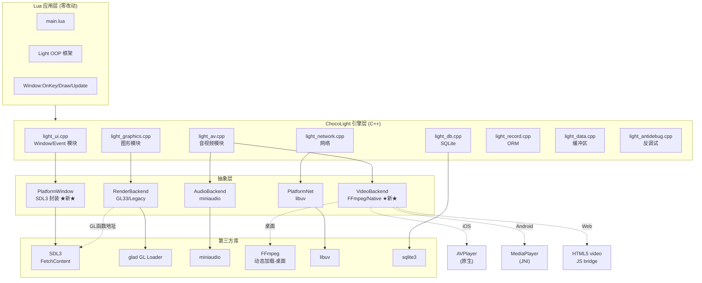
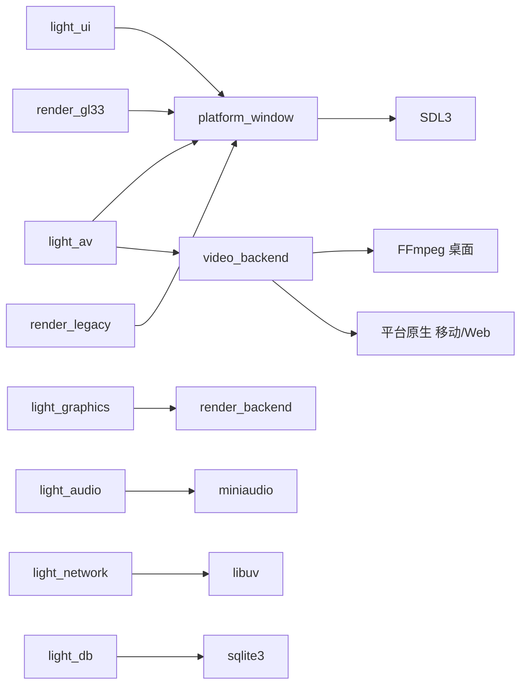
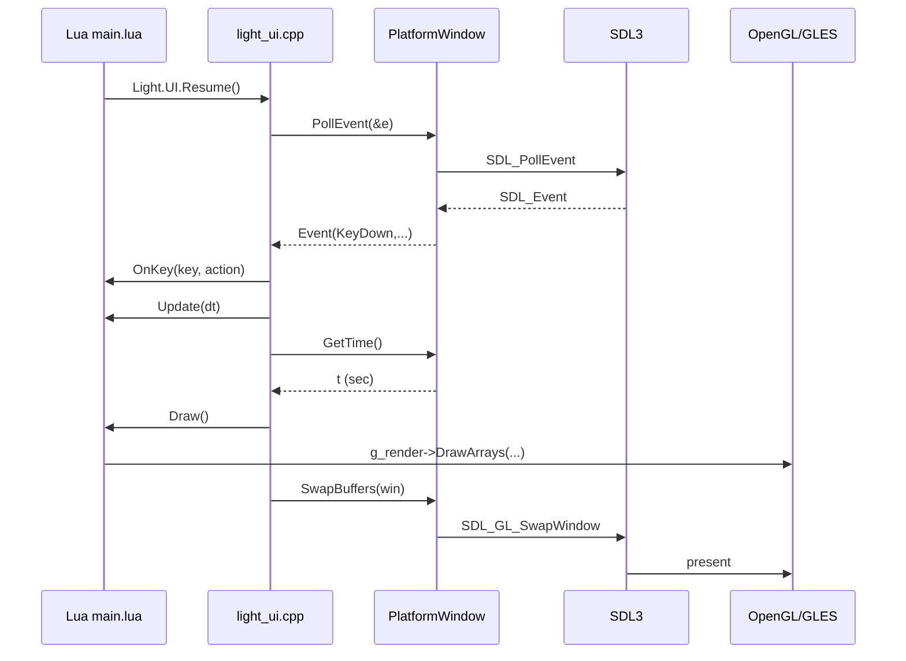
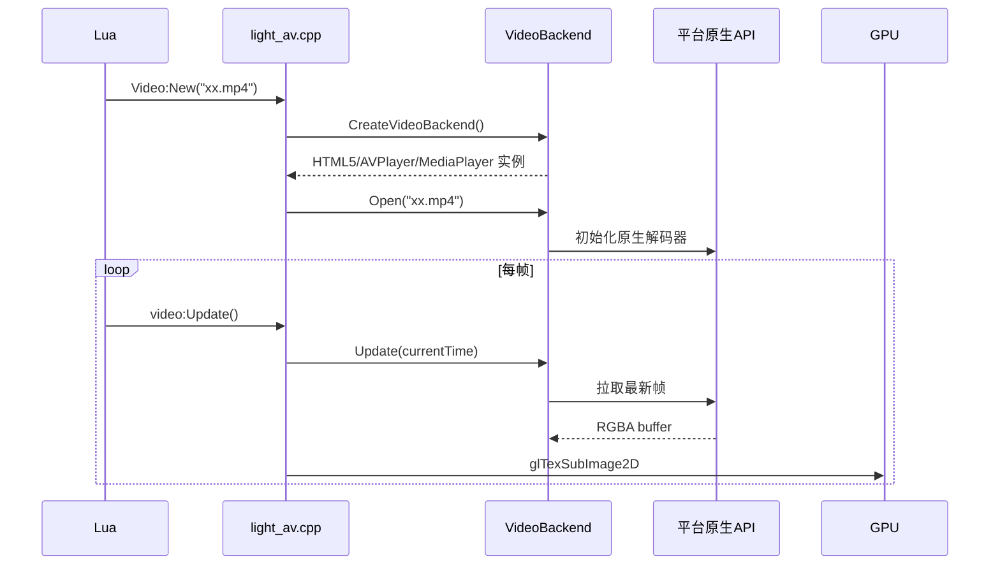

<!--
 * @Author: 炽热
 * @Date: 2026-04-25
 * @Description: SDL3 全平台迁移 - 系统架构设计
-->

# DESIGN — SDL3 全平台迁移系统设计

## 一、整体架构图



## 二、分层设计

### 2.1 PlatformWindow 抽象 (新增)

**职责**: 屏蔽 SDL3 与平台差异，对内提供统一窗口/事件/计时接口。

**接口** (`include/platform_window.h`):

```cpp
namespace PlatformWindow {

struct Event {
    enum Type {
        KeyDown, KeyUp,
        MouseDown, MouseUp, MouseMove, MouseWheel,
        Resize, Close,
        TouchDown, TouchUp, TouchMove   // 移动端
    } type;
    union {
        struct { int key, scancode, mods; } key;
        struct { int button; double x, y; } mouse;
        struct { double dx, dy; } wheel;
        struct { int w, h; } size;
        struct { int id; double x, y; } touch;
    };
};

// 生命周期
bool Init();
void Shutdown();

// 窗口
void* CreateWindow(const char* title, int w, int h, bool fullscreen);
void  DestroyWindow(void* win);
void  GetWindowSize(void* win, int* w, int* h);
void  SetWindowSize(void* win, int w, int h);
void  GetFramebufferSize(void* win, int* w, int* h);  // HiDPI
bool  ShouldClose(void* win);
void  SetShouldClose(void* win, bool close);

// GL 上下文
void* CreateGLContext(void* win);
void  DestroyGLContext(void* ctx);
void  MakeCurrent(void* win, void* ctx);
void  SwapBuffers(void* win);
void* GetGLProcAddress(const char* name);

// 事件
bool PollEvent(Event* out);  // 返回 false 表示队列空

// 计时
double GetTime();           // 单位: 秒, 高精度

// Web 主循环 (M2)
#ifdef __EMSCRIPTEN__
void RunMainLoop(void (*frame)(void*), void* userdata);
#endif

}
```

**实现** (`src/platform_window_sdl3.cpp`):
- 仅包含 SDL3 相关代码
- 使用 `SDL_Window*` / `SDL_GLContext` 作为不透明指针返回
- `Event` 通过 `SDL_PollEvent` 拉取并转换

### 2.2 VideoBackend 抽象 (新增)

**职责**: 视频解码和纹理上传统一接口，桌面用 FFmpeg，移动/Web 用平台原生 API。

**接口** (`include/video_backend.h`):

```cpp
class VideoBackend {
public:
    virtual ~VideoBackend() = default;
    virtual bool Open(const char* path) = 0;
    virtual void Close() = 0;
    virtual bool Update(double currentTimeSec) = 0;  // 解码到当前时刻
    virtual void GetFrameSize(int* w, int* h) = 0;
    virtual const uint8_t* GetRGBAPixels() = 0;     // 返回当前帧 RGBA
    virtual bool IsFinished() = 0;
    virtual void Play() = 0;
    virtual void Pause() = 0;
};

VideoBackend* CreateVideoBackend();  // 工厂, 自动选实现
```

**实现矩阵**:
| 平台 | 实现文件 | 后端 |
|------|---------|------|
| Win/Linux/macOS | `video_backend_ffmpeg.cpp` (从现有 `light_av.cpp` 抽取) | FFmpeg 动态加载 |
| Web | `video_backend_html5.cpp` | `EM_JS` 桥接 `<video>` + `texImage2D` |
| iOS | `video_backend_avplayer.mm` | `AVPlayer` + `CVPixelBuffer` |
| Android | `video_backend_mediaplayer.cpp` | JNI → `MediaPlayer` + `SurfaceTexture` |

### 2.3 RenderBackend (现有，调整)

**调整点**: GL 函数加载源从 `glfwGetProcAddress` 改为 `PlatformWindow::GetGLProcAddress`。

```cpp
// render_gl33.cpp
gladLoadGL((GLADloadfunc)PlatformWindow::GetGLProcAddress);
// render_legacy.cpp
glGenFB = (PFN_glGenFramebuffers)PlatformWindow::GetGLProcAddress("glGenFramebuffers");
```

**新增 GLES 适配** (M2-M4):
- 桌面: GL 3.3 Core 不变
- Web/移动: GLES 3.0 = WebGL2 = GL 3.0 Core 子集
- 编译时分支: `#if defined(__EMSCRIPTEN__) || defined(__ANDROID__) || defined(__APPLE__) && TARGET_OS_IOS`

### 2.4 AudioBackend (现有，不变)

miniaudio 已支持全平台，无需改动。

### 2.5 ChocoLight 引擎模块改造

#### light_ui.cpp 重写要点

```
现有架构:
    glfwInit() → glfwCreateWindow → glfwSet*Callback → glfwPollEvents
新架构:
    PlatformWindow::Init() → CreateWindow → CreateGLContext
    主循环: while (PollEvent(&e)) DispatchToLua(e)
```

**关键差异处理**:
1. **回调 → 拉取**: GLFW 注册回调；SDL3 主循环里轮询。在 `light_ui.cpp` 主循环统一拉事件后调用 Lua 回调。
2. **键码映射**: SDL_Scancode 与 GLFW key 不同。建立映射表 `SDLKeyToGLFW(SDL_Keycode)`，保持 Lua 看到的 key 码值与之前一致 (避免破坏现有 `OnKey` 处理)。
3. **HiDPI**: `SDL_GetWindowSizeInPixels` (M1) vs `glfwGetFramebufferSize`，行为一致。
4. **触摸事件 (M3/M4)**: SDL_EVENT_FINGER_* 转为 `OnMouseButton` (用主指作鼠标)，同时新增 `OnTouch` Lua 回调。

#### light_av.cpp 改动

| 行号 (现状) | 当前代码 | 新代码 |
|-----------|---------|-------|
| 35 | `#include <GLFW/glfw3.h>` | `#include "platform_window.h"` |
| 902 | `ctx->lastFrameTimeSec = glfwGetTime();` | `ctx->lastFrameTimeSec = PlatformWindow::GetTime();` |
| 967 | `double nowSec = glfwGetTime();` | `double nowSec = PlatformWindow::GetTime();` |
| 1175 | `ctx->lastFrameTimeSec = nowSec;` | (不变) |

视频部分 (M2-M4): `CreateVideoBackend()` 工厂自动选实现，桌面继续 FFmpeg，移动/Web 用原生。

## 三、模块依赖关系图



## 四、接口契约定义

### 4.1 PlatformWindow 完整契约

```cpp
// 错误处理: 所有失败函数返回 nullptr / false / -1
// 线程安全: 仅主线程调用
// 资源所有权: CreateWindow/CreateGLContext 返回的指针由调用者负责 Destroy

bool Init();
    // 前置: 进程启动后, 在创建任何窗口前调用
    // 后置: SDL_Init(SDL_INIT_VIDEO|SDL_INIT_EVENTS) 成功
    // 返回: true=成功, false=SDL3 初始化失败 (Log 错误)

void* CreateWindow(const char* title, int w, int h, bool fullscreen);
    // 前置: Init() 已调用
    // 后置: SDL_Window 已创建, OpenGL 属性已设置 (3.3 Core / GLES 3.0)
    // 返回: SDL_Window*, nullptr=失败
```

### 4.2 Event 字段对应表

| SDL3 Event | PlatformWindow::Event | Lua 回调 |
|-----------|----------------------|---------|
| `SDL_EVENT_KEY_DOWN` | `KeyDown` | `OnKey(key, 1)` |
| `SDL_EVENT_KEY_UP` | `KeyUp` | `OnKey(key, 0)` |
| `SDL_EVENT_MOUSE_BUTTON_DOWN` | `MouseDown` | `OnMouseButton(btn, 1, x, y)` |
| `SDL_EVENT_MOUSE_BUTTON_UP` | `MouseUp` | `OnMouseButton(btn, 0, x, y)` |
| `SDL_EVENT_MOUSE_MOTION` | `MouseMove` | `OnMouseMove(x, y)` |
| `SDL_EVENT_MOUSE_WHEEL` | `MouseWheel` | `OnMouseWheel(dx, dy)` |
| `SDL_EVENT_WINDOW_PIXEL_SIZE_CHANGED` | `Resize` | `OnResize(w, h)` |
| `SDL_EVENT_WINDOW_CLOSE_REQUESTED` | `Close` | (引擎内部退出) |
| `SDL_EVENT_FINGER_DOWN` | `TouchDown` | `OnTouch(id, "down", x, y)` |

## 五、数据流向图

### 5.1 帧循环数据流



### 5.2 视频解码数据流 (M2-M4 平台原生路径)



## 六、异常处理策略

| 异常情形 | 处理 |
|---------|------|
| SDL_Init 失败 | `CC::Log(LOG_ERROR)` + 引擎初始化失败 (Lua 层 `Light.UI.Window:Open` 返回 nil) |
| GL 上下文创建失败 | 尝试降级 GL 版本 (3.3 → 2.1)，仍失败则报错 |
| Web 主循环异常 | Emscripten exception handling 启用，捕获后日志输出 |
| 移动平台权限拒绝 (相机/网络) | 当前不涉及，未来扩展时需要 |
| FFmpeg 加载失败 (桌面) | 已有处理，video 创建返回失败 |
| 平台原生视频失败 (移动/Web) | VideoBackend 返回 false，Lua 层 `Video:New` 返回 nil |

## 七、构建系统设计

### 7.1 CMakeLists.txt 结构 (M1 后)

```cmake
cmake_minimum_required(VERSION 3.20)
project(ChocoLight LANGUAGES C CXX)

# === SDL3 (FetchContent) ===
include(FetchContent)
FetchContent_Declare(SDL3
    GIT_REPOSITORY https://github.com/libsdl-org/SDL.git
    GIT_TAG release-3.2.0
    GIT_SHALLOW TRUE
)
set(SDL_SHARED OFF)
set(SDL_STATIC ON)
set(SDL_TEST_LIBRARY OFF)
FetchContent_MakeAvailable(SDL3)

# === 平台条件源文件 ===
set(LIGHT_SOURCES
    src/cc_core.cpp src/light_module.cpp ... 
    src/platform_window_sdl3.cpp        # 新
)

if(WIN32 OR (UNIX AND NOT APPLE) OR (APPLE AND NOT IOS))
    list(APPEND LIGHT_SOURCES src/video_backend_ffmpeg.cpp)
elseif(EMSCRIPTEN)
    list(APPEND LIGHT_SOURCES src/video_backend_html5.cpp)
elseif(IOS)
    list(APPEND LIGHT_SOURCES src/video_backend_avplayer.mm)
elseif(ANDROID)
    list(APPEND LIGHT_SOURCES src/video_backend_mediaplayer.cpp)
endif()

target_link_libraries(Light PRIVATE SDL3::SDL3-static)
```

### 7.2 GLES vs OpenGL 编译时分支

```cpp
// render_gl33.cpp (新)
#if defined(__EMSCRIPTEN__)
#  include <GLES3/gl3.h>
#elif defined(__ANDROID__) || (defined(__APPLE__) && TARGET_OS_IOS)
#  include <GLES3/gl3.h>
#else
#  include <glad/gl.h>
#endif
```

### 7.3 CI/CD 构建矩阵 (M4 后)

| Job | Runner | 编译目标 |
|-----|--------|---------|
| build-windows | windows-latest | MSVC, Light.dll |
| build-linux   | ubuntu-latest | GCC, libLight.so |
| build-macos   | macos-latest | Clang, libLight.dylib (Universal) |
| build-web     | ubuntu-latest | Emscripten, light.wasm |
| build-android | ubuntu-latest | NDK, libLight.so + APK |
| build-ios     | macos-latest | Xcode, Light.framework + .app |

## 八、设计原则确认

✅ **范围严格**: 仅替换 GLFW，不动渲染管线、音频、网络  
✅ **架构对齐**: 沿用现有 `RenderBackend` / `AudioBackend` 抽象，新增 `PlatformWindow` / `VideoBackend` 与之同级  
✅ **复用优先**: SDL3 仅做窗口/事件/GL 上下文，其他保持现有第三方库  
✅ **接口完整**: 所有新接口已定义前置/后置条件  
✅ **平台隔离**: 平台特定代码独立文件，编译时选择，无运行时分支  
✅ **可行性**: SDL3 API 已成熟，所有目标平台官方支持

**质量门控通过，进入阶段 3 (Atomize)。**
