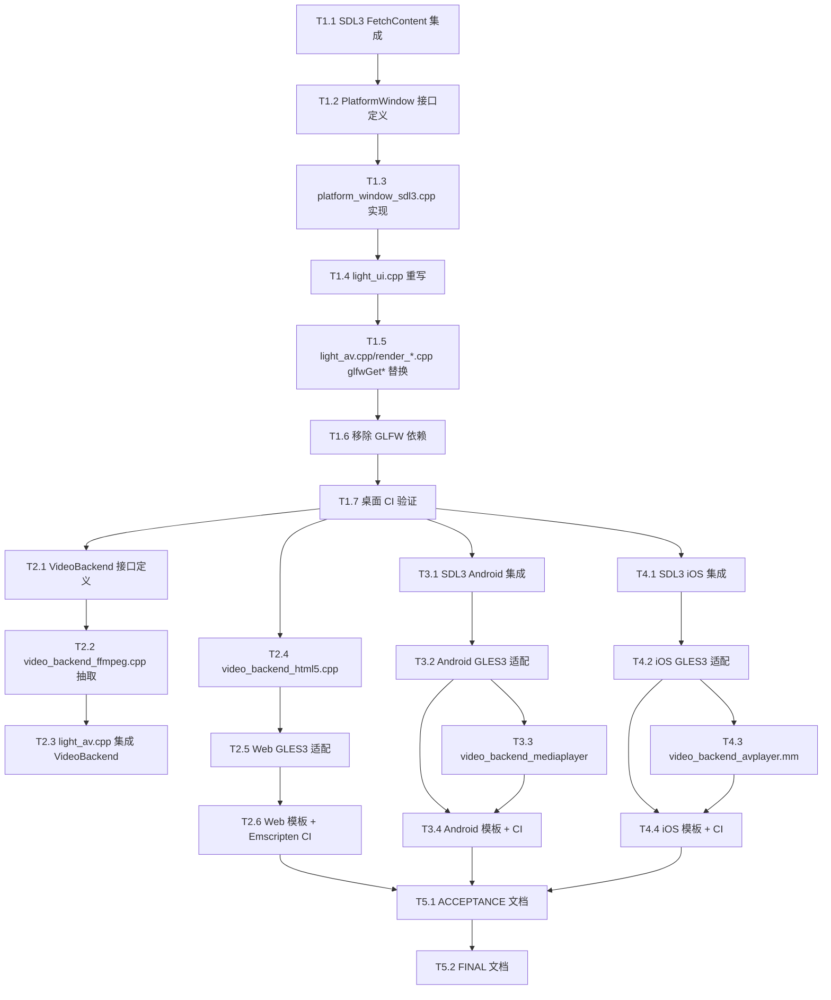

<!--
 * @Author: 炽热
 * @Date: 2026-04-25
 * @Description: SDL3 全平台迁移 - 原子任务拆分
-->

# TASK — SDL3 全平台迁移原子任务

## 任务依赖图

---

## M1: 桌面三平台 GLFW → SDL3

### T1.1 SDL3 FetchContent 集成

**输入契约**:
- 现有 `ChocoLight/CMakeLists.txt` 使用 `find_package(glfw3)`
- CMake 版本 ≥ 3.20

**输出契约**:
- `CMakeLists.txt` 引入 `FetchContent(SDL3)` (release-3.2.0, 静态库)
- `target_link_libraries(Light PRIVATE SDL3::SDL3-static)`
- GLFW 链接保持 (本任务仅添加 SDL3，不删除 GLFW)
- 本地 cmake configure 成功

**实现约束**:
- 使用 `GIT_SHALLOW TRUE` 减小克隆体积
- 禁用 SDL3 不需要的子系统: `SDL_TEST_LIBRARY=OFF`, `SDL_AUDIO=OFF` (我们用 miniaudio)

**验收标准**:
- `cmake -B build -DCMAKE_BUILD_TYPE=Release` 在 Windows 成功
- `_deps/sdl3-src` 目录被创建

**依赖**: 无  
**复杂度**: 低 (~30 行 CMakeLists 改动)

---

### T1.2 PlatformWindow 接口定义

**输入契约**:
- DESIGN 文档中的 `platform_window.h` 接口规范

**输出契约**:
- 新文件 `ChocoLight/include/platform_window.h`
- 包含 Event 结构、生命周期/窗口/GL 上下文/事件/计时函数声明
- 含 doxygen 注释

**实现约束**:
- 仅声明，不依赖任何 SDL3 类型 (使用 `void*` 不透明指针)
- C++17 命名空间 `PlatformWindow`

**验收标准**:
- 头文件可被 C++ 编译器单独 parse 通过
- 所有 DESIGN §2.1 中列出的函数都有声明

**依赖**: T1.1  
**复杂度**: 低 (~80 行)

---

### T1.3 platform_window_sdl3.cpp 实现

**输入契约**:
- T1.2 完成的 `platform_window.h`
- SDL3 头文件可用 (T1.1 完成)

**输出契约**:
- 新文件 `ChocoLight/src/platform_window_sdl3.cpp`
- 实现所有 PlatformWindow 函数
- SDL_Event → PlatformWindow::Event 转换 (按 DESIGN §4.2 表格)
- 键码映射函数 `SDLKeyToGLFW(SDL_Keycode)` 保留旧 GLFW 键码值

**实现约束**:
- 包含 `<SDL3/SDL.h>` 但不向外暴露
- 所有 `SDL_*` 调用做错误检查并 `CC::Log` 日志
- HiDPI: `SDL_GetWindowSizeInPixels` 用于 GetFramebufferSize

**验收标准**:
- 编译通过
- 单元测试 (本地手动): `Init() → CreateWindow → CreateGLContext → 5秒事件循环 → Destroy` 无崩溃

**依赖**: T1.1, T1.2  
**复杂度**: 中 (~300 行)

---

### T1.4 light_ui.cpp 重写

**输入契约**:
- T1.3 完成的 PlatformWindow 实现
- 现有 `light_ui.cpp` (558 行) 的 Lua API 行为
- `Light-0.2.3/lua/main.lua` 使用的所有 Lua 函数

**输出契约**:
- `light_ui.cpp` 完全重写
- GLFW 调用全部替换为 PlatformWindow
- Lua API 保持兼容: `Open/Close/GetWidth/GetHeight/SetWidth/SetHeight/GetDimensions/SetDimensions/__call/Resume`
- 事件循环改为拉取模式: `while (PollEvent(&e)) { 分发到 Lua 回调 }`

**实现约束**:
- `OnKey` / `OnMouseButton` / `OnMouseMove` / `OnResize` 等 Lua 回调签名不变
- `LightAntiDebug::Init/Check` 调用位置保持
- `g_render` 创建/销毁时机不变

**验收标准**:
- `git grep -l GLFW ChocoLight/src/light_ui.cpp` 返回空
- 本地编译通过
- 启动 `Light-0.2.3` 演示能创建窗口、显示画面、响应键盘 (功能回归测试)

**依赖**: T1.3  
**复杂度**: 高 (~600 行重写)

---

### T1.5 light_av/render_*.cpp glfwGet* 替换

**输入契约**:
- T1.3 完成的 PlatformWindow

**输出契约**:
- `light_av.cpp`: 4 处 `glfwGetTime()` → `PlatformWindow::GetTime()`
- `render_legacy.cpp`: `wglGetProcAddress`/`glfwGetProcAddress` → `PlatformWindow::GetGLProcAddress`
- `render_gl33.cpp`: `gladLoadGL((GLADloadfunc)glfwGetProcAddress)` → `gladLoadGL((GLADloadfunc)PlatformWindow::GetGLProcAddress)`

**实现约束**:
- 包含 `<GLFW/glfw3.h>` 替换为 `#include "platform_window.h"`
- 不引入新逻辑

**验收标准**:
- `git grep -l glfw ChocoLight/src` 仅在 light_ui.cpp 之外为空 (light_ui.cpp 在 T1.4 处理)
- 编译通过

**依赖**: T1.3  
**复杂度**: 低 (~10 处替换)

---

### T1.6 移除 GLFW 依赖

**输入契约**:
- T1.4, T1.5 完成

**输出契约**:
- `CMakeLists.txt` 删除 GLFW 相关代码 (find_package, GLFW_LIB, third_party/glfw 引用)
- 不删除 `third_party/glfw/` 目录 (留作历史，gitignored)
- `git grep -l GLFW ChocoLight/src` 完全无结果 (除注释)

**实现约束**:
- 不影响其他平台/CI 配置

**验收标准**:
- 三平台 cmake configure + build 成功 (本地或 CI)

**依赖**: T1.4, T1.5  
**复杂度**: 低

---

### T1.7 桌面 CI 验证

**输入契约**:
- T1.6 完成
- 现有 `.github/workflows/build-templates.yml`

**输出契约**:
- 移除 Windows 的 `vcpkg install glfw3`
- 移除 Linux 的 `libglfw3-dev`
- 移除 macOS 的 `brew install glfw`
- Linux 仍需要 `libgl-dev xorg-dev` (SDL3 需要 X11/Wayland 头文件)
- macOS 仍需要系统 framework
- CI 三平台绿色

**实现约束**:
- 不破坏现有 Lumen/Web/Android/iOS 构建步骤

**验收标准**:
- 推送后 GitHub Actions 三平台 (Windows/Linux/macOS) 全部绿色
- Artifact 包含 `Light.dll/libLight.so/libLight.dylib`

**依赖**: T1.6  
**复杂度**: 低  
**M1 完成里程碑**

---

## M2: Web (Emscripten + SDL3 + WebGL2)

### T2.1 VideoBackend 接口定义

**输入契约**: DESIGN §2.2 接口规范  
**输出契约**:
- 新文件 `ChocoLight/include/video_backend.h`
- 抽象类 + 工厂函数 `CreateVideoBackend()`

**实现约束**: 与 RenderBackend 抽象同风格  
**验收标准**: 头文件可单独编译  
**依赖**: M1 完成  
**复杂度**: 低 (~50 行)

---

### T2.2 video_backend_ffmpeg.cpp 抽取

**输入契约**: 现有 `light_av.cpp` 中视频解码代码 (FFmpeg 部分)  
**输出契约**:
- 新文件 `ChocoLight/src/video_backend_ffmpeg.cpp`
- 实现 `VideoBackend` 接口
- 仅在桌面三平台编译 (CMakeLists 条件)

**实现约束**:
- FFmpeg 动态加载逻辑保留
- 测试: 桌面平台视频播放仍正常

**验收标准**: 桌面 demo 视频能播放  
**依赖**: T2.1  
**复杂度**: 中 (重构现有 ~500 行代码)

---

### T2.3 light_av.cpp 集成 VideoBackend

**输入契约**: T2.2 完成  
**输出契约**:
- `light_av.cpp` 中 `VideoContext` 内部使用 `VideoBackend*`
- `l_Video_Call` 调用 `CreateVideoBackend() → backend->Open()`
- `l_Video_Update` 调用 `backend->Update()`

**实现约束**: Lua API 不变  
**验收标准**: 桌面视频回归测试通过  
**依赖**: T2.2  
**复杂度**: 中

---

### T2.4 video_backend_html5.cpp

**输入契约**: VideoBackend 接口 + Emscripten 工具链  
**输出契约**:
- 新文件 `ChocoLight/src/video_backend_html5.cpp`
- 使用 `EM_JS` 调用 JavaScript 创建 `<video>` 元素
- 通过 `<canvas>` + `texImage2D` 把视频帧上传 GL 纹理

**实现约束**:
- 仅在 `__EMSCRIPTEN__` 编译
- JavaScript 代码内联在 EM_JS 块中

**验收标准**: 浏览器中 `Light.AV.Video:New("test.mp4"):Play()` 显示视频  
**依赖**: T2.1  
**复杂度**: 高 (~200 行 + JS)

---

### T2.5 Web GLES3 适配

**输入契约**: M1 完成的渲染层  
**输出契约**:
- `render_gl33.cpp` 添加 `#ifdef __EMSCRIPTEN__ #include <GLES3/gl3.h>` 条件包含
- glad 加载在 Emscripten 下跳过 (WebGL 自动可用)
- Shader: GLSL 330 → GLSL ES 300 兼容

**实现约束**:
- GL_QUADS 在 GLES 中不存在，已有的拆分逻辑生效
- `glLineWidth > 1` 在 GLES 不保证支持，添加警告

**验收标准**: 浏览器中渲染基本图元正常  
**依赖**: M1, T2.4  
**复杂度**: 中

---

### T2.6 Web 模板 + Emscripten CI

**输入契约**: T2.5 完成  
**输出契约**:
- 新目录 `templates/web/` 含 `index.html`, `build.sh`, `CMakeLists.txt`
- `index.html` 包含 canvas + emscripten module loader
- `.github/workflows/build-templates.yml` 的 `build-web` job 改为构建完整引擎 (而非仅 Lumen)
- 产物: `light.wasm`, `light.js`, `index.html`

**实现约束**:
- `--preload-file lua/main.lua` 打包 Lua 脚本
- `-s USE_WEBGL2=1 -s FULL_ES3=1`

**验收标准**: CI `build-web` 绿色，下载 artifact 后本地启动 HTTP 服务能在浏览器看到 demo  
**依赖**: T2.5  
**复杂度**: 中  
**M2 完成里程碑**

---

## M3: Android (SDL3 Activity + GLES3)

### T3.1 SDL3 Android 集成

**输入契约**:
- M1 完成
- Android NDK 可用 (CI runner 自带)

**输出契约**:
- 新目录 `templates/android-sdl3/`
- 复制 SDL3 项目的 `android-project` 模板作为基础
- 整合 ChocoLight 引擎源码 (作为静态/动态库)
- AndroidManifest.xml 配置 GLES3, OpenGL

**实现约束**:
- minSdkVersion 24 (Android 7.0+, GLES3 / SDL3 要求)
- targetSdkVersion 34
- gradle 8.x

**验收标准**: 本地 `./gradlew assembleDebug` 成功产出 APK  
**依赖**: M1  
**复杂度**: 高

---

### T3.2 Android GLES3 适配

**输入契约**: T2.5 (GLES 适配) + T3.1  
**输出契约**: ChocoLight 在 Android 编译通过，能创建 GLES3 上下文  
**验收标准**: 模拟器启动 APK 看到引擎初始化日志  
**依赖**: T2.5, T3.1  
**复杂度**: 中

---

### T3.3 video_backend_mediaplayer.cpp

**输入契约**: VideoBackend 接口 + Android NDK MediaPlayer JNI  
**输出契约**:
- 新文件 `ChocoLight/src/video_backend_mediaplayer.cpp`
- JNI 调用 `android.media.MediaPlayer` + `SurfaceTexture`
- GL_TEXTURE_EXTERNAL_OES 纹理上传

**实现约束**: 仅在 `__ANDROID__` 编译  
**验收标准**: APK 中视频文件能播放  
**依赖**: T3.2  
**复杂度**: 高 (~300 行 + JNI)

---

### T3.4 Android 模板 + CI

**输入契约**: T3.1, T3.2, T3.3 完成  
**输出契约**:
- `.github/workflows/build-templates.yml` 的 `build-android` job 改为完整引擎构建
- `templates/android/` (旧) 移到 `templates/legacy/android-luaonly/`
- `templates/android-sdl3/` 重命名为 `templates/android/` (取代旧的)

**验收标准**: CI 绿色，APK artifact 含完整引擎  
**依赖**: T3.3  
**复杂度**: 中  
**M3 完成里程碑**

---

## M4: iOS (SDL3 + GLES3)

### T4.1 SDL3 iOS 集成

**输入契约**: M1 完成 + macOS CI runner  
**输出契约**:
- 新目录 `templates/ios-sdl3/`
- CMakeLists.txt 配置 iOS 工具链
- Light.framework 嵌入 app bundle

**实现约束**:
- iOS deployment target 13.0
- 仅签名跳过 (CI 不签名)

**验收标准**: 本地 cmake + Xcode 构建成功  
**依赖**: M1  
**复杂度**: 高

---

### T4.2 iOS GLES3 适配

**输入契约**: T2.5 + T4.1  
**输出契约**: ChocoLight 在 iOS 编译通过  
**验收标准**: 模拟器启动看到引擎初始化  
**依赖**: T2.5, T4.1  
**复杂度**: 中

---

### T4.3 video_backend_avplayer.mm

**输入契约**: VideoBackend 接口 + iOS AVFoundation  
**输出契约**:
- 新文件 `ChocoLight/src/video_backend_avplayer.mm` (Objective-C++)
- `AVPlayer` + `AVPlayerItemVideoOutput` + `CVPixelBuffer`
- CVOpenGLES TextureCache 上传 GL

**实现约束**: 仅在 `TARGET_OS_IOS` 编译  
**验收标准**: 模拟器中视频能播放  
**依赖**: T4.2  
**复杂度**: 高

---

### T4.4 iOS 模板 + CI

**输入契约**: T4.1, T4.2, T4.3  
**输出契约**:
- `templates/ios/` (旧) 移到 `templates/legacy/ios-luaonly/`
- `templates/ios-sdl3/` 重命名为 `templates/ios/`
- CI `build-ios` 绿色

**验收标准**: CI 绿色，.app artifact 含完整引擎  
**依赖**: T4.3  
**复杂度**: 中  
**M4 完成里程碑**

---

## M5: 文档与收尾

### T5.1 ACCEPTANCE 文档

**输出契约**: `docs/SDL3迁移/ACCEPTANCE_SDL3迁移.md` 记录每个任务的实际完成状况、问题、解决方案

**依赖**: M1-M4 完成  
**复杂度**: 低

### T5.2 FINAL 文档

**输出契约**: `docs/SDL3迁移/FINAL_SDL3迁移.md` 项目总结报告

**依赖**: T5.1  
**复杂度**: 低

---

## 复杂度评估汇总

| 里程碑 | 任务数 | 总复杂度 | 预计工作量 |
|--------|-------|---------|-----------|
| M1 桌面 | 7 | 中 | 1-2 天 |
| M2 Web | 6 | 中 | 1-2 天 |
| M3 Android | 4 | 高 | 1-2 天 |
| M4 iOS | 4 | 高 | 1-2 天 |
| M5 文档 | 2 | 低 | 0.5 天 |
| **合计** | **23** | - | **~1 周** |

## 复杂度可控性确认

✅ 每个任务 < 1 天工作量  
✅ 输入/输出契约明确  
✅ 依赖关系无循环  
✅ 关键路径: T1.1 → T1.7 (M1) → 三个并行分支 (M2/M3/M4)  
✅ 验收标准可独立验证  
✅ 平台风险隔离: 单个平台失败不阻塞其他平台

**进入阶段 4 (Approve)，等待用户确认后启动 M1。**
