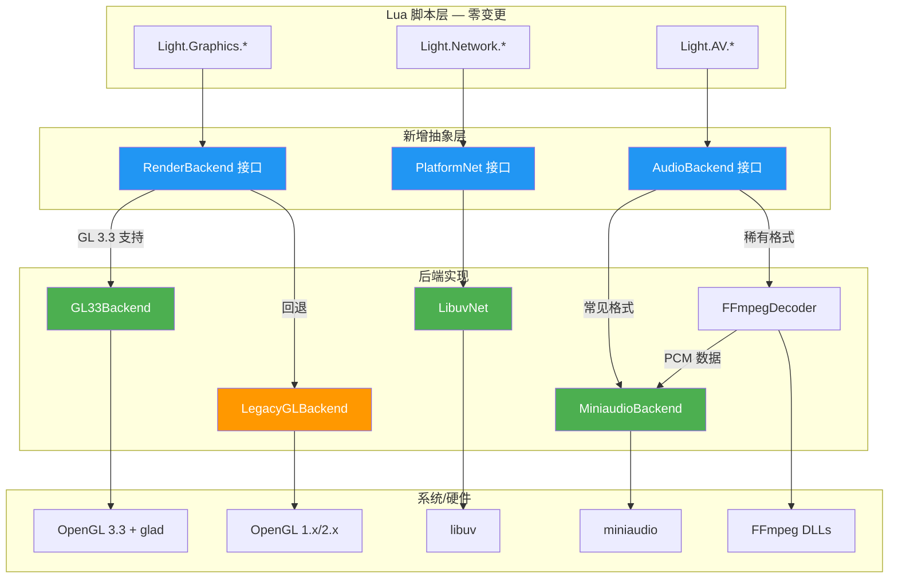
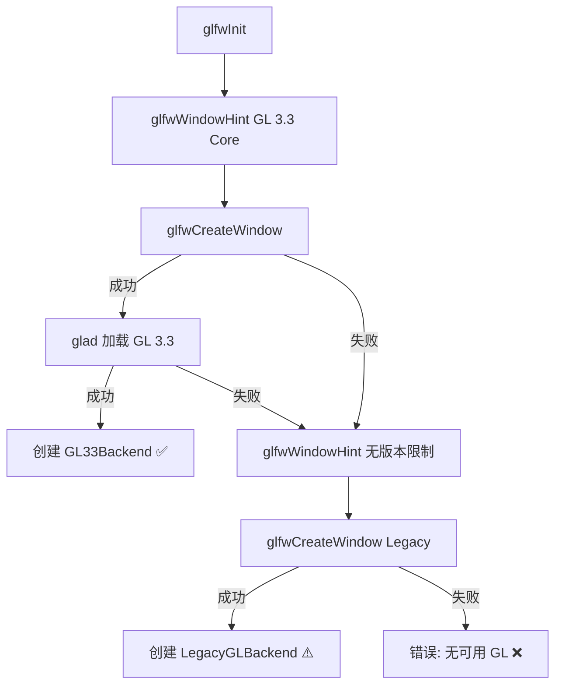
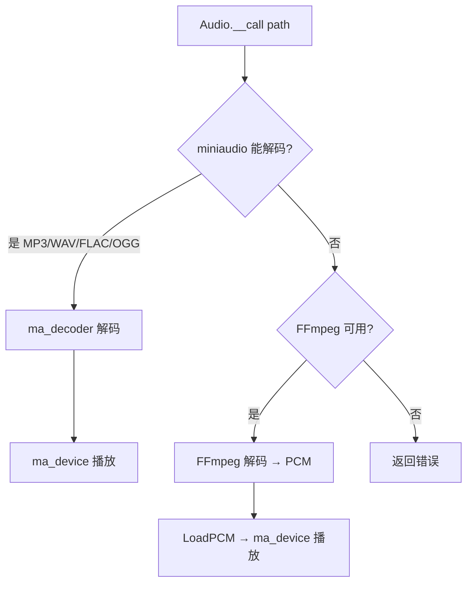
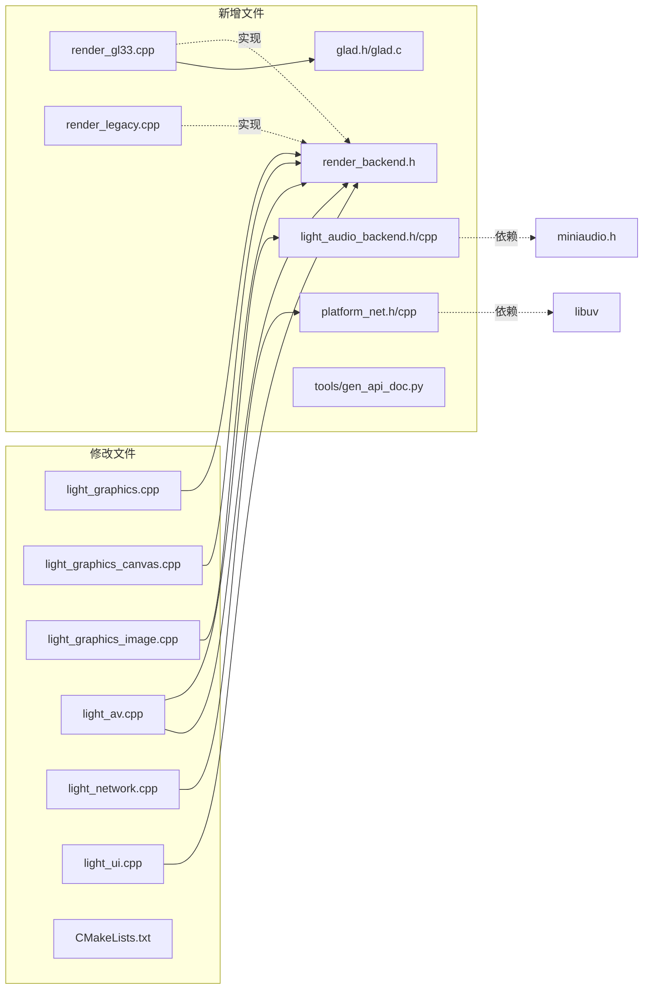

# DESIGN — ChocoLight 引擎 Phase 1 架构设计

> 创建日期: 2026-04-25 | 基于 CONSENSUS 文档

---

## 一、整体架构图



---

## 二、分层设计

### Layer 0: Lua API 层 (不变)
- 所有 `luaopen_Light_*` 入口函数签名保持不变
- Lua 侧 `Light.Graphics.Draw(...)` 等调用不感知后端切换

### Layer 1: 抽象接口层 (新增)
- `RenderBackend` — 渲染后端接口
- `PlatformNet` — 网络平台抽象
- `AudioBackend` — 音频播放抽象

### Layer 2: 后端实现层 (新增/修改)
- `GL33Backend` / `LegacyGLBackend` — 渲染
- `LibuvNet` — 网络
- `MiniaudioPlayer` + `FFmpegDecoder` — 音频

### Layer 3: 第三方库层 (新增依赖)
- glad (GL 3.3 加载器, 生成文件)
- libuv (跨平台异步 I/O)
- miniaudio (已有头文件)

---

## 三、核心组件设计

### 3.1 RenderBackend — 渲染后端接口

```cpp
// render_backend.h
#pragma once
#include <cstdint>

// 前向声明, 避免暴露 GL 细节
struct RenderVertex {
    float x, y, z;      // 位置
    float u, v;          // 纹理坐标
    float r, g, b, a;    // 颜色
};

enum class DrawMode { Lines, LineLoop, LineStrip, Triangles, TriangleFan, Quads };

class RenderBackend {
public:
    virtual ~RenderBackend() = default;

    // ---- 生命周期 ----
    virtual bool Init(int glMajor, int glMinor) = 0;
    virtual void Shutdown() = 0;
    virtual const char* GetName() const = 0;

    // ---- 状态 ----
    virtual void SetColor(float r, float g, float b, float a) = 0;
    virtual void SetViewport(int x, int y, int w, int h) = 0;
    virtual void Clear(float r, float g, float b, float a) = 0;

    // ---- 变换栈 ----
    virtual void PushMatrix() = 0;
    virtual void PopMatrix() = 0;
    virtual void Translate(float x, float y, float z) = 0;
    virtual void Rotate(float angle, float ax, float ay, float az) = 0;
    virtual void Scale(float sx, float sy, float sz) = 0;
    virtual void LoadOrtho(float l, float r, float b, float t, float n, float f) = 0;

    // ---- 绘制 ----
    virtual void DrawArrays(DrawMode mode, const RenderVertex* verts, int count) = 0;

    // ---- 纹理 ----
    virtual uint32_t CreateTexture(int w, int h, int channels, const void* pixels) = 0;
    virtual void DeleteTexture(uint32_t texId) = 0;
    virtual void BindTexture(uint32_t texId) = 0;
    virtual void UpdateTexture(uint32_t texId, int w, int h, int channels, const void* pixels) = 0;

    // ---- FBO ----
    virtual uint32_t CreateFBO(int w, int h, uint32_t* outTex) = 0;
    virtual void DeleteFBO(uint32_t fbo, uint32_t tex, uint32_t depthRB) = 0;
    virtual void BindFBO(uint32_t fbo) = 0;

    // ---- 裁剪 ----
    virtual void SetScissor(bool enable, int x, int y, int w, int h) = 0;
};

// 工厂: 根据 GL 版本自动选择后端
RenderBackend* CreateRenderBackend();
```

**运行时检测流程:**



### 3.2 GL33Backend 实现要点

```cpp
// render_gl33.cpp — 核心数据结构
struct GL33State {
    GLuint vao;              // 共享 VAO
    GLuint vbo;              // 动态 VBO
    GLuint shaderTextured;   // 带纹理的 shader program
    GLuint shaderColored;    // 纯色 shader program
    
    // 自管理矩阵栈 (替代 glPushMatrix/glPopMatrix)
    std::vector<Mat4> matrixStack;
    Mat4 projection;
    Mat4 modelview;
};
```

**内嵌 Shader (顶点):**
```glsl
#version 330 core
layout(location=0) in vec3 aPos;
layout(location=1) in vec2 aTexCoord;
layout(location=2) in vec4 aColor;
uniform mat4 uMVP;
out vec2 vTexCoord;
out vec4 vColor;
void main() {
    gl_Position = uMVP * vec4(aPos, 1.0);
    vTexCoord = aTexCoord;
    vColor = aColor;
}
```

**内嵌 Shader (片段):**
```glsl
#version 330 core
in vec2 vTexCoord;
in vec4 vColor;
uniform sampler2D uTexture;
uniform int uUseTexture;
out vec4 FragColor;
void main() {
    vec4 tex = (uUseTexture == 1) ? texture(uTexture, vTexCoord) : vec4(1.0);
    FragColor = vColor * tex;
}
```

### 3.3 light_graphics.cpp 改造模式

**改造前:**
```cpp
// 每个绘制函数都直接调用 GL
glPushMatrix();
glTranslatef(x, y, z);
glColor4f(r, g, b, a);
glBegin(GL_QUADS);
glTexCoord2f(0, 0); glVertex3f(0, 0, 0);
// ...
glEnd();
glPopMatrix();
```

**改造后:**
```cpp
// 通过 RenderBackend 抽象层调用
extern RenderBackend* g_render;  // 全局渲染后端

g_render->PushMatrix();
g_render->Translate(x, y, z);
g_render->SetColor(r, g, b, a);
g_render->BindTexture(texId);
RenderVertex verts[4] = {
    {0,  0,  0,  0, 0,  r, g, b, a},
    {fw, 0,  0,  1, 0,  r, g, b, a},
    {fw, fh, 0,  1, 1,  r, g, b, a},
    {0,  fh, 0,  0, 1,  r, g, b, a},
};
g_render->DrawArrays(DrawMode::Quads, verts, 4);
g_render->PopMatrix();
```

### 3.4 AudioBackend — 音频抽象

```cpp
// light_audio_backend.h
#pragma once

struct AudioHandle;  // 不透明句柄

class AudioBackend {
public:
    virtual ~AudioBackend() = default;
    virtual bool Init() = 0;
    virtual void Shutdown() = 0;

    // 从文件加载 (miniaudio 直接解码)
    virtual AudioHandle* LoadFile(const char* path) = 0;
    // 从 PCM 数据加载 (FFmpeg 解码结果)
    virtual AudioHandle* LoadPCM(const void* data, int size,
                                  int sampleRate, int channels, int bitsPerSample) = 0;
    
    virtual void Play(AudioHandle* h) = 0;
    virtual void Pause(AudioHandle* h) = 0;
    virtual void Stop(AudioHandle* h) = 0;
    virtual void SetVolume(AudioHandle* h, float vol) = 0;
    virtual bool IsPlaying(AudioHandle* h) = 0;
    virtual void Free(AudioHandle* h) = 0;
};

// 创建 miniaudio 实现
AudioBackend* CreateMiniaudioBackend();
```

**双路径解码流程:**



### 3.5 PlatformNet — libuv 网络抽象

```cpp
// platform_net.h
#pragma once
#include <functional>

struct NetHandle;  // 不透明句柄

// 回调类型
using OnConnectCB = std::function<void(NetHandle*, int status)>;
using OnReadCB    = std::function<void(NetHandle*, const char* data, int len)>;
using OnCloseCB   = std::function<void(NetHandle*)>;

class PlatformNet {
public:
    virtual ~PlatformNet() = default;
    virtual bool Init() = 0;
    virtual void Shutdown() = 0;

    // TCP 客户端
    virtual NetHandle* TcpConnect(const char* host, int port, OnConnectCB cb) = 0;
    virtual int TcpWrite(NetHandle* h, const char* data, int len) = 0;
    virtual void TcpStartRead(NetHandle* h, OnReadCB cb) = 0;
    virtual void TcpClose(NetHandle* h, OnCloseCB cb) = 0;

    // TCP 服务器
    virtual NetHandle* TcpBind(const char* host, int port) = 0;
    virtual int TcpListen(NetHandle* h, int backlog, OnConnectCB cb) = 0;
    virtual NetHandle* TcpAccept(NetHandle* server) = 0;

    // 事件循环 (每帧调用)
    virtual void Poll() = 0;
};

PlatformNet* CreateLibuvNet();
```

---

## 四、模块依赖关系图



---

## 五、数据流向图

### 渲染数据流
```
Lua Draw(img, x, y) → l_Draw() → 构建 RenderVertex[] → g_render->DrawArrays()
                                                              │
                                    ┌─────────────────────────┤
                                    ▼                         ▼
                              GL33Backend              LegacyGLBackend
                              glBufferData()           glBegin/glEnd
                              glDrawArrays()           glVertex3f()
```

### 音频数据流
```
Lua Audio(path) → l_Audio_Call()
    │
    ├─ miniaudio 尝试: ma_decoder_init_file(path)
    │   ├─ 成功 → ma_device 播放 ✅
    │   └─ 失败 → FFmpeg 回退 ↓
    │
    └─ FFmpeg 解码: avformat_open → avcodec_decode → PCM
        └─ PCM → AudioBackend::LoadPCM → ma_device 播放 ✅
```

---

## 六、异常处理策略

| 场景 | 策略 |
|------|------|
| GL 3.3 不可用 | 自动回退 GL 1.x, 日志 LOG_WARN |
| glad 加载失败 | 回退 Legacy, 日志 LOG_WARN |
| libuv 初始化失败 | 日志 LOG_ERROR, 网络模块不可用 |
| miniaudio 解码失败 | 回退 FFmpeg, 日志 LOG_INFO |
| FFmpeg 也失败 | 返回 Lua nil + 错误消息 |
| FBO 创建失败 | 日志 LOG_ERROR, Canvas 返回 nil |

---

## 七、文件变更清单

### 新增文件 (9 个)

| 文件 | 位置 | 用途 | 行数估计 |
|------|------|------|----------|
| `render_backend.h` | include/ | 渲染抽象接口 | ~80 |
| `render_gl33.cpp` | src/ | GL 3.3 Core 后端 | ~400 |
| `render_legacy.cpp` | src/ | GL 1.x 兼容后端 | ~300 |
| `glad.h` + `glad.c` | third_party/glad/ | GL 3.3 加载器 | ~生成 |
| `light_audio_backend.h` | include/ | 音频抽象接口 | ~50 |
| `light_audio_backend.cpp` | src/ | miniaudio + FFmpeg 实现 | ~300 |
| `platform_net.h` + `.cpp` | include/ + src/ | libuv 网络封装 | ~400 |
| `tools/gen_api_doc.py` | tools/ | API 文档生成脚本 | ~200 |

### 修改文件 (7 个)

| 文件 | 变更内容 | 影响范围 |
|------|----------|----------|
| `light_graphics.cpp` | 所有 GL 调用 → RenderBackend 调用 | 全部 12 个绘制函数 |
| `light_graphics_canvas.cpp` | FBO 操作 → RenderBackend | 全部 |
| `light_graphics_image.cpp` | 纹理创建 → RenderBackend | __call, __gc |
| `light_av.cpp` | PlaySound → AudioBackend, 纹理 → RenderBackend | Audio/Video |
| `light_network.cpp` | WinSock2 → PlatformNet | 全部网络函数 |
| `light_ui.cpp` | GLFW hints + 后端初始化 | EnsureGLFW, Window.Open |
| `CMakeLists.txt` | 新增源文件 + glad + libuv 依赖 | 构建配置 |

---

## 八、设计原则

1. **最小侵入**: 只在 GL/Socket/PlaySound 调用点替换, 不重构业务逻辑
2. **接口隔离**: 抽象层定义清晰接口, 后端实现互不依赖
3. **渐进迁移**: 可逐模块迁移, 不需要一次性完成
4. **可测试**: 每个后端可独立编译测试
5. **与现有架构对齐**: 保持 DLL 导出、Lua metatable OOP 模式不变
